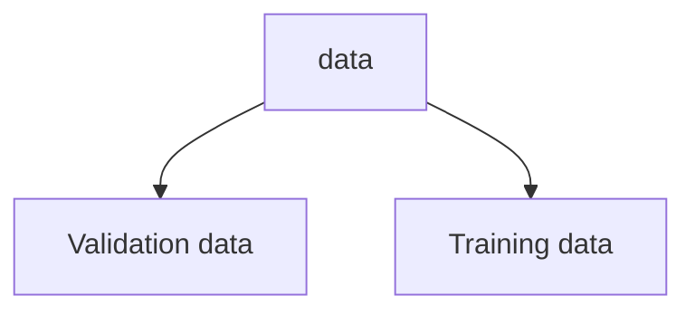
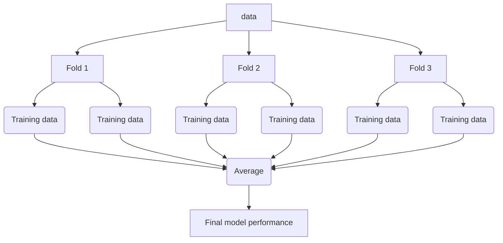

# Validation strategy and its related problems

* This is a summary of the course [How to win a data science competition: Learn from top Kagglers](https://www.coursera.org/learn/competitive-data-science). The course is available on coursera. The course is taught by Yandex and MIPT. This is my note taken from that course.


# Validation and overfitting

- Validation is one of the most important things to be done, becuase we need to select our best model based on validation data. Next we will discuss following topics on validation and overfitting.

  - Concept of validation
  - number of splits that should be done to establish stable validation score
  - most frequent ways to generate train-test split
  - most often validation problem

## Concept of validation

- We want to make sure, whether model is performing well on unseen data. Very easy way to understand that, e.g. you went to class for taking a subject, but you didn't understand the topics well. So you just memorized it without understanding its detail. During exam the professor asked you similar question but in a different way. So you could not answer it, because you just did cramming. In case of validaiton, if model did not learn the function well, then with unseen data, it will perform bad.

- Normally we have some training data.  And we have some test data, which we never seen during training and also we don't have label for those data.
- Then we split our given training data into two parts.

  - One part is used for training the model.
  - Other part is used for validation. __Be careful here, there is a possibility we sometime overfit on validation data, so we need to be very careful here.__

### Overfitting and underfitting

- Underfitting: If model is not able to learn the function well, then it is called underfitting. In this case, model will perform bad on both training and validation data.
- Overfitting: If we use a very complex function, then it is called overfitting. In this case, model will perform good on training data, but it will perform bad on validation data.
- Following figure shows the concept of underfitting and overfitting.


- Another useful way to understand overfitting and underfitting is to use following figure.


## Validation Strategies

- Common validation types are

  - Holdout validation
  - K-fold validation
  - Leave-one-out validation

### Holdout validation



- So here one sample can go to either validation data or training data. So we can have different validation data and training data. So we can have different validation score. After selecting best model, we can select all the data and train model will all data.

```python
from sklearn.model_selection import ShuffleSplit
```

- It is a good choice when we have enough data for validation.

### K-fold validation

- K-fold is actually repeated holdout validation. Split the data in K folds.
- Iterate though each fold: retrain the model on all folds except current fold, predict for the current fold.
- Use the predictions to calculate quality on each fold. Find such hyper-parameters, that quality on each fold is maximized. You can also estimate mean and variance of the loss. This is very helpful in order to understand significance of improvement.



```python
sklearn.model_selection.KFold
```

- it is good choice when we have major amount of data.

### Leave-one-out validation

Iterate over samples: retrain the model on all samples except current sample, predict for the current sample. You will need to retrain the model N times (if N is the number of samples in the dataset).

In the end you will get LOO predictions for every sample in the trainset and can calculate loss.  

- It is used when we have very small amount of data and sufficient time to trian a model with small amount of time.

## Stratification

- we normally use random split for k fold or hold out. But sometimes random split can fail, because some target sample never went into validaiton set.
- Just to make sure, similar target distribution over different folds, we use stratification.
- Stratification is usefull for

  - small dataset
  - Unbalanced dataset
  - Malticlass classification

----
Notice, that these are validation schemes are supposed to be used to estimate quality of the model. When you found the right hyper-parameters and want to get test predictions don't forget to retrain your model using all training data

----

## Most frequent ways to generate train-test split

- Time series data

  - If we create features which is time based, then we need to split with time into account
  - If we want to create a random split, then we need to create features which don't account time in it. Here may be time base features will not work, although in case of time data, this model could be the best model.

- Different splitting strategies can differ significantly

  1. in generated features
  2. in a way the model will rely on that features
  3. in some kind of target leak

- Splitting data

  1. Random split, row-wise (assumption is rows are independent)
  2. Time based split (assumption some type of time dependency)

     - special case of time based validaiton is moving window validation

  3. By id
     - May be user, shop or item id
     - User which was in train set, should not be in test set

  4. Combined
     - for example we have to predict sales for a shop and a shelf of this shop
     - in that case we need to search for shope and date in this shop
     - or in case of search result for different users, we can split based on different user id and search engine

## Problems occurinng during validation

a. Problem in validation stage.
b. Problem in leader -board or when in production

### a. Problem in validation stage

- Actually we find it during validation

  - e.g. we have a model which predict the sells in Febraury. Say we have model and our validation set is for Month January. In January the holidays are signficantly more than February. And people tend to buy more in January. So our model will perform well in January, but it will perform bad in February. So we need to be careful about this.
  - This type of behviour is expected. But in case of we can already know what could be the problem in validation low score.

  - Tool little data.

    - There are lots of patterns in data and we have little data to genrate such patterns.

  - Too diverse and  inconsistant data

    - similar features but different target values. One of them in train and other in test. Then we will get error which is big. In case of both in validation data, then we will get less error.
    - In case of January and February problem, this is expected, we can remove such diverstiy if we can validate it with last year February data.

### Solution

- We need to do more thorogh validation on such case.

  - Average score from different KFold splits ( normally 5 folds are enough , but can be increased). May be try different random seed and then try to estimate the model quality from them.
  - Tune model on one split, evaluate score on the other split. In case of hyperparameter tuning.

### b. Problem in leader-board or when in production

1. During serving the score is constantly higher, lower than validaiton score
2. During serving the score is not correlated with validation score

- These problems can be much more problematic. Because we can't find it during validation. The solution for this type of problem, is somehow recreate train-test split during validation, which is not easy.
- __Highly recommended__ to submit solution or in case of production, compare with production data, as eary as possible.

0. As we already know, we have different type of score in differnt validation. So we can assume leader-board/production is another type of validation. If we have different score on different fold and differnt result on leader-board/production result is not surprising. We can calculate mean and standard deviation of validaiton scores and estimate if the leader-board/produciton score is expected or not.

1. If this is not the case then there is something which is wrong.

   a. Too little data, which ok. Trust your validation and it will be ok.
   b. Train and test are from differnt distribution. (here train test means train and production)

      

    - If the train data just see the men and test data just see women, so model will have problem in production. So we need to make sure that train and test data are from same distribution.

    - __Solution__:
    
      - We need to find a way to tackle differnt distribution in train and test. Sometimes it is possible by adjusting during training. But sometimes it is only possible to adjust production/leader-board data.
      - In this particular solution, we can some how figure out a constant from train and test data
        - Mean from train data
        - Mean from test data
      - Then shift the prediciton with this difference.
      - Normally this type of case is rare. However the most frequent type of problem is following.

      

      - Then as we said, try to create a validation set , which reflects the test data. So we need to create a similar distribution in validation data. Then we can find out the problem.

      


---
# Useful link

[How(and why) to create a good validation set](https://www.fast.ai/2017/11/13/validation-sets.html)
[sklearn doc](https://scikit-learn.org/stable/modules/cross_validation.html)
[Advices on kaggle validation](http://www.chioka.in/how-to-select-your-final-models-in-a-kaggle-competitio/)
