# Stable Diffusion fastai course lesson 9

# First part

## Guidance scale

- basically it is telling to what degree should we focusing on specific caption vs just creating a specific image
- at present 7.5 is default

- What it is doing, just creating two version of the image
  1. With the prompt-  
  2. One without any prompt text, just random things
- At the end it takes the avg

## Negative prompts

- What we can do, is actually not taking the avg but subtract one from another
- e.g. we subtract something which is for caption blue
  1. What here happens, create one image with the prompt
  2. Create another image with the prompt blue
- Subtract first image from the second one

## Image to image

- What we can do actually using an image instead of text prompt.
- Here we need to use StableDiffusionImg2ImgPipeline
- As we know, in text prompt the starting point is a random image
- However here the starting point would be the given image and then it will create an image based on text prompt
- There is parameter called ``strength``, which tells you what degree you want to think like your given guided image and what degree you want to have image like other things

## Finetune

- We can finetune stable diffusion model with out own data. Fine tuning can be done many ways

### Text Inversion

- We finetune just a singel embedding.

  - We can give a concept a name e.g. water color portrait.
  - We can add that token to the text model and train the embedding for this. So that they match some water color pictures.
  - This is faster because we are training only one token for a single image.
  - We can start any prompt but use those tokens in our prompt, so that we can get the image we want.

### Dream booth

- Instead of using an existing token like in textual inversion, dream booth uses an existing token from the vocabulary and then finetunes the model to bring that token closer to the image we want.

# Second part -> Details of machine learning

- In fastai jeremy will try to clarify the stable diffusion different than just mathematical explanation

- For example we have a function which tells the probability of having a hand-written digit.
- If we have a 3, then it will give us a high probability of having a 3
- If we have a 3, but with huge amount of noise, then it will give us a medium probability of having a 3, e.g. 0.6
- Similary if we have only noise, then it will give us a low probability of having a 3, e.g. 0.01 .

 ```mermaid

flowchart LR

A[Image of 3] --> B[function]
B[function] --> C[0.9]
```

 ```mermaid

flowchart LR

A[image of 3 + noise] --> B[function]
B[function] --> C[0.6]
```

 ```mermaid

flowchart LR

A[Image of noise] --> B[function]
B[function] --> C[0.02]
```

## Generate an image from a magical function

- If we have a such function, then we can generate a hand-written digit.
- let's see how we can do it

- For example we have an image of noise which has a shape of `28x28`. So we have 784 pixels.
- If we change the value of one pixel and see how our functions probability changes, then we can see which direction we should go to get a 3.
- We have now 784 pixels and we need to consider each pixel and then see how our function output changes.
- In case of derivative we know when we have more than one variable, then we need to take partial derivative.
$$ loss = function(W, X) $$
- here weight is W which is vector from any type of model(neural network or any other type)
- X is the input, which is our 784 pixels.
$$ \frac{\partial loss}{\partial X_{1,1}} \frac{\partial loss}{\partial X_{1,2}} ...$$
- So we have 784 partial derivatives. But we can use one symbol for all of them.
- which is called ``nabla``
$$ \nabla_x loss = \frac{\partial loss}{\partial X_{1,1}} \frac{\partial loss}{\partial X_{1,2}} ...$$
- Normally in neural network we learn the weights but in our case we are learning the pixels(X value).
- We run it every and update the pixels with small number multiplying with it(similar concept like learning rate).
- Now we know we just need the function, then we are capaple creating an image of our desired image.

## Where to get such function

- Actually we train a neural network.
- We need to have some training data and train with this training data our neural network and then it will be our magical function

## Training our neural network (magical function)

- We could have something which is fully hand-written digit.
- We could have something which if something like hand-written digit but with noise.
- We could have something which is not at all hand-written digit.
- Actually this training data creation is very easy to create. We can have our actuall hand-written digit and then we can add some noise to it.
- Problem is like that, to have a training data, we need to have a label, which tells the probability of having a hand-written digit. But we don't have it in our hand, because we have crated noise arbitarily.
- But we know how much noise we have added to our actula image.

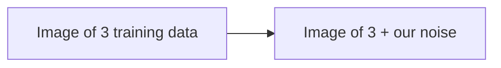

- Something with no noise, we know it is 100% hand-written digit.
- Something with lots of noise is not digit at all.

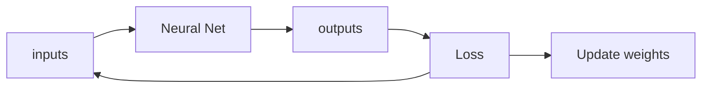

- inputs to our model is created handwritten image with or without noise
- outputs to our model is how much noise there is ?
- Then we train our neural network. After that our neural network is capable of predicting how much noise is added.
- So now can actually substract the predicted noise to get the actual image.
- So now we have something which can generate image, which is our goal.
- Now if we have something very very noisy. Our neural network is capable of predicting which part of the image is noise.

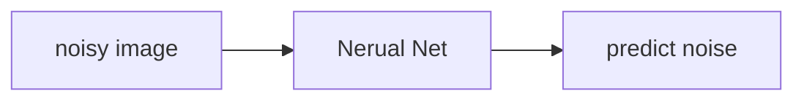

1. Substract predicted noise from the noisy image
2. Now in the next step, we will predict the noise again from our neural network.

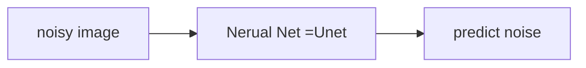

- our particualr neural network is UNet and this is first component of stable diffusion.
- Input for Unet is somewhat(maybe fully noisy image or without any noise or just middle ground ) noisy image
- Output is the noise
- If we subtract the output from input we get the actual image

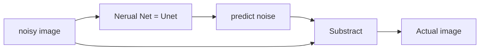

## Variational Autoencoder

- So our work is done. Just we have slight problem.
- We normally have a high defination image, with lots of pixes. So it needs lots of computing power to accomplish our task.
- But can we do it more efficiently, we know that image compression is possible. As when we have jpeg image, it is already compressed.
- For example we have an imput image of size `512x512x3`
- We can use a convolution with stride 2, then we will have an image `256x256x6`
- Again if we use another convolution with stride 2, then we will have an image `128x128x12`
- Same thing we can perform again and get an image of size `64x64x24`
- If we use now some resnet blocks which squeezes all number of channels. Then we will get an image of size of `64x64x4`.  
- So we started an image of size of `512x512x3=786432` and we ended up with an image of size of `64x64x4=16384`, which is 48 times smaller.

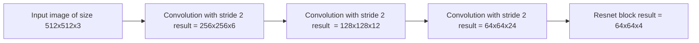

- So can we get our original image?
- We can use transpose convolution with stride 2, then we will have an image `128x128x12`.
- Again we will do it again and we will have an image `256x256x6` and at the end we will get our original image of size of `512x512x3`.
- We can perform the action and get the original image.
- Following the flowchart of the work.

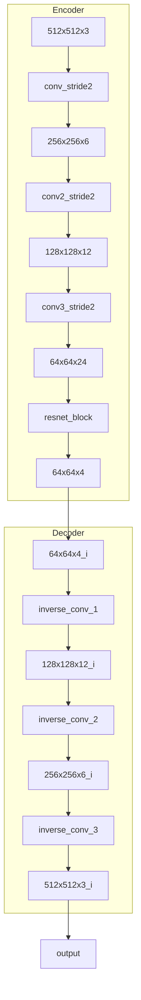

- so the Encoder and Decoder both part is a single Neural Network.
- We can start feeding images to the neural network, from the decoder part of the neural network we will get the image
- Initially we will get random images from decoder
- After training the net we get the original image. During training we will update the weights of the neural network based on loss(here MSE).
- But whats the point of getting same information from a Neural Network.
- We can take the output of the encoder part of the neural network, which is 48 times smaller than the input image.
- But if any other person who has decoder, can take the output of the encoder and get the original image after feeding it to decoder.
- This type of neural network is called  Autoencoder.

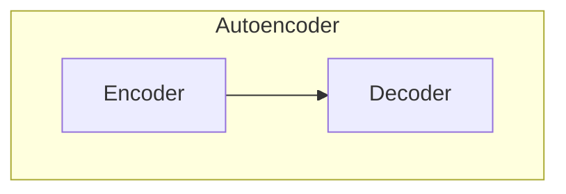

## Latents

- So we just created a compression algorithm.
- What we will do is, we will train our `U-net` with the output of the encoder part of the Autoencoder(because it compressed the input image).
- Earlier we said, U-net takes somewhat noisy image. But actually it takes the output of the encoder part of the Autoencoder, where input of Autoencoder is somewhat noise image.
- As we can see output of the encoder part of the Autoencoder is very important, we can give a name to it, which is `Latents`.

## Training the U-net

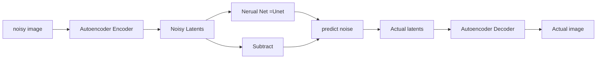

- Atually we will not tell from now Autoencoder but Variational Autoencoder (VAE).

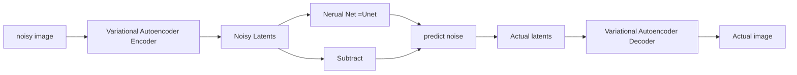

## Text insertion

- So we can now generate an image from noise. But we are not just generating an image, but we are generating an image from a text.
- How can we do that for hand written digit. So we will insert a text + some noise, and based on our text the generated image will be our inserted text digit.
- We can actually insert a one hot-encoded version of a digit.
- Now we have two things as an input

  1. Noisy image
  2. One hot encoded digit

- Output will be the predicting noise.
- As we are inserting an extra information to our Neural-network, we will be expecting a better result from our neural-network, why we can expect better result?
- Because now it will predict the noise based on the information, what is not in one hot encoded vector that is noise.

- For a hand-written digit, inserting one-hot-encoded vector is easy, but for text like "a very cut Teddy" is not easy to create a one-hot-encoded vector. May be it is possible to create a one-hot-encoded vector for all the words in the dictionary, but it will be very big vector and sparse. It is not practical.

- What we can do, actually create a model, which will take a sentence like "a very cut Teddy" and will convert it to a vector and this vector will tell us, what a Teddy is look like

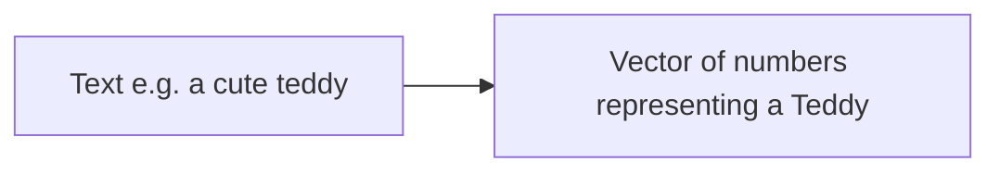

## ClIP and contrastive loss

- For that we need two model
  1. Create a text embedding vector
  2. Create an image embedding vector

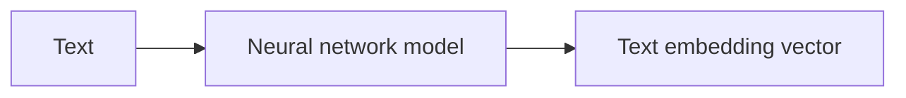

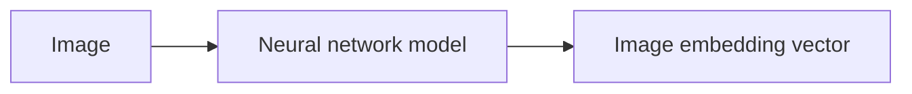

- At first the embedding will be random.

image\Text| A gracful swan|A cute teddy|jeremy howard
|--|--|--|--|
image of swan| swan text and image embedding dot product |cute teddy text + swan image embedding dot product| jeremy howard + swan image embedding dot product   |
image of cute teddy|embedding of cute Teddy image + embedding of graceful swan|embedding of cute teddy image + cute teddy text embedding|embedding of cute Teddy image + embedding of jeremy howard text dot product|
image of jeremy howard|embedding of jeremy howard image + a graceful swan text embedding dot product | embedding of jeremy howard image embedding + a cute Teddy text embedding dot product   | embedding of jeremy howard image + jeremy howard text embedding dot product   |

- From the table we want to have the diagonal larger value, because these are same thing
- And other than diagonal we want to have a smaller value.
- For these two neural we can create a loss function

image\Text| A gracful swan|A cute teddy|jeremy howard
|--|--|--|--|
image of swan| big|small| small|
image of cute teddy|small|big|small|
image of jeremy howard|small|small|big|

- if we add all the diagonal values and substract the off diagonal values, we will get a loss function.
$$loss =  \sum_{j=1}^{n} \text{diagonal} - \sum_{i=1}^{n}\text{off diagonal}$$

- After training we can get the embedding vector of the text and image, which is similar.
- If we try to create embedding of

  - A beutiful swan
  - A cute swan
  - Such a lovely swan

- These should create a similar embedding vector, because they are similar.

- What we actually created two models, which will put image and text in same space. We have these multi-modal setup models.

- Now we can insert a text like "a very cute teddy" and that we can put to our model as an helper, instead of one hot encoded vector.

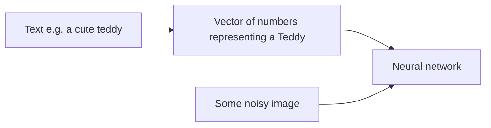

- The model which is used for text encoding is called `CLIP`
- The loss used for text and image embedding in similar space is called `Contrastive Loss`

## Time steps

- Nothing to do with time
- As we already said, we will use different types of noise.
- We can use different range of numbers, from 1 to 1000. For each number there will be specific noise amount which can be added.
- We can create a noising schedule, which will tell us, what is the noise amount for a specific number. This number can be denoted by $t$. This $t$ is called `time step`.
- Right now many people tend to use how much noise was there with $\sigma$. As we also know $\sigma$ is the standard deviation of the Gaussian distribution. Therefore people also use the $\beta$. So  $\beta$ telss us, how much standard deviation is used for the noise generation.

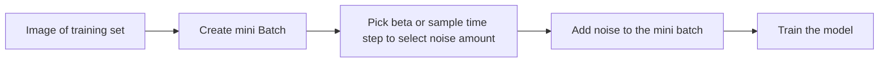

- As we have the model tries to predict amount of noise. Then we substract the amount of noise, from the image. After this first step, model creates an image which is not what we wanted to have.
- But we just don't substract the full noise, but we multply the predicted noise with a constant($C$) and then substract it.
- Why we are not selecting the best image we can find?
- In our training set, this type of image was not there, therefore our model doesnot know what to do with it. In our training set, there was somewhat noisy latent.
- Thats why we substract a bit of noise, so that we still have a somewhat noisy latent.
- This process repeats bunch of time, and questions like what we use $C$, and how we go from noisy image to our target image, will be answered in `diffusion sampler`
- All these things seems like deep learning optimizer. The constant $C$ is like learning rate, and the amount of noise is like momentum and also like `Adam`. May be we can use such tricks also here.
- Different research direction can be found if we think this is like optimizer.
