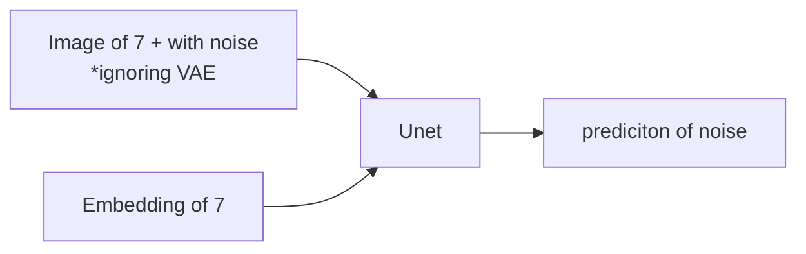
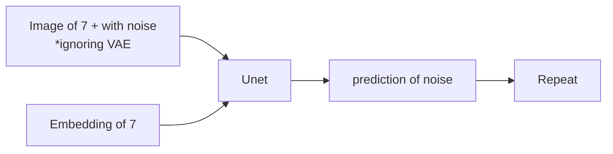

# Introduction

- Last week we have learned about stable diffusion model



- To train a model needs lots of GPU and computer power. So we use pre-trained model.



- After repeating some steps we get our desired image.
- Previously it took 1000 steps to get the desired image. Right now because of different improvement we can get with desired image.
- Some interesting paper come out recently (2022 Dec 20)
  - __Progressive Distillation for fast sampling of diffusion models__.
    - With this paper we can get the desired image in 4 steps. So they just decrease the number of steps from 60 steps to 4 steps.
    - `Distillation`  is used in this paper
    - `Distillation` is a process where we have a teacher model which may be big and slow and we have a student model which is small and fast. We train the student model to learn from the teacher model.

    ```{mermaid}
    flowchart LR
    A[Teacher Network] -->B[Student Network]
    ```

    - Teacher model train the student model to learn from it and then skip of step can be done. Then student model is converted to a Teacher model and tries to teach the another student model.  As a result we can get image with very small steps.

  - __On Distillation of guided diffusion Models__
    - `Classifier free guided diffusion` is used in this paper. Following is the flow chart for classifier free diffusion model.

    ```mermaid

    flowchart TD
    A[Text prompt] -->B[Embedding]
    D[Empty prompt] -->E[Embedding]
    B[Embedding] --> C[Concatenate]
    E[Embedding] --> C[Concatenate]
    C[Concatenate] --> F[U-net]
    F[U-net] --> G[Text prompt output]
    F[U-net] --> I[Arbitrary  output]
    G[Text prompt output] --> H[Like weighted avg]
    I[Arbitrary  output] --> H[Like weighted avg]
    H[Like weighted avg] --> J[Repeat]
    ```

    - This paper says, instead of two images, we need to use two imagesThis paper says, instead of two images, we need to use two images. Can we skip it. This can be done also like previous paper. We can use a teacher model to teach the student model.
    - So in our CFGD (Classifer Free Guidance Scale) model, we use difference guidance scale. In this case the student model has an additional input.
    $$ \text{Student model(prompt, noise, guidance scale)}$$

- __Imagic: Text-based real image editing with diffusion models__.

   - So you pass one image and then you pass some text and the image changed based on your input. 

# Coding part

- Now we will go through the details of the pipeline.

```python

vae = pipe.vae
images = []

def latents_callback(i, t, latents):

    latents = 1/0.18215 * latents
    image = vae.decode(latents).sample[0]
    image = (image / 2 + 0.5).clamp(0, 1)
    image = image.cpu().permute(1, 2, 0).numpy()
    image.extend(pipe.numpy_to_pil(image))

prompt = "Portrait painting of jeremy howard looking happy"
torch.manual_seed(9000)

final_image = pipe(
                   prompt,
                   callbacks=latents_callback,
                   callback_steps=12).images[0]
images.append(final_image)
images_grid(images, rows=1, cols=len(images))
```