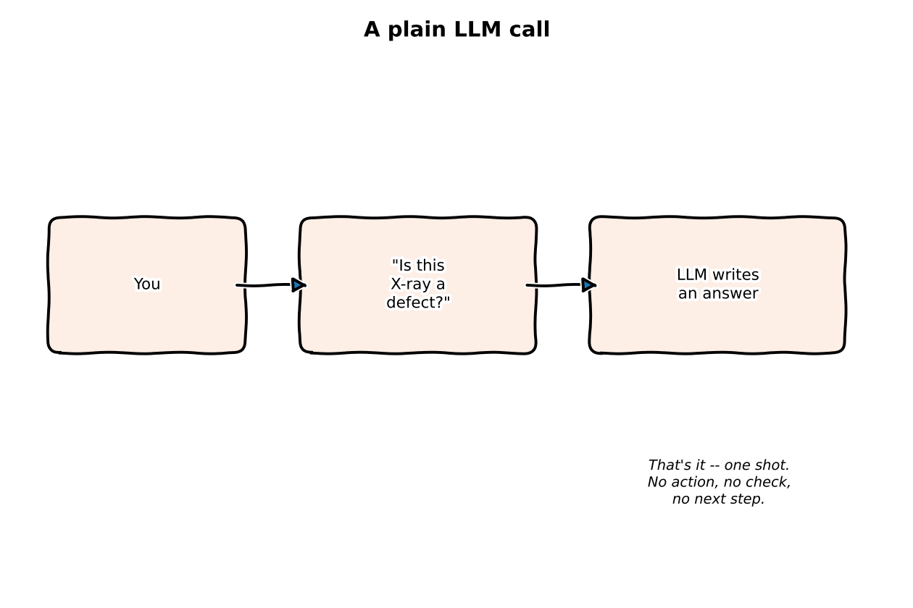
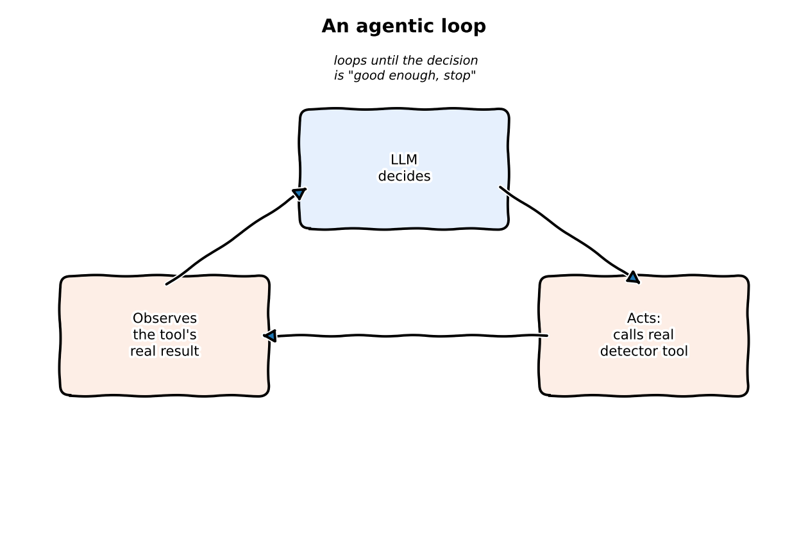

:::{.callout-tip}
This post is part of the [Agentic Developer: Zero to Advanced](index.qmd) series.
:::

I already have an [Agentic Development](../agentic-development/index.qmd) series on this blog.
That one exists because I went through Andrew Ng's *Agentic AI* course and rebuilt every example
around my own work: semiconductor X-ray void detection, following the course's own five modules,
then four more posts past where the course stops. It assumes you already know roughly what an
agent is. And it uses proprietary imagery -- you can't actually run the code yourself.

This series starts from zero instead. Public, downloadable datasets, so every example is
something you can run. And it goes deeper into the actual framework mechanics -- LangGraph, Deep
Agents -- than a course survey has room for. Same author, same interest in defect inspection,
just a different starting point and more ground covered. If you've read the other series, some of
Arc 1 and Arc 2 here will feel familiar. If you haven't, that's fine too.

The [full roadmap is on the series index](index.qmd) -- 30 posts across six arcs plus a capstone,
plus a companion series that ports the same architecture to supply chain. This post does two
things: says what "agentic" actually buys you over a plain LLM call, and explains why X-ray
defect detection beats the usual chatbot demo as a teaching example.

## What "agentic" actually buys you

A plain LLM call is one-shot. You send a prompt, you get text back, and whatever happens next is
on you to code. An agentic system adds three things on top of that:

- **It acts.** It calls real functions -- a detector model, a database query, a rule check --
  instead of just describing in prose what it would do.
- **It iterates.** It looks at what its own tool call returned and decides whether that's good
  enough, or whether something needs to happen again with different inputs.
- **It decides.** It chooses what happens next based on that output, instead of you hard-coding
  every branch in advance.

None of that needs a fancy framework. You could write the loop yourself in twenty lines of
Python: call a tool, check the result, ask the LLM what's next, repeat. LangGraph (which this
series leans on from Arc 2 onward) exists to keep that loop's state, branching, and retries
manageable once you've got more than a couple of steps -- not because the idea itself is
complicated.

Drag the slider below to compare the two shapes directly: a plain call is a dead end after one
box; an agentic loop keeps circling back until the decision itself says "stop."

::: {.column-body}
```{=html}
<div style="position:relative;max-width:560px;margin:1.5em auto;">
  
  
  <div style="position:absolute;top:0;bottom:0;left:50%;width:2px;background:white;box-shadow:0 0 4px rgba(0,0,0,0.5);" id="al-handle"></div>
  <input id="al-range" type="range" min="0" max="100" value="50" style="width:100%;margin-top:10px;">
  <p style="text-align:center;font-size:0.85em;color:#666;">left: a plain LLM call (one shot, dead end) &nbsp;|&nbsp; right: an agentic loop (acts, observes, decides, repeats)</p>
</div>
<script>
(function(){
  var r = document.getElementById('al-range');
  var a = document.getElementById('al-after');
  var h = document.getElementById('al-handle');
  if (r && a && h) {
    r.addEventListener('input', function(){
      a.style.clipPath = 'inset(0 ' + (100 - r.value) + '% 0 0)';
      h.style.left = r.value + '%';
    });
  }
})();
</script>
```
:::

## Why not another chatbot demo

Most agentic AI content reaches for the same examples: a customer-support bot, a research
assistant, a coding helper. Fine for showing off conversation. Bad for showing off the part that
actually matters in production -- a *decision with real consequences* at the end of the tool
call.

X-ray defect detection has that built in:

- **A CV baseline already exists.** Object detection and defect classification on X-ray images is
  a mature field, so Arc 1 can put a real, non-agentic model in front of you on day one --
  something to compare every later agentic layer against, instead of taking it on faith.
- **The output has a natural pass/fail shape.** "Is this defect real, how severe is it, does it
  need to be flagged for a human" is exactly the kind of structured decision an agent's tool-use
  and planning patterns are built for -- much closer to a real inspection workflow than "write me
  a poem."
- **It stays reproducible.** No proprietary data, no NDA-covered imagery. Every dataset used here
  is public, so every code example is something you can actually clone and run -- the biggest gap
  in the older series.
- **It generalizes on purpose.** The companion supply-chain series exists to prove that none of
  the architecture built here is actually about X-rays -- swap the tools and the data, keep the
  graph.

## The datasets: GDXray and DeepPCB

Two public X-ray datasets carry the running example, deliberately not just one:

**GDXray** is a large collection of grayscale X-ray images across several industrial inspection
domains -- castings, welds, and baggage security screening among them -- released by the GRIMA
research group at Pontificia Universidad Católica de Chile for defect-detection research. Closer
to the void/porosity work in the other series, but public and citable.

**DeepPCB** is a printed-circuit-board dataset: paired template and test images, with annotated
locations for six defect classes (open, short, mousebite, spur, copper, pin-hole). Smaller, more
structured than GDXray, which makes it a useful second surface later on -- if the architecture
only works on one dataset's particular quirks, that's worth knowing, not something to hide.

Arc 1's baseline (next post) starts on GDXray, since castings defects map most directly onto "is
this a real flaw and how bad is it." DeepPCB comes in later, once the architecture needs testing
against something structurally different.

## Jargon, explained simply

**Agentic AI.** An LLM given the ability to call real functions and decide what happens next,
instead of only producing text in response to a single prompt.
*Daily-life version:* a cookbook can only ever tell you what to do; a smart oven that turns
itself on, checks the cake at the 20-minute mark, and gives it five more minutes because it's
still wobbly is agentic. Same recipe, but one of them actually bakes the cake.

**Tool calling.** The mechanism by which an LLM invokes a real function (a detector model, a
lookup, a calculation) and gets a real result back, rather than describing what it would do.
*Daily-life version:* asking a friend what the weather looks like ("probably sunny") versus
asking a friend who actually walks outside, checks, and tells you it's raining right now. The
second friend used a "tool" -- their own eyes -- instead of guessing from memory.

**LangGraph.** A library for building agent control flow as an explicit graph of state and
nodes, so branching, retries, and multi-step pipelines don't have to live in ad hoc `if`
statements.
*Daily-life version:* a recipe card with numbered steps and a decision box ("if the toothpick
comes out wet, go back to step 4") beats holding the whole recipe and every "what if" in your
head at once -- same idea, applied to an agent's steps instead of a cake's.

**Baseline model.** A plain, non-agentic model run first, specifically so every later agentic
addition has something concrete to be compared against.
*Daily-life version:* the 5k time you ran before you hired a running coach. Every week after
that, "better" only means something because you know the number you started from.

**Structured output.** A model response constrained to a defined shape (JSON with specific
fields, for example) rather than free-form prose, so downstream code can reliably parse it.
*Daily-life version:* a tax form with labeled boxes for name, income, and date, instead of a
rambling free-text letter explaining your finances -- the person (or program) on the other end
can process a filled-in box far more reliably than prose.

**GDXray / DeepPCB.** The two public X-ray defect datasets this series' running example is built
on -- see above.
*Daily-life version:* a shared, public past-exam archive anyone can study from, instead of a
school's private exam vault only current students can see.

## What's next

[Part 2](02-dataset-baseline.qmd) loads GDXray, runs a plain CV detection model with no agent
anywhere in sight, and establishes the ground-truth baseline every later post in Arc 1 and Arc 2
gets compared against.
