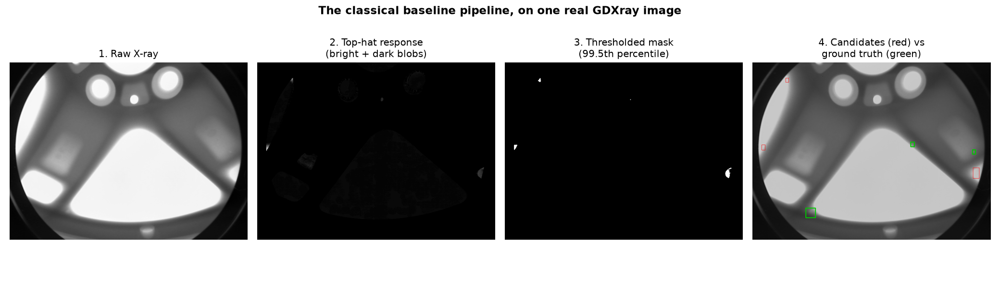
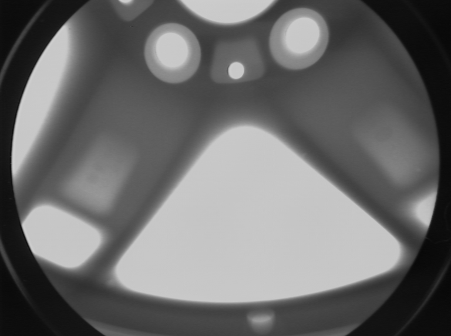
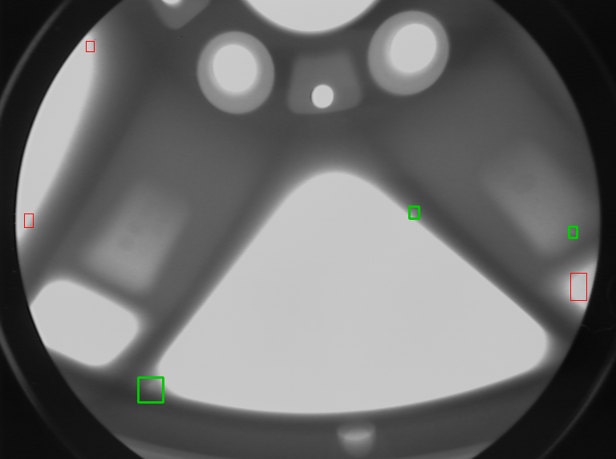

:::{.callout-tip}
This post is part of the [Agentic Developer: Zero to Advanced](index.qmd) series. It follows on
from [Part 1 -- why agentic AI, why X-ray defect detection](01-introduction.qmd).
:::

Part 1 was all talk. This one has no LLM in it at all -- on purpose. Before any agent shows up in
Arc 2, there needs to be a real, boring, non-agentic baseline: load real GDXray data, run a plain
classical computer-vision detector, score it honestly against real ground truth. Whatever number
comes out of this post is the number every later, agentic addition in this series has to actually
beat.

## The data, for real

The running dataset is GDXray Castings -- specifically series **C0001**: 72 X-ray images of the
same aluminum wheel casting, rotated 5 degrees between shots, with a `ground_truth.txt` file
giving real bounding boxes for real casting defects in each frame. It's real research data from
GRIMA (Pontificia Universidad Católica de Chile), for educational and research use.

Across all 72 images, `ground_truth.txt` marks **256 real defect instances** -- most images have
2-4 small, faint boxes a few dozen pixels wide, in the aluminum where a void or inclusion sits.

## The baseline: no learning at all

The detector here is deliberately not deep learning. It's four classical steps, and that's the
whole method:

1. **Top-hat morphology.** Run both a white top-hat and a black top-hat filter over the image.
   These flag small regions that are locally brighter or darker than their surroundings --
   exactly the kind of thing a defect looks like, in theory.
2. **Object masking.** Otsu-threshold the casting body away from the surrounding air, and erode
   the mask a bit so the casting's own outer edge (a very strong, very boring top-hat response)
   doesn't get treated as a candidate defect.
3. **Percentile thresholding.** Keep only the top 0.5% strongest responses inside the object mask.
4. **Connected components.** Turn surviving blobs into candidate bounding boxes.

```python
def detect_candidates(gray, return_stages=False):
    white_hat = cv2.morphologyEx(gray, cv2.MORPH_TOPHAT, TOPHAT_KERNEL)
    black_hat = cv2.morphologyEx(gray, cv2.MORPH_BLACKHAT, TOPHAT_KERNEL)
    response = np.maximum(white_hat, black_hat)

    mask = object_mask(gray)
    response = cv2.bitwise_and(response, response, mask=mask)

    thresh_val = np.percentile(response[mask > 0], TOPHAT_PERCENTILE)
    binary = (response >= thresh_val).astype(np.uint8) * 255
    binary = cv2.morphologyEx(binary, cv2.MORPH_OPEN, CLEAN_KERNEL)

    n, _, stats, _ = cv2.connectedComponentsWithStats(binary)
    boxes = [
        (x, y, x + w, y + h)
        for x, y, w, h, area in stats[1:]
        if area >= MIN_BLOB_AREA
    ]
    return boxes
```

Every candidate box gets matched against the real ground-truth boxes by IoU (details below). No
tracking across the 72-frame rotation sequence, no learning from labels, no memory between images
-- each image is scored completely on its own. That's the point of a baseline: the dumbest honest
thing that could plausibly work.



Panel 2 already gives away why this baseline struggles: the strongest top-hat responses are the
wheel's own spoke and rim edges, not the tiny real defects. Structural geometry produces a much
bigger signal than an actual flaw does. That's a real, explainable failure mode, not a bug in the
code.

## The real numbers

Run across all 72 images, scored with a loose IoU-hit-threshold of 0.05 (generous, given this is
a coarse classical method):

| Metric | Value |
|---|---|
| Images scored | 72 |
| Real ground-truth defects | 256 |
| Candidate boxes raised | 366 |
| True positives | 24 |
| False positives | 342 |
| False negatives | 232 |
| **Precision** | **0.066** |
| **Recall** | **0.094** |

That's a genuinely bad detector -- it catches under 10% of real defects, and 93% of what it flags
isn't a defect at all. Reported honestly, because that's the actual number, and it's the number
every later post in this series has to improve on.

Drag the slider to see it on the actual image: green boxes are real ground truth, red boxes are
what the classical detector raised.

::: {.column-body}
```{=html}
<div style="position:relative;max-width:560px;margin:1.5em auto;">
  
  
  <div style="position:absolute;top:0;bottom:0;left:50%;width:2px;background:white;box-shadow:0 0 4px rgba(0,0,0,0.5);" id="bl-handle"></div>
  <input id="bl-range" type="range" min="0" max="100" value="50" style="width:100%;margin-top:10px;">
  <p style="text-align:center;font-size:0.85em;color:#666;">left: the raw X-ray &nbsp;|&nbsp; right: real ground truth (green) vs. the classical detector's real candidates (red)</p>
</div>
<script>
(function(){
  var r = document.getElementById('bl-range');
  var a = document.getElementById('bl-after');
  var h = document.getElementById('bl-handle');
  if (r && a && h) {
    r.addEventListener('input', function(){
      a.style.clipPath = 'inset(0 ' + (100 - r.value) + '% 0 0)';
      h.style.left = r.value + '%';
    });
  }
})();
</script>
```
:::

## Why bother with a baseline this bad

Because "the agent found more defects" only means something if you know what "more" is being
measured against. Precision 0.066, recall 0.094, zero learning, zero memory across frames -- that's
the floor. Later posts in this series swap in better detectors, add tool-calling, add planning,
add multi-agent review. Every one of those additions gets checked against this same 72-image,
256-defect set, with the same IoU-hit-threshold. If a later post can't beat 0.066 precision and
0.094 recall on this exact data, it isn't actually helping, no matter how sophisticated the agent
architecture behind it looks.

## Jargon, explained simply

**Ground truth.** The real, correct answer, established independently of whatever your model
predicts.
*Daily-life version:* the answer key a teacher already has before grading anyone's exam.

**Bounding box.** A rectangle marking roughly where something is in an image, not its exact
pixel-perfect shape.
*Daily-life version:* "the treasure is somewhere in this square on the map" -- not the exact spot,
just a region.

**IoU (Intersection over Union).** How much a predicted box overlaps a real one, as a fraction of
their combined area.
*Daily-life version:* you and a friend each draw a circle on the ground guessing where a dropped
coin landed. IoU is how much your two circles overlap, divided by the total ground either circle
covers.

**Precision.** Of everything the model flagged, what fraction was actually real.
*Daily-life version:* of every parking ticket you wrote today, what fraction of cars were actually
illegally parked.

**Recall.** Of everything that was actually real, what fraction the model actually caught.
*Daily-life version:* of every car that actually was illegally parked today, what fraction you
actually caught and ticketed.

**Classical computer vision.** Image analysis via fixed, hand-written rules (thresholds, filters,
morphology) rather than a model that learned patterns from labeled examples.
*Daily-life version:* reading a thermometer versus asking a doctor who's examined a thousand
patients -- one follows a rule you could write down on paper, the other learned from experience.

## Reproduce this yourself

```bash
git clone https://github.com/HasanGoni/quarto_blog_hasan
cd quarto_blog_hasan/notebooks/agentic-zero-to-advanced
uv sync
uv run python baseline_detector.py
```

The script expects GDXray Castings series C0001 (a Kaggle mirror of the original GRIMA dataset --
search "gdxray" on Kaggle) with its `ground_truth.txt` alongside the `.png` frames. GDXray itself
is free for educational and research use only.

## What's next

Part 3 wraps this exact detector as a callable tool and puts one LLM call in front of it: reading
the detector's raw output and writing a plain-English explanation. Still no planning, no
iteration, no real agent yet -- just the first tool call.
