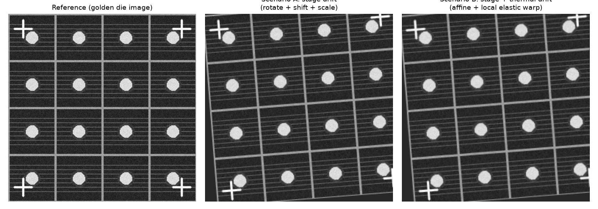
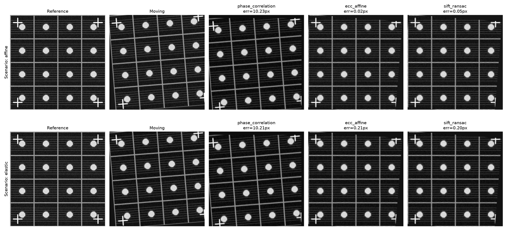

:::{.callout-tip}
This post is part of the [Image Registration Series](index.qmd) series.
:::

## The problem

A wafer inspection tool captures a "golden" reference image of a die layout once, then captures a
new image of every subsequent die to compare against it. Between those two captures, the *content*
hasn't changed -- but the *pixels have*, because the stage that positions the wafer isn't
perfectly repeatable: a fraction of a degree of rotation from vibration, a few microns of
translation from mechanical backlash, a hair of scale drift from thermal expansion of the fixture.
Compare the two images pixel-for-pixel without correcting for that first, and every downstream
step -- defect detection, overlay metrology, die-to-die diffing -- is comparing the wrong pixels to
each other.

**Image registration** is the step that fixes this: estimate the transform that maps the drifted
image back onto the reference frame, then resample it through that transform before anything else
happens. This post builds a benchmark we can actually *measure* accuracy against, then throws three
classical (non-deep-learning) methods at it.

## The benchmark: a synthetic die image with known ground truth

Real production images don't come with an answer key -- you never actually know the true drift, so
you can't tell if a registration is *slightly* off. The fix here is to synthesize the problem:
build a "golden" reference image by hand, apply a *known* transform to create the "drifted" image,
and keep the transform. Now every method's estimate can be compared against the one true answer.

```{python}
#| echo: true
#| eval: false
# notebooks/image-registration/common.py -- pattern generator (excerpt)
def make_semiconductor_pattern(size=256, seed=0):
    img = np.full((size, size), 40, dtype=np.float32)      # dark background
    # die-grid scribe lines every 64px
    for i in range(0, size + 1, 64):
        cv2.line(img, (i, 0), (i, size), 160, 2)
        cv2.line(img, (0, i), (size, i), 160, 2)
    # periodic interconnect lines inside each die
    # via/pad grid: filled circles at each die center
    # 4 corner alignment-mark crosses
    # + photon/sensor noise
    ...
```

The pattern (below) has everything a real inspection image would need to stress-test registration:
a repeating grid (scribe lines), fine periodic texture (interconnects), high-contrast circular
features (vias/pads) that are easy for feature detectors to lock onto, and four corner alignment
crosses like a real overlay-metrology target.

Two drift scenarios are generated from it, both with the exact transform recorded:

- **Scenario A ("stage drift")**: a pure rigid/affine transform -- 4.5° rotation, (9, -6) px
  translation, 2% scale. This is the kind of drift a registration method has to fully correct.
- **Scenario B ("stage + thermal drift")**: the same affine transform, *plus* a smooth random
  local elastic warp (an image-wide Gaussian-smoothed random displacement field). No single global
  affine matrix can undo this one -- it's the motivating case for [Part 3](03-dl-deformable-registration.qmd)'s
  deformable network.



Accuracy is measured the same way throughout the whole series: 25 known grid-intersection points
are tracked through every transform, and **landmark error** is the mean pixel distance between
where a method predicts those points land and where they actually are. A second, weaker signal
(**NCC**, normalized cross-correlation between the registered and reference images) is reported
alongside it, since it's what you'd compute in production when ground truth isn't available.

## Method 1: Phase correlation (translation only)

Phase correlation finds a pure translational shift by taking the cross-power spectrum of the two
images' Fourier transforms and locating its peak -- fast, subpixel-accurate, and a completely
standard first tool for image alignment.

```{python}
#| echo: true
#| eval: false
def phase_correlation(ref, moving):
    win = cv2.createHanningWindow((ref.shape[1], ref.shape[0]), cv2.CV_32F)
    (dx, dy), response = cv2.phaseCorrelate(ref.astype(np.float32),
                                             moving.astype(np.float32), win)
    M = np.array([[1, 0, -dx], [0, 1, -dy]], dtype=np.float32)
    return M, response
```

**Result on Scenario A: 10.23 px landmark error.** That's not a bug -- it's the honest limit of a
translation-only model against a scene that also has 4.5° of rotation: a point 128px from the
rotation center sweeps roughly `128 * sin(4.5°) ≈ 10px` under pure rotation, which is almost
exactly what's left over. Phase correlation was never going to fix rotation, so this checks out.

The more interesting finding is what happened *before* windowing was added. The raw (unwindowed)
call returned a **confidence response of 0.07** -- barely above noise -- and a wildly wrong shift
estimate, because this benchmark's periodic scribe-line grid (a line every 64px) creates an
inherently ambiguous cross-power spectrum: a repeating pattern correlates with *many* candidate
shifts, not just the true one, and phase correlation's peak can lock onto the wrong one. This is
a real, well-known failure mode for phase correlation on **any** repeating industrial pattern --
wafer die arrays, PCB via grids, woven textiles -- not specific to this synthetic example. A Hann
window (`cv2.createHanningWindow`, applied before correlating) is the standard partial fix, and it
did raise the useful signal here, but the response confidence stayed low (0.10) even after
windowing, because the periodicity isn't just at the image border -- it's everywhere. **The
practical lesson: always check `response` before trusting a phase-correlation shift on a periodic
pattern; a low score means "don't trust this," not "small error."**

## Method 2: ECC (intensity-based, affine)

The Enhanced Correlation Coefficient algorithm iteratively adjusts a parametric transform (here,
a full 2x3 affine) to maximize the normalized correlation between the two images directly in pixel
intensity space -- no feature extraction at all.

```{python}
#| echo: true
#| eval: false
def ecc_affine(ref, moving):
    warp = np.eye(2, 3, dtype=np.float32)
    criteria = (cv2.TERM_CRITERIA_EPS | cv2.TERM_CRITERIA_COUNT, 200, 1e-6)
    _, warp = cv2.findTransformECC(ref.astype(np.float32), moving.astype(np.float32),
                                    warp, cv2.MOTION_AFFINE, criteria)
    return invert_affine(warp)   # findTransformECC returns ref->moving; we standardize on moving->ref
```

**Result: 0.02 px on Scenario A, 0.21 px on Scenario B.** Essentially perfect on the pure-affine
case -- ECC directly optimizes an affine model, and the ground truth *is* an affine model, so
there's no representational gap to close. The small residual on Scenario B is exactly the part of
the drift that an affine model structurally cannot represent (the local elastic warp) -- ECC found
the best possible *affine* explanation of a non-affine deformation, and 0.21px is how good that
best-possible affine fit is.

## Method 3: SIFT + RANSAC (feature-based)

Detect SIFT keypoints in both images, match them with a ratio test, then fit an affine transform
with RANSAC to reject outlier matches.

```{python}
#| echo: true
#| eval: false
def sift_ransac(ref, moving):
    sift = cv2.SIFT_create()
    kp1, des1 = sift.detectAndCompute(ref, None)
    kp2, des2 = sift.detectAndCompute(moving, None)
    matches = cv2.BFMatcher().knnMatch(des2, des1, k=2)
    good = [m for m, n in matches if m.distance < 0.75 * n.distance]
    src = np.float32([kp2[m.queryIdx].pt for m in good])
    dst = np.float32([kp1[m.trainIdx].pt for m in good])
    M, inliers = cv2.estimateAffinePartial2D(src, dst, method=cv2.RANSAC, ransacReprojThreshold=3.0)
    return M
```

**Result: 0.05 px on Scenario A (204 candidate matches, 120 RANSAC inliers), 0.20 px on Scenario B
(161 candidates, 79 inliers).** Essentially tied with ECC on both scenarios. The high-contrast
circular pads and cross-shaped alignment marks in this benchmark are exactly the kind of blob-like,
corner-rich structure SIFT is built to detect, so it has no trouble here.

## Results so far

| Method | Scenario A (affine) | Scenario B (affine+elastic) | Notes |
|---|---|---|---|
| Phase correlation | 10.23 px | 10.21 px | Translation-only; low confidence (0.07-0.10) on this periodic pattern -- flags itself as unreliable |
| ECC (affine) | **0.02 px** | 0.21 px | Best on pure affine; residual on B is the affine-model ceiling |
| SIFT + RANSAC | 0.05 px | **0.20 px** | Ties ECC; needs enough distinct local structure to find keypoints |



Both ECC and SIFT+RANSAC comfortably solve the rigid/affine case here -- for a semiconductor
inspection pipeline with only stage drift to correct, either is a completely adequate, well-
understood, dependency-light answer. The next post brings in deep learning, and the interesting
question is whether it can do any better than *this* -- spoiler: not on the affine case, but the
comparison surfaces something else worth knowing.
