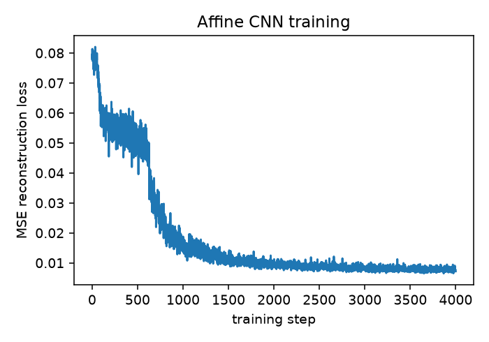
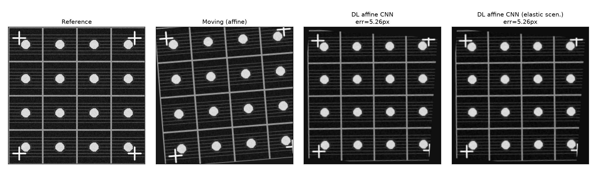
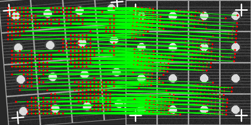
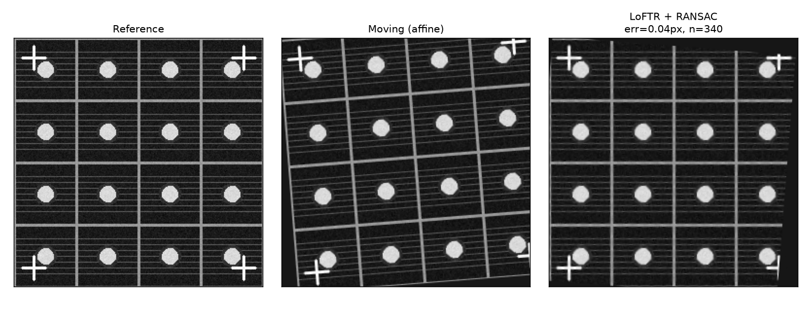

:::{.callout-tip}
This post is part of the [Image Registration Series](index.qmd) series.
:::

[Part 1](01-classical-methods.qmd) showed that ECC and SIFT+RANSAC both solve the affine drift
benchmark to well under a pixel. That's a high bar. This post asks what deep learning brings to
the same problem -- one method that replaces the *optimizer* (a CNN that regresses the transform
directly), and one that replaces the *feature detector* (a learned matcher standing in for SIFT).

## Method 4: a from-scratch affine-regression CNN

The idea: instead of iteratively optimizing an affine matrix per image pair (what ECC does), train
a small CNN once, on many synthetic drifts of the *same* reference pattern, so that at inference
time a single forward pass predicts the transform. This is the realistic framing for a semiconductor
fab -- you register against the same golden die layout on every unit of that product, so a
per-recipe network is a sensible thing to train once and reuse.

Critically, this network is trained **unsupervised**: the loss never sees the true transform
parameters, only a reconstruction loss between the registered output and the reference image --
exactly how production registration networks are actually trained, since you don't have ground
truth transforms for real drifted images either.

```{python}
#| echo: true
#| eval: false
class AffineRegressor(nn.Module):
    """(reference, moving) -> 6 affine params. Zero-init head -> starts at identity transform."""
    def __init__(self):
        super().__init__()
        self.features = nn.Sequential(
            nn.Conv2d(2, 16, 5, stride=2, padding=2), nn.ReLU(),
            nn.Conv2d(16, 32, 5, stride=2, padding=2), nn.ReLU(),
            nn.Conv2d(32, 64, 3, stride=2, padding=1), nn.ReLU(),
            nn.Conv2d(64, 64, 3, stride=2, padding=1), nn.ReLU(),
            nn.AdaptiveAvgPool2d(1),
        )
        self.head = nn.Linear(64, 6)
        nn.init.zeros_(self.head.weight)
        self.head.bias.data.copy_(torch.tensor([1, 0, 0, 0, 1, 0]))  # identity

    def forward(self, ref, moving):
        theta = self.head(self.features(torch.cat([ref, moving], 1)).flatten(1))
        return theta.view(-1, 2, 3)
```

Training generates a fresh random affine drift every batch (±6°, ±10% translation, ±4% scale) plus
noise, warps the reference with PyTorch's own `affine_grid`/`grid_sample` to make the synthetic
"moving" image, and backpropagates a plain MSE reconstruction loss through the predicted inverse
transform -- all differentiable, no ground truth transform anywhere in the loss:

```{python}
#| echo: true
#| eval: false
for step in range(4000):
    theta_gt = random_theta(batch).to(device)
    moving_batch = F.grid_sample(ref_batch, F.affine_grid(theta_gt, ref_batch.shape,
                                  align_corners=True), align_corners=True, padding_mode="border")
    moving_batch += torch.randn_like(moving_batch) * (6.0 / 255.0)

    theta_pred = model(ref_batch, moving_batch)
    registered = F.grid_sample(moving_batch, F.affine_grid(theta_pred, ref_batch.shape,
                                align_corners=True), align_corners=True, padding_mode="border")
    loss = F.mse_loss(registered, ref_batch)
    loss.backward(); opt.step()
```

**Result on the held-out benchmark: 5.26 px landmark error** (both scenarios -- the network never
learned to fix elastic drift specifically, it just does its regular affine job on Scenario B too).
Training loss dropped smoothly and plateaued around 0.007-0.008 MSE.





That's an honest result, not a great one: **5.26px is roughly 100x worse than ECC's 0.02px on the
identical problem.** Visually the grid is close to aligned, but a residual rotation is still
visible at the corners. This makes sense once you think about what each method is actually doing:
ECC re-optimizes its transform from scratch on *this exact pair*, refining until the correlation
score stops improving. The CNN has to generalize a single set of weights across an entire
distribution of possible drifts, ahead of time, without ever seeing this specific pair during
training -- it's solving a harder problem (amortized inference) in exchange for a much cheaper one
at test time (a single forward pass instead of an iterative per-image optimization). For a small
CNN like this one, that trade shows up as reduced peak accuracy. A bigger network, more training
diversity, or a coarse-to-fine architecture would likely close some of this gap -- but "some of the
gap," not obviously "past ECC," which is already sub-pixel. **The honest takeaway: on a problem
this well-suited to classical intensity-based optimization, training a small DL regressor doesn't
buy you accuracy -- it buys you speed at scale, if you have enough recipes/volume to amortize the
training cost.**

## Method 5: LoFTR (deep feature matching)

LoFTR ("Local Feature TRansformer") replaces SIFT's separate detect-then-describe pipeline with a
single transformer that predicts dense correspondences directly between two images, detector-free.
It's the deep-learning generation of feature matching -- same job as SIFT+RANSAC, learned instead
of hand-engineered.

```{python}
#| echo: true
#| eval: false
import kornia.feature as KF

matcher = KF.LoFTR(pretrained="outdoor").to(device).eval()

def loftr_affine(ref, moving):
    out = matcher({"image0": to_kornia(moving), "image1": to_kornia(ref)})
    mkpts0, mkpts1 = out["keypoints0"].cpu().numpy(), out["keypoints1"].cpu().numpy()
    keep = out["confidence"].cpu().numpy() > 0.5
    M, inliers = cv2.estimateAffinePartial2D(mkpts0[keep], mkpts1[keep],
                                              method=cv2.RANSAC, ransacReprojThreshold=3.0)
    return M
```

The honest expectation going in was a domain-gap failure: kornia's `"outdoor"` LoFTR checkpoint is
trained on natural photo scenes (city landmarks, outdoor structures) -- nothing like this
benchmark's flat, high-contrast, synthetic line-art. **That expectation was wrong, and the actual
result is the most interesting one in this post.**



**Result: 0.04 px on Scenario A, 0.19 px on Scenario B** -- 340 matches above 0.5 confidence
(mean confidence 0.76), essentially tied with SIFT+RANSAC and ECC, and **~130x more accurate than
the affine CNN this post trained from scratch specifically for this reference pattern.**



Why did a natural-photo-pretrained matcher generalize this well to a synthetic industrial pattern?
The likely reason: LoFTR's transformer attends over broad spatial context to find geometrically
consistent correspondences, and this benchmark's crosses, circular pads, and grid intersections are
*unambiguous, high-contrast local structure* -- exactly the kind of feature LoFTR was trained to
find, just rendered in a different visual style than its training photos. That's a reasonable
finding, but it is a **single benchmark result, not a generalization guarantee** -- a real fab
image with low contrast, heavy sensor noise, or genuinely textureless regions could easily land
LoFTR back in its actual domain gap. The practical recommendation this result supports is "try
LoFTR, validate on your real images before trusting it," not "LoFTR always works out of the box on
industrial imagery."

## Results so far

| Method | Scenario A | Scenario B | Type |
|---|---|---|---|
| ECC (Part 1) | 0.02 px | 0.21 px | Classical, intensity-based |
| SIFT + RANSAC (Part 1) | 0.05 px | 0.20 px | Classical, feature-based |
| **DL affine CNN** | 5.26 px | 5.26 px | Deep learning, learned regressor |
| **LoFTR + RANSAC** | **0.04 px** | **0.19 px** | Deep learning, learned feature matching |

The headline so far: the deep-learning method that **replaces feature detection** (LoFTR) matches
classical accuracy; the one that **replaces the optimizer** (the affine CNN) doesn't, at least not
at this model size and training budget. Neither one, however, can touch Scenario B's elastic
component -- they're both still fundamentally fitting a single global affine matrix. Part 3 drops
that constraint entirely.
