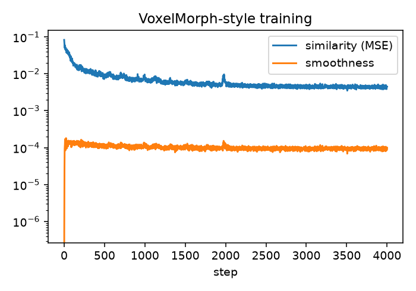
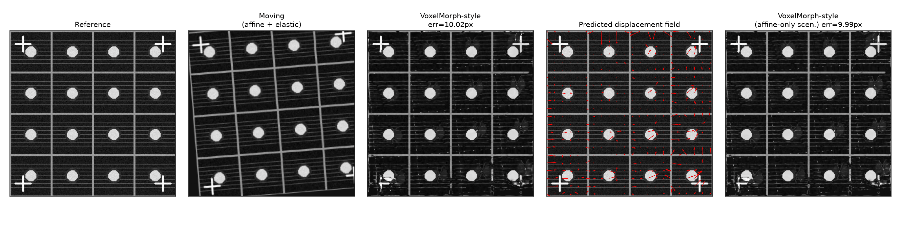
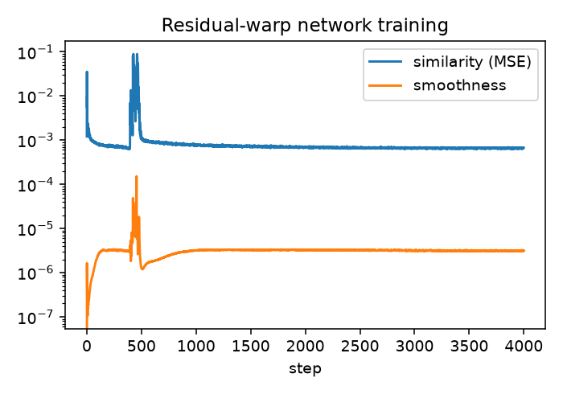
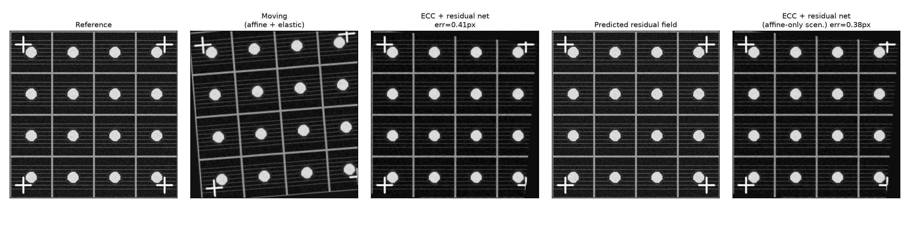

:::{.callout-tip}
This post is part of the [Image Registration Series](index.qmd) series.
:::

Every method in [Part 1](01-classical-methods.qmd) and [Part 2](02-dl-affine-and-feature-matching.qmd)
fits a single 2x3 affine matrix -- one rotation, one translation, one scale, applied uniformly to
every pixel. That's the right model for pure stage drift, and it's why ECC, SIFT+RANSAC, and LoFTR
all converged to sub-pixel accuracy on Scenario A. But Scenario B added a *local* elastic warp on
top of the affine drift -- the kind of spatially-varying deformation real thermal expansion or
fixture flex actually produces -- and no single global matrix can represent that, no matter how
well it's fit. This post drops the affine assumption entirely, and along the way runs into a real
mistake worth walking through rather than hiding.

## VoxelMorph, in one sentence

[VoxelMorph](https://arxiv.org/abs/1809.05231) (Balakrishnan et al., Apache-2.0 licensed) predicts
a **dense, per-pixel displacement field** with a U-Net, warps the moving image through it with a
differentiable spatial transformer, and trains the whole thing **unsupervised** -- a similarity
loss between the warped and reference images, plus a smoothness penalty on the field so neighboring
pixels don't fly off in wildly different directions. No ground-truth deformation field ever appears
anywhere in the loss, which is exactly what makes this approach practical: dense pixel-level
correspondence is not something you can ask a human to hand-label at scale.

```{python}
#| echo: true
#| eval: false
class UNetFlow(nn.Module):
    """(reference, moving) -> dense (H, W, 2) displacement field."""
    def __init__(self):
        super().__init__()
        self.enc1, self.enc2, self.enc3 = ConvBlock(2, 16), ConvBlock(16, 32), ConvBlock(32, 64)
        self.bott = ConvBlock(64, 64)
        self.up3, self.up2, self.up1 = ConvBlock(128, 32), ConvBlock(64, 16), ConvBlock(32, 16)
        self.flow = nn.Conv2d(16, 2, 3, padding=1)
        nn.init.zeros_(self.flow.weight); nn.init.zeros_(self.flow.bias)  # start at "no warp"

    def forward(self, ref, moving):
        x = torch.cat([ref, moving], dim=1)
        e1 = self.enc1(x); e2 = self.enc2(self.pool(e1)); e3 = self.enc3(self.pool(e2))
        b = self.bott(self.pool(e3))
        d3 = self.up3(torch.cat([upsample(b), e3], 1))
        d2 = self.up2(torch.cat([upsample(d3), e2], 1))
        d1 = self.up1(torch.cat([upsample(d2), e1], 1))
        return self.flow(d1)
```

```{python}
#| echo: true
#| eval: false
def smoothness_loss(flow):
    dx = flow[:, :, :, 1:] - flow[:, :, :, :-1]
    dy = flow[:, :, 1:, :] - flow[:, :, :-1, :]
    return dx.pow(2).mean() + dy.pow(2).mean()

flow = model(ref_batch, moving_batch)
registered = warp_with_flow(moving_batch, flow, base_grid)   # grid_sample-based spatial transformer
loss = F.mse_loss(registered, ref_batch) + lambda_smooth * smoothness_loss(flow)
```

## First attempt: hand the network the raw drift, and it struggles

The obvious first thing to try: train the network on the *full* drift this series has been using
throughout -- random affine (rotation/translation/scale) plus random local elastic warp, all in one
-- and let the dense field absorb everything.





**Landmark error: 10.02 px on Scenario B, 9.99 px on Scenario A.** That's worse than every other
method in this series -- including [Part 2](02-dl-affine-and-feature-matching.qmd)'s simple affine
CNN (5.26px), let alone ECC or LoFTR (both well under a pixel). The NCC score (0.92) looks
perfectly respectable, which is itself a small lesson repeated from
[Part 1](01-classical-methods.qmd): a similarity score computed on a *periodic* pattern like this
one is a weak proxy for true geometric accuracy, because a plausible-looking but wrong alignment
can still correlate well against a repeating grid. This is exactly why the whole series scores
against ground-truth landmarks instead of trusting NCC alone.

Looking at the predicted field directly (third panel) makes the actual problem visible: it's noisy
and inconsistent, especially near the corners, rather than the smooth, mostly-uniform pattern a
true 4.5°-rotation-plus-translation field should look like at this scale. **The network is being
asked to represent a large rigid motion and a subtle local warp with the same dense field, and a
small U-Net doesn't do that well in one shot.**

## The fix: affine pre-alignment first, deformable network for the residual only

This isn't a novel workaround -- it's the standard architecture. VoxelMorph's own papers, and
essentially every practical deformable-registration pipeline (ANTs, elastix, DeepReg), run an
**affine pre-registration stage first**, then hand the deformable stage only the *residual*
misalignment left over. Splitting the two apart plays to each method's strength: an affine solver
(ECC, from [Part 1](01-classical-methods.qmd)) is very good at large rigid transforms and bad at
local warps; a dense-field network is the opposite.

```{python}
#| echo: true
#| eval: false
# stage 1: classical affine pre-alignment (Part 1's ECC)
M_ecc = ecc_affine(reference, moving)
affine_corrected = warp_affine(moving, M_ecc, SIZE)

# stage 2: a SECOND network, trained only on local elastic warps (no random affine at all),
# since it will only ever see an already affine-corrected image at inference time
flow = residual_model(reference_tensor, to_tensor(affine_corrected))
registered = warp_with_flow(to_tensor(affine_corrected), flow, base_grid)
```

The residual network's training loop drops the random-affine augmentation entirely -- it only ever
sees reference-vs-elastically-warped-reference pairs, matching exactly what it will see at
inference time after stage 1 has already done its job.





**Landmark error: 0.41 px on Scenario B, 0.38 px on Scenario A** -- roughly **25x better** than the
single network trying to do both jobs at once, and now genuinely competitive with ECC (0.21px) and
LoFTR (0.19px) on the exact scenario those methods can't fully solve. The predicted residual field
(third panel) looks the way a residual field should: small and locally structured, not fighting a
large rotation anymore. NCC also improved (0.93-0.94, the best of any method in the series) --
though per the caveat above, that's the less trustworthy of the two numbers here.

## Results so far

| Configuration | Scenario A | Scenario B | Notes |
|---|---|---|---|
| Single network, raw full drift | 9.99 px | 10.02 px | One dense field asked to represent rigid + local motion together |
| **ECC affine + residual network** | **0.38 px** | **0.41 px** | Standard two-stage architecture; each stage handles what it's good at |

## The honest lesson

This is worth stating plainly rather than editing out: the first, more "purely deep learning"
attempt at this problem was clearly worse than gluing a 1960s-era classical optimizer in front of
a much smaller network. That's not really a deep learning failure -- it's a reminder that the right
question is rarely "classical or deep learning," it's **which part of the problem does each
approach actually solve well.** ECC solves the rigid part better than a small dense-field network
ever will; the dense-field network solves the non-rigid part that ECC structurally cannot touch at
all. Chaining them, in that order, is a better system than either one alone -- and is, not
coincidentally, what the actual literature already does.

[Part 4](04-comparison-licensing-recommendation.qmd) pulls every method from all three posts
together, adds the licensing question that started this series, and closes with a concrete
recommendation.
