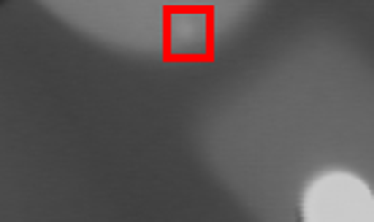

:::{.callout-tip}
This post is part of the [Local-AI Defect Inspection Series](index.qmd). Full code:
[github.com/HasanGoni/lfm2-vl-xray-defects](https://github.com/HasanGoni/lfm2-vl-xray-defects).
:::

## Where this picks up

[Part 2](index.qmd) ended with local VLMs failing hard at zero-shot wafer-defect classification —
1-2/9, mostly by picking one default answer and riding it regardless of what was on screen. The
obvious next question: does fine-tuning actually close that gap, or does a 450M model just learn
a *different* shortcut?

I decided to push further than plain classification. Instead of just "defect or not," I wanted
LFM2-VL-450M to say **where** — a bounding box, grounded against real annotation data, evaluated
with real IoU, not a vibe check.

Short version: **detection got measurably better. Localization never worked, in any of the four
configurations I tried — and I can show you exactly what it did instead.**

## The task

Input: one X-ray image + a fixed prompt. Output: a JSON object.

```python
PROMPT = (
    "Examine this X-ray image of a metal casting for defects (cracks, porosity, voids). "
    'Respond with only a JSON object of the form {"defect": true|false, "boxes": [[x1,y1,x2,y2], ...]}. '
    "Each box is a defect region in x1,y1,x2,y2 pixel coordinates normalized to a 0-1000 scale "
    "relative to the image width and height. If there is no defect, use an empty list."
)
```

Boxes are normalized 0-1000 relative to each image's own width/height — a standard grounding
convention, and necessary here since GDXray images vary in resolution. Schema, enforced at
generation time with [Outlines](https://github.com/dottxt-ai/outlines):

```python
from pydantic import BaseModel, conlist

MAX_BOXES = 6  # covers 97.3% of GDXray defect images (real max is 11, but rare)

class Detection(BaseModel):
    defect: bool
    boxes: conlist(conlist(int, min_length=4, max_length=4), max_length=MAX_BOXES) = []
```

Outlines constrains decoding token-by-token so the model *cannot* emit malformed JSON — no
retry loops, no regex parsing of free text.

One deliberate scope decision: **no defect-type label** (crack vs. porosity vs. shrinkage).
GDXray doesn't provide one — only bounding boxes. Making up type labels to make the task look
richer would have broken the one thing that makes this series credible: every ground-truth label
is real.

## Dataset: GDXray Castings

[GDXray+](https://github.com/computervision-xray-testing/GDXray) Castings group: 2,727 X-ray
images across 67 series, mostly aluminum automotive parts (wheels, knuckles), each with defect
bounding-box annotations in a per-series `BoundingBox.mat`. Free for research/education use.

### Obstacle #1: the official download is scripted-download-blocked

GDXray's Dropbox links return a JS-gated interstitial to any non-browser client — curl with a
spoofed user-agent, cookies, referer headers, none of it got past a `Dropbox - Error` page. I
found a Kaggle mirror instead
([`samarthgoel2604/gdxray-without-synthetic-for-defectd`](https://www.kaggle.com/datasets/samarthgoel2604/gdxray-without-synthetic-for-defectd))
that preserves the original per-series folder structure, pulled via `kagglehub`:

```python
import kagglehub
path = kagglehub.dataset_download("samarthgoel2604/gdxray-without-synthetic-for-defectd")
```

### Obstacle #2: the bounding-box column order is not what you'd guess

`BoundingBox.mat` has one row per defect region: 5 numbers. I assumed
`[image_index, x1, y1, x2, y2]` — the "obvious" convention. Wrong. Cross-checking against a
reference implementation ([maxkferg/metal-defect-detection](https://github.com/maxkferg/metal-defect-detection)),
the actual column order is `[image_index, x1, x2, y1, y2]` — **x-range then y-range**, not
interleaved. My first guess would have silently produced a degenerate box (`x2 < x1`) for at
least one real annotation I checked by hand — a useful tell that something was wrong before I'd
trained a single step on bad labels.

I didn't just trust the reference code either — I rendered the corrected box on a real image:

![A GDXray box, rendered with the corrected `[x1,x2,y1,y2]` column order — it lands exactly on a small localized anomaly near the rim of the casting.](images/gdxray-box-sanity-check.png)

{width=50%}

Lesson: when a dataset format is undocumented and a reference implementation disagrees with the
"obvious" reading, render a box on a real image before trusting either.

### Manifest and split

Ground truth gives a clean per-image label for free: an image is `defect` if its index appears
in any row of its series' `BoundingBox.mat`, `no_defect` otherwise.

```python
boxes_by_index: dict[int, list[list[float]]] = {}
for r in bb:
    idx, x1, x2, y1, y2 = int(r[0]), float(r[1]), float(r[2]), float(r[3]), float(r[4])
    boxes_by_index.setdefault(idx, []).append([x1, y1, x2, y2])
```

87 series, 3,981 images, **714 defect (17.9%) / 3,267 no_defect (82.1%)** — a real, imbalanced,
single-label split close to real-world defect rates. 1,319 total boxes; 318 images have more
than one defect region.

Split train/eval **by series, not by image** — images within one series are highly correlated
(same casting, adjacent rotation angles), so a naive image-level split would leak information
between train and eval. Result: 3,313 train images (70 series) / 668 eval images (17 series),
same seed reused across every experiment below so comparisons stay fair.

## Zero-shot baseline

Before touching any weights, I ran the same prompt against the vanilla model on all 668 eval
images.

| | accuracy | precision | recall | mean IoU |
|---|---|---|---|---|
| Zero-shot | 26.3% | 21.0% | 100% | 0.00 |

100% recall sounds great until you see the confusion matrix: the model predicted `defect: true`
for 623 of 668 images (93.3%) — it wasn't detecting defects, it was just saying yes to nearly
everything. And on the 131 true positives, mean IoU against ground truth was exactly **0.00** —
zero real localization signal, zero-shot.

(Side note: a differently-worded plain-text prompt asking only for `defect`/`no_defect` — no
JSON, no boxes — produced the *opposite* degenerate behavior: `no_defect` on all 668 images,
0% recall. Prompt framing alone flipped which majority-class shortcut the model defaulted to.
Neither framing engaged with the actual image content zero-shot.)

## LoRA fine-tune

### Config

Following [Liquid AI's own fine-tuning guidance](https://docs.liquid.ai/lfm/fine-tuning/trl):
rank 16, `lora_alpha=32` (2×r). Their docs list generic target-module names for their model
family (`q_proj, v_proj, fc1, fc2, linear, gate_proj, up_proj, down_proj`) — but half of those
don't exist as literal module names in LFM2-VL-450M's actual architecture. I checked with
`named_modules()` before trusting the doc:

```python
LORA_TARGET_MODULES = ["q_proj", "k_proj", "v_proj", "out_proj", "fc1", "fc2"]
```

### Training target = the same schema Outlines will constrain at eval time

```python
def target_json(row: dict) -> str:
    boxes = [normalize_box(b, row["width"], row["height"]) for b in row["boxes"][:MAX_BOXES]]
    det = Detection(defect=row["label"] == "defect", boxes=boxes)
    return det.model_dump_json()
```

Training the model to emit exactly what Outlines will later constrain it to, rather than
free-text, so there's no train/eval mismatch in output format.

### Label masking via prompt-prefix trick

Loss should only apply to the response tokens, not the image+prompt context. Rather than parsing
the chat template's special-token structure by hand, I exploited that the tokenized prompt is an
exact prefix of the tokenized full conversation (image processing is deterministic regardless of
what text follows it) — verified this holds before relying on it:

```python
prompt_inputs = processor(images=[img], text=prompt_text, return_tensors="pt")
full_inputs = processor(images=[img], text=full_text, return_tensors="pt")
prompt_len = prompt_inputs["input_ids"].shape[1]
labels = full_inputs["input_ids"].clone()
labels[:, :prompt_len] = -100  # ignored by cross-entropy
```

### Class-weighted sampling

Train split is 17.6% defect. Left alone, a fine-tune on this data will happily relearn "always
say no_defect" — it's an easy 82% accuracy. Inverse-frequency weighted sampling forces roughly
balanced defect/no_defect exposure per epoch:

```python
weight_defect = 1.0 / n_defect
weight_ok = 1.0 / n_ok
sample_weights = [weight_defect if l == "defect" else weight_ok for l in labels_for_weight]
sampler = WeightedRandomSampler(sample_weights, num_samples=len(train_rows), replacement=True)
```

### Obstacle #3: training instability

First run (flat lr=1e-4, no schedule, 800 steps, checkpoint every 200): loss trended down
(1.23 → 0.56) but quick-eval on a held-back 80-image subset **oscillated between collapsing to
"always no_defect" and a more balanced state**, checkpoint to checkpoint:

| step | accuracy | recall | precision |
|---|---|---|---|
| 0 (baseline) | 52.5% | 100% | 51.3% |
| 200 | 50.0% | 0% | — collapsed |
| 400 | **60.0%** | 52.5% | 61.8% |
| 600 | 50.0% | 0% | — collapsed again |
| 800 (final) | 48.75% | 12.5% | 45.5% |

I added a warmup + cosine LR decay schedule (peak `lr=5e-5`, 10% warmup) and reran, checking
every 100 steps instead of 200. **It didn't fix the oscillation** — recall still bounced
0%→100%→12.5%→0%→32.5%→30% across the run. That ruled out "missing LR schedule" as the root
cause and points instead at the small effective batch size (gradient-accumulated batch of 4, on
a dataset with only ~583 real defect training examples after oversampling) producing a
high-variance gradient estimate. Something I'd want to fix with a larger effective batch before
trusting this recipe further.

### Results — full 668-image eval, four configurations

| config | accuracy | precision | recall | mean IoU |
|---|---|---|---|---|
| Zero-shot | 26.3% | 21.0% | 100% | 0.00 |
| LoRA, flat lr, step 400 | **60.3%** | 26.6% | 58.0% | 0.00 |
| LoRA, flat lr, step 800 (final) | 75.6% | 26.5% | 13.7% | 0.00 |
| LoRA, warmup+cosine, step 800 (final) | 66.0% | 23.9% | 33.6% | 0.00 |

**Detection genuinely improved.** Zero-shot's degenerate "flag everything" (100% recall / 21%
precision) became a real, much more balanced decision at step 400 — 58% recall at similar
precision. Unstable across configurations, not a clean monotonic win, but real signal that the
model learned something about defect *presence*.

**Localization never moved. At all. In any configuration.** Mean IoU is exactly 0.00 across
zero-shot and all three fine-tuned checkpoints.

### I didn't just report 0.00 — I checked why

A number that's *exactly* 0.00 in four separate runs is either a very clean finding or a bug in
my eval code. Before writing this up, I pulled the raw predictions:

```
true: [[456.0, 502.0, 489.0, 545.0]]  pred: [[0,0,0,0], [0,0,0,0], [0,0,0,0], [0,0,0,0]]
true: [[459.0, 483.0, 489.0, 524.0]]  pred: [[0,0,0,0], [0,0,0,0], [0,0,0,0], [0,0,0,0]]
true: [[462.0, 465.0, 492.0, 503.0]]  pred: [[0,0,0,0], [0,0,0,0]]
true: [[466.0, 447.0, 499.0, 483.0]]  pred: [[0,0,0,0], [0,0,0,0], [0,0,0,0], [0,0,0,0]]
```

Every single predicted box, on every image, is `[0,0,0,0]` — regardless of where the real defect
actually is. The fine-tuned model learned to say `"defect": true` more accurately. It never
engaged with the harder task hiding inside the same JSON object: predicting the actual numbers.
`[0,0,0,0]` is a cheap, constant way to reduce the coordinate-token loss without ever learning to
regress a real value through next-token prediction — and apparently a local optimum the training
found and kept.

That's a much stronger, more specific finding than "IoU was low." Detecting *that* something's
wrong turned out to be learnable in an 800-step LoRA budget on a 450M model. Detecting *where* —
asking a generalist small VLM to learn numeric grounding purely through text-token generation,
from a few hundred examples — did not work once, in four attempts.

## What's next

I don't think a 450M generalist VLM, fine-tuned this way, is the right tool for pixel-level
localization from scratch. The natural next experiment: split the job. Use a dedicated
segmentation/prompted-detection model (SAM3, or similar) to find candidate defect regions, and
hand *that* result to the VLM for reasoning — instead of asking one small model to learn both
"what" and "where" end-to-end through the same text-generation objective.

If you've combined a segmentation model with a small VLM this way for a narrow visual task, I'd
like to hear about it — curious whether the extra moving part is worth it in practice.

---

**Full code, all scripts referenced above, and the raw per-image results**:
[github.com/HasanGoni/lfm2-vl-xray-defects](https://github.com/HasanGoni/lfm2-vl-xray-defects)
