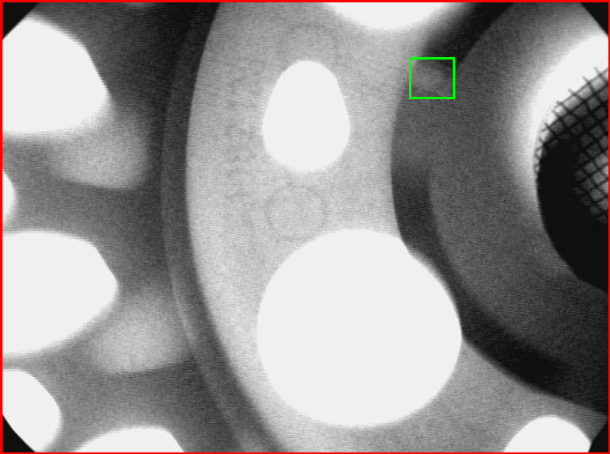
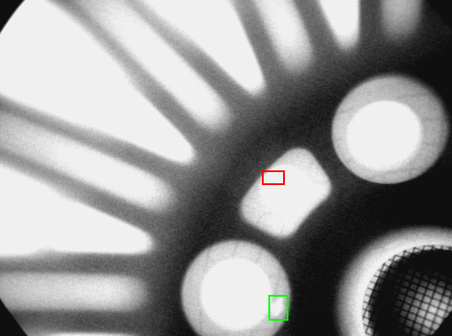

:::{.callout-tip}
This post is part of the [Local-AI Defect Inspection Series](index.qmd). Full code:
[github.com/HasanGoni/lfm2.5-vl-xray-defects](https://github.com/HasanGoni/lfm2.5-vl-xray-defects).
:::

## Where this picks up

[Part 3](03-finetuning-lfm2-vl-xray-defects.qmd) was, honestly, a bit of a downer to write.
LoRA fine-tuned LFM2-VL-450M on real GDXray casting X-ray images for defect detection +
localization. Detection got measurably better. Localization just... never worked. Mean IoU
exactly **0.00**, in all four configurations I tried, because the fine-tuned model had quietly
learned to predict the constant box `[0,0,0,0]` no matter what was in front of it. I remember
staring at that results file for a while, half-convinced I'd broken the eval script, before I
went and pulled the raw predictions to check.

Then, mid-way through writing this series, Liquid AI shipped **LFM2.5-VL-3B** (Aug 12, 2026) — a
3.1B-parameter successor — and their release notes specifically call out improved grounding and
object detection over the previous generation. I'll admit my first reaction was mild
skepticism — "improved grounding" is the kind of line that shows up in every model release, and
it rarely means what you'd hope on a narrow, weird task like this one. But it's a specific,
testable claim, and it lands directly on the exact gap post 3 found. So I couldn't really not
check it. Same task, same dataset, same eval split, same schema — only the model changes. Does
the grounding upgrade actually close it?

Short version: **detection improved again, in the same shape as post 3. Localization still
didn't work — but it failed in a genuinely different, and honestly more interesting, way than the
450M model did.** I did not expect that part, and it's the reason I think this post is worth
reading even if you already read post 3.

## The task (unchanged from post 3)

Same input/output contract as post 3: one X-ray image + fixed prompt, JSON output
`{"defect": bool, "boxes": [[x1,y1,x2,y2], ...]}`, boxes normalized 0-1000 relative to image
width/height, schema-constrained at generation time with
[Outlines](https://github.com/dottxt-ai/outlines). Same `Detection` Pydantic schema, same
`MAX_BOXES=6` cap, same GDXray Castings dataset (87 series, 3,981 images, 714 defect / 3,267
no_defect), same **series-level** train/eval split (3,313 train / 668 eval) — copied straight
from post 3's manifest files, which point at the shared kagglehub image cache, so this is a
byte-identical split, not a re-shuffle I could talk myself into rigging. If the numbers move,
it's the model, not the data. I was fairly paranoid about this one, since it's the whole point of
doing a follow-up post instead of a standalone one.

## Zero-shot baseline: the opposite failure mode

| | accuracy | precision | recall | mean IoU (of TPs) | localized (IoU>0.3) |
|---|---|---|---|---|---|
| LFM2-VL-450M (post 3) | 26.3% | 21.0% | 100% | 0.00 | 0/131 |
| LFM2.5-VL-3B (this post) | 79.9% | 43.5% | 7.6% | 0.02 | 0/10 |

This is the part that made me laugh a little, in a tired-engineer way. Post 3's 450M zero-shot
flagged `defect: true` on 623/668 images (93.3%) — it wasn't reading the image, it was riding one
default answer into the ground. LFM2.5-VL-3B does the **exact opposite**: it flagged only 23/668
images (3.4%) as `defect: true`, catching just 10 of 131 real defects. That 79.9% accuracy number
looks great for about five seconds, until you notice the eval set is 80.4% `no_defect` — which
means the model is basically getting credit for saying "no" almost every time, same as the
majority-class baseline would. Bigger model, newer release, and it's still not really looking at
the picture — it just picked a different lazy default to hide behind. Not the "the newer model is
just better" story I half-expected going in.

When it *does* flag a defect, the box isn't localized either — it defaults to something close to
the whole image, or a coarse grid quadrant, which honestly reads like the model hedging: "there's
*something* wrong, somewhere in here."

Mean IoU across the 10 true positives: 0.02. Not meaningfully different from post 3's 0.00, and
not a number I'd defend as "close."

## LoRA fine-tune

### Config

I reused post 3's *stable* final configuration on purpose — rank 16, `lora_alpha=32`, warmup +
cosine LR decay (peak `lr=5e-5`, 10% warmup), class-weighted sampler (train split is 17.6%
defect). I'd already burned a chunk of post 3 re-discovering that a flat learning rate makes this
training unstable; no reason to pay that tax twice. One thing I did *not* let myself assume: that
the target module names (`q_proj, k_proj, v_proj, out_proj, fc1, fc2`) would carry over cleanly
to the new architecture. Checked `named_modules()` on the actual loaded model before touching the
LoRA config — they matched, but I've been burned by "the docs said so" before on this exact
project, so I'd rather check than trust.

### Training

Loss went 1.85 → 0.83 over 800 steps — noisy, generally down, same shape as post 3. Quick-eval
recall on the held-out 80-image subset climbed 10% → 45%, with the same oscillation pattern I
flagged in post 3 as a likely small-effective-batch artifact — including a dip back down to 5% at
step 300, right in the middle of training, which is exactly the kind of thing that makes you want
to kill a run early and restart. I didn't, and I'm glad, because it recovered. At this point I'm
fairly convinced this jitter is just what fine-tuning a VLM on ~580 real defect examples with a
grad-accumulated batch of 4 looks like, not a bug specific to either model.

### Full eval, 668-image eval set

| | accuracy | precision | recall | mean IoU (of TPs) | localized (IoU>0.3) |
|---|---|---|---|---|---|
| Zero-shot | 79.9% | 43.5% | 7.6% | 0.02 | 0/10 |
| LoRA, step 800 (final) | 71.7% | 35.1% | **51.9%** | 0.01 | 0/68 |

**Detection improved, same shape as post 3, and this part I'll happily call a win.** Recall went
from single digits to catching about half of all real defects — 7.6% → 51.9% — at the usual cost
of a less conservative decision boundary (126 false positives vs. 13 zero-shot). I'd take that
trade for an inspection-triage use case; missing half the defects zero-shot is much worse than an
extra review pass on some clean parts. It's real, repeatable signal that the fine-tune worked on
the *presence* half of the task — same conclusion post 3 landed on, now confirmed on a second,
larger model.

**Localization still didn't work. But it failed differently than 450M did — and honestly, that
difference is the actual reason I wanted to write this post rather than just posting a table and
moving on.**

## I checked what it's actually predicting — again

Post 3 taught me not to trust a suspiciously clean 0.00 without looking at the raw predictions,
so I did that again here. Post 3's 450M model had collapsed completely: every single predicted
box, on every image, was the literal constant `[0,0,0,0]`. Zero information content, easy to spot,
almost boring once you see it.

LFM2.5-VL-3B's fine-tuned predictions are *not* collapsed, and that surprised me enough that I
double- and triple-checked it before writing this section. Across the 68 true positives:

- **Box size is close to correct.** Mean predicted box: 64.6×51.0px. Mean true box: 71.4×46.3px.
  The model genuinely learned a reasonable prior over what a defect-sized bounding box looks like
  in this dataset — that's not nothing, and it's a real step up from "give up entirely."
- **Box position is essentially uncorrelated with the real defect location.** Mean offset between
  predicted and true box center: (Δx=-58, Δy=+33), with a standard deviation (114, 147) on top of
  that — larger than the box itself, on both axes. Not a small, fixable coordinate-frame bug. Just
  noise dressed up as a plausible-looking box.

So the model learned **what** a plausible defect region looks like — shape and scale — without
ever learning **where** to put it. My read: that's a more specific, more useful failure than
450M's flat collapse to a constant, because it tells you *which part* of the task got learned.
The easy part of the coordinate-regression loss — box size, which barely varies across the
dataset and correlates loosely with "defect vs. not" — got picked up fast. The hard part —
actually conditioning position on the pixels in front of it — never did, in 800 steps on ~580 real
examples. If I had to guess why, I'd say the loss landscape just makes "guess an average-sized box
near the average location" a cheap local minimum that's easy to fall into and hard to climb out of
with this little data.

## Does "improved grounding" hold up?

Short answer, my honest opinion: partially, and not in the way the marketing copy implies.

Liquid AI's release notes for LFM2.5-VL-3B specifically call out improved grounding and object
detection over the previous generation. Something in this experiment is consistent with that —
the model didn't collapse to a lazy constant the way 450M did, it produced structurally sensible,
appropriately-sized boxes instead of giving up outright. That's real, measurable progress, and I
don't want to undersell it just because it's not the headline result I was hoping for.

But it is not evidence that per-image spatial grounding — actually reading where the defect is
and putting the box there — transfers from a few hundred LoRA examples on a 3B model, any more
than it did on a 450M one. If you're evaluating LFM2.5-VL-3B for a task like this based on that
release-notes claim, my honest take is: don't take it at face value for a narrow, low-data
fine-tune like this one — go check it on your own data the way I just did here, because "improved
grounding" clearly means something different in their benchmark suite than it does on GDXray
castings after 800 LoRA steps. Same headline conclusion as post 3, arrived at through a more
specific mechanism: **detection generalizes fast in this budget; per-image localization doesn't,
regardless of model size or claimed grounding improvements.**

## Comparison across both posts

| | zero-shot recall | zero-shot IoU | fine-tuned recall | fine-tuned IoU | fine-tuned failure mode |
|---|---|---|---|---|---|
| LFM2-VL-450M (post 3) | 100% (over-triggers) | 0.00 | 13.7–58.0%¹ | 0.00 | constant `[0,0,0,0]` |
| LFM2.5-VL-3B (this post) | 7.6% (under-triggers) | 0.02 | 51.9% | 0.01 | plausible size, random position |

¹ unstable across checkpoints — see post 3's step-by-step table.

What sticks with me about this table: two models, roughly 7x apart in parameter count, released
about a year apart, landed on basically the same localization ceiling — approached from two
completely different directions. If it were just a 450M-specific limitation, I'd expect the
bigger model to just quietly fix it. It didn't. That consistency is more convincing to me than
either result on its own — it looks less like a model-specific gap and more like a property of
fine-tuning a generalist VLM on a few hundred grounding examples through plain next-token
prediction, independent of scale in this range.

## What's next

Post 3 proposed splitting the job: a dedicated segmentation/prompted-detection model for
candidate regions, handed to the VLM for reasoning, instead of asking one small model to learn
"what" and "where" end-to-end. Nothing here changes my mind on that — if anything, watching the
same ceiling hold at 3B makes me more confident it's the right next move, not less. I still
haven't built that combination; it's next on my list, and at this point I'm more curious about it
than I am about squeezing another point of recall out of this exact recipe.

Separately, I deliberately scoped this post to LoRA only — 121GB of unified memory on the GB10
made QLoRA's 4-bit quantization pointless here, there was no memory pressure forcing my hand. A
full fine-tune, unlocking every parameter instead of the ~0.38% LoRA touches, is the other open
experiment I want to run before I'm willing to conclude localization is genuinely out of reach for
a model this size, rather than just out of reach for this particular training recipe.

---

**Full code, training/eval scripts, and raw per-image results**:
[github.com/HasanGoni/lfm2.5-vl-xray-defects](https://github.com/HasanGoni/lfm2.5-vl-xray-defects)
