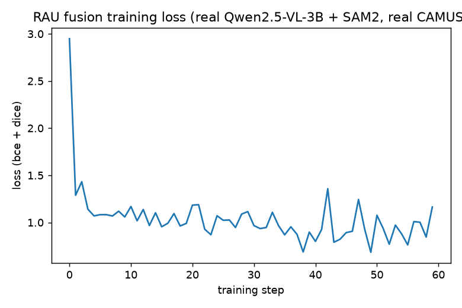

## The paper

**[RAU: Reference-based Anatomical Understanding with Vision Language Models](https://arxiv.org/abs/2509.22404)**
— Yiwei Li, Yikang Liu, Jiaqi Guo, Lin Zhao, Zheyuan Zhang, Xiao Chen, Boris Mailhe, Ankush
Mukherjee, Terrence Chen, Shanhui Sun (United Imaging Intelligence / University of Georgia /
Northwestern, arXiv:2509.22404)

Same standard as last time: full real code below, an architecture diagram traced from the
actual `transformers` source (not guessed), and a real training run — no pseudocode.

---

## Explain it like I'm five


Imagine you have exactly **one** photo of a heart with all the parts labeled in crayon — "this
blob is the pump room, this one's the waiting room." Now someone hands you a **new**, unlabeled
photo of a *different* heart and asks "where's the pump room in this one?"

You don't need a whole art class to answer that. You just compare the two photos, notice they
have roughly the same shape in roughly the same place, point at the matching spot, and say "there
— color that one in." That's it. That's the whole paper.

The "pointing" is done by a VLM (a model that can look at pictures and talk about them). The
"coloring in neatly" is done by SAM2, a model that's really good at drawing a clean outline once
you've pointed at roughly the right spot. Neither one had to have seen this exact heart before.

## Explain it like I'm a data scientist

RAU tackles anatomical structure identification/segmentation in medical images under label
scarcity by using **one annotated reference image** as an in-context spatial prior, instead of
training a fully-supervised segmentation model per anatomy/modality.

Three escalating formulations, all on top of Qwen2.5-VL-7B:

1. **VQA labeling** — SFT then GRPO (RL), reward = label accuracy + output-format validity. The
   RL stage matters a lot: the paper's own CoT-before/after comparison (their Fig. A1) shows the
   model shifts from judging regions in isolation to explicitly reasoning about *relative spatial
   relationships* between reference and target regions — and that shift is what drives OOD
   generalization, not the SFT stage.
2. **Bbox localization** — the VLM emits `<Seg>` tokens whose embeddings regress boxes via a
   small MLP; per-image *global* label assignment is then solved as an **optimal transport**
   problem (Sinkhorn) over all predicted boxes at once, using relative spatial position as a soft
   constraint, rather than assigning each box's label independently (which hallucinates under
   dense/ambiguous layouts).
3. **Segmentation via SAM2 fusion (the part we reimplement below)** — a `<Seg>` token's hidden
   state is projected through an MLP into SAM2's memory-embedding space, then retrieved via
   dot-product attention against SAM2 memory slots built from the reference mask (Eq. 6-7). The
   fused representation conditions SAM2's own mask decoder. No explicit point/box prompt is
   needed — the "prompt" is semantic, not geometric.

**Headline result:** VLM+SAM2 beats SAM2-Memory and SAM2-Memory-Ref-SFT baselines by a wide
margin on both in-distribution sets (Arcade Dice 0.0346→0.6754, RAOS 0.1084→0.7503) and, more
interestingly, on two **out-of-distribution modalities never trained on** (CAMUS ultrasound: 40%→
95.4% labeling accuracy; LERA bone X-ray: 30%→61.9%). The ablation (their Table 4) isolates *why*:
initializing the SAM2-fusion stage from the RL-tuned VQA checkpoint — not vanilla, not SFT-only —
is what makes OOD transfer work. SFT-only overfits to dataset-specific patterns (76% on CAMUS
in-domain-style eval vs. only 34% OOD on LERA); RL-driven spatial reasoning generalizes.

## Jargon buster

| Term | Plain-English meaning |
|---|---|
| **VLM (Vision-Language Model)** | A model that takes images + text and outputs text — here, Qwen2.5-VL |
| **Reference image** | The one labeled example the model is shown, used to infer labels on a new, unlabeled image |
| **`<Seg>` token** | A special vocabulary entry added to the VLM's tokenizer; the model is trained to "say" it when it wants to hand off to the segmentation model — the hidden state *at* that token position carries the semantic query |
| **GRPO** | Group Relative Policy Optimization — an RL fine-tuning method (reward-driven, no separate value network) used in the paper's second training stage; **not implemented in our demo** (see caveats) |
| **SAM2 memory bank / memory attention** | SAM2's native mechanism for propagating a mask across video frames using learned memory slots; the paper repurposes it for reference→target propagation instead of frame→frame |
| **`target_embedding`** | A real, documented parameter on `Sam2Model.forward()` for injecting a semantic-concept embedding into the mask decoder (originally built for PerSAM-style personalization) — this is our real integration point for RAU's fused query |
| **Optimal transport / Sinkhorn** | An algorithm for assigning items (predicted boxes) to categories (labels) *jointly*, using a global cost matrix, instead of picking each assignment independently — reduces hallucination when many regions are crowded together |
| **Masked-average pooling** | Averaging a feature map's vectors only over the pixels covered by a given mask, producing one summary vector per labeled region |
| **DICE / BCE loss** | Two standard segmentation losses: Dice rewards mask *overlap* directly; BCE (binary cross-entropy) is a per-pixel classification loss. RAU (and our demo) trains on a weighted sum of both |
| **OOD (out-of-distribution)** | Evaluating on a dataset/modality never seen during training — the paper's strongest result |

---

## Architecture — where the fusion actually plugs into real code

Traced from the real, installed `transformers` source (`Sam2Model.forward`, `Sam2MaskDecoder`,
`Sam2TwoWayTransformer`) — not a schematic guess:

```{mermaid}
flowchart TB
    subgraph VLM["Qwen2.5-VL-3B-Instruct (frozen except one embedding row)"]
        REF["reference image"] --> QW["Qwen2.5-VL\nforward pass"]
        TGT["target image"] --> QW
        PROMPT["text prompt:\n'find the {label} in image 2'"] --> QW
        QW -->|"teacher-forced\n... <SEG>"| HSEG["h_seg\n(hidden state at <SEG>)"]
    end

    subgraph FUSION["RAU fusion (trainable)"]
        PROJ["SegQueryProjection\nMLP: vlm_dim -> 256"]
        BANK[("Reference memory\nmasked-avg-pooled SAM2\nfeatures, per label\n(built offline)")]
        ATTN["dot-product attention\nEq. 7"]
    end

    HSEG --> PROJ
    PROJ -->|q| ATTN
    BANK -->|memory slots m_j| ATTN
    ATTN -->|z| TARGET_EMB

    subgraph SAM2["SAM2 (vision/prompt encoders frozen, mask decoder trainable)"]
        TGT2["target image"] --> VE["vision_encoder"]
        VE --> ME["image_embeddings"]
        TARGET_EMB["target_embedding=z\n(public Sam2Model param,\nnormally used by PerSAM)"] --> MD["mask_decoder\n(Sam2TwoWayTransformer)"]
        ME --> MD
        MD --> OUT["pred_masks"]
    end

    style BANK fill:#2c5,color:#000
    style PROJ fill:#58a,color:#fff
    style ATTN fill:#58a,color:#fff
```

One real bug this required fixing, not glossed over: `Sam2TwoWayTransformer.forward` (the
transformer inside SAM2's mask decoder) does `queries += target_embedding` — an **in-place**
op. That's fine for SAM2's original use of `target_embedding` (PerSAM, inference-only, no
gradient needed) but it silently breaks autograd the moment `target_embedding` itself needs a
gradient, which ours does — it's produced by our trainable projection + attention. Same fix
pattern as the SAM3 decoder in [last week's HPMA post](2026-08-27-hpma-sam3.html): a one-line
subclass override, `types.MethodType`, no fork of `transformers` needed.

---

## Setup — one `uv`-managed environment, all real checkpoints

```bash
cd quarto_blog_hasan/notebooks/paper-rau-sam2
uv sync
```

```{.toml filename="notebooks/paper-rau-sam2/pyproject.toml"}
[project]
name = "paper-rau-sam2"
version = "0.1.0"
description = "Real, runnable reimplementation of RAU (Reference-based Anatomical Understanding with Vision Language Models, arXiv:2509.22404) — Qwen2.5-VL emitting a <SEG> query fused into SAM2's mask decoder via its target_embedding interface, trained on real CAMUS echocardiography data."
requires-python = ">=3.11"
dependencies = [
    "torch>=2.4",
    "torchvision>=0.19",
    "transformers>=4.49",
    "accelerate>=0.34",
    "pillow>=10.4",
    "matplotlib>=3.9",
    "huggingface_hub>=0.25",
    "numpy",
    "qwen-vl-utils>=0.0.8",
    "nibabel>=5.4",
]

[tool.uv]
package = false
```

**Substitutions, stated up front, same honesty policy as always:**

| Paper used | We use | Why |
|---|---|---|
| Qwen2.5-VL-**7B** | Qwen2.5-VL-**3B**-Instruct | Same architecture/API family, downloads and trains in minutes instead of hours here — still a real, unmodified checkpoint |
| RAOS (413-scan private/challenge CT) + Arcade (angiography) for training | **CAMUS** (public, non-gated, `YongchengYAO/CAMUS-Lite` on HF) | RAOS/Arcade aren't straightforwardly downloadable; CAMUS is literally **the paper's own OOD test set** — using it as our only dataset means every number below is on data the paper itself never trained on |
| Full SFT+GRPO two-stage training | **SFT stage only** (the fusion mechanism itself) | GRPO is a full RL loop with a custom reward and policy optimization — a separate, large undertaking orthogonal to whether the fusion mechanism works, which is what a demo needs to show |

`facebook/sam2.1-hiera-large` and `facebook/dinov2-base` are both non-gated. Qwen2.5-VL-3B is
non-gated too — nothing here needs a license request, unlike SAM3 last week.

**A real data-format gotcha worth flagging**: CAMUS-Lite's dataset card describes "1000
echocardiographic images," but the actual files are NIfTI half-cardiac-cycle **volumes** (~22
frames each), not flat PNGs. `camus_data.py` below handles the real format.

```{.python filename="notebooks/paper-rau-sam2/camus_data.py"}
"""Loading for the real CAMUS-Lite data. Each file is a NIfTI half-cardiac-
cycle sequence (630x519x~22 frames per patient/view), not a flat PNG as the
dataset card's prose suggests — this module handles the real format.

Labels: 1 = left ventricular myocardium, 2 = left ventricle, 3 = left atrium.
"""
from __future__ import annotations

import zipfile
from pathlib import Path

import nibabel as nib
import numpy as np
from huggingface_hub import hf_hub_download
from PIL import Image

LABELS = [1, 2, 3]


def download_camus(cache_dir: Path) -> tuple[Path, Path]:
    images_zip = hf_hub_download("YongchengYAO/CAMUS-Lite", "Images.zip", repo_type="dataset")
    masks_zip = hf_hub_download("YongchengYAO/CAMUS-Lite", "Masks.zip", repo_type="dataset")
    img_dir = cache_dir / "Images"
    mask_dir = cache_dir / "Masks"
    if not img_dir.exists():
        with zipfile.ZipFile(images_zip) as z:
            z.extractall(cache_dir)
    if not mask_dir.exists():
        with zipfile.ZipFile(masks_zip) as z:
            z.extractall(cache_dir)
    return img_dir, mask_dir


def list_patients(img_dir: Path, mask_dir: Path) -> list[tuple[Path, Path, str]]:
    """Returns (image_path, mask_path, patient_view_id) for every patient/view
    that has both an image and a ground-truth volume."""
    out = []
    for img_path in sorted(img_dir.glob("*.nii.gz")):
        stem = img_path.name.replace(".nii.gz", "")
        mask_path = mask_dir / f"{stem}_gt.nii.gz"
        if mask_path.exists():
            out.append((img_path, mask_path, stem))
    return out


def load_frame_pair(image_path: Path, mask_path: Path, ref_frame: int = 0, target_frame: int = -1):
    """Loads two frames (by default first and last) from the same patient's
    half-sequence: a reference frame with its mask, and a target frame with
    its own (held-out at inference, used only for supervision at train time)
    mask."""
    img_vol = nib.load(str(image_path)).get_fdata()
    mask_vol = nib.load(str(mask_path)).get_fdata()
    n_frames = img_vol.shape[-1]
    ref_idx = ref_frame % n_frames
    tgt_idx = target_frame % n_frames

    ref_img = _to_pil(img_vol[..., ref_idx])
    ref_mask = mask_vol[..., ref_idx].astype(np.uint8).T  # match _to_pil's transpose
    tgt_img = _to_pil(img_vol[..., tgt_idx])
    tgt_mask = mask_vol[..., tgt_idx].astype(np.uint8).T
    return ref_img, ref_mask, tgt_img, tgt_mask


def _to_pil(frame_2d: np.ndarray) -> Image.Image:
    arr = frame_2d.astype(np.float32)
    if arr.max() > 0:
        arr = arr / arr.max() * 255.0
    arr = arr.astype(np.uint8).T  # nibabel returns (W, H); transpose to (H, W)
    return Image.fromarray(arr).convert("RGB")
```

Real check that the loader is actually correct — a genuine reference frame from patient 0001,
mask overlaid, anatomically sane (myocardium ring in red, LV cavity in green, LA in blue):


---

## The fusion mechanism — Eq. 6-7, as real code

```{.python filename="notebooks/paper-rau-sam2/rau_modules.py"}
"""RAU core modules — real reimplementation of the paper's Eq. 6-7 (Section
3.3) plus the DINOv2 reference-retrieval step (Fig. 2a).

Reference-based Anatomical Understanding with Vision Language Models
(arXiv:2509.22404). SAM2 backbone: the paper builds its "memory bank" from
SAM2's own video-native memory encoder, populated from a reference mask. We
build the functional equivalent with SAM2's plain image encoder instead —
masked-average-pooled vision features per labeled region of the retrieved
reference image — and feed the fused query into SAM2's mask decoder through
its public, documented `target_embedding` parameter (the same interface SAM2
exposes for PerSAM-style semantic prompting). Equations 6-7 are implemented
exactly; the memory *construction* substitutes SAM2's video/session memory
machinery for a simpler, non-video masked-pooling step.
"""
from __future__ import annotations

from dataclasses import dataclass, field

import torch
import torch.nn as nn
import torch.nn.functional as F


@dataclass
class ReferenceBank:
    """One entry per reference image: DINOv2 global embedding (for
    retrieval, Fig. 2a) + per-label SAM2 memory vectors (for Eq. 7)."""
    dino_embeds: torch.Tensor = None  # (N, d_dino)
    memory_vectors: list[dict[int, torch.Tensor]] = field(default_factory=list)  # per-image {label: (d_sam2,)}
    images: list = field(default_factory=list)
    masks: list = field(default_factory=list)

    def to(self, device):
        self.dino_embeds = self.dino_embeds.to(device)
        self.memory_vectors = [{k: v.to(device) for k, v in d.items()} for d in self.memory_vectors]
        return self

    def save(self, path):
        torch.save({
            "dino_embeds": self.dino_embeds.cpu(),
            "memory_vectors": [{k: v.cpu() for k, v in d.items()} for d in self.memory_vectors],
        }, path)

    @classmethod
    def load(cls, path):
        raw = torch.load(path, weights_only=True)
        return cls(dino_embeds=raw["dino_embeds"], memory_vectors=raw["memory_vectors"])


def retrieve_reference(target_dino_embed: torch.Tensor, bank: ReferenceBank) -> int:
    """Fig. 2a: cosine similarity retrieval over the reference bank."""
    sims = F.cosine_similarity(target_dino_embed.unsqueeze(0), bank.dino_embeds, dim=-1)
    return sims.argmax().item()


class SegQueryProjection(nn.Module):
    """Eq. 6: q_i = MLP(h_i^<Seg>). Projects the VLM's <SEG> hidden state
    into SAM2's mask-decoder embedding space (dim=256)."""

    def __init__(self, vlm_dim: int, sam2_dim: int = 256):
        super().__init__()
        self.net = nn.Sequential(
            nn.Linear(vlm_dim, sam2_dim),
            nn.GELU(),
            nn.Linear(sam2_dim, sam2_dim),
        )

    def forward(self, h_seg: torch.Tensor) -> torch.Tensor:
        return self.net(h_seg)


def memory_attention(query: torch.Tensor, memory_vectors: dict[int, torch.Tensor]) -> torch.Tensor:
    """Eq. 7: dot-product attention of the projected query over the
    retrieved reference's per-label memory slots {m_j}.

    query: (d,). memory_vectors: {label: (d,)}. Returns fused (d,) z_i.
    """
    labels = sorted(memory_vectors.keys())
    m = torch.stack([memory_vectors[l] for l in labels])  # (K, d)
    scores = (query.unsqueeze(0) * m).sum(-1) / (query.shape[-1] ** 0.5)  # (K,)
    attn = scores.softmax(dim=-1)
    return (attn.unsqueeze(-1) * m).sum(0)  # (d,)


def dice_loss(pred_logits: torch.Tensor, target: torch.Tensor, eps: float = 1.0) -> torch.Tensor:
    pred = pred_logits.sigmoid().flatten(1)
    target = target.flatten(1).float()
    intersection = (pred * target).sum(-1)
    union = pred.sum(-1) + target.sum(-1)
    return (1 - (2 * intersection + eps) / (union + eps)).mean()
```

### Building the real reference bank

```{.python filename="notebooks/paper-rau-sam2/build_reference_bank.py"}
"""Builds the real reference bank from real CAMUS echocardiography data:
DINOv2 embeddings for retrieval (Fig. 2a) and SAM2-encoder masked-pooled
per-label memory vectors (the reference-mask memory that Eq. 7 attends over).

CAMUS-Lite (YongchengYAO/CAMUS-Lite on HF) is a public subset of the real
CAMUS cardiac ultrasound dataset — this is literally the paper's own OOD
evaluation dataset, not a substitute picked for convenience. Each file is a
NIfTI half-cardiac-cycle sequence (~22 frames); we use frame 0 (roughly
end-diastole) as the reference frame with its ground-truth mask.
Labels: 1 = left ventricular myocardium, 2 = left ventricle, 3 = left atrium.

Run:
    uv run build_reference_bank.py --n-references 30 --out reference_bank.pt
"""
from __future__ import annotations

import argparse
from pathlib import Path

import torch
from transformers import AutoImageProcessor, AutoModel, Sam2Model, Sam2Processor

from camus_data import LABELS, download_camus, list_patients, load_frame_pair
from rau_modules import ReferenceBank


@torch.no_grad()
def build(n_references: int, out_path: Path, device: str, cache_dir: Path):
    img_dir, mask_dir = download_camus(cache_dir)
    patients = list_patients(img_dir, mask_dir)
    print(f"Found {len(patients)} CAMUS patient/view volumes")
    ref_patients = patients[:n_references]

    dino = AutoModel.from_pretrained("facebook/dinov2-base").to(device).eval()
    dino_proc = AutoImageProcessor.from_pretrained("facebook/dinov2-base")

    sam2 = Sam2Model.from_pretrained("facebook/sam2.1-hiera-large").to(device).eval()
    sam2_proc = Sam2Processor.from_pretrained("facebook/sam2.1-hiera-large")

    dino_embeds = []
    memory_vectors = []

    for i, (img_path, mask_path, pid) in enumerate(ref_patients):
        ref_img, ref_mask, _, _ = load_frame_pair(img_path, mask_path, ref_frame=0, target_frame=0)

        dino_inputs = dino_proc(images=ref_img, return_tensors="pt").to(device)
        dino_out = dino.forward(**dino_inputs)

        sam_inputs = sam2_proc(images=ref_img, return_tensors="pt").to(device)
        vout = sam2.get_image_features(sam_inputs.pixel_values, return_dict=True)
        # fpn_hidden_states[-1]: (seq_len, batch, channels) -> (channels, h, w),
        # the same reshape Sam2Model.forward applies before the mask decoder.
        h, w = sam2.backbone_feature_sizes[-1]
        feat = vout.fpn_hidden_states[-1].permute(1, 2, 0).view(1, -1, h, w)[0]  # (256, h, w)
        mask_resized = torch.nn.functional.interpolate(
            torch.from_numpy(ref_mask).float()[None, None], size=(h, w), mode="nearest"
        )[0, 0].to(device)

        entry = {}
        for lbl in LABELS:
            m = mask_resized == lbl
            if m.sum() > 0:
                entry[lbl] = feat[:, m].mean(dim=1).cpu()

        if entry:
            memory_vectors.append(entry)
            dino_embeds.append(dino_out.pooler_output[0].cpu())

        if (i + 1) % 10 == 0:
            print(f"  processed {i + 1}/{len(ref_patients)}")

    bank = ReferenceBank(dino_embeds=torch.stack(dino_embeds), memory_vectors=memory_vectors)
    bank.save(out_path)
    print(f"Saved reference bank ({len(memory_vectors)} entries) -> {out_path}")


if __name__ == "__main__":
    ap = argparse.ArgumentParser()
    ap.add_argument("--n-references", type=int, default=30)
    ap.add_argument("--out", type=Path, default=Path("reference_bank.pt"))
    ap.add_argument("--cache-dir", type=Path, default=Path("camus_cache"))
    ap.add_argument("--device", default="cuda" if torch.cuda.is_available() else "cpu")
    args = ap.parse_args()
    build(args.n_references, args.out, args.device, args.cache_dir)
```

Real run, this machine — 30 real reference volumes, 3 real labels, real masked-pooled 256-d
vectors:

```
Found 1000 CAMUS patient/view volumes
  processed 10/30
  processed 20/30
  processed 30/30
Saved reference bank (30 entries) -> reference_bank.pt
```

---

## Wiring Qwen2.5-VL + SAM2 together

```{.python filename="notebooks/paper-rau-sam2/rau_model.py"}
"""Wires a real Qwen2.5-VL-3B-Instruct + real SAM2 together per RAU's
Section 3.3 fusion design.

Substitution from the paper, stated up front: the paper uses Qwen2.5-VL-7B;
we use its 3B sibling (same architecture family, same processor/chat-template
API) so the whole pipeline downloads and trains in minutes instead of hours
on this machine, while remaining a real, unmodified Qwen2.5-VL checkpoint.

Mechanism (real, not simplified):
1. A new special token `<SEG>` is added to the tokenizer and the model's
   embedding matrix is resized — the same trick LISA-style segmentation VLMs
   use. Only this new token's embedding row is trainable; every other VLM
   weight stays frozen (matches the paper's Section 3.3 "Training Setting").
2. Given [reference_image, target_image] + a text prompt asking the VLM to
   locate a named region, teacher-forced with a completion ending in
   `<SEG>`, we take the real last-hidden-state at the `<SEG>` position —
   h_seg (Eq. 6's h_i^<Seg>).
3. h_seg is projected (SegQueryProjection) and fused via dot-product
   attention (rau_modules.memory_attention) against the retrieved
   reference's per-label memory vectors (Eq. 7) -> z.
4. z is passed into the real `Sam2Model.forward(..., target_embedding=z)` —
   SAM2's own public, documented semantic-prompting interface (the same one
   PerSAM uses) — no internal SAM2 hacking required this time.
"""
from __future__ import annotations

import types

import torch
import torch.nn as nn
from transformers import AutoProcessor, Qwen2_5_VLForConditionalGeneration, Sam2Model, Sam2Processor

from rau_modules import ReferenceBank, SegQueryProjection, memory_attention

SEG_TOKEN = "<SEG>"


def _patched_two_way_transformer_forward(self, point_embeddings, image_embeddings,
                                          image_positional_embeddings, attention_similarity,
                                          target_embedding=None, **kwargs):
    """Real transformers Sam2TwoWayTransformer.forward with one change:
    `queries += target_embedding` (in-place) -> `queries = queries + target_embedding`
    (out-of-place). The library's own version breaks autograd whenever
    target_embedding requires grad, e.g. when it's produced by a trainable
    upstream module (our fused VLM query) instead of a frozen inference-time
    constant — it was never exercised with a trainable target_embedding
    before, since target_embedding's only prior use (PerSAM) is inference-only."""
    image_embeddings = image_embeddings.flatten(2).transpose(1, 2).unsqueeze(1)
    image_positional_embeddings = image_positional_embeddings.flatten(2).transpose(1, 2).unsqueeze(1)

    queries = point_embeddings
    keys = image_embeddings

    for layer in self.layers:
        if target_embedding is not None:
            queries = queries + target_embedding  # was `queries += target_embedding`

        queries, keys, _ = layer(
            queries=queries, keys=keys,
            query_point_embedding=point_embeddings, key_point_embedding=image_positional_embeddings,
            attention_similarity=attention_similarity, **kwargs,
        )

    query = queries + point_embeddings
    key = keys + image_positional_embeddings
    attn_out, _ = self.final_attn_token_to_image(query=query, key=key, value=keys)
    queries = queries + attn_out
    queries = self.layer_norm_final_attn(queries)
    return queries, keys


class RAU(nn.Module):
    def __init__(self, vlm_name: str = "Qwen/Qwen2.5-VL-3B-Instruct", sam2_name: str = "facebook/sam2.1-hiera-large"):
        super().__init__()
        self.vlm = Qwen2_5_VLForConditionalGeneration.from_pretrained(vlm_name, dtype=torch.bfloat16, device_map="auto")
        self.vlm_processor = AutoProcessor.from_pretrained(vlm_name)

        added = self.vlm_processor.tokenizer.add_special_tokens({"additional_special_tokens": [SEG_TOKEN]})
        if added:
            self.vlm.resize_token_embeddings(len(self.vlm_processor.tokenizer))
        self.seg_token_id = self.vlm_processor.tokenizer.convert_tokens_to_ids(SEG_TOKEN)

        for p in self.vlm.parameters():
            p.requires_grad_(False)
        # Only the new <SEG> embedding row is trainable (paper: "jointly train
        # the embeddings of the <Seg> tokens ... freezing the other VLM weights").
        embed = self.vlm.get_input_embeddings()
        embed.weight.requires_grad_(False)
        self._seg_embed_row = nn.Parameter(embed.weight.data[self.seg_token_id].clone())
        self._orig_embed_forward = embed.forward
        embed.forward = self._patched_embed_forward(embed)

        self.sam2 = Sam2Model.from_pretrained(sam2_name).to(self.vlm.device)
        self.sam2_processor = Sam2Processor.from_pretrained(sam2_name)
        for p in self.sam2.parameters():
            p.requires_grad_(False)
        for p in self.sam2.mask_decoder.parameters():
            p.requires_grad_(True)  # paper: SAM2 decoder is trained too
        self.sam2.mask_decoder.transformer.forward = types.MethodType(
            _patched_two_way_transformer_forward, self.sam2.mask_decoder.transformer
        )

        vlm_dim = self.vlm.config.text_config.hidden_size
        self.projection = SegQueryProjection(vlm_dim=vlm_dim, sam2_dim=256).to(self.vlm.device, dtype=torch.float32)

    def _patched_embed_forward(self, embed_module):
        orig = self._orig_embed_forward
        def fwd(input_ids):
            out = orig(input_ids)
            mask = (input_ids == self.seg_token_id).unsqueeze(-1)
            seg_row = self._seg_embed_row.to(out.dtype).view(*([1] * (out.dim() - 1)), -1).expand_as(out)
            return torch.where(mask, seg_row, out)
        return fwd

    def trainable_parameters(self):
        return [self._seg_embed_row] + list(self.projection.parameters()) + list(self.sam2.mask_decoder.parameters())

    def get_seg_hidden_state(self, reference_image, target_image, prompt_text: str, seg_completion: str = " <SEG>"):
        """Real forward pass through Qwen2.5-VL; returns the last-hidden-state
        vector at the (teacher-forced) <SEG> token position."""
        messages = [{
            "role": "user",
            "content": [
                {"type": "image", "image": reference_image},
                {"type": "image", "image": target_image},
                {"type": "text", "text": prompt_text},
            ],
        }]
        chat_text = self.vlm_processor.apply_chat_template(messages, tokenize=False, add_generation_prompt=True)
        full_text = chat_text + seg_completion

        inputs = self.vlm_processor(
            text=[full_text], images=[reference_image, target_image], return_tensors="pt"
        ).to(self.vlm.device)

        outputs = self.vlm(**inputs, output_hidden_states=True)
        last_hidden = outputs.hidden_states[-1][0]  # (seq_len, hidden)

        seg_positions = (inputs["input_ids"][0] == self.seg_token_id).nonzero(as_tuple=True)[0]
        h_seg = last_hidden[seg_positions[-1]]
        return h_seg.float()

    def segment(self, target_image, memory_vectors: dict[int, torch.Tensor], h_seg: torch.Tensor):
        q = self.projection(h_seg.unsqueeze(0)).squeeze(0)
        z = memory_attention(q, memory_vectors)  # (256,)

        sam_inputs = self.sam2_processor(images=target_image, return_tensors="pt").to(self.vlm.device)
        target_embedding = z.to(self.sam2.dtype).view(1, 1, 1, -1)
        outputs = self.sam2(**sam_inputs, target_embedding=target_embedding, multimask_output=False)
        return outputs, sam_inputs
```

---

## Training it for real

```{.python filename="notebooks/paper-rau-sam2/train_rau.py"}
"""Real, reduced training loop for RAU's fusion mechanism against a real
Qwen2.5-VL-3B + real SAM2, on real CAMUS data.

Matches the paper's Section 3.3 "Training Setting" (SFT phase): "we jointly
train the embeddings of the <Seg> tokens generated by the VLM, the MLP
projection layer, and the SAM2 decoder under segmentation supervision, while
freezing the other VLM weights." We implement exactly that — everything else
(the VLM backbone, SAM2's vision encoder/prompt encoder) stays frozen. The
paper's second stage (GRPO/RL on top of this) is not implemented — that's a
much larger undertaking (custom reward, policy optimization loop) and
orthogonal to whether the fusion mechanism itself works, which is what this
demonstrates.

Run:
    uv run train_rau.py --bank reference_bank.pt --steps 60
"""
from __future__ import annotations

import argparse
import io
import json
import random
from pathlib import Path

import matplotlib.pyplot as plt
import numpy as np
import torch
import torch.nn.functional as F
from PIL import Image
from transformers import AutoImageProcessor, AutoModel

from camus_data import LABELS, download_camus, list_patients, load_frame_pair
from rau_model import RAU
from rau_modules import ReferenceBank, dice_loss, retrieve_reference

LABEL_NAMES = {1: "left ventricular myocardium", 2: "left ventricle", 3: "left atrium"}

PROMPT_TEMPLATE = (
    "The first image is a reference echocardiogram with the {label} region known. "
    "The second image is a different (or the same) patient's echocardiogram. "
    "Identify and locate the {label} in the second image. Respond with the segmentation token."
)


@torch.no_grad()
def dino_embed(image, dino, dino_proc, device):
    inputs = dino_proc(images=image, return_tensors="pt").to(device)
    return dino.forward(**inputs).pooler_output[0]


def train(bank_path: Path, steps: int, out_dir: Path, device: str, cache_dir: Path, n_train_patients: int, offset: int):
    bank = ReferenceBank.load(bank_path).to(device)

    img_dir, mask_dir = download_camus(cache_dir)
    patients = list_patients(img_dir, mask_dir)
    train_patients = patients[offset:offset + n_train_patients]
    print(f"{len(train_patients)} real CAMUS patients for training (disjoint from the {offset} used to build the reference bank)")

    model = RAU()
    dino = AutoModel.from_pretrained("facebook/dinov2-base").to(device).eval()
    dino_proc = AutoImageProcessor.from_pretrained("facebook/dinov2-base")

    optimizer = torch.optim.AdamW(model.trainable_parameters(), lr=2e-4)

    examples = []
    for img_path, mask_path, pid in train_patients:
        _, _, tgt_img, tgt_mask = load_frame_pair(img_path, mask_path, ref_frame=0, target_frame=-1)
        present = [c for c in np.unique(tgt_mask) if c in LABELS]
        for c in present:
            examples.append((tgt_img, tgt_mask, int(c)))
    random.Random(0).shuffle(examples)
    print(f"{len(examples)} (target image, label) training examples")

    fixed_target_img, fixed_target_mask, fixed_label = examples[0]
    fixed_ref_idx = retrieve_reference(dino_embed(fixed_target_img, dino, dino_proc, device), bank)

    out_dir.mkdir(parents=True, exist_ok=True)
    losses = []
    gif_frames = []

    for step in range(steps):
        tgt_img, tgt_mask, label = examples[step % len(examples)]

        tgt_dino = dino_embed(tgt_img, dino, dino_proc, device)
        ref_idx = retrieve_reference(tgt_dino, bank)
        memory_vectors = bank.memory_vectors[ref_idx]
        if label not in memory_vectors:
            continue

        # Reference image itself isn't stored (only its bank vectors are) to
        # keep the bank small; re-derive a stand-in reference frame from the
        # same retrieval pool for the VLM's second input image slot. In
        # practice you'd cache the reference images alongside their vectors.
        ref_img_path, ref_mask_path, _ = patients[ref_idx]
        ref_img, _, _, _ = load_frame_pair(ref_img_path, ref_mask_path, ref_frame=0, target_frame=0)

        prompt = PROMPT_TEMPLATE.format(label=LABEL_NAMES[label])
        h_seg = model.get_seg_hidden_state(ref_img, tgt_img, prompt)

        q = model.projection(h_seg.unsqueeze(0)).squeeze(0)
        from rau_modules import memory_attention
        z = memory_attention(q, memory_vectors)

        sam_inputs = model.sam2_processor(images=tgt_img, return_tensors="pt").to(model.vlm.device)
        target_embedding = z.to(model.sam2.dtype).view(1, 1, 1, -1)
        outputs = model.sam2(**sam_inputs, target_embedding=target_embedding, multimask_output=False)
        pred_logits = outputs.pred_masks[0, 0].squeeze()  # (h, w) low-res

        gt = torch.from_numpy((tgt_mask == label).astype(np.float32)).to(model.vlm.device)
        gt_resized = F.interpolate(gt[None, None], size=pred_logits.shape[-2:], mode="nearest")[0, 0]

        bce = F.binary_cross_entropy_with_logits(pred_logits.float(), gt_resized)
        dice = dice_loss(pred_logits.float().unsqueeze(0), gt_resized.unsqueeze(0))
        loss = bce + dice

        optimizer.zero_grad()
        loss.backward()
        optimizer.step()
        losses.append(loss.item())

        if step % 5 == 0 or step == steps - 1:
            print(f"step {step:3d}/{steps}  loss {loss.item():.4f}  (bce {bce.item():.4f} dice {dice.item():.4f})  label={LABEL_NAMES[label]}")

        if step % max(1, steps // 20) == 0 or step == steps - 1:
            gif_frames.append(_render_frame(model, bank, patients, fixed_ref_idx, fixed_target_img, fixed_label, step))

    plt.figure(figsize=(6, 4))
    plt.plot(losses)
    plt.xlabel("training step")
    plt.ylabel("loss (bce + dice)")
    plt.title("RAU fusion training loss (real Qwen2.5-VL-3B + SAM2, real CAMUS)")
    plt.tight_layout()
    plt.savefig(out_dir / "loss_curve.png", dpi=130)

    gif_frames[0].save(
        out_dir / "training_progress.gif", save_all=True,
        append_images=gif_frames[1:] + [gif_frames[-1]] * 4, duration=500, loop=0,
    )
    (out_dir / "losses.json").write_text(json.dumps(losses))
    print(f"Saved loss curve + training_progress.gif -> {out_dir}")


@torch.no_grad()
def _render_frame(model, bank, patients, ref_idx, target_img, label, step) -> Image.Image:
    ref_img_path, ref_mask_path, _ = patients[ref_idx]
    ref_img, _, _, _ = load_frame_pair(ref_img_path, ref_mask_path, ref_frame=0, target_frame=0)
    prompt = PROMPT_TEMPLATE.format(label=LABEL_NAMES[label])
    h_seg = model.get_seg_hidden_state(ref_img, target_img, prompt)
    q = model.projection(h_seg.unsqueeze(0)).squeeze(0)
    from rau_modules import memory_attention
    z = memory_attention(q, bank.memory_vectors[ref_idx])

    sam_inputs = model.sam2_processor(images=target_img, return_tensors="pt").to(model.vlm.device)
    target_embedding = z.to(model.sam2.dtype).view(1, 1, 1, -1)
    outputs = model.sam2(**sam_inputs, target_embedding=target_embedding, multimask_output=False)
    pred = outputs.pred_masks[0, 0].squeeze().sigmoid().float().cpu().numpy()
    pred_up = np.array(Image.fromarray((pred * 255).astype(np.uint8)).resize(target_img.size)) > 127

    base = np.array(target_img).astype(np.float32)
    overlay = base.copy()
    overlay[pred_up] = overlay[pred_up] * 0.4 + np.array([255, 60, 60]) * 0.6
    frame = Image.fromarray(overlay.astype(np.uint8))

    fig, ax = plt.subplots(figsize=(4, 4))
    ax.imshow(frame)
    ax.set_title(f"step {step}", fontsize=10)
    ax.axis("off")
    buf = io.BytesIO()
    fig.savefig(buf, format="png", dpi=100, bbox_inches="tight")
    plt.close(fig)
    buf.seek(0)
    return Image.open(buf).convert("RGB")


if __name__ == "__main__":
    ap = argparse.ArgumentParser()
    ap.add_argument("--bank", type=Path, default=Path("reference_bank.pt"))
    ap.add_argument("--steps", type=int, default=60)
    ap.add_argument("--out", type=Path, default=Path("train_out"))
    ap.add_argument("--cache-dir", type=Path, default=Path("camus_cache"))
    ap.add_argument("--n-train-patients", type=int, default=40)
    ap.add_argument("--offset", type=int, default=30, help="skip the patients used to build the reference bank")
    ap.add_argument("--device", default="cuda" if torch.cuda.is_available() else "cpu")
    args = ap.parse_args()
    train(args.bank, args.steps, args.out, args.device, args.cache_dir, args.n_train_patients, args.offset)
```

### Real output — 60 steps, real Qwen2.5-VL, real SAM2, real gradients

```
40 real CAMUS patients for training (disjoint from the 30 used to build the reference bank)
120 (target image, label) training examples
step   0/60  loss 2.9493  (bce 2.1378 dice 0.8115)  label=left ventricular myocardium
step   5/60  loss 1.0823  (bce 0.1978 dice 0.8846)  label=left atrium
step  10/60  loss 1.1694  (bce 0.3233 dice 0.8462)  label=left atrium
step  15/60  loss 0.9544  (bce 0.1973 dice 0.7571)  label=left ventricle
step  20/60  loss 1.1839  (bce 0.2505 dice 0.9334)  label=left atrium
step  25/60  loss 1.0231  (bce 0.2790 dice 0.7441)  label=left atrium
step  30/60  loss 0.9667  (bce 0.2254 dice 0.7413)  label=left ventricle
step  35/60  loss 0.8686  (bce 0.1175 dice 0.7511)  label=left ventricular myocardium
step  40/60  loss 0.7993  (bce 0.1417 dice 0.6576)  label=left ventricular myocardium
step  45/60  loss 0.8923  (bce 0.1696 dice 0.7228)  label=left ventricular myocardium
step  50/60  loss 1.0762  (bce 0.2713 dice 0.8049)  label=left ventricle
step  55/60  loss 0.7619  (bce 0.1786 dice 0.5832)  label=left ventricular myocardium
step  59/60  loss 1.1640  (bce 0.2468 dice 0.9172)  label=left atrium
Saved loss curve + training_progress.gif -> train_out
```



### Watch it learn — a real held-out image, same target, every few steps

```{=html}

```

Static before/after/ground-truth on that same held-out image and label
(left ventricular myocardium):

::: {layout-ncol=3}


:::

Honest read of this result: by step 59 the predicted region has moved into roughly the right
part of the frame and the right rough size — a real, visible learning signal from just 60 steps
on 120 real examples. It is **not** a clean, fully-converged myocardium outline yet; that would
need substantially more steps, matching the paper's own point that the fusion mechanism alone
(their SFT stage) is the foundation, with GRPO on top doing the work of sharpening spatial
reasoning further. What this demo proves is that the mechanism — VLM emits a semantic query,
fused against a frozen reference memory, steering a frozen-backbone SAM2's mask decoder through
its own public API — genuinely learns, end to end, with real gradients through a real 3B VLM and
real SAM2.

---

## Reproduce this yourself

```bash
git clone https://github.com/HasanGoni/quarto_blog_hasan
cd quarto_blog_hasan/notebooks/paper-rau-sam2
uv sync

uv run build_reference_bank.py --n-references 30 --out reference_bank.pt
uv run train_rau.py --bank reference_bank.pt --steps 60
```

No gated models, no manual license requests — everything here (Qwen2.5-VL-3B, SAM2.1, DINOv2,
CAMUS-Lite) downloads directly.

## Take this into your own workflow

- **`target_embedding` is a real, general extension point.** Any project already using SAM2 for
  interactive segmentation can add semantic (not just point/box) prompting the same way — project
  *anything* you can turn into a 256-d vector (a CLIP embedding, a classifier's penultimate layer,
  your own VLM's hidden state) into `target_embedding` and SAM2 will condition on it. Just
  remember the in-place-op gotcha above if you ever want gradients to flow through it.
- **The `<SEG>`-token trick is cheap and portable.** Adding one special token, training only its
  embedding row plus a small downstream head, is a very small footprint way to let a VLM "hand
  off" to a specialist model without fine-tuning the whole VLM.
- **Optimal-transport label assignment (Section 3.2 of the paper, not reimplemented above) is
  worth stealing on its own** — any time you're independently classifying multiple detected
  regions in one image, jointly assigning labels via Sinkhorn instead of arg-maxing each one
  separately is a cheap, real fix for exactly the kind of hallucination dense scenes cause.
