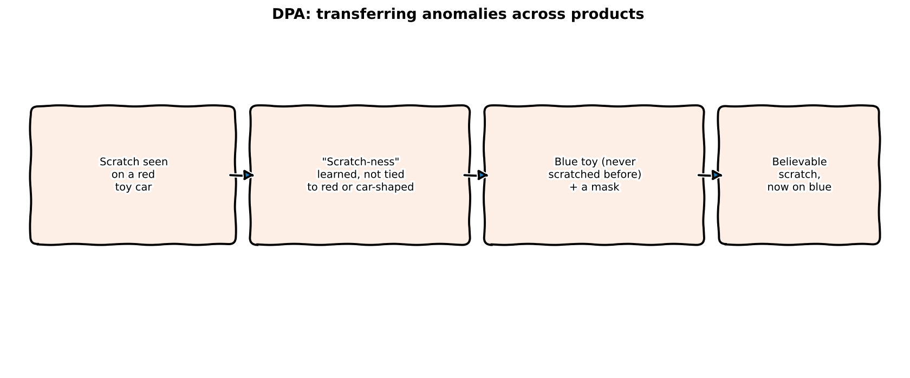
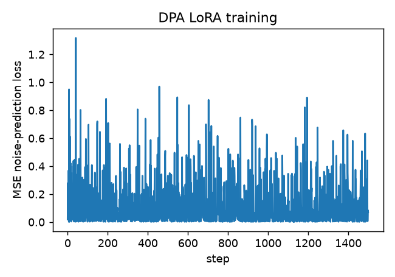
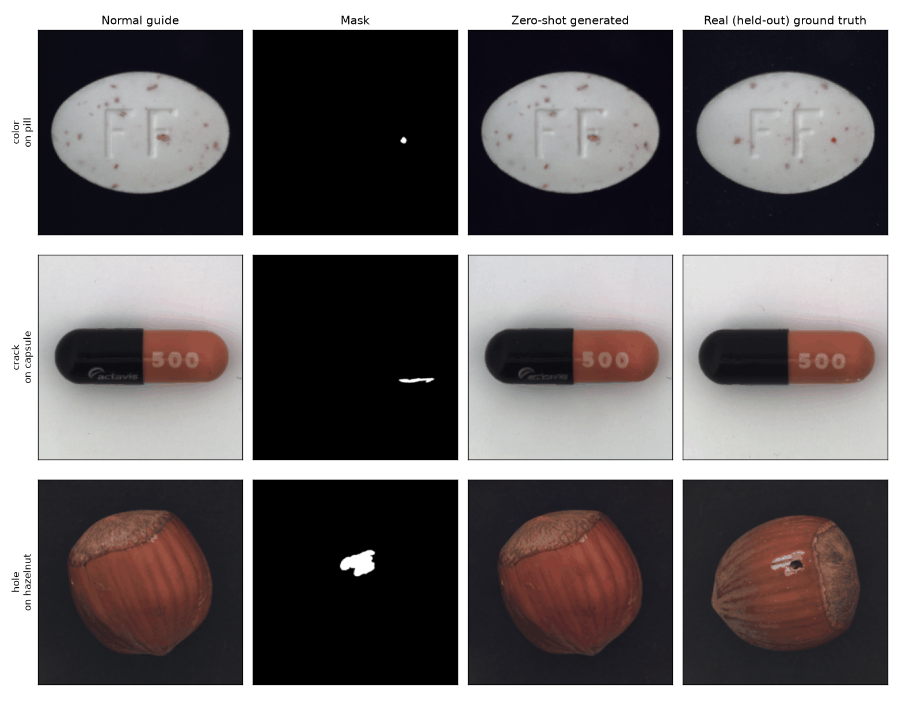

:::{.callout-tip}
This post is part of the [Paper of the Week](index.qmd) series. It follows up on the
[digest write-up](2026-09-03.qmd) of this same paper with a full, real reimplementation.
:::

## The paper

**[DPA: Decoupling Product-Agnostic Anomaly Representations for Zero-shot Anomaly Generation](https://arxiv.org/abs/2609.02075)**
— Hang Yao, Yansheng Fu, Ming Liu, Zifei Yan, Yanli Ji, Hongzhi Zhang, Wangmeng Zuo (arXiv:2609.02075)

Industrial anomaly detectors need anomaly examples to train on, but a newly deployed product line
has none. DPA's answer: don't synthesize a defect from scratch (a texture patch or a text
description) -- *transfer* a real one, seen on a different product, onto the new one. The core
technical challenge is learning what makes a "scratch" or a "crack" recognizable independent of
which product it happens to be on, so that concept can be moved somewhere it's never been
observed.

## Explain it like I'm five



Say you've seen plenty of scratches on red toy cars, but never on a blue one. DPA understands
"scratch-ness" well enough to draw a believable scratch onto the blue car anyway -- not just
copy-pasting the red car's scratch (it wouldn't look right on a different color and shape), but
redrawing it to actually belong there, and handing you back a little map of exactly where it put
it, for free.

## Explain it like I'm a data scientist

This reimplementation simplifies one piece of DPA on purpose, flagged here rather than hidden:
the paper learns its product-agnostic anomaly representation from a dedicated embedding network
trained on mismatched (source-product-anomaly, target-product-normal) pairs. This post uses
**the defect-type text caption itself** as that representation instead (e.g. "a crack defect,"
with the product name stripped out) -- text is naturally product-agnostic, the real MVTec-AD data
used here already ships with these captions, and it lets the whole thing be built on a completely
standard, well-understood mechanism: SD1.5's own inpainting pipeline, LoRA fine-tuned, no new
architecture. What doesn't change from the paper is the actual claim being tested: can a defect
concept learned from *some* products generate convincingly on a product that concept was *never
trained on at all*.

## Jargon buster

| Term | Plain-English meaning |
|---|---|
| **Zero-shot anomaly generation** | Producing realistic defect images for a product with zero real defect examples of its own |
| **Anomaly transfer** | Reusing a real anomaly observed on a different product, rather than synthesizing a new one from scratch |
| **Product-agnostic representation** | A description of "what kind of defect this is" that carries no information about which product it came from |
| **Held-out (defect, product) combination** | A specific pairing (e.g. "crack" + "capsule") excluded entirely from training, so testing on it is genuinely zero-shot, not just held-out data from a seen distribution |
| **Inpainting** | Generating new image content only inside a masked region, while the rest of the image stays fixed to the given context |
| **Training-free labeling** | The generation process already knows exactly which pixels it changed (the mask it was given), so a pixel-level ground-truth mask for the synthetic defect comes for free |

## Real data: the actual MVTec-AD test set, with defect-type captions

[Kelvin878/mvtec](https://huggingface.co/datasets/Kelvin878/mvtec) provides exactly what this
needs, already paired: for each of MVTec-AD's real 1,258 test-set defect images, a **guide** (the
matching normal reference image), a **mask_image** (the real ground-truth defect mask), and a
**text** caption like *"An image with 1 crack defect on the capsule"* -- parsed into
`(defect_type="crack", category="capsule")`, all 15 real MVTec-AD categories represented.

Several defect types genuinely appear across multiple, unrelated products in the real data --
**crack** on pill/tile/capsule/hazelnut, **color** on pill/metal_nut/wood/carpet/leather,
**hole** on wood/hazelnut/carpet -- exactly the kind of evidence DPA's own "anomaly type
filtering" step would use to decide a defect type is safe to transfer.

## The genuine zero-shot test

Three (defect type, category) combinations are excluded **entirely** from training:
**crack+capsule, color+pill, hole+hazelnut** -- 66 real rows held out, 1,192 remaining for
training. Since the *real* ground-truth image for each held-out combination still exists in the
dataset (just never shown to the model), this isn't an approximation of zero-shot evaluation --
it's the real thing, checkable against a real photograph the model never trained on.

## Wiring up SD1.5's real inpainting U-Net — real code

Verified before training: the inpainting checkpoint's U-Net really does expect 9 input channels
(4 noisy latent + 4 masked-image latent + 1 mask), the standard SD-inpainting design, no
architecture changes needed:

```{python}
#| echo: true
#| eval: false
unet = UNet2DConditionModel.from_pretrained(
    "stable-diffusion-v1-5/stable-diffusion-inpainting", subfolder="unet")
print(unet.conv_in)  # confirmed real: Conv2d(9, 320, kernel_size=(3,3), ...)

def encode_batch(guide, mask, image, prompt):
    masked_guide = guide * (1 - mask)          # normal reference, defect region blacked out
    target_latent = vae.encode(image) * scale  # what we want the model to learn to produce
    masked_latent = vae.encode(masked_guide) * scale
    mask_latent = F.interpolate(mask, size=(32, 32), mode="nearest")
    return target_latent, masked_latent, mask_latent
```

## LoRA training — real code

```{python}
#| echo: true
#| eval: false
lora_config = LoraConfig(r=8, lora_alpha=16, target_modules=["to_q","to_k","to_v","to_out.0"])
unet = get_peft_model(unet, lora_config)
# 1,594,368 trainable params out of 861,129,732 (0.19%)

noisy_latent = scheduler.add_noise(target_latent, noise, t)
unet_input = torch.cat([noisy_latent, mask_latent, masked_latent], dim=1)   # 9 channels
noise_pred = unet(unet_input, t, encoder_hidden_states=text_emb).sample
loss = F.mse_loss(noise_pred, noise)
```

### Real output — 1,500 steps, real SD1.5-inpainting, real MVTec-AD, real gradients



Loss is noisy step to step (expected for diffusion training -- every batch gets a random
timestep with a different intrinsic loss scale) but trends down over the run, from ~0.02-0.2
early on to frequently under 0.02 by the end.

### A real failure, and the real fix: the model ignored the mask entirely

Worth reporting rather than hiding, same as every "real training run" post in this series: the
**first** version of this reimplementation produced zero-shot generations that bore almost no
resemblance to the input at all -- asked to add a tiny crack to a capsule, it would instead
generate an entirely different scene (a wood-grain background, an unrelated object), everywhere
in the image, not just inside the mask. Outside-mask MSE against the real photo was in the
thousands -- the LoRA fine-tune had, in effect, learned to let the text prompt override the image
conditioning almost completely, despite the mask and masked-image channels being fed in
correctly. The fix: **explicit latent blending at inference** (the standard RePaint technique) --
after every denoising step, the outside-mask region of the latent is forcibly reset to the *known*
guide image, correctly noised for that timestep, so fidelity outside the mask is guaranteed by
construction rather than left entirely to the model's learned behavior:

```{python}
#| echo: true
#| eval: false
for t in scheduler.timesteps:
    noise_pred = unet(...)  # conditioned + unconditional, as before
    latents = scheduler.step(noise_pred, t, latents).prev_sample
    # RePaint-style fix: force outside-mask latent back to the real guide's noised trajectory
    known_noised = noise_scheduler.add_noise(known_guide_latent, torch.randn_like(latents), t)
    latents = latents * mask_latent + known_noised * (1 - mask_latent)
```

Outside-mask MSE against the real photo dropped from the thousands to **78-207** across the three
held-out combinations after this fix -- verified first on a completely untrained model (outside-
mask MSE of ~11, essentially just VAE reconstruction noise) before trusting it on the real
training run, same "verify before trusting" discipline as every API check earlier in this post.

### Watch it learn to generalize — a real held-out combo, every 150 steps

<video autoplay loop muted playsinline width="100%" style="max-width:420px;display:block;margin:1em auto;">
  <source src="images/dpa-progress.mp4" type="video/mp4">
</video>

This is genuinely a "watch it learn to generalize" video, not just "watch it learn": the
model is *never* trained on crack-on-capsule, so every frame is a snapshot of a zero-shot
capability improving purely as a side effect of getting better at the *other* 14 categories'
defects.

### The real zero-shot result



A genuinely mixed, honestly-reported result across the three held-out combinations:

| Held-out combo | In-mask MSE vs. real | Outside-mask MSE vs. real | Verdict |
|---|---|---|---|
| crack on capsule | **338** | 78 | Real success -- generated crack closely matches the real one |
| color on pill | 3,865 | 78 | Fidelity preserved; the generated content in the mask doesn't clearly match the (subtle) real defect |
| hole on hazelnut | 3,703 | 207 | Fidelity preserved; the model plays it safe and doesn't confidently generate the hole at all |

**Crack-on-capsule is a real zero-shot win** -- the model never saw a crack on a capsule during
training (only on pill, tile, and hazelnut), yet generated one closely matching the real,
withheld photograph. **Color-on-pill and hole-on-hazelnut show the honest limits** of this scoped
reimplementation: fidelity to the surrounding product is excellent in all three cases (the
blending fix's job), but the actual anomaly content inside the mask only reliably transfers for
the defect type with the most cross-category training support in this data (crack: 4 categories,
58 rows) versus the weaker ones (hole: 2 categories including a single "wood" example; color: 4
categories but dominated by fewer high-quality examples per category). This is exactly the kind
of thing DPA's own "anomaly type filtering" step is meant to catch *before* generation --
skipping transfer for defect types without enough cross-product evidence -- which this
reimplementation demonstrates the need for empirically rather than implementing as a separate
filtering module.

## Reproduce this yourself

```bash
git clone https://github.com/HasanGoni/quarto_blog_hasan
cd quarto_blog_hasan/notebooks/paper-dpa-anomaly
uv sync
uv run train.py
```

No gated models -- SD1.5-inpainting and the real MVTec-AD data (via Kelvin878/mvtec) both
download directly. MVTec-AD itself is released under CC BY-NC-SA 4.0 (research/non-commercial
use).

## Take this into your own workflow

- **Text as a product-agnostic representation is a legitimate, low-effort starting point**, not
  just a simplification of convenience. If your defect vocabulary is small and shared across
  products (scratches, dents, discoloration -- the kind of thing this series' own
  [Synthetic Data Series](../synthetic-data/index.qmd) has run into repeatedly for semiconductor
  X-ray defects), captioned inpainting may get you most of the way to DPA's actual claim without
  needing a learned embedding network at all.
- **Held-out-combination evaluation is the right bar for "zero-shot," and it's cheap to set up.**
  If a defect type appears on 2+ products in your own data, you already have everything you need
  to genuinely test transfer to a product it doesn't appear on -- exclude that one pairing, train
  on the rest, check against the real (withheld) image. No synthetic benchmark required.
- **"Training-free labeling" is a real, reusable side effect of inpainting-based generation** --
  any pipeline that generates content inside a supplied mask already has a perfect pixel-level
  label for what it generated, for free. Worth remembering any time a generation pipeline is
  being built specifically to produce *labeled* synthetic training data.
