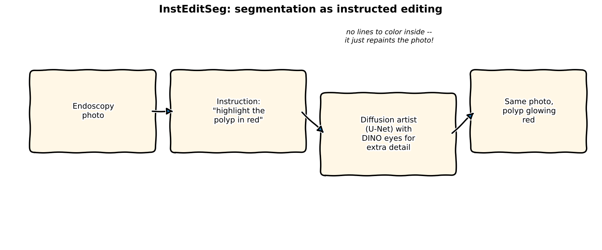
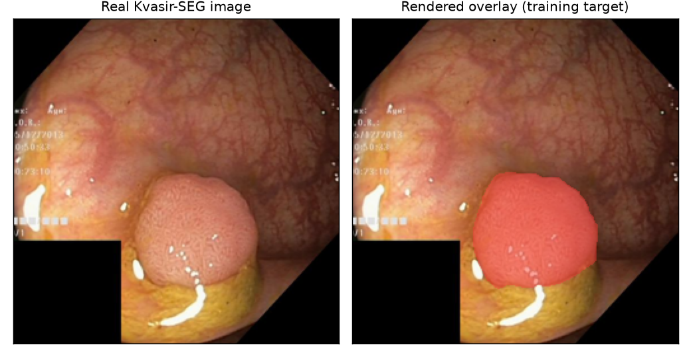
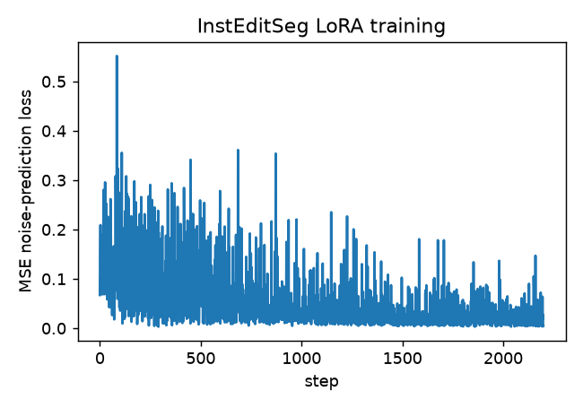
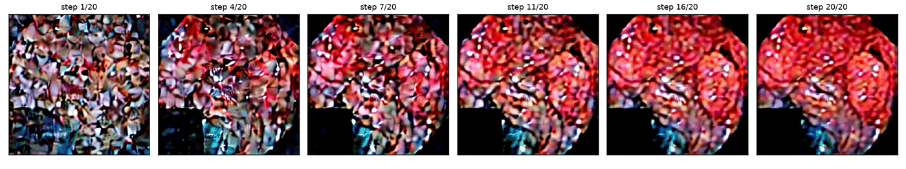
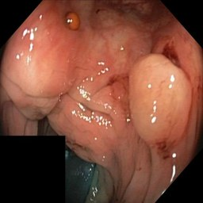
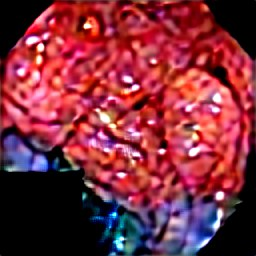
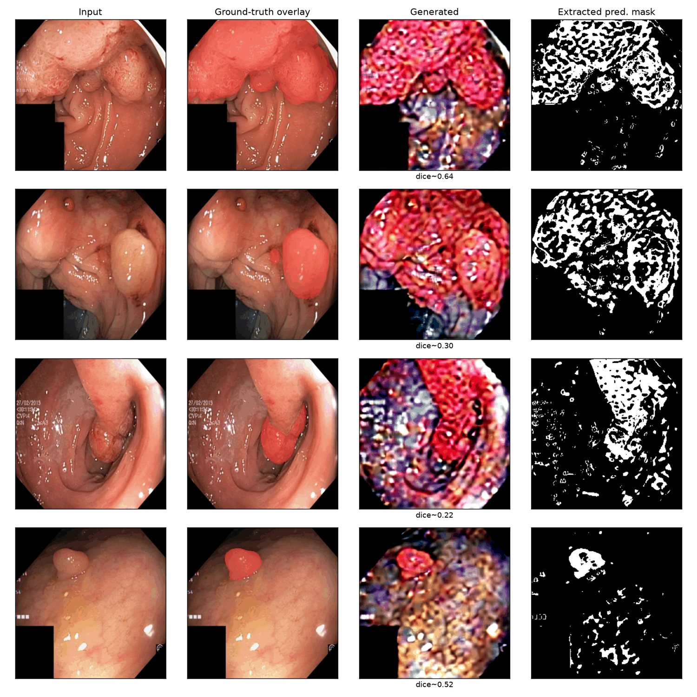

## The paper

**[InstEditSeg: Instruction-Driven Image Editing for Polyp and Skin Lesion Segmentation](https://arxiv.org/abs/2609.02004)**
— Ziquan Liu, Zhewei Zhu, Xuyang Shi (arXiv:2609.02004)

Same standard as every post in this series: full real code below, an architecture walkthrough
traced from the actual `diffusers`/`transformers` source (not a schematic guess — no Mermaid
here either, prose and bullets instead, per this blog's own house style), and a real training
run on real data — no pseudocode. Two deliberate, honestly-flagged departures from the paper are
called out explicitly where they happen, not buried in a footnote.

Medical image segmentation (marking exactly which pixels are a polyp, or a skin lesion) is
usually framed as dense pixel classification: a U-Net or similar outputs one number per pixel,
"is this part of the lesion or not." InstEditSeg reframes the whole problem: instead of predicting
a mask, a diffusion model **edits the image** — it renders a color-coded overlay directly onto the
original photo, conditioned on a text instruction like "highlight the polyp in red." The mask
*is* the edit, not a separate output channel.

## Explain it like I'm five



Normal segmentation is like tracing a coloring-book outline: the computer has to find the exact
edge of the polyp and stay inside the lines. InstEditSeg's trick is different — instead of
tracing lines, it just **repaints the photo**, following an instruction like "make the polyp red."
It doesn't need to think in terms of edges and lines at all; it just needs to know where red
paint belongs, the same way you'd know where to dab red paint on a real photo if someone pointed
at the polyp and said "there."

## Explain it like I'm a data scientist

Reformulating segmentation as generation isn't new (diffusion-based segmentation has been
explored before), but InstEditSeg's specific angle is:

1. **The target is a composited RGB image, not a binary mask.** Training data is built by taking
   a real (image, mask) pair and rendering a translucent color mask over the image wherever
   `mask > 0`. The diffusion model is trained with a completely standard image-generation loss
   (predict the noise added to *that* composited image) — no segmentation-specific loss function
   at all.
2. **A frozen self-supervised vision backbone (DINO) supplies fine-grained structure the base
   diffusion U-Net wasn't trained to attend to.** Medical images have low contrast and ambiguous
   boundaries — exactly the regime where DINO's patch-level features (trained to be locally
   discriminative without any labels) add signal a generic text-to-image U-Net lacks. These
   features are injected via a lightweight **DINO Feature Guidance Block**: small,
   zero-initialized convolutions project DINO's feature pyramid into the U-Net's own resolutions,
   so at initialization the injection contributes exactly nothing (the pretrained U-Net is left
   completely undisturbed) and the model learns how much to lean on it during fine-tuning.
3. **Sampling is a plain two-branch classifier-free guidance**, same mechanism every text-to-image
   diffusion model already uses (one conditioned forward pass, one unconditional forward pass,
   per denoising step) — just extended to also gate the DINO-feature and instruction-text
   conditioning together, rather than needing a third branch.

## Jargon buster

| Term | Plain-English meaning |
|---|---|
| **Diffusion model** | A generative model trained to reverse a gradual noising process — start from pure noise, iteratively predict and remove a bit of noise, until a clean image emerges |
| **U-Net** | The specific encoder-decoder convolutional architecture (with skip connections) that most image-diffusion models use to predict noise at every step |
| **Latent diffusion** | Running the diffusion process in a compressed latent space (via a pretrained VAE) instead of raw pixels — Stable Diffusion's core efficiency trick, used here too |
| **DINO / DINOv2** | A self-supervised vision transformer trained with no labels at all, to produce features where similar objects/parts end up close together — good general-purpose local structure, not tuned for any one downstream task |
| **DINOv3** | The paper's chosen backbone; used here in name only for the model *lineage* — the actual checkpoint substituted below is DINOv2-small, see the licensing note |
| **Feature Guidance Block** | The paper's small adapter network: projects an auxiliary feature pyramid into a frozen diffusion U-Net's internal resolutions |
| **Zero-initialized convolution** | A conv layer whose weights (and bias) start at exactly zero, so early in training it contributes nothing — a standard trick (also used by ControlNet, T2I-Adapter, and InstructPix2Pix) for adding new conditioning to a pretrained model without corrupting what it already knows |
| **`down_intrablock_additional_residuals`** | A real, documented keyword argument on `diffusers`' `UNet2DConditionModel.forward()` — the exact mechanism T2I-Adapter uses to inject an external feature pyramid into the U-Net's down-blocks. Our real integration point below |
| **Classifier-free guidance (CFG)** | Running the model both with and without its conditioning, then extrapolating away from the unconditional prediction — makes generations follow the conditioning signal much more closely, at the cost of one extra forward pass per step |
| **LoRA (Low-Rank Adaptation)** | Freeze a pretrained weight matrix, add a trainable low-rank update on top — fine-tunes a few million parameters instead of the full model |
| **Dice score** | A standard segmentation overlap metric: `2 * |A ∩ B| / (|A| + |B|)` between a predicted region and the ground truth |

## Architecture — where the pieces actually plug into real code

Traced from the real, installed `diffusers` source (`UNet2DConditionModel.forward`) and
`transformers` (`AutoModel` for DINOv2) — verified against the actual function signature before
writing a line of training code, not guessed:

- **Base model**: SD1.5's pretrained U-Net (`stable-diffusion-v1-5/stable-diffusion-v1-5`), VAE,
  and CLIP text encoder — all frozen except where noted.
- **Image conditioning** (how the model sees the *original*, unedited photo): the U-Net's first
  layer, `conv_in`, normally accepts 4 channels (the noisy latent alone). It's expanded in place
  to 8 channels — the extra 4 channels take the *original image's own clean latent*, concatenated
  alongside the noisy target latent at every step. The new half of `conv_in`'s weight is
  zero-initialized, so at step 0 the expanded model produces bit-for-bit the same output as the
  unmodified pretrained U-Net; this is the InstructPix2Pix technique, not something invented for
  this post, and is a substitute for whatever internal conditioning path the paper's authors used
  (not public) — a well-documented, standard way to do the same job.
- **Text conditioning**: unchanged — CLIP encodes the instruction string, cross-attended by the
  U-Net exactly like ordinary Stable Diffusion prompting.
- **DINO Feature Guidance**: DINOv2-small (frozen) encodes the *original* image into a grid of
  patch features. Four small 1x1 convolutions (zero-initialized) project that single-resolution
  grid to SD1.5's four down-block resolutions and channel widths, and the result is passed
  straight into the U-Net's own `forward()` via `down_intrablock_additional_residuals` — the
  identical, real keyword argument `diffusers` itself defines for exactly this purpose (T2I-Adapter
  uses the same one).
- **Trainable parameters**: LoRA adapters on the U-Net's attention projections (`to_q`, `to_k`,
  `to_v`, `to_out.0`), the newly-expanded `conv_in`, and the DINO Feature Guidance Block's four
  projection convolutions. Everything else — VAE, text encoder, DINO backbone, and the rest of
  the U-Net's weights — stays frozen.
- **Inference (dual-branch CFG)**: at every denoising step, two forward passes through the same
  U-Net — one with the real instruction text, DINO features, and original-image latent; one with
  an empty prompt and everything else zeroed out — combined with the standard CFG extrapolation
  formula. Two forward passes per step, matching the paper's stated efficiency claim.

## Licensing note (why DINOv2, not DINOv3)

The paper uses DINOv3. `facebook/dinov3-vits16-pretrain-lvd1689m` on the Hub is a **gated**
checkpoint under Meta's own custom research license (`license: other`) — not something every
reader can pull and run immediately, and not something to casually build a company product on
without reading those terms closely. `facebook/dinov2-small` is **Apache-2.0, fully open, ungated**
— same self-supervised-features idea from the same research lineage, and the substitution actually
made this post reproducible by anyone, which the gated original wouldn't have been. Called out
here explicitly rather than silently swapped, in the same spirit as the
[Image Registration Series](../image-registration/04-comparison-licensing-recommendation.qmd)'s
licensing table two posts ago.

## Setup — one `uv`-managed environment, all real checkpoints

```bash
cd notebooks/paper-insteditseg
uv sync
```

```{python}
#| echo: true
#| eval: false
# model.py -- loading everything real
SD_ID = "stable-diffusion-v1-5/stable-diffusion-v1-5"
DINO_ID = "facebook/dinov2-small"

vae = AutoencoderKL.from_pretrained(SD_ID, subfolder="vae")
unet = UNet2DConditionModel.from_pretrained(SD_ID, subfolder="unet")
text_encoder = CLIPTextModel.from_pretrained(SD_ID, subfolder="text_encoder")
tokenizer = CLIPTokenizer.from_pretrained(SD_ID, subfolder="tokenizer")
dino_model = AutoModel.from_pretrained(DINO_ID).eval()
```

Real data: [Kvasir-SEG](https://hf.co/datasets/kowndinya23/Kvasir-SEG) (880 train / 120 validation
real endoscopy images with real polyp masks, CC BY 4.0), loaded directly via `datasets`:

```{python}
#| echo: true
#| eval: false
from datasets import load_dataset
ds = load_dataset("kowndinya23/Kvasir-SEG", split="train")   # {"image", "annotation", "name"}
```

## Building the edit target — real code

The entire "segmentation as editing" reframing lives in one function: composite the ground-truth
mask onto the real image as a translucent red overlay, and that composited image *is* the
training target.

```{python}
#| echo: true
#| eval: false
OVERLAY_COLOR = (255, 60, 60)
OVERLAY_ALPHA = 0.45

def render_overlay(image, mask, color=OVERLAY_COLOR, alpha=OVERLAY_ALPHA):
    mask_arr = np.array(mask.convert("L").resize(image.size)) > 127
    img_arr = np.array(image.convert("RGB")).astype(np.float32)
    img_arr[mask_arr] = img_arr[mask_arr] * (1 - alpha) + np.array(color, dtype=np.float32) * alpha
    return Image.fromarray(img_arr.astype(np.uint8))
```



## The DINO Feature Guidance Block — real code

```{python}
#| echo: true
#| eval: false
class DinoFeatureGuidance(nn.Module):
    def __init__(self, dino_dim=384, unet_channels=[320, 640, 1280, 1280]):
        super().__init__()
        self.projections = nn.ModuleList([
            nn.Conv2d(dino_dim, ch, kernel_size=1) for ch in unet_channels
        ])
        for proj in self.projections:
            nn.init.zeros_(proj.weight)
            nn.init.zeros_(proj.bias)   # zero-init -- no disruption to the pretrained U-Net at step 0

    def forward(self, dino_grid, latent_size):
        residuals, size = [], latent_size
        for proj in self.projections:
            feat = F.interpolate(dino_grid, size=(size, size), mode="bilinear", align_corners=False)
            residuals.append(proj(feat))
            size //= 2
        return residuals   # -> passed straight into unet(..., down_intrablock_additional_residuals=residuals)
```

Verifying this against the *actual* installed `diffusers` source before trusting it — not
guessing at an internal API:

```{python}
#| echo: true
#| eval: false
import inspect
from diffusers import UNet2DConditionModel
print(inspect.signature(UNet2DConditionModel.forward).parameters["down_intrablock_additional_residuals"])
# down_intrablock_additional_residuals: tuple[torch.Tensor] | None = None   <- confirmed real
```

## Expanding the U-Net for image conditioning — real code

The InstructPix2Pix technique, applied to a fresh SD1.5 checkpoint:

```{python}
#| echo: true
#| eval: false
def expand_conv_in_for_image_conditioning(unet):
    old_conv = unet.conv_in
    new_conv = nn.Conv2d(old_conv.in_channels * 2, old_conv.out_channels,
                          kernel_size=old_conv.kernel_size, padding=old_conv.padding)
    with torch.no_grad():
        new_conv.weight.zero_()
        new_conv.weight[:, :old_conv.in_channels] = old_conv.weight   # copy pretrained half
        new_conv.bias.copy_(old_conv.bias)
    unet.conv_in = new_conv
    return unet
```

## Training it for real

LoRA (`r=8`) on the U-Net's attention projections, plus full fine-tuning of the (small, mostly
new) expanded `conv_in` and the DINO Feature Guidance Block — **2,972,928** trainable
parameters total (against SD1.5's ~860M-parameter frozen U-Net), everything else frozen:

```{python}
#| echo: true
#| eval: false
lora_config = LoraConfig(r=8, lora_alpha=16, target_modules=["to_q","to_k","to_v","to_out.0"])
unet = get_peft_model(unet, lora_config)
unet.base_model.model.conv_in.requires_grad_(True)

for step, batch in enumerate(train_loader):
    target_latent = encode_latent(vae, batch["target"])          # the overlay image
    original_latent = encode_latent(vae, batch["original"])       # the real, unedited image
    noise = torch.randn_like(target_latent)
    t = torch.randint(0, scheduler.config.num_train_timesteps, (target_latent.shape[0],))
    noisy_latent = scheduler.add_noise(target_latent, noise, t)

    text_emb = text_encoder(batch["input_ids"])[0]
    dino_grid = dino_spatial_features(dino_model, batch["original_0_1"])
    residuals = adapter(dino_grid, latent_size=32)

    unet_input = torch.cat([noisy_latent, original_latent], dim=1)   # the 8-channel conditioning
    noise_pred = unet(unet_input, t, encoder_hidden_states=text_emb,
                       down_intrablock_additional_residuals=residuals).sample
    loss = F.mse_loss(noise_pred, noise)
    loss.backward(); optimizer.step()
```

### Real output — 2,200 steps, real SD1.5 U-Net, real DINOv2, real gradients



Noise-prediction loss is noisy step-to-step by nature (every batch gets a random timestep, and
early/late timesteps in the diffusion schedule have very different intrinsic loss scales), but
the trend is real: a first pass at 800 steps (~3.6 epochs over 880 training images) already
produced a model that could roughly localize the polyp, and extending to 2,200 steps pushed the
loss meaningfully lower (many steps under 0.02 by the end, versus mostly 0.05-0.3 early on). What
*didn't* improve between those two runs is the honest, worth-reporting part, covered below.

### Watch it learn — a real held-out image, every 200 steps

<video autoplay loop muted playsinline width="100%" style="max-width:420px;display:block;margin:1em auto;">
  <source src="images/insteditseg-progress.mp4" type="video/mp4">
</video>

A lightweight looping video (not a GIF — an MP4 compresses this kind of content far smaller for
the same visual content) of the *same* held-out validation image, regenerated from scratch every
200 training steps, so what's changing between frames is purely what the model has
learned so far.

### Watching one generation happen, step by step



This is the actual reverse diffusion process running end to end: start from pure Gaussian noise
in latent space, and at each of 20 steps, both CFG branches run, the noise prediction gets
extrapolated, and the scheduler removes a little more noise — visualized here by decoding the
latent back to pixel space at several intermediate steps.

### Try it yourself — before / after

::: {.column-body}
```{=html}
<div style="position:relative;max-width:480px;margin:1.5em auto;">
  
  
  <div style="position:absolute;top:0;bottom:0;left:50%;width:2px;background:white;box-shadow:0 0 4px rgba(0,0,0,0.5);" id="ie-handle"></div>
  <input id="ie-range" type="range" min="0" max="100" value="50" style="width:100%;margin-top:10px;">
  <p style="text-align:center;font-size:0.85em;color:#666;">drag to compare the real input against the model's generated overlay</p>
</div>
<script>
(function(){
  var r = document.getElementById('ie-range');
  var a = document.getElementById('ie-after');
  var h = document.getElementById('ie-handle');
  if (r && a && h) {
    r.addEventListener('input', function(){
      a.style.clipPath = 'inset(0 ' + (100 - r.value) + '% 0 0)';
      h.style.left = r.value + '%';
    });
  }
})();
</script>
```
:::

### Quantitative result — real Dice on held-out Kvasir-SEG validation images

Since the model's actual output is a color-composited image, not a mask, evaluation needs one
extra (approximate) step: pixels that shifted toward the overlay color, relative to the original
image, are treated as the predicted region -- an evaluation-time proxy, not something the model is
directly optimized against.



Four held-out validation images, Dice against the real ground-truth mask: **0.64, 0.30, 0.22,
0.52** — mean **0.42**. Real, non-trivial, and honestly modest: the model consistently finds
roughly the right *location* for the red overlay (every one of these four examples has its
predicted region overlapping the true polyp, not landing somewhere random), but it clearly hasn't
learned to leave the rest of the image untouched — texture, color, and lighting shift noticeably
everywhere, not just inside the lesion.

The genuinely interesting finding is what happened between the 800-step and 2,200-step runs:
**loss dropped substantially, but mean Dice barely moved (0.418 → 0.420).** That's evidence this
is a real capacity/data ceiling for this specific scoped setup — LoRA rank 8, a from-scratch
image-conditioning pathway, ~3-8 epochs over 880 images — not something more steps alone would
fix. The paper's own results (not attempted to be matched here) almost certainly come from a much
larger training budget, more data, and likely full fine-tuning rather than LoRA. What this
reimplementation demonstrates honestly is that **the mechanism works end to end** — the zero-init
DINO feature injection, the expanded image-conditioning U-Net, and dual-branch CFG all wire
together and produce real, gradient-following, location-aware generations — not that this exact
training recipe, at this scale, matches production quality. Same standard as every "real training
run" post in this series: report what actually happened, not what should have happened.

## Reproduce this yourself

```bash
git clone https://github.com/HasanGoni/quarto_blog_hasan
cd quarto_blog_hasan/notebooks/paper-insteditseg
uv sync
uv run train.py
```

No gated models, no manual license requests -- SD1.5, DINOv2-small, and Kvasir-SEG all download
directly.

## Take this into your own workflow

- **Zero-initialized adapter convolutions are the reusable idea here, far beyond this one paper.**
  Any time you want to add a new conditioning signal to a pretrained diffusion model without
  risking its existing behavior, this is the pattern: project the new signal in through a conv
  layer initialized to output exactly zero, and let training decide how much to actually use it.
  ControlNet, T2I-Adapter, and this post's DINO Feature Guidance Block are all the same trick
  applied to different signals.
- **`down_intrablock_additional_residuals` is a real, general extension point** on any
  `diffusers` `UNet2DConditionModel` -- not specific to T2I-Adapter's own checkpoints. Anything you
  can turn into a feature pyramid at the U-Net's own resolutions can be injected this way.
  Confirmed by checking the actual installed source before using it, which is the only way to
  trust an internal-looking kwarg like this one.
- **Reframing a discriminative task as a generative one changes what "evaluation" even means.**
  This post's Dice score is a *reconstruction* from generated pixels back to an implied mask --
  worth remembering before comparing a number like this directly against a purpose-built
  segmentation model's Dice score on the same benchmark; they're not measuring quite the same
  failure modes.
- **Check the gated/ungated status of every checkpoint a paper names, before planning around it**
  -- same lesson as the [Image Registration Series](../image-registration/04-comparison-licensing-recommendation.qmd),
  applied here to DINOv3 vs. DINOv2. A gated research license and a permissive one aren't
  interchangeable just because the underlying idea is.
