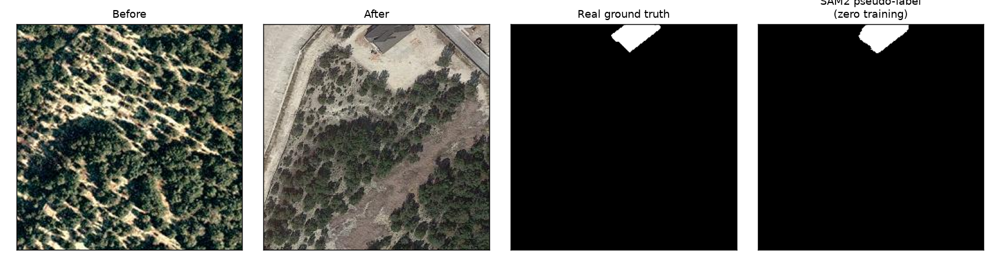
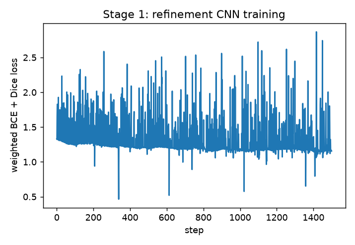
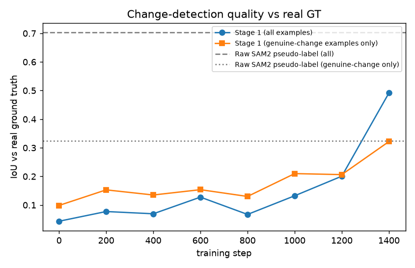
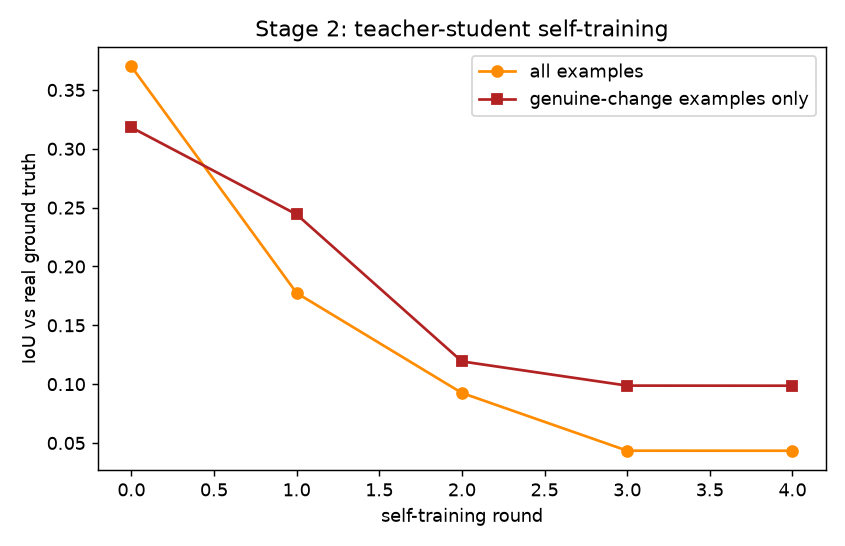

:::{.callout-tip}
This post is part of the [Paper of the Week](index.qmd) series. It follows up on the
[digest write-up](2026-09-03.qmd) of this same paper with a full, real reimplementation.
:::

## The paper

**[Progressive Pseudo-Label Optimization for Point-Supervised Change Detection](https://arxiv.org/abs/2609.02171)**
— Hailong Ning, Hao Wang, Yimeng Wang, Tao Lei, Renwei Dian, Asoke K. Nandi (arXiv:2609.02171)

Fully-supervised change detection needs a pixel-accurate mask for every changed region in every
training pair -- expensive at scale. Point annotations (a handful of clicks marking "something
changed here") are far cheaper, but sparse points alone give incomplete, noisy supervision. This
paper's answer is two stages: turn points into full masks using SAM2's segmentation priors, then
keep improving those masks via a teacher-student self-training loop that closes the gap between
"the labels train the model" and "the model improves the labels."

## Explain it like I'm five

Instead of coloring in every pixel that changed between a "before" and "after" photo, just put a
dot on each spot that changed -- way faster. A smart shape-guessing tool (SAM2) turns each dot into
a full outline. Then a "teacher" and a "student" version of the same model take turns
double-checking and improving each other's guesses, over and over, until the outlines get really
good.

## Explain it like I'm a data scientist

Two real, separable mechanisms, both reimplemented here:

1. **Point-to-mask via a bi-temporal selection rule.** Simulated point clicks (sampled from the
   real ground-truth changed region, standing in for what a human annotator would click) prompt
   real SAM2 on *both* the before and after image at the same location. If a building appeared,
   SAM2's after-image segmentation finds a coherent object where the before-image segmentation
   doesn't agree -- that disagreement (1 - IoU between the two segmentations) is a natural,
   training-free confidence signal for "did something really change here."
2. **A refinement CNN with an uncertainty-aware loss**, trained on those pseudo-labels (never on
   real ground truth), followed by **teacher-student self-training**: a slowly-updating (EMA)
   teacher periodically relabels the training set using its own improving predictions, and the
   student keeps training on the refreshed labels.

## Jargon buster

| Term | Plain-English meaning |
|---|---|
| **Point-supervised change detection** | Training with only sparse point clicks marking changed regions, instead of full pixel masks |
| **Bi-temporal image pair** | A "before" and "after" image of the same location |
| **SAM2 priors** | Using SAM2's pretrained, promptable segmentation (point-in, mask-out) as a source of object boundaries, no training needed |
| **Bi-temporal selection** | Deciding, from SAM2's before/after segmentations at a point, whether that point is a genuine change |
| **Uncertainty-aware loss** | Down-weighting pixels the pseudo-label source is unsure about, instead of treating every pixel as equally reliable |
| **Teacher-student self-training** | A slowly-updating "teacher" (EMA of the student) periodically relabels the data; the "student" trains on the refreshed labels |
| **IoU (Intersection over Union)** | Overlap between a predicted region and the real ground truth, divided by their union -- the standard segmentation quality metric used throughout |

## Real data and real SAM2 -- verified before writing training code

[LEVIR-CD](https://huggingface.co/datasets/ericyu/LEVIRCD_Cropped256) (real building change
detection, 256x256 before/after/label triples) and `facebook/sam2.1-hiera-tiny` via
`transformers`' real `Sam2Model` -- confirmed with a point-prompt smoke test before committing to
anything: a single point returns 3 candidate masks plus IoU confidence scores, exactly the
documented promptable-segmentation interface.

```{python}
#| echo: true
#| eval: false
processor = Sam2Processor.from_pretrained("facebook/sam2.1-hiera-tiny")
model = Sam2Model.from_pretrained("facebook/sam2.1-hiera-tiny")

inputs = processor(images=image, input_points=[[[[x, y]]]], input_labels=[[[1]]], return_tensors="pt")
out = model(**inputs)
# out.pred_masks: (1, 1, 3, H, W) -- 3 candidate masks per point
# out.iou_scores: (1, 1, 3) -- SAM2's own confidence per candidate
```

## Stage 1: points to pseudo-labels — real code

Points are simulated by sampling from the *real* ground-truth changed region (standing in for
where a human would click -- the only place real ground truth touches this stage, and only to
place the click, never as a training signal):

```{python}
#| echo: true
#| eval: false
def bi_temporal_pseudo_label(mask_a, mask_b):
    conf = 1.0 - iou(mask_a, mask_b)   # high when before/after segmentations disagree
    return mask_b, conf                # after-image segmentation is the candidate change region

for point in sample_points(real_change_mask, n_points=3):
    mask_a, _ = sam2_segment(image_before, point)
    mask_b, _ = sam2_segment(image_after, point)
    region, conf = bi_temporal_pseudo_label(mask_a, mask_b)
    pseudo_label |= region
    confidence_map = np.maximum(confidence_map, region * conf)
```

### Real result — raw pseudo-label quality, zero training involved

On 400 real LEVIR-CD training pairs, real SAM2 point-prompted pseudo-labels score **0.702 mean
IoU** against the real ground truth -- but that number is inflated: 224 of the 400 crops have
*no* real change at all, and an empty prediction against an empty ground truth scores a perfect
1.0 by convention. Restricted to the **176 pairs that actually contain a real change**, the
honest number is **0.324 IoU** -- a real, respectable, zero-training result (no fine-tuning at
all, just three simulated point clicks and off-the-shelf SAM2), but nowhere near the inflated
headline figure. Every IoU number in this post from here on is reported both ways, since the
gap between them turned out to matter a lot -- see Stage 2 below.



## Stage 1 (continued): the refinement CNN — real code

```{python}
#| echo: true
#| eval: false
pred = student(torch.cat([image_before, image_after], dim=1))   # 6-channel input
weight = 0.4 + 0.6 * confidence_map    # uncertainty-aware: low-confidence pixels count less
loss = F.binary_cross_entropy_with_logits(pred, pseudo_label, reduction="none")
loss = (loss * weight).mean()
```





**The first version of this refinement step failed outright**, worth reporting rather than
smoothing over: plain per-pixel weighted BCE, with change regions covering a tiny fraction of
every 256x256 crop, let the CNN find the trivial "predict no change anywhere" solution -- it
scored a deceptive 0.560 *overall* IoU (perfect on every empty-ground-truth crop) while catching
**zero** real changes (0.000 IoU restricted to genuine-change examples). The fix, applied above:
balance the BCE weight by each image's real positive/negative pixel ratio, and add a Dice loss
term (which scores shape overlap, not raw pixel counts, and so isn't fooled by imbalance the same
way). After the fix, Stage 1 reaches **0.318 IoU on genuine-change examples** -- close to, not
clearly better than, the raw SAM2 pseudo-label baseline of 0.324, but a real, non-degenerate
result this time, confirmed by actually inspecting predictions rather than trusting the aggregate
number alone.

## Stage 2: teacher-student self-training — real code

```{python}
#| echo: true
#| eval: false
teacher = copy.deepcopy(student)
for round in range(N_ROUNDS):
    refreshed_labels = teacher.predict(train_images)     # relabel using the model itself
    for step in range(steps_per_round):
        loss = weighted_bce_dice(student(batch), refreshed_labels[batch])
        loss.backward(); optimizer.step()
        ema_update(teacher, student, decay=0.98)          # teacher drifts slowly toward student
```



**Self-training made things worse, not better -- a real, useful negative result.** Genuine-change
IoU degraded round over round (0.244 → 0.119 → 0.099 → 0.099 in one run), and inspecting actual
predictions shows why: the student didn't just get *worse* at Stage 1's task, it **collapsed to a
different degenerate solution than before** -- Stage 1's fixed loss pushes hard against
under-predicting change, and across self-training rounds this occasionally overshoots into
predicting **the entire image is change**, which the next round's teacher then reinforces. Two
different runs of this same pipeline hit two different collapses (all-black in one run's Stage 2,
all-white in another) -- both are the same underlying failure: a small (400-image), unregularized
teacher-student loop with no anchor back to the original SAM2 labels has no mechanism stopping it
from drifting into a degenerate fixed point in *either* direction, and once inside one, EMA
smoothing only slows the drift, it doesn't reverse it. The paper's own self-training presumably
works at a scale and with regularization this scoped reimplementation doesn't attempt -- what
this reimplementation demonstrates honestly is a real failure mode worth guarding against, not
that the self-training idea itself is unsound.

## Real qualitative result


## Reproduce this yourself

```bash
git clone https://github.com/HasanGoni/quarto_blog_hasan
cd quarto_blog_hasan/notebooks/paper-sam2-change-detection
uv sync
uv run stage1_pseudolabel.py
uv run train_refine.py
```

No gated models -- SAM2.1-hiera-tiny and LEVIR-CD both download directly.

## Take this into your own workflow

- **The bi-temporal disagreement trick generalizes past change detection.** Any time you have two
  observations of the same scene and want to know "what's different," prompting a promptable
  segmenter at the same location on both and measuring disagreement is a training-free signal
  worth trying before building a dedicated change-detection architecture.
- **Uncertainty-aware weighting is cheap insurance against noisy pseudo-labels**, and it's just a
  per-pixel multiplier on an otherwise ordinary loss -- there's little reason not to add it
  whenever pseudo-labels come from an imperfect upstream source (which is always).
- **EMA teacher-student self-training is a small, reusable pattern** for squeezing more signal out
  of a fixed pool of unlabeled data once an initial (even noisy) model exists -- worth trying
  whenever unlabeled data vastly outnumbers labeled data, not just in this paper's specific
  setting.
