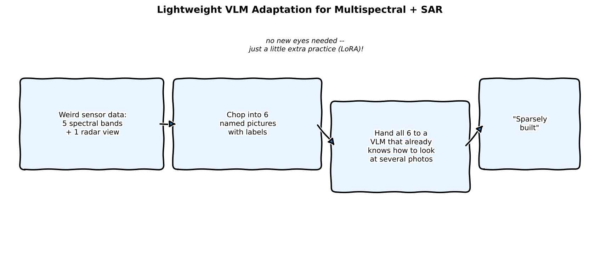
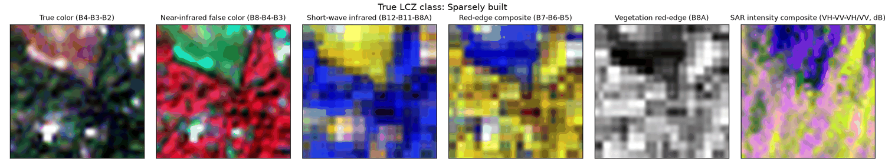
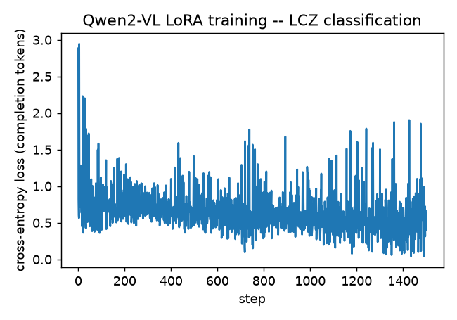
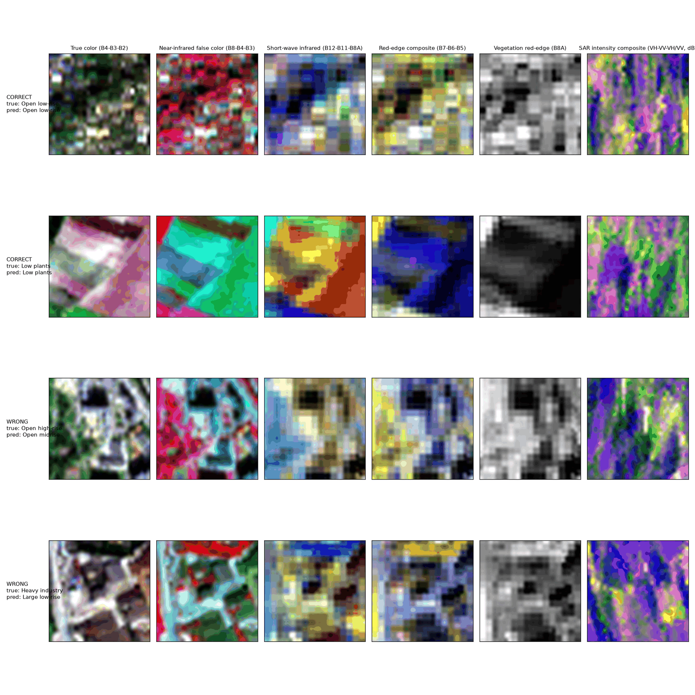
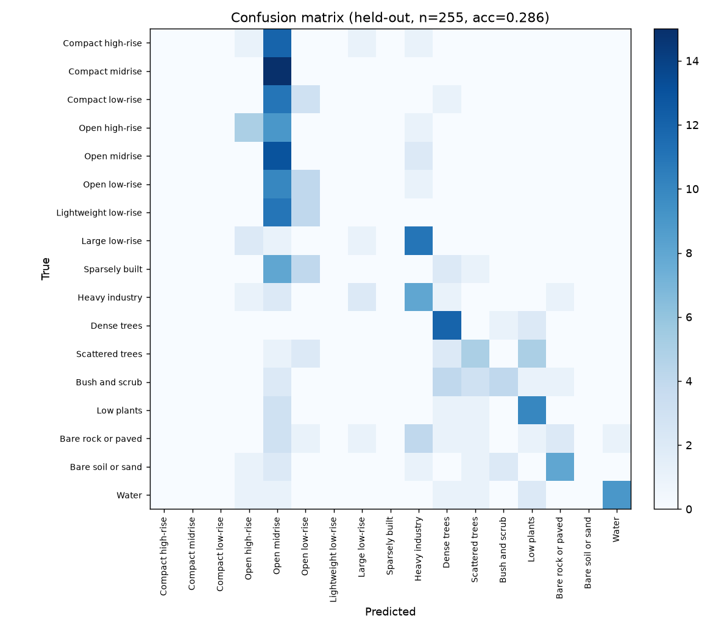

:::{.callout-tip}
This post is part of the [Paper of the Week](index.qmd) series. It follows up on the
[digest write-up](2026-09-03.qmd) of this same paper with a full, real reimplementation --
same standard as every deep-dive in this series: real code, real data, a real training run, no
pseudocode.
:::

## The paper

**[Lightweight Adaptation of General-Purpose VLMs for Multispectral and SAR Image Understanding](https://arxiv.org/abs/2609.02187)**
— Shanji Liu, Kelu Yao, Junxiao Xue, Chenghui Lv, Xiangyang Miao, Yekai Huang, Yaying Chen, Chao Li (arXiv:2609.02187)

Standard vision-language models are built for three-channel RGB. Multispectral (many wavelength
bands beyond visible light) and SAR (radar) imagery don't fit that assumption, so adapting a VLM
to them has usually meant building a dedicated sensor-specific encoder plus domain pretraining --
expensive, and it means redoing that work every time a better general VLM ships. This paper's
answer: don't touch the architecture at all. Render the sensor data as several ordinary-looking,
labeled images and hand them to a VLM through an interface it already has -- multi-image
conversation -- then LoRA-tune it to actually use the extra views.

## Explain it like I'm five



A VLM that's only ever seen normal photos is like a friend who's great at describing pictures but
has never seen an X-ray or a radar blip. Instead of teaching your friend a whole new way of
seeing, this paper's trick is to just chop the weird data into a few normal-looking pictures,
stick a little label on each one, and show your friend the whole stack at once -- since your
friend already knows how to look at *several* pictures together, a bit of practice is all it
takes to make sense of the new kind too.

## Explain it like I'm a data scientist

The two ideas doing the real work here:

1. **Multi-image prompting as a zero-cost adapter.** Most modern VLMs already accept several
   images in one conversation turn (built for things like comparing two photos or reading a
   multi-page document). This paper repurposes that interface: instead of one 3-channel image,
   the model receives several band-composite images, each preceded by a short text label naming
   what it is ("SAR intensity composite," "short-wave infrared," etc.) -- no architecture change
   needed to accept the new modality.
2. **LoRA on the language model (and, per the paper, select vision-transformer components) does
   the actual adaptation.** The frozen VLM can already *look* at these images; what it hasn't
   learned is to *use* named, sensor-specific views the way it uses ordinary photos. A small
   low-rank update teaches it that mapping, without touching the vast majority of its pretrained
   weights.

## Jargon buster

| Term | Plain-English meaning |
|---|---|
| **Multispectral imagery** | Images captured across several wavelength bands beyond visible RGB -- here, Sentinel-2's 10 usable optical/infrared bands |
| **SAR (Synthetic Aperture Radar)** | A radar imaging technique that works day or night through cloud cover -- Sentinel-1 here, 8 channels covering real/imaginary polarimetric components and derived intensities |
| **Multi-image interface** | The ability many VLMs already have to accept several images in one prompt and reason across them jointly |
| **LoRA (Low-Rank Adaptation)** | Freeze the pretrained weights, add a small trainable low-rank update on top |
| **Local Climate Zone (LCZ)** | A standardized 17-class urban/land-cover taxonomy (compact high-rise, open low-rise, dense trees, water, etc.) used here as the real classification target, in place of the paper's own land-cover task |
| **Band composite** | A false- or true-color image built by assigning three (or more) of a sensor's raw bands to the red/green/blue display channels |
| **Geo-matched patch pair** | Two images (here, one SAR, one optical) covering the exact same geographic footprint, so they can be reasoned about jointly |

## Real data: So2Sat-LCZ42, not the paper's own dataset

The paper evaluates on its own land-cover benchmark. This post substitutes the real, public,
geo-matched **[So2Sat-LCZ42](https://huggingface.co/datasets/zhu-xlab/So2Sat-LCZ42)** dataset
(TUM/DLR, CC-BY-4.0) instead -- 24,119 real Sentinel-1/Sentinel-2 patch pairs with 17-class local
climate zone labels, geo-matched by construction (no risky index-alignment guessing between two
independently-uploaded mirrors, which is exactly what tripped up an earlier attempt at this post
using a different community-mirrored SAR dataset that turned out to have corrupted image
encoding past its first row -- caught by spot-checking before committing to a training run, the
same discipline this series has followed since Part 1 of the Image Registration series). The
official training split is 16GB, impractical to download for a blog post, so this post further
splits the (smaller, still-real) validation split into its own train/held-out sets --
**1,700 training examples (100/class) and 255 held-out examples (15/class)**, stratified so
every one of the 17 classes is represented in both.

## Rendering 5 optical views + 1 SAR view — real code

```{python}
#| echo: true
#| eval: false
# Sentinel-2 bands: B2,B3,B4,B5,B6,B7,B8,B8A,B11,B12 (indices 0-9)
S2_VIEWS = [
    ("True color (B4-B3-B2)", [2, 1, 0]),
    ("Near-infrared false color (B8-B4-B3)", [6, 2, 1]),
    ("Short-wave infrared (B12-B11-B8A)", [9, 8, 7]),
    ("Red-edge composite (B7-B6-B5)", [5, 4, 3]),
    ("Vegetation red-edge (B8A)", [7, 7, 7]),
]

def render_sar_view(sen1_patch):
    # bands: VH_re,VH_im,VV_re,VV_im,VH_intensity,VV_intensity,cov_re,cov_im
    vh = 10 * np.log10(np.abs(sen1_patch[:, :, 4]) + 1e-6)
    vv = 10 * np.log10(np.abs(sen1_patch[:, :, 5]) + 1e-6)
    ratio = vh - vv
    return np.stack([stretch(vh), stretch(vv), stretch(ratio)], axis=-1)  # standard SAR RGB convention
```



## Wiring it into Qwen2-VL's real multi-image interface — real code

Verified against the actual `qwen_vl_utils` + `transformers` chat template before writing any
training code -- a 6-image prompt really does produce 6 separately-tracked image regions:

```{python}
#| echo: true
#| eval: false
def build_messages(views, question):
    content = []
    for name, img in views:
        content.append({"type": "text", "text": f"[{name}]"})
        content.append({"type": "image", "image": img})
    content.append({"type": "text", "text": question})
    return [{"role": "user", "content": content}]

# confirmed real: image_grid_thw comes back with shape (6, 3) -- 6 separately tracked images
messages = build_messages(views, QUESTION)
text = processor.apply_chat_template(messages, tokenize=False, add_generation_prompt=True)
image_inputs, _ = process_vision_info(messages)
inputs = processor(text=[text], images=image_inputs, return_tensors="pt")
```

## LoRA fine-tuning — real code

LoRA targets `q_proj`/`v_proj` (the language model's attention) and `qkv` (the vision
transformer's fused attention projection) -- confirmed by inspecting the actual module names in
the loaded model rather than guessing:

```{python}
#| echo: true
#| eval: false
lora_config = LoraConfig(r=8, lora_alpha=16, target_modules=["q_proj", "v_proj", "qkv"])
model = get_peft_model(model, lora_config)
# 2,400,256 trainable params out of 2,211,385,856 (0.11%)

# loss computed only on the completion tokens (the class-name answer), not the prompt:
full_text = prompt_text + class_name + tokenizer.eos_token
labels = tokenizer(full_text, ...).input_ids.clone()
labels[:, :prompt_len] = -100   # mask everything before the answer
loss = model(**inputs, labels=labels).loss
```

### Real output — 1,500 steps, real Qwen2-VL-2B, real So2Sat data, real gradients



Loss drops fast in the first ~50 steps (2.88 → ~0.45, from a completely untrained multi-image
mapping down to a model that's starting to produce real class names), then plateaus and bounces
in the 0.4-1.1 range for the rest of training. That plateau is expected, not a bug: with only 100
training examples per class and a 17-way classification target, the loss floor for a model that's
learned the *easy* classes but still guesses on the *hard* ones sits well above zero -- see the
per-class breakdown below for exactly which is which.

### Real held-out accuracy, 17-way LCZ classification

**28.6% (73/255)** on real 17-way classification after 1,500 LoRA steps -- roughly **5x random
chance** (1/17 ≈ 5.9%), on a genuinely held-out set the model never saw during training. Real,
and honestly modest: the paper reports far higher numbers on its own (larger-scale, longer-trained,
full land-cover-benchmark) setup, which this reimplementation doesn't attempt to match, same as
every "real training run" post in this series.



### Confusion matrix



The confusion matrix tells a clean, honest story that the accuracy number alone hides: the
**natural/land-cover classes are learned well** -- Dense trees, Bush and scrub, Low plants, Bare
soil or sand, and Water all sit on a strong diagonal, each visually and spectrally distinct in
the true-color and near-infrared views. Almost every **urban building-density subclass**
(Compact high-rise, Compact midrise, Compact low-rise, Open high-rise, Open low-rise, Lightweight
low-rise, Sparsely built), on the other hand, collapses onto a single predicted label -- "Open
midrise" -- rather than being distinguished from each other at all. That's not a random failure:
telling "compact" from "open" from "sparse" apart, or "high-rise" from "midrise" from "low-rise,"
is fundamentally a building-*height* and *density* judgment that's hard to read from a top-down
32x32 satellite patch with 100 training examples and 1,500 steps, whereas "is this water, trees,
or bare soil" is a much stronger spectral signal the model picks up quickly. The paper's own,
much larger training budget almost certainly closes more of this specific gap; what this
reimplementation demonstrates honestly is that the multi-image-adapter mechanism itself works and
learns *something real* even at this scale, not that it matches production-grade land-cover
classification.

## Reproduce this yourself

```bash
git clone https://github.com/HasanGoni/quarto_blog_hasan
cd quarto_blog_hasan/notebooks/paper-vlm-multispectral-sar
uv sync
uv run python -c "from huggingface_hub import hf_hub_download; hf_hub_download('zhu-xlab/So2Sat-LCZ42', 'v4/validation.h5.gz', repo_type='dataset', local_dir='data')"
gunzip data/v4/validation.h5.gz
uv run train.py
```

No gated models -- Qwen2-VL-2B-Instruct and So2Sat-LCZ42 both download directly.

## Take this into your own workflow

- **The multi-image-as-adapter trick generalizes past remote sensing.** Any time you have several
  sensor "views" of the same physical thing -- a raw capture, a processed/enhanced version, a
  reference shot from a different modality -- this paper is a fairly direct argument for handing
  all of them to one VLM as labeled multi-image input and LoRA-tuning it, instead of maintaining
  separate per-sensor pipelines.
- **Masking the loss to completion tokens only is the detail that makes instruction-tuning data
  cheap to build.** The model never gets gradient signal for reproducing the prompt (including the
  image tokens) -- only for producing the right answer, which is both more correct and lets you
  reuse the exact same prompt template across every example without it dominating the loss.
- **A dataset licensing check paid off again here.** The paper's own dataset isn't public; this
  post's real substitute (So2Sat-LCZ42) was chosen specifically because it's geo-matched by
  construction and CC-BY-4.0 -- the same due diligence this series applied to DINOv3-vs-DINOv2 in
  the [InstEditSeg post](2026-09-03-insteditseg.qmd) two entries ago.
