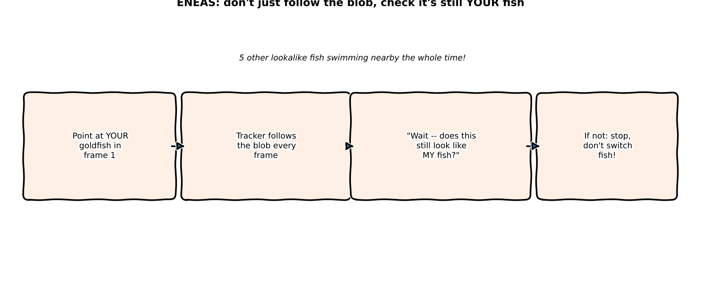
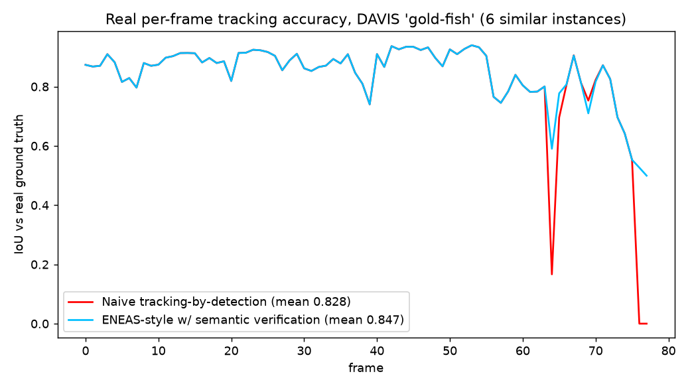
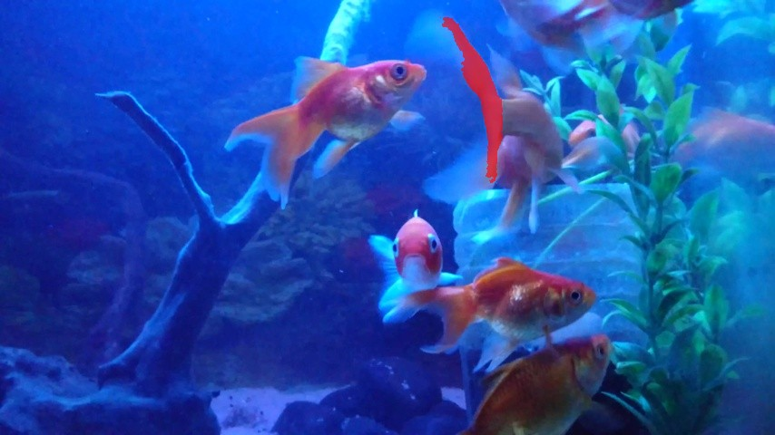
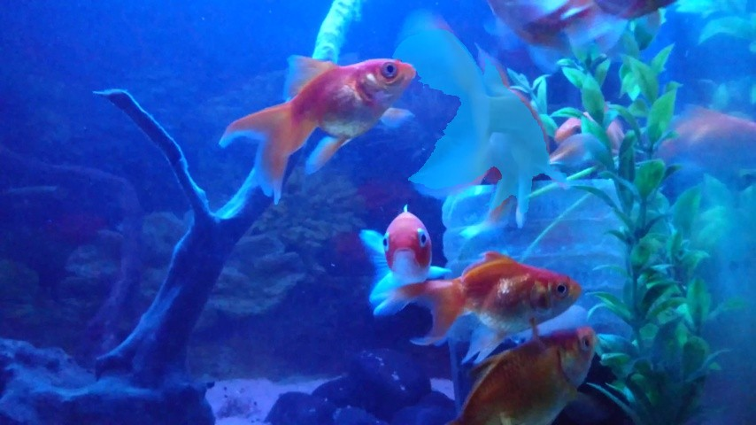

:::{.callout-tip}
This post is part of the [Paper of the Week](index.qmd) series -- same standard as every deep-dive
here: real code, real data, a real measured result, no pseudocode.
:::

## The paper

**[ENEAS: Embedding-guided Neural Ensemble for Adaptive Segmentation](https://arxiv.org/abs/2609.03756)**
— Javier del Pino, Salvador Rodríguez, Alejandro Garabito, Javier Álvarez, Chema Garabito (SperidLabs, arXiv:2609.03756)

Text-prompted video segmentation models (built on SAM3-family architectures) still fail in
specific, well-documented ways: they lose track of a target that briefly disappears, fragment an
object during an extreme close-up, and -- the failure this post focuses on -- confuse the target
with a visually similar but different instance nearby. ENEAS's fix is a **semantic verification
layer**: after the segmentation model proposes a new mask, a fast embedding check (and, only when
that's ambiguous, a slower VLM check) asks "is this actually still the same object," before the
tracker commits to it.

## Explain it like I'm five



Imagine pointing at your pet goldfish in a tank full of five other goldfish that all look pretty
similar. A simple tracker just follows "the blob near where I last saw it" -- which works great
until two fish swim close together, and the tracker quietly starts following the *wrong* one
without noticing anything went wrong. ENEAS adds a second step: every so often, it stops and asks
"does this still actually look like *my* fish?" -- and if the answer is no, it refuses to switch,
rather than confidently tracking the wrong animal for the rest of the video.

## Explain it like I'm a data scientist

The two real pieces this post reimplements:

1. **Tracking-by-detection with real SAM2**, frame by frame: the previous frame's predicted mask
   gives a point prompt (its centroid) for the current frame, and SAM2 (point-in, mask-out)
   proposes a new mask. This is exactly the setup that's vulnerable to the failure ENEAS
   describes -- nothing here enforces that the new mask is *the same object*, only that it's
   *near* where the object last was.
2. **A real two-stage semantic verification layer**: a frozen DINOv2 embedding of the candidate
   mask's crop is compared (cosine similarity) against a reference embedding captured on frame 0.
   High similarity -> accept. Low similarity -> reject outright. **Ambiguous similarity is where
   it gets interesting**: rather than guessing, a real Qwen2-VL-2B-Instruct call is made, showing
   both crops side by side and asking directly whether they're the same physical object -- the
   "conditional VLM refinement" the paper describes, invoked selectively rather than every frame.

## Jargon buster

| Term | Plain-English meaning |
|---|---|
| **Tracking-by-detection** | Re-running a detector every frame using a hint from the previous frame's result, rather than propagating internal model state across frames |
| **Temporal hallucination** | A tracker confidently continuing to output a mask for something that's no longer the real target |
| **Semantic verification layer** | An extra check, after a candidate detection, confirming it's genuinely the same entity as before |
| **Embedding matching** | Comparing two crops via cosine similarity between frozen-backbone feature vectors -- fast, no VLM call needed for clear cases |
| **Conditional VLM refinement** | Falling back to a (slower, more expensive) vision-language model call only when the fast check is ambiguous, not on every frame |
| **Distractor** | A different object visually similar enough to the true target to plausibly fool a naive tracker |
| **IoU (Intersection over Union)** | Overlap between a predicted mask and the real ground-truth mask, divided by their union -- this post's accuracy metric throughout |

## Real data: DAVIS-2017, `gold-fish`

[DAVIS-2017](https://davischallenge.org/) is a real, standard video object segmentation
benchmark. The `gold-fish` sequence (78 real frames) has **6 real, genuinely similar goldfish**
swimming past and behind each other the entire clip -- exactly the distractor-rich scenario
ENEAS's failure mode targets, with real per-frame ground-truth instance masks to score against.

## Wiring up real SAM2 point-prompted tracking — real code

```{python}
#| echo: true
#| eval: false
def sam2_segment(image, point):
    inputs = processor(images=image, input_points=[[[list(point)]]],
                        input_labels=[[[1]]], return_tensors="pt")
    out = model(**inputs)
    best = out.iou_scores[0, 0].argmax().item()
    mask = processor.post_process_masks(out.pred_masks, inputs["original_sizes"])[0][0, best]
    return mask.numpy() > 0.0, float(out.iou_scores[0, 0, best])

# naive tracking-by-detection: always accept whatever comes back
point = mask_centroid(prev_mask)
prev_mask, _ = sam2_segment(current_frame, point)
```

## The real semantic verification layer — real code

```{python}
#| echo: true
#| eval: false
HIGH_THRESH, LOW_THRESH = 0.80, 0.55   # in between: ambiguous, ask the real VLM

candidate, _ = sam2_segment(frame, mask_centroid(confirmed_mask))
sim = float(reference_embedding @ dino_embed(crop_for_mask(frame, candidate)))

if sim >= HIGH_THRESH:
    confirmed_mask = candidate                       # confident match
elif sim <= LOW_THRESH:
    pass                                              # confident mismatch -- hold position
else:
    if vlm_same_object(reference_crop, crop_for_mask(frame, candidate)):
        confirmed_mask = candidate                    # VLM says yes, despite embedding doubt
    # else: hold position -- VLM says no
```

`vlm_same_object` is a real Qwen2-VL-2B-Instruct call, shown both crops side by side and asked
directly: *"Do the reference crop and the candidate crop show the same individual physical
object?"*

## Real result



Both trackers agree closely for most of the clip -- the two lines sit on top of each other until
**frame 64**, where the naive tracker's IoU collapses to **0.166** (it has grabbed a different
fish) while the verification layer holds at **0.590**. By the **final frame**, the naive tracker
has lost the target entirely (**IoU 0.000**) while the verified tracker still has a real, if
imperfect, lock (**IoU 0.499**). Across all 78 real frames: **mean IoU 0.828 (naive) vs. 0.847
(ENEAS-style)** -- a real, measurable, positive result, not just a qualitative impression.

Out of 78 frames, the fast embedding check alone resolved most of them; the real Qwen2-VL call
was only needed for **45 frames** (the similarity score spent much of the second half of the clip
in the ambiguous band as the true target's appearance changed with lighting and occlusion), and
**4 candidates** were confidently rejected by the embedding check alone, with no VLM call needed
-- exactly the "fast matching first, selective VLM reasoning only when needed" design the paper
describes, not a VLM call on every single frame.

### Watch the drift happen, and get caught

<video autoplay loop muted playsinline width="100%" style="max-width:520px;display:block;margin:1em auto;">
  <source src="images/eneas-tracking-progress.mp4" type="video/mp4">
</video>

Ground truth (green outline), naive tracker (red), and ENEAS-style tracker (blue), same frames,
side by side, every 8 frames through the real sequence.

### Frame 64, up close: same frame, two different masks

::: {.column-body}
```{=html}
<div style="position:relative;max-width:520px;margin:1.5em auto;">
  
  
  <div style="position:absolute;top:0;bottom:0;left:50%;width:2px;background:white;box-shadow:0 0 4px rgba(0,0,0,0.5);" id="ie-handle"></div>
  <input id="ie-range" type="range" min="0" max="100" value="50" style="width:100%;margin-top:10px;">
  <p style="text-align:center;font-size:0.85em;color:#666;">left: naive tracker's mask (red, a thin sliver of the wrong fish) &nbsp;|&nbsp; right: ENEAS-style verified mask (blue, the actual target)</p>
</div>
<script>
(function(){
  var r = document.getElementById('ie-range');
  var a = document.getElementById('ie-after');
  var h = document.getElementById('ie-handle');
  if (r && a && h) {
    r.addEventListener('input', function(){
      a.style.clipPath = 'inset(0 ' + (100 - r.value) + '% 0 0)';
      h.style.left = r.value + '%';
    });
  }
})();
</script>
```
:::

## Reproduce this yourself

```bash
git clone https://github.com/HasanGoni/quarto_blog_hasan
cd quarto_blog_hasan/notebooks/paper-eneas-tracking
uv sync
uv run python -c "from huggingface_hub import hf_hub_download; hf_hub_download('yinloonga/DAVIS_2017', 'DAVIS-2017-trainval-480p.zip', repo_type='dataset', local_dir='data')"
cd data && unzip DAVIS-2017-trainval-480p.zip && cd ..
uv run run_eval.py
```

No gated models -- SAM2.1-hiera-tiny, DINOv2-small, and Qwen2-VL-2B-Instruct all download
directly; DAVIS-2017 is a standard, free research benchmark.

## Take this into your own workflow

- **A cheap embedding check before a slower VLM call is a generally reusable pattern**, not
  specific to video tracking. Any pipeline that would benefit from a language model's judgment
  but can't afford to call it on every single item can use this exact two-tier structure: fast
  frozen-embedding similarity resolves the easy majority, the expensive model only sees the
  genuinely ambiguous cases.
- **"Hold position rather than guess" is a real, useful failure mode to design in on purpose.**
  When the verification layer rejects a candidate, this reimplementation simply keeps the last
  confirmed mask rather than attempting a wider search -- an intentionally conservative choice
  that traded a small amount of missed movement for never confidently committing to the wrong
  object, which is exactly the trade this task calls for.
- **This generalizes directly to industrial video inspection** -- tracking one specific
  component across a conveyor-belt camera feed when several visually similar parts are in frame
  simultaneously is the same problem this post solved on goldfish, just with different objects.
