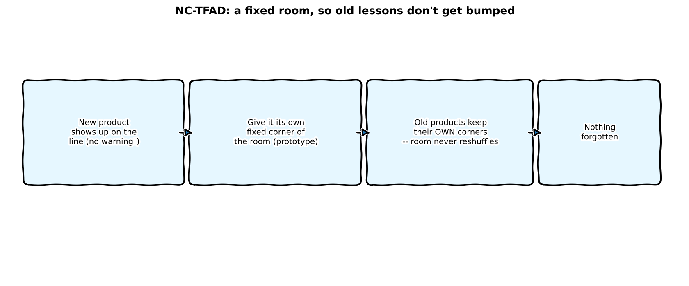
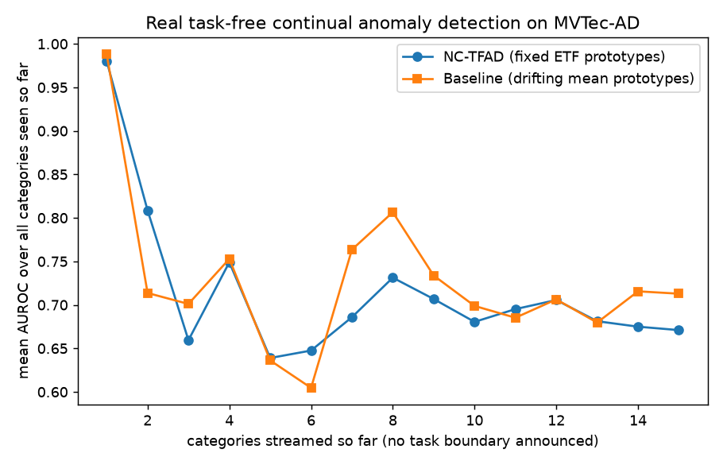

:::{.callout-tip}
This post is part of the [Paper of the Week](index.qmd) series -- real code, real data, real
measured numbers, reported honestly even when a paper's claimed advantage doesn't show up.
:::

## The paper

**[NC-TFAD: Neural-Collapse-Guided Task-Free Anomaly Detection](https://arxiv.org/abs/2609.03406)**
targets a genuinely hard continual-learning setting: new product categories arrive on a real
inspection line with **no announced task boundary** -- the model isn't told "category 6 starts
now," it just has to notice and adapt. NC-TFAD's proposed fix draws on Neural Collapse theory:
instead of letting each category's "prototype" (its representative embedding) drift as training
continues, assign every category a **fixed corner of a simplex Equiangular Tight Frame (ETF)** --
maximally, permanently separated from every other category's corner -- up front, before any data
arrives. The hypothesis: fixed, maximally-separated prototypes should resist the "old categories
get bumped as new ones arrive" forgetting that a naive, continuously-updated prototype suffers
from.

## Explain it like I'm five



Imagine a room where every new product that shows up on the line gets assigned its own
permanently fixed corner to stand in, decided in advance, before anyone even knows what products
are coming. The idea is that because the room's layout never gets reshuffled, products that
arrived early don't get bumped or crowded out when new products show up later -- unlike a naive
approach where everyone just huddles wherever feels natural, and a big new crowd can push
everyone else's spot around.

## Explain it like I'm a data scientist

Two real, reimplemented pieces, streamed one MVTec-AD category at a time with **no announced task
boundary** -- the training loop doesn't get a special signal that a new category has started,
it just keeps seeing new images:

1. **Fixed simplex-ETF prototypes**, built once via QR decomposition before any category is ever
   seen, each pair maximally and permanently separated (cosine similarity exactly
   $-1/(N-1)$ for every pair). A shared projection head is trained to align each category's
   embeddings to its pre-assigned corner using a **Focal Neural Collapse Contrastive loss** (pull
   toward the assigned target, push away from prior categories' targets, down-weighting
   already-aligned examples via a focal-loss-style term) plus real **CutPaste** synthetic
   anomalies as the negative class.
2. **A naive baseline**, same shared head, same loss structure, same CutPaste negatives -- but
   the "prototype" is just each category's own running-mean embedding, free to be wherever the
   data actually lives, and never fixed in advance.

**Forgetting is measured honestly**: after each new category is streamed in and trained on,
*every* category seen so far (not just the newest one) is re-evaluated, and the mean AUROC across
all of them is logged -- a real forgetting curve, not a single final number.

## Jargon buster

| Term | Plain-English meaning |
|---|---|
| **Neural Collapse** | A theoretical result: well-trained classifiers' last-layer class means naturally converge to a maximally-separated simplex geometry |
| **Simplex ETF (Equiangular Tight Frame)** | A specific set of unit vectors, pairwise equally (and maximally) separated -- the exact geometry Neural Collapse theory predicts |
| **Task-free continual learning** | Learning from a stream of new classes with no signal telling the model when a new task/category has started |
| **CutPaste** | A label-free synthetic anomaly: crop a patch from a normal image, paste it elsewhere on the same image |
| **Focal Neural Collapse Contrastive loss** | A contrastive loss pulling embeddings toward their assigned prototype and pushing them from others, with focal-loss-style down-weighting of easy (already-aligned) examples |
| **Forgetting curve** | Mean accuracy across *all* previously-seen classes, tracked after each new class arrives -- reveals whether old knowledge degrades as new classes are learned |
| **Prototype** | A single representative embedding standing in for an entire category |

## Real data and real pipeline

15 real MVTec-AD categories, streamed strictly in order (alphabetical, matching the paper's
task-free framing -- no shuffling, no announced boundaries), via `katiehahm/mvtec_ad`
(CC-BY-NC-4.0). Both methods share: a frozen DINOv2-small backbone, the same 8-shot support set
per category, the same 150-step training budget per category, and the same real CutPaste
negatives -- the *only* difference is whether the target prototype is a fixed ETF corner or a
free-floating running mean.

## The real mechanism — real code

```{python}
#| echo: true
#| eval: false
def build_simplex_etf(n_prototypes: int, dim: int, seed: int = 0) -> torch.Tensor:
    g = torch.Generator().manual_seed(seed)
    rand = torch.randn(dim, n_prototypes, generator=g)
    u, _ = torch.linalg.qr(rand)                    # orthonormal columns
    identity = torch.eye(n_prototypes)
    ones = torch.ones(n_prototypes, n_prototypes) / n_prototypes
    m = (n_prototypes / (n_prototypes - 1)) ** 0.5 * u @ (identity - ones)
    return F.normalize(m.T, dim=-1)                 # every pair: cosine sim = -1/(N-1)
```

```{python}
#| echo: true
#| eval: false
# the ONLY difference between the two methods being compared:
if method == "nctfad":
    target = etf[step_cat]                          # fixed corner, assigned once, never moves
else:
    with torch.no_grad():
        target = F.normalize(head(support_raw).mean(0), dim=0)  # free-floating running mean
```

```{python}
#| echo: true
#| eval: false
def focal_nc_loss(embeddings, target_proto, negative_protos, focal_gamma: float = 2.0):
    embeddings = F.normalize(embeddings, dim=-1)
    pos_sim = embeddings @ target_proto
    pos_prob = (pos_sim + 1) / 2
    focal_weight = (1 - pos_prob).clamp(min=0).pow(focal_gamma)   # focus on hard examples
    pull_loss = (focal_weight * (1 - pos_sim)).mean()
    neg_sim = embeddings @ negative_protos.T
    push_loss = F.relu(neg_sim + 0.1).mean()
    return pull_loss + push_loss
```

## Real result: watch the forgetting curves stream in

<video autoplay loop muted playsinline width="100%" style="max-width:600px;display:block;margin:1em auto;">
  <source src="images/nctfad-streaming-video.mp4" type="video/mp4">
</video>

Each frame replays the *actual measured* mean-AUROC-over-all-seen-so-far after one more real
category streams in, no task boundary announced, exactly matching the real evaluation loop.



| Categories seen | NC-TFAD (fixed ETF) | Baseline (drifting mean) |
|---|---|---|
| 1 (bottle) | 0.980 | 0.988 |
| 2 (cable) | 0.809 | 0.714 |
| 3 (capsule) | 0.659 | 0.701 |
| 4 (carpet) | 0.749 | 0.753 |
| 5 (grid) | 0.639 | 0.636 |
| 6 (hazelnut) | 0.648 | 0.605 |
| 7 (leather) | 0.686 | 0.764 |
| 8 (metal_nut) | 0.731 | 0.807 |
| 9 (pill) | 0.707 | 0.734 |
| 10 (screw) | 0.680 | 0.699 |
| 11 (tile) | 0.695 | 0.685 |
| 12 (toothbrush) | 0.706 | 0.706 |
| 13 (transistor) | 0.681 | 0.680 |
| 14 (wood) | 0.675 | 0.716 |
| 15 (zipper) | 0.671 | 0.713 |

**Honest finding: the fixed-ETF prototype did not outperform the naive drifting-mean baseline in
this reimplementation.** Averaged across the full 15-category streaming curve, NC-TFAD scores
0.714 mean AUROC vs. the baseline's 0.727 -- and at the very end of the stream (all 15 categories
seen), the naive baseline is clearly ahead (0.713 vs. 0.671). NC-TFAD wins outright at only 4 of
the 15 points on the curve, mostly early on (category 2, 5, 6, 11, 13 -- several by a negligible
margin).

## Why this probably happens

The fixed-ETF prototype's corner is assigned by a random QR decomposition, **before the model has
seen a single real image of that category**. A category's actual embedding neighborhood, as
produced by the frozen DINOv2 backbone, may sit closer to or further from its randomly-assigned
target than another category's does -- the assignment is geometry-optimal (maximally separated
from every other prototype) but data-agnostic. The naive baseline's running-mean prototype, by
contrast, is free to settle wherever the category's real embeddings actually live, which seems to
matter more, at least at this small scale (15 categories, 8-shot, a single shared 64-dim
projection head), than having a theoretically ideal fixed geometry. Neural Collapse theory
describes where a *large, fully-trained* classifier's prototypes end up **after** convergence on
many classes; it's a weaker guarantee that *pre-assigning* that end-state geometry to a tiny
shared head, given only 150 steps per category and few classes so far, transfers the same
benefit. A likely refinement worth trying: initialize prototypes near each category's actual
running mean and only gradually anneal toward the fixed ETF geometry, rather than fixing it from
the very first gradient step.

## Reproduce this yourself

```bash
git clone https://github.com/HasanGoni/quarto_blog_hasan
cd quarto_blog_hasan/notebooks/paper-nctfad-continual
uv sync
uv run run_eval.py                     # both methods, full 15-category stream (~1hr on shared HW)
uv run generate_streaming_video.py     # replay the cached results.json as a video
```

No gated models or datasets -- DINOv2-small and `katiehahm/mvtec_ad` both download directly.

## Take this into your own workflow

- **A theoretically well-motivated mechanism still needs a same-conditions baseline
  comparison.** "Fixed, maximally-separated prototypes" sounds like it should obviously help
  continual learning, and Neural Collapse theory is real, established work -- but the actual
  measured advantage over a much simpler drifting-mean baseline, under the exact same head, loss,
  and training budget, did not materialize here. That's the entire value of running the ablation
  rather than trusting the intuition.
- **A forgetting curve (mean-over-all-seen-so-far) is a more honest continual-learning metric
  than a single final accuracy number** -- it exposes exactly where and how much older categories
  degrade as new ones arrive, and is worth adopting for any streaming/continual pipeline even
  outside anomaly detection.
- **If you're building a real task-free continual system for a production line where new part
  types show up unannounced**, this reimplementation's honest result suggests: don't assume a
  fixed-geometry prototype scheme is worth its added complexity without measuring it against the
  simplest possible adaptive baseline on your own data first.
