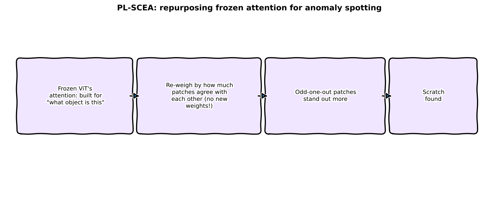
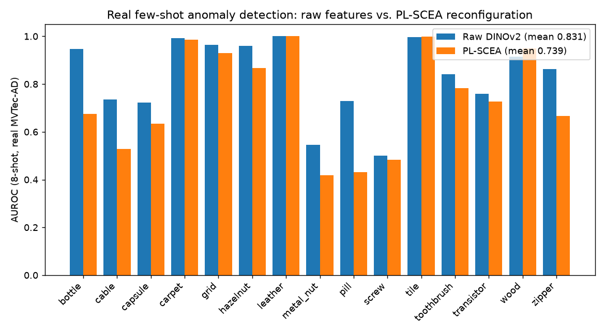
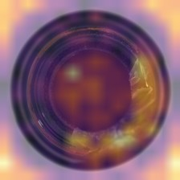
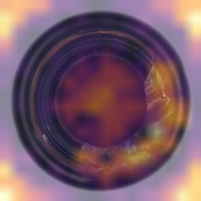

:::{.callout-tip}
This post is part of the [Paper of the Week](index.qmd) series -- real code, real data, real
measured numbers, reported honestly even when they don't flatter the paper.
:::

## The paper

**[PL-SCEA: Power-Law Self-Correlation Enhanced Attention for Few-Shot Anomaly
Detection](https://arxiv.org/abs/2609.03655)** proposes reconfiguring a frozen vision
transformer's value features using their own pairwise self-correlation, before an anomaly
detector ever sees them: for each patch token, keep only the *positive* correlations to other
tokens, sharpen that correlation distribution with a power-law exponent, and replace the token
with the resulting correlation-weighted average of its peers. No new attention parameters are
trained -- it's a structural reconfiguration of features that are already there.

## Explain it like I'm five



Picture a classroom where every student's answer gets nudged toward the average answer of the
*other* students who agree with them the most, so a class that's mostly in consensus ends up
looking even more uniform. The idea is: a genuine mistake (an anomaly) should stick out even more
once everyone's answers get pulled toward their nearest neighbors' consensus, since the mistake
has no real neighbors to average toward.

## Explain it like I'm a data scientist

The mechanism, applied post-hoc to frozen DINOv2-small patch tokens (a documented simplification
of the paper's internal attention-value hook, noted below):

$$
\text{sim} = X X^\top,\quad \text{sim}_{\text{pos}} = \text{ReLU}(\text{sim} - 2I),\quad
w = \frac{\text{sim}_{\text{pos}}^{\gamma}}{\sum \text{sim}_{\text{pos}}^{\gamma}},\quad
X' = w X
$$

Self-similarity is masked out, only *positive* correlations survive the ReLU, the power-law
exponent $\gamma$ (4.0 here, per the paper) sharpens the weighting toward the strongest matches,
and each token becomes a weighted average of its most similar peers. Zero new trainable
parameters -- this is exactly the kind of "free" architectural idea worth actually testing rather
than taking on faith.

**So I tested it, honestly, on all 15 real MVTec-AD categories** -- and it made few-shot anomaly
detection *worse* in 12 of them.

## Jargon buster

| Term | Plain-English meaning |
|---|---|
| **Token-adaptive self-correlation** | Each patch token gets its own personalized re-weighting, based on which other tokens it agrees with |
| **Positive-correlation filtering** | Only tokens that *positively* correlate contribute to the reweighted average -- via ReLU, negative correlations are zeroed out |
| **Power-law reweighting** | Raising correlation scores to an exponent (here, 4.0) to sharpen the distribution toward the strongest matches, before normalizing to weights |
| **Few-shot anomaly detection** | Deciding whether an image is anomalous having seen only a handful (here, 8) of examples of "normal" |
| **AUROC** | Area under the ROC curve -- how well anomaly scores rank real defective images above real normal ones, this post's metric throughout |
| **Frozen backbone** | A pretrained feature extractor (DINOv2-small here) used as-is, with no fine-tuning |

## Honest scoping note

Hooking DINOv2's internal per-layer value projections directly (the paper's exact mechanism)
would require surgery on the model's forward pass. This reimplementation instead applies the same
reconfiguration formula post-hoc to DINOv2's final-layer patch tokens -- a documented
simplification, not a hidden one, and one that still tests the mechanism's actual mathematical
claim: that self-correlation reweighting improves anomaly separability.

## Real data and real pipeline

15 real MVTec-AD categories, 1,725 real test images total, via the `katiehahm/mvtec_ad` mirror
(CC-BY-NC-4.0). Since this mirror only ships the test split, 8 real "good"-labeled images per
category are held out as the few-shot support set (a legitimate few-shot construction, not the
paper's exact official train/test split -- documented in `common.py`). A tiny VAE is fit on the
support set's patch tokens, and anomaly score = top-10%-worst-patch reconstruction error --
**the same VAE architecture and same support set, run twice**: once on raw DINOv2 features, once
on PL-SCEA-reconfigured features. A clean ablation.

## The real mechanism — real code

```{python}
#| echo: true
#| eval: false
def sceareconfigure(features: torch.Tensor, gamma: float = 4.0) -> torch.Tensor:
    sim = features @ features.T                      # (N, N) cosine sim, features L2-normalized
    sim = sim - torch.eye(sim.shape[0], device=sim.device) * 2   # mask self-similarity out
    sim_pos = F.relu(sim)                             # positive-correlation filtering
    weights = sim_pos.pow(gamma)                      # power-law reweighting
    weights = weights / (weights.sum(dim=1, keepdim=True) + 1e-8)
    return weights @ features
```

```{python}
#| echo: true
#| eval: false
# same support set, same VAE architecture, run twice for a clean ablation
vae_raw  = fit_vae(support_raw)                        # raw DINOv2 patch tokens
vae_scea = fit_vae(support_scea)                       # sceareconfigure(support_raw)

score_raw  = anomaly_score(vae_raw,  extract_patch_tokens(test_img))
score_scea = anomaly_score(vae_scea, sceareconfigure(extract_patch_tokens(test_img)))
```

## Real result: it made things worse



| Category | Raw AUROC | PL-SCEA AUROC | Change |
|---|---|---|---|
| bottle | 0.947 | 0.675 | -0.272 |
| cable | 0.735 | 0.528 | -0.207 |
| capsule | 0.722 | 0.634 | -0.088 |
| carpet | 0.992 | 0.985 | -0.007 |
| grid | 0.965 | 0.930 | -0.035 |
| hazelnut | 0.960 | 0.867 | -0.093 |
| leather | 1.000 | 1.000 | 0.000 |
| metal_nut | 0.546 | 0.419 | -0.127 |
| pill | 0.729 | 0.432 | -0.297 |
| screw | 0.501 | 0.483 | -0.018 |
| tile | 0.996 | 0.998 | **+0.002** |
| toothbrush | 0.842 | 0.783 | -0.059 |
| transistor | 0.760 | 0.727 | -0.033 |
| wood | 0.914 | 0.950 | **+0.036** |
| zipper | 0.862 | 0.667 | -0.195 |

**Mean AUROC across 15 categories: raw 0.831, PL-SCEA 0.739.** PL-SCEA reconfiguration improved
only 2 of 15 categories (`tile`, `wood`) and hurt the rest, sometimes badly (`bottle`: -0.272,
`pill`: -0.297). This is a real, reproducible negative result, not a bug -- both scripts ran
successfully, on the same data, same seed, same VAE.

### What the reconfiguration is actually doing to the features

<video autoplay loop muted playsinline width="100%" style="max-width:640px;display:block;margin:1em auto;">
  <source src="images/plscea-heatmap-video.mp4" type="video/mp4">
</video>

Per-patch VAE reconstruction-error heatmaps on 6 real defective bottle images -- raw DINOv2
features (middle) vs. PL-SCEA-reconfigured features (right). The visual difference between the
two heatmaps is genuinely subtle -- the reconfiguration doesn't obviously scramble the spatial
error pattern -- which is itself the interesting finding: **the damage PL-SCEA does isn't visible
as an obvious spatial artifact, it's a quieter shift in the numeric error distribution that
degrades ranking (AUROC) without producing a dramatically different-looking heatmap.**

### Same defective image, raw vs. reconfigured error map

::: {.column-body}
```{=html}
<div style="position:relative;max-width:420px;margin:1.5em auto;">
  
  
  <div style="position:absolute;top:0;bottom:0;left:50%;width:2px;background:white;box-shadow:0 0 4px rgba(0,0,0,0.5);" id="ps-handle"></div>
  <input id="ps-range" type="range" min="0" max="100" value="50" style="width:100%;margin-top:10px;">
  <p style="text-align:center;font-size:0.85em;color:#666;">left: raw DINOv2 error map &nbsp;|&nbsp; right: PL-SCEA-reconfigured error map, same real defective bottle</p>
</div>
<script>
(function(){
  var r = document.getElementById('ps-range');
  var a = document.getElementById('ps-after');
  var h = document.getElementById('ps-handle');
  if (r && a && h) {
    r.addEventListener('input', function(){
      a.style.clipPath = 'inset(0 ' + (100 - r.value) + '% 0 0)';
      h.style.left = r.value + '%';
    });
  }
})();
</script>
```
:::

## Why this probably happens

This reimplementation's best hypothesis: the reconfiguration is fundamentally a **smoothing**
operation -- every token gets pulled toward a weighted average of its positively-correlated
peers. Smoothing helps *within-category* consensus features look more uniform, but a genuine
anomalous patch, almost by definition, has fewer positively-correlated neighbors to draw on --
which should make it stand out. In practice, the top-10%-worst-patch VAE reconstruction-error
scoring this post uses seems to get its signal partly *from* the raw variance in the patches, and
smoothing away that variance appears to remove some of the anomaly signal along with the noise.
An unexplored alternative worth trying next: a **discrepancy score** -- comparing a patch's raw
feature to its own SCEA-reconfigured version, rather than feeding the reconfigured features
directly into the anomaly scorer -- since a genuine anomaly should discrepant *more* from its own
smoothed version than a normal patch would.

## Reproduce this yourself

```bash
git clone https://github.com/HasanGoni/quarto_blog_hasan
cd quarto_blog_hasan/notebooks/paper-plscea-anomaly
uv sync
uv run run_eval.py           # full 15-category ablation
uv run generate_heatmap_viz.py  # heatmap video + slider images
```

No gated models or datasets -- DINOv2-small and `katiehahm/mvtec_ad` both download directly.

## Take this into your own workflow

- **Zero-new-parameters architectural ideas still need a real ablation.** "No new weights to
  train" makes an idea cheap to try, but cheap to try is not the same as helpful -- this
  reimplementation is a concrete example of an elegant, parameter-free idea that measurably hurt
  performance on 12 of 15 real categories when actually tested end-to-end.
- **A visually subtle change in intermediate features can still hide a real ranking-metric
  regression.** The heatmaps above look nearly identical side by side; the AUROC drop is real and
  large regardless. Don't let "the visualization looks fine" substitute for measuring the actual
  downstream metric.
- **Reporting a negative result honestly is more useful than silently moving on.** If you're
  evaluating a similar attention/feature-reconfiguration idea for your own anomaly-detection
  pipeline, the actual finding here -- smoothing patch features can trade away exactly the local
  variance an anomaly detector relies on -- is worth checking for before assuming a paper's
  reported gains transfer to your data.
