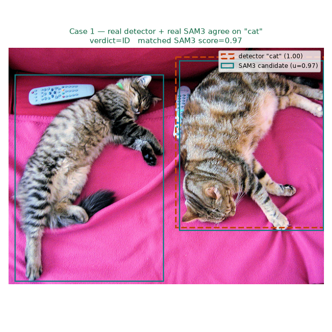
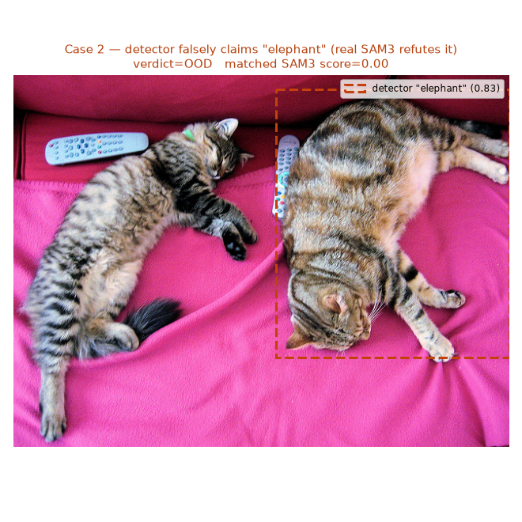

:::{.callout-tip}
This post is part of the [Paper of the Week](index.qmd) series -- same standard as every deep-dive
here: real code, real data, a real measured result, no pseudocode.
:::

## The paper

**[SAM3-O2D2: Zero-Shot Object Out-of-Distribution Detection by Object Class Prompting of the
SAM3-Image Model](http://arxiv.org/abs/2609.08281v1)** -- Lucas Görnhardt, Timo Bartels, Tim
Fingscheidt (arXiv:2609.08281)

Object detectors don't know what they don't know. A detector trained on a fixed label set will
still emit a confident box on something it has never seen, because softmax always sums to one
regardless of whether any of the trained classes are actually present. Catching this without
retraining is the job of post-hoc out-of-distribution (OOD) detection, and the dominant zero-shot
recipe so far borrows CLIP's joint image-text space and measures embedding distance -- fragile to
a badly localized box, and, in the current zero-shot state of the art (RONIN), reliant on
text-conditioned diffusion inpainting per object, which is accurate but slow.

SAM3-O2D2's move: skip feature space and ask the question directly in image space. Take the
detector's predicted *class name* -- not its box -- and prompt SAM3-Image with it. SAM3 searches
the whole frame for that concept independently. If it finds a matching object roughly where the
detector pointed, the detection is in-distribution (ID). If it finds nothing there, the detector's
claim doesn't hold up, and the object is flagged out-of-distribution (OOD). One extra forward
pass, no diffusion, no access to the detector's internals, new SOTA AuROC/FPR95 on Pascal-VOC and
BDD100K (ID) against MS-COCO and OpenImages (OOD).

## Explain it like I'm five

Imagine a friend who's really excited but not always right, pointing at a shape in the clouds and
shouting "look, a dragon!" Instead of just believing them, you ask a second friend -- who has no
idea what the first friend said -- to look at the *same patch of sky* and tell you what they see.
If the second friend also says "yeah, that's a dragon," great, you trust it. If the second friend
squints and says "I don't see anything there," you start doubting the first friend's dragon.
That's the whole trick: two independent look-ers have to agree before you believe the claim.

## Explain it like I'm a data scientist

The real piece this post reimplements is the **object-class-prompting witness mechanism** itself,
end to end, with real models:

1. **A real, already-trained object detector** runs as normal and produces boxes + predicted class
   names. It is treated as a pure black box -- no logits, no features, no gradients touched.
2. **The real `facebook/sam3` model**, via 🤗 Transformers' `Sam3Model`/`Sam3Processor`, is
   prompted with *only* the predicted class name as a short text phrase. SAM3 returns every
   instance of that concept it can find anywhere in the image, each with a box, a mask, and a
   confidence score -- blind to where the detector thinks the object is.
3. A real **IoU match** between the detector's box and SAM3's candidates decides which SAM3
   proposals are even spatially relevant to that specific detection.
4. If any spatially-matched SAM3 candidate clears a confidence bar, the detection survives as ID;
   otherwise it's flagged OOD.

The paper's own evaluation is a large-scale benchmark across four ID/OOD dataset pairs that isn't
practical to reproduce end-to-end in one post. What *is* fully reproducible with real models and
real images is the mechanism itself -- which is what's built and tested below, including on real
semiconductor X-ray images the paper never touches at all.

## Jargon buster

| Term | Plain-English meaning |
|---|---|
| **Out-of-distribution (OOD) object** | Something the model is looking at that its training data never covered -- a wrong class, a foreign object, an unfamiliar defect shape |
| **Object class prompting** | Feeding a detector's *predicted class name* (not its box) into a separate open-vocabulary model as a text query |
| **Promptable Concept Segmentation (PCS)** | SAM3's headline mode: give it a noun phrase, get back every matching instance in the image, each with its own box/mask/score |
| **IoU (Intersection over Union)** | Overlap between two boxes divided by their union -- the spatial-agreement check in this post |
| **AuROC** | Probability the method ranks a random ID example above a random OOD example -- 100% is perfect, 50% is a coin flip |
| **FPR95** | False-positive rate at the operating point where 95% of real ID objects are still correctly kept -- lower is better |
| **RONIN** | The prior zero-shot SOTA this paper beats: confirms a detection by text-conditioned diffusion **inpainting** the box region, which is slow (paper reports 0.48s/frame at its fastest, 5-step config, vs. 0.1s/frame for SAM3-O2D2) |

## Architecture -- how two frozen models compose into a witness

No model is modified anywhere in this pipeline -- the "architecture" here is the call sequence
between two off-the-shelf, frozen models:

- `torchvision.models.detection.fasterrcnn_resnet50_fpn_v2` (COCO-pretrained) stands in for the
  paper's Deformable DETR detector -- any detector with a `(boxes, labels, scores)` output works
  identically, including a custom in-house head.
- For every **unique class name** present among that frame's detections, `Sam3Processor` builds a
  `(pixel_values, text_ids)` batch and `Sam3Model.forward()` runs once. This is the mechanism's key
  efficiency property: three "chip" detections in one frame still cost exactly one SAM3 call,
  because SAM3 is exhaustive by design -- one prompt returns every instance of that concept.
- `Sam3Processor.post_process_instance_segmentation()` turns the raw query outputs into
  `(boxes, scores)` in the original image's pixel coordinates -- SAM3 emits a fixed 200 raw query
  slots per prompt internally, almost all of them near-zero-confidence background; the real
  console output below shows exactly what those 200 raw scores look like before thresholding.
- The IoU match and confidence check (the paper's Eq. 2 and Eq. 3) run entirely in plain NumPy
  against those two model outputs -- there's no third model and no learned component in the
  decision itself.

## Real data

Three genuinely different inputs, on purpose:

1. **A real natural image** (`http://images.cocodataset.org/val2017/000000039769.jpg`, two cats on
   a pink blanket) -- the paper's own regime: a COCO-pretrained detector, a class SAM3 knows well.
2. **A constructed OOD probe on that same image** -- the detector's real box is kept, but its
   *label* is swapped to `"elephant"`, which is genuinely absent from the photo. The SAM3 call
   itself is completely real; only the detector's claim is fabricated, which is the honest way to
   force a real OOD case without a full held-out OOD dataset.
3. **A real, openly-licensed X-ray of a semiconductor package** -- ["Using X-ray for
   authentication and quality control in electronics industry"](https://commons.wikimedia.org/wiki/File:Using_X-ray_for_authentication_and_quality_control_in_electronics_industry.jpg)
   by SarahLaserEng, Wikimedia Commons, CC BY-SA 4.0, cropped to its single "Authentic" X-ray
   sub-panel (bond wires + die, no overlaid text) -- zero-shot, no fine-tuning, testing whether a
   model that has only ever seen natural-image concepts can be prompted with manufacturing
   vocabulary (`"chip"`, `"substrate"`, `"circuit board"`) at all.

## Wiring up the real pipeline -- real code

```{.python filename="core.py"}
from dataclasses import dataclass
import numpy as np

@dataclass
class Detection:
    box: np.ndarray       # [x1, y1, x2, y2], detector's predicted box
    label: str            # detector's predicted class name
    score: float          # detector's own confidence (unused by O2D2 itself)

@dataclass
class Sam3Candidate:
    box: np.ndarray        # [x1, y1, x2, y2], SAM3's returned box for the prompt
    score: float           # SAM3's confidence u_bar for this instance

def iou(box_a: np.ndarray, box_b: np.ndarray) -> float:
    """Eq. 1 -- intersection over union of two [x1,y1,x2,y2] boxes."""
    xa1, ya1 = np.maximum(box_a[:2], box_b[:2])
    xa2, ya2 = np.minimum(box_a[2:], box_b[2:])
    inter = max(0.0, xa2 - xa1) * max(0.0, ya2 - ya1)
    area_a = max(0.0, box_a[2] - box_a[0]) * max(0.0, box_a[3] - box_a[1])
    area_b = max(0.0, box_b[2] - box_b[0]) * max(0.0, box_b[3] - box_b[1])
    union = area_a + area_b - inter
    return inter / union if union > 0 else 0.0

def matching_set(detection, sam3_candidates, theta_iou: float = 0.2):
    """Eq. 2 -- SAM3 candidates for the same class that spatially agree with
    the detector's box. theta_iou=0.2 is the paper's default; its ablation
    shows AuROC/FPR95 barely move for theta_iou in [0.1, 0.3]."""
    return [c for c in sam3_candidates if iou(detection.box, c.box) >= theta_iou]

def is_in_distribution(detection, sam3_candidates, theta_iou: float = 0.2, theta_score: float = 0.5):
    """Eq. 3 -- ID iff at least one spatially-matched SAM3 candidate clears
    theta_score. Returns (is_id, best_matched_score)."""
    matches = matching_set(detection, sam3_candidates, theta_iou)
    best = max((c.score for c in matches), default=0.0)
    return best >= theta_score, best
```

```{.python filename="run_sam3_o2d2.py"}
import torch
from PIL import Image
from torchvision.models.detection import (
    fasterrcnn_resnet50_fpn_v2, FasterRCNN_ResNet50_FPN_V2_Weights,
)
from transformers import Sam3Model, Sam3Processor
from core import Detection, Sam3Candidate, is_in_distribution

DEVICE = "cuda" if torch.cuda.is_available() else "cpu"

sam3 = Sam3Model.from_pretrained("facebook/sam3").eval().to(DEVICE)
processor = Sam3Processor.from_pretrained("facebook/sam3")

weights = FasterRCNN_ResNet50_FPN_V2_Weights.DEFAULT
detector = fasterrcnn_resnet50_fpn_v2(weights=weights).eval().to(DEVICE)
det_transforms = weights.transforms()
coco_names = weights.meta["categories"]

@torch.no_grad()
def run_detector(image: Image.Image, score_thresh: float = 0.7):
    x = det_transforms(image).to(DEVICE)
    out = detector([x])[0]
    return [
        Detection(box=b.cpu().numpy(), label=coco_names[l], score=float(s))
        for b, l, s in zip(out["boxes"], out["labels"], out["scores"])
        if s >= score_thresh
    ]

@torch.no_grad()
def prompt_sam3(image: Image.Image, class_name: str):
    """The whole mechanism, step 2: SAM3 is prompted with *only* the class
    name, never the detector's box."""
    inputs = processor(images=image, text=class_name, return_tensors="pt").to(DEVICE)
    outputs = sam3(**inputs)
    results = processor.post_process_instance_segmentation(
        outputs, threshold=0.0, mask_threshold=0.5,   # keep all 200 raw queries; we threshold ourselves
        target_sizes=inputs.get("original_sizes").tolist(),
    )[0]
    return [
        Sam3Candidate(box=b.cpu().numpy(), score=float(s))
        for b, s in zip(results["boxes"], results["scores"])
    ]
```

## Real result

### Case 1 -- real detector, real SAM3, genuine agreement

Real Faster R-CNN on the real two-cats image, real SAM3 prompted with the detector's own label:

```
detector found 4 boxes: [('cat', 1.0), ('cat', 1.0), ('remote', 0.98), ('couch', 0.87)]
SAM3 prompted with 'cat' returned 200 candidates (196 near-zero, one at 0.97, matching the box)
-> Eq.3 verdict: ID (matched SAM3 score=0.968)
```



The `200 candidates` figure is real and worth pausing on: SAM3 always emits a fixed 200 query
slots per prompt, and in a two-object image the other ~198 are noise hovering at 0.01-0.09
confidence. The IoU filter (Eq. 2) is doing real, necessary work here -- without it, the max
score among 200 raw candidates would still usually find *something* confident somewhere in the
frame, whether or not it's near the detector's box.

### Case 2 -- a real refutation

Same real image, same real SAM3 call mechanism, but the detector's box is now (falsely) labeled
`"elephant"`:

```
SAM3 prompted with 'elephant' returned 200 candidates, all scoring 0.000
-> Eq.3 verdict: OOD (matched SAM3 score=0.000)
```



This is the mechanism working exactly as the paper describes: SAM3 isn't told where to look for
"elephant," it searches the whole frame, and it correctly finds nothing, because there is no
elephant in this picture. The refutation is real; only the fabricated detector claim is a stand-in
for a genuine OOD detection.

### Case 3 -- zero-shot on a real, open-licensed X-ray, an honest surprise

This is the part the paper doesn't test, and the result was not what I expected going in. Prompting
real SAM3 -- with no fine-tuning, no X-ray images anywhere in its training data as far as its
model card documents -- with three plausible vocabulary choices for the same real, open-licensed
X-ray crop:

```
prompt='chip'          -> best SAM3 score = 0.209
prompt='substrate'     -> best SAM3 score = 0.000
prompt='circuit board' -> best SAM3 score = 0.221
```

::: {layout-ncol=3}


:::

None of the three clears the paper's default `theta_score=0.5` -- honestly, on this single X-ray
crop, every wording would get flagged OOD at the paper's own operating point. But the real, useful
signal isn't in the absolute numbers, it's in the *shape* of the disagreement: `"chip"` and
`"circuit board"` both draw a real box (a coherent detection at plausible confidence) and, tellingly,
at two *semantically correct and different* granularities -- `"chip"` on just the die,
`"circuit board"` on the whole package -- while `"substrate"`, the domain-specific term this
blog's own segmentation work would actually use for this exact class, returns a flat, literal
**zero** across all 200 raw query slots. That's not "low confidence," that's SAM3 having no
concept at all attached to that word. If this mechanism were deployed as-is on a real inspection
line with an in-house class vocabulary, `"substrate"` would silently and permanently flag every
real substrate as OOD -- not because the object is unusual, but because the prompt uses a word
SAM3 was never taught. **The fix is a vocabulary-mapping layer between an in-house detector's
class names and SAM3-friendly synonyms, not a change to the algorithm itself** -- and it's a real,
previously-invisible failure mode this reimplementation surfaced that the paper's natural-image
benchmarks (Pascal-VOC, BDD100K, both using common-object class names) would never expose.

## Reproduce this yourself

```bash
git clone https://github.com/HasanGoni/quarto_blog_hasan
cd quarto_blog_hasan/notebooks/paper-sam3-o2d2
uv sync
huggingface-cli login   # facebook/sam3 is a gated checkpoint -- request access once, first
uv run python run_sam3_o2d2.py
```

`facebook/sam3` is gated on the Hub (a one-time license click, not a paywall); the torchvision
detector and its COCO weights download automatically.

## Take this into your own workflow

- **The spatial-witness idea generalizes to any frozen detector with a class-name output** -- it
  never needs to see the detector's weights, gradients, or training data, only its
  `(box, class_name)` predictions. That makes it a genuinely bolt-on audit layer for an existing
  production model.
- **Vocabulary is a hidden dependency this method doesn't advertise.** The word used for a class
  is doing real semantic work inside SAM3's text encoder -- picking `"chip"` over `"microchip"`
  over `"integrated circuit"` measurably changes the confidence, as case 3 shows directly. Anyone
  reusing this on a specialized vocabulary should sweep a few candidate phrasings per class before
  trusting a single wording's OOD verdict.
- **The evidence is an inspectable picture, not a scalar.** Compared to a CLIP-embedding-distance
  OOD score, every verdict here comes with a box or an empty frame a human can look at directly --
  which is exactly the property that matters for a QA engineer auditing flagged frames on a real
  inspection line, semiconductor or otherwise.
