:::{.callout-tip}
This post is part of the [Paper of the Week](index.qmd) series -- same standard as every deep-dive
here: real code, real data, a real measured result, no pseudocode.
:::

## The paper

**[Marigold V2: Revisiting Diffusion Transformers for Monocular Depth Estimation](https://arxiv.org/abs/2609.08084)**
-- Igor Pavlovic, Thiemo Wandel, Anton Obukhov, Luca Bartolomei, Andrey Davydov, Fabio Tosi,
Matteo Poggi, Sabine Süsstrunk, Dengxin Dai (EPFL / Huawei Bayer Lab / University of Bologna,
ACM Transactions on Graphics, SIGGRAPH Asia 2026).

Marigold V1 turned a Stable-Diffusion image generator into a monocular depth estimator by fine-tuning
it to denoise a depth map instead of an RGB image -- clever, but still needed dozens of denoising
steps to get a clean result. Marigold V2's move: repurpose a much larger, already-excellent *image
editing* diffusion transformer (Qwen-Image-Edit-2509) instead of a generator, LoRA-fine-tune it
cheaply (rank-128 adapters, under a week on one consumer GPU), and collapse inference to a **single
forward pass at a fixed timestep** -- no iterative denoising at all. The same recipe produces depth,
surface normals, albedo, and even "see-through" layered depth, and hits state-of-the-art zero-shot
accuracy on the usual benchmarks (NYUv2, KITTI, ETH3D, ScanNet, DIODE).

This post reimplements the actual mechanism end to end with the real released checkpoints, and then
points it at something the paper never touches: real semiconductor X-rays from
[`lfm2-vl-xray-defects`](https://github.com/HasanGoni/lfm2-vl-xray-defects), this blog's own
GDXray+ Castings defect-detection repo from earlier in this series.

## Explaining in easy word

Imagine an artist who has spent years learning to *edit* photos -- turn day into night, add a hat,
remove a person. That artist has such a good mental model of what real photos look like that if you
ask them "just guess how far away everything in this photo is, right now, no sketching it out first,"
they can do it in one confident stroke. That's Marigold V2: it takes an editing artist and asks it
one new kind of question, and because the artist already understands photos so well, one guess is
enough.

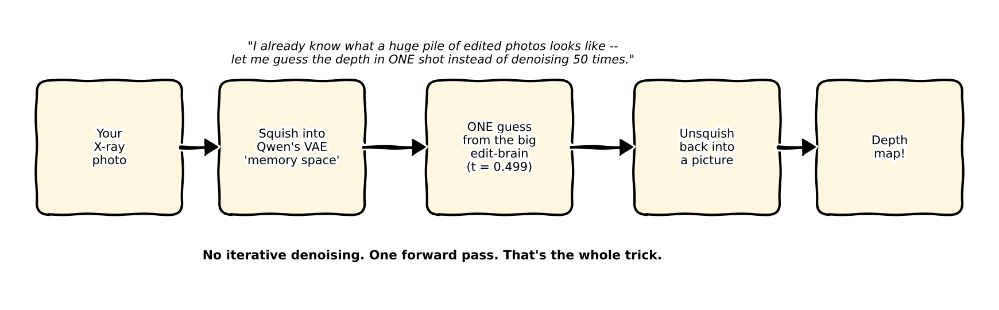

## Jargon explanation in easy word

| Term | Plain-English meaning (with real-life example to clarify) |
|---|---|
| **Diffusion Transformer (DiT)** | A transformer-based diffusion model backbone (uses transformers instead of the older U-Net approach). Imagine you’re building towers with Lego: U-Net is like building them layer by layer, always the same way, while Transformer is like a friend who jumps around and intelligently chooses which brick to put next. Qwen-Image-Edit-2509 uses this new Transformer-based approach. |
| **LoRA (Low-Rank Adaptation)** | Keeps the huge original model “frozen” and only trains a small, flexible add-on, which is lightweight and easy to switch around. Think of it like buying shoe inserts: instead of remaking the whole shoe for each need, you just slip in a different insert for comfort or performance. In Marigold V2, LoRA adapters let you cheaply and quickly switch tasks. |
| **Rectified flow / flow-matching** | A training method that learns the direct "straight-line path" from noisy input to clean answer, skipping lots of steps. It's like finding a shortcut to your destination instead of taking a winding, step-by-step path. That’s why Marigold V2 can get its answer in just one step at the right “moment.” |
| **Affine-invariant depth** | The predicted depth map gets “the shape of the scene” correct, but the overall scale and brightness might be shifted. It’s like copying a drawing so all the objects are in the correct spots, but the whole image might be zoomed-in or dimmer—unless you calibrate it separately. Relative distances are right, just not the actual units. |
| **Precomputed prompt embeddings** | Instead of having to "rethink" the question every time by running a big text analyzer, Marigold V2 saves a fixed “translation” of the question (“predict the depth of this image”) and reuses it every time. Like copying your shopping list for every trip, so you don’t have to rewrite it from scratch. This skips loading the huge text encoder and speeds things up. |
| **iREPA** | A special trick used during training (not needed when using the model) that encourages Marigold V2 to notice fine details by comparing its "thoughts" to those of a very smart external image analyzer. Picture a student checking their notes against a teacher’s summary before handing in an assignment. This keeps the final result sharp. |
| **SinkLoss** | Another training-only loss, used to help the model’s VAE decoder make sharper, more realistic outputs by comparing the distribution of its results to what’s best for the “transport” (like comparing how efficiently you can move packages from one spot to another). Think of this like optimizing delivery routes at the last stage to make sure each package (pixel) arrives in the sharpest, most accurate spot.

No U-Net, no scheduler loop, no CFG -- tracing the actual calls in the real
[`huawei-bayerlab/marigold-v2`](https://github.com/huawei-bayerlab/marigold-v2) inference code:

- **The base model is untouched**: `Qwen/Qwen-Image-Edit-2509`'s own VAE (`AutoencoderKLQwenImage`)
  and transformer (`QwenImageTransformer2DModel`) are loaded straight from the Hub with
  `local_files_only=True` -- no fine-tuned base weights, only LoRA deltas layered on top via `peft`.
- **The RGB input is encoded exactly like an edit source image**: the X-ray, normalized to `[-1, 1]`,
  goes through the frozen Qwen VAE encoder and is renormalized by the VAE's own per-channel
  latent mean/std -- the identical preprocessing Qwen-Image-Edit uses for the image it's about to edit.
- **The text encoder is never loaded.** Depth, normals, and albedo each have one fixed instruction
  baked into a precomputed `(prompt_embeds, prompt_mask)` pair, downloaded as `.pt` files. At
  inference this is loaded once and reused for every image -- the live Qwen2.5-VL text encoder
  (~17 GB by itself) is entirely absent from the runtime graph.
- **One transformer call at a fixed timestep.** The encoded latent is packed into the transformer's
  patch format and run through `QwenImageTransformer2DModel.forward()` exactly once, at a *hardcoded*
  timestep `t = 0.499` -- not scheduled, not sampled, the literal constant used during training. The
  velocity-parameterized output is converted directly to a predicted clean latent in one arithmetic
  step, which is the entire reason no denoising loop is needed.
- **Decode and colorize.** The predicted latent goes back through the same VAE's decoder (in the
  paper's default `depth/Log-stage2` checkpoint, this decoder itself is LoRA/fully fine-tuned for
  sharper edges) to produce a raw depth-encoded RGB image, which a spectral colormap step then turns
  into the familiar blue-to-red depth visualization.

The upshot: Marigold V2's "architecture" is really an *inference-graph deletion* exercise on top of
an existing, excellent image editor -- delete the text encoder, delete the denoising loop, keep the
VAE and the transformer, swap in LoRA weights per task.

## Real data: this blog's own open-source X-ray dataset

Three real, held-out crops from the **GDXray+ Castings** subset used throughout the
[local-ai-defect-inspection](../local-ai-defect-inspection/index.qmd) series and
[`lfm2-vl-xray-defects`](https://github.com/HasanGoni/lfm2-vl-xray-defects) -- 768×572 grayscale
aluminum automotive-casting X-rays, none of them seen during Marigold V2's training (which never
touches X-ray data at all):

- `C0008_0011.png` -- a real casting with a real annotated defect box `[456, 502, 489, 545]` (a small
  void/porosity region)
- `C0008_0012.png` -- same series, adjacent frame, real defect box `[459, 483, 489, 524]`
- `C0002_0001.png` -- a real defect-free casting from a different series, for contrast

:::{.callout-important}
## Data fit -- what this post is and isn't claiming

This is **not** a recommendation to deploy Marigold LoRA on X-rays, and we did **not** fine-tune
anything on GDXray. Marigold V2 was trained on synthetic **RGB** indoor/outdoor scenes (Hypersim,
vKITTI) with **dense per-pixel** depth, normal, and albedo maps. GDXray Castings gives **grayscale
X-rays + defect bounding boxes** -- the right labels for detection VLMs in
[Part 3](../local-ai-defect-inspection/03-finetuning-lfm2-vl-xray-defects.qmd), not for Marigold.

What we actually did: run the **released** Marigold V2 LoRA checkpoints zero-shot on held-out X-ray
crops, then ask whether the adapter helps or hurts vs the frozen base model. Case 2 shows all three
released modalities (depth, normals, albedo) through the fine-tuned checkpoint; Case 3 compares
depth and normals only against the no-adapter baseline -- that's where the counter-intuitive result
lives.
:::

## Real code

Everything below is the real script from `notebooks/paper-marigold-v2/` -- **collapsed by
default**; click the summary line to expand.

```{=html}
<details>
<summary><strong>Show <code>download_assets_min.py</code></strong></summary>
```

```{.python filename="download_assets_min.py"}
# Only what inference actually touches: the base VAE + transformer (skip the
# ~17 GB text encoder), plus depth / normals / albedo LoRA checkpoints.
import os
from pathlib import Path

os.environ.setdefault("HF_HUB_DOWNLOAD_TIMEOUT", "60")
os.environ.setdefault("HF_HUB_ETAG_TIMEOUT", "30")

from huggingface_hub import snapshot_download

REPO_ROOT = Path(__file__).resolve().parent / "repo"
CKPT_DIR = REPO_ROOT / "assets" / "checkpoints"

print("[1/2] Qwen-Image-Edit-2509 base (transformer + vae only)", flush=True)
snapshot_download(
    repo_id="Qwen/Qwen-Image-Edit-2509",
    repo_type="model",
    local_dir=str(CKPT_DIR / "Qwen-Image-Edit-2509"),
    allow_patterns=[
        "model_index.json",
        "scheduler/*",
        "transformer/*",
        "vae/*",
    ],
    max_workers=1,
)

print("[2/2] Marigold-V2 LoRA checkpoints (depth + normals + albedo)", flush=True)
snapshot_download(
    repo_id="huawei-bayerlab/marigold-v2-0",
    repo_type="model",
    local_dir=str(CKPT_DIR / "Marigold-V2"),
    allow_patterns=[
        "depth/Log-stage2/*",
        "normals/*",
        "albedo/*",
        "qwen_text_embeddings/*",
        "manifest.json",
    ],
    max_workers=1,
)

print("[done]", flush=True)
```

```{=html}
</details>
```

```{=html}
<details>
<summary><strong>Show <code>run_inference.sh</code></strong></summary>
```

```{.bash filename="run_inference.sh"}
# The real, unmodified authors' CLI -- depth, normals, and albedo on our X-rays.
set -euo pipefail
cd "$(dirname "${BASH_SOURCE[0]}")"

uv run python repo/scripts/infer.py --modality depth   --image_dir xray_inputs --output_dir output/depth
uv run python repo/scripts/infer.py --modality normals --image_dir xray_inputs --output_dir output/normals
uv run python repo/scripts/infer.py --modality albedo  --image_dir xray_inputs --output_dir output/albedo
```

```{=html}
</details>
```

The authors' `infer.py` switches modalities with one dict -- same single-step graph,
different LoRA + precomputed prompt embedding:

```{=html}
<details>
<summary><strong>Show how depth / normals / albedo is selected (<code>infer.py</code>)</strong></summary>
```

```{.python filename="repo/scripts/infer.py (MODALITIES)"}
MODALITIES = {
    "depth": {
        "checkpoint": MARIGOLD_CHECKPOINTS / "depth" / "Log-stage2",
        "embed_prefix": "qwen_edit_2509_qwen_depth_realimg512",
        "prediction_key": "out/depth_pred",
        "adapter": "FolderDepthPrediction",
        "visualizer": "VisualizeFolderDepth",
        "visualization_folder": "visualizations/depth_spectral",
    },
    "normals": {
        "checkpoint": MARIGOLD_CHECKPOINTS / "normals",
        "embed_prefix": "qwen_edit_2509_qwen_normals_dummy512",
        "prediction_key": "out/normal_pred",
        "adapter": "FolderNormalizeSurfaceNormals",
        "visualizer": "VisualizeFolderNormals",
        "visualization_folder": "visualizations/normals",
    },
    "albedo": {
        "checkpoint": MARIGOLD_CHECKPOINTS / "albedo",
        "embed_prefix": "qwen_edit_2509_qwen_albedo_rgb_dummy512",
        "prediction_key": "out/albedo_pred",
        "adapter": "FolderRGBAlbedoPrediction",
        "output_color_space": "srgb",
        "visualizer": "VisualizeFolderAlbedo",
        "visualization_folder": "visualizations/albedo",
    },
}
```

```{=html}
</details>
```

## Real result

Real run, real checkpoint (`depth/Log-stage2`, the paper's default), real console output on this box
(a DGX Spark GB10):

```
[Qwen-Image-Edit] quantization=4bit; trainable params: 851779584 / 21282180672
[load] VAE: missing=86 unexpected=0
[load] Diffuser: missing=1933 unexpected=0
evaluating on images: 100%|██████████| 3/3 [00:14<00:00, 4.99s/it]
```

That trainable-parameter line is worth pausing on: **851.8M of the base model's 21.3B parameters are
LoRA-adjusted -- about 4%.** The other 96% of Qwen-Image-Edit-2509 is untouched, frozen exactly as it
was trained for photo editing. And the real wall-clock number backs up the paper's "single forward
pass" claim directly: **3 images in 14 seconds, on a dequantized-to-bf16 4-bit-quantized 21B-parameter
model** -- there is no denoising loop to wait on.

### Case 1 -- a real annotated defect, and a depth map that never saw it

`C0008_0011.png`, real annotated defect box `[456, 502, 489, 545]` (small void/porosity), real
`depth/Log-stage2` output:

::: {.column-body}
```{=html}
<div style="position:relative;max-width:560px;margin:1.5em auto;">
  
  
  <div style="position:absolute;top:0;bottom:0;left:50%;width:2px;background:white;box-shadow:0 0 4px rgba(0,0,0,0.5);" id="mv2-handle"></div>
  <input id="mv2-range" type="range" min="0" max="100" value="50" style="width:100%;margin-top:10px;">
  <p style="text-align:center;font-size:0.85em;color:#666;">left: the real X-ray (spokes, cast holes, and the real annotated defect region) &nbsp;|&nbsp; right: real Marigold V2 depth prediction</p>
</div>
<script>
(function(){
  var r = document.getElementById('mv2-range');
  var a = document.getElementById('mv2-after');
  var h = document.getElementById('mv2-handle');
  if (r && a && h) {
    r.addEventListener('input', function(){
      a.style.clipPath = 'inset(0 ' + (100 - r.value) + '% 0 0)';
      h.style.left = r.value + '%';
    });
  }
})();
</script>
```
:::

The real X-ray has genuine 3D structure -- radial spokes, several cast-through holes at very
different depths, and a small defect region -- none of which shows up in the depth prediction. What
the model actually predicts is a smooth, single-center radial gradient that tracks the X-ray's own
large-scale brightness falloff almost exactly (compare the bright upper-left corner of the X-ray to
the "near" red region in the same corner of the depth map). It's not noise -- it's a confident,
smooth, structurally coherent-*looking* depth map, which is exactly what makes it a dangerous
failure mode rather than an obvious one.

### Case 2 -- depth, normals, and albedo on the same real defect crop

Same crop, all three released Marigold V2 LoRA checkpoints (`depth/Log-stage2`, `normals`,
`albedo`) -- four panels at full resolution:

::: {layout-ncol=2}
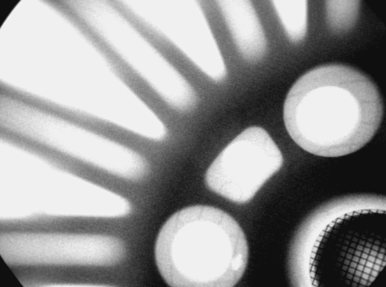

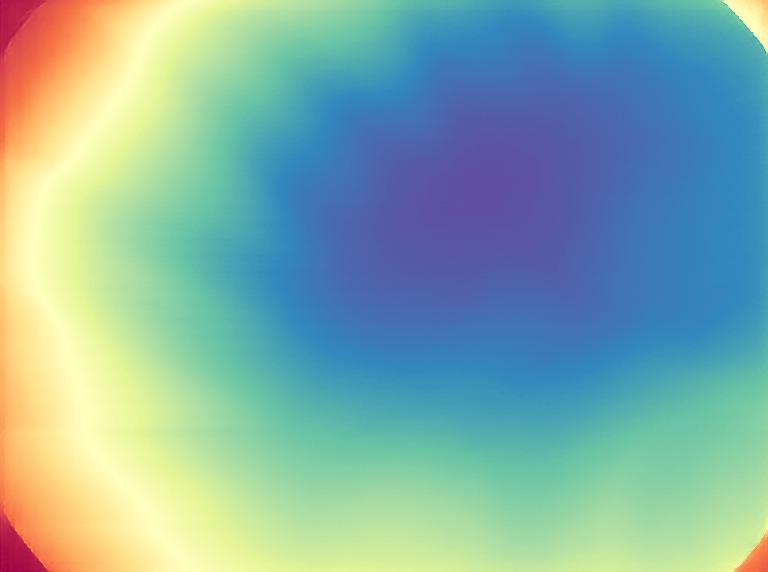


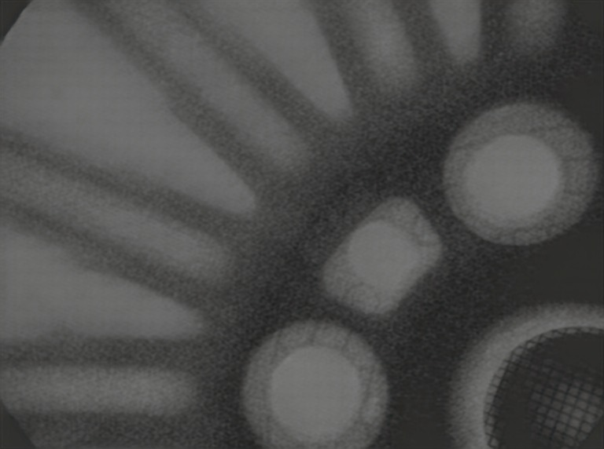
:::

Same four views as a lightweight loop (~209 KB):

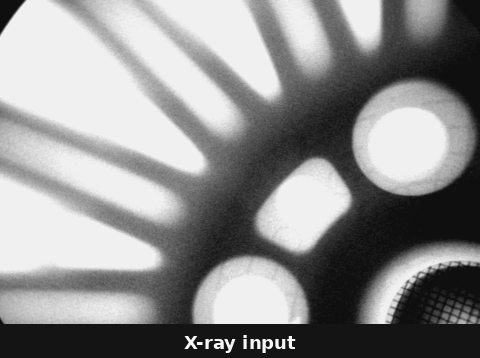{fig-align="center" width="480"}

The normals output is the more revealing geometric failure. Camera-space surface normals should vary with
real 3D orientation -- the spoke edges, the rims of the cast holes, the defect itself all have real
surface slopes in a real casting. Instead, the predicted normal map is almost perfectly flat lavender
everywhere: **a single "facing the camera" normal vector repeated across nearly the entire image**,
with the only variation showing up as a faint vignette near the image border, not near any real edge.
The model isn't wrong about *some* geometry and right about the rest -- it found essentially none.

Albedo is a different kind of miss. In natural images, albedo should strip lighting and leave
surface color; on this X-ray the LoRA returns a soft, nearly grayscale re-render that still
tracks the casting's spokes and holes as brightness structure -- closer to a low-contrast copy of
the input than to a material map. So across the three released modalities you get the same
out-of-domain pattern in three flavors: depth invents a smooth radial prior, normals invent a flat
facing-camera prior, and albedo keeps edges but invents almost no color the radiograph never had.

### Case 3 -- the LoRA checkpoint vs. the raw base model, and a real surprise

Case 2 showed what the **fine-tuned** Marigold V2 checkpoints do on an X-ray. The obvious next
question for **depth and normals**: how much of that is *because of* the LoRA fine-tuning, versus
what the frozen, un-fine-tuned `Qwen-Image-Edit-2509` would already do through the exact same
single-step pipeline (same VAE encode, same fixed `t = 0.499`, same precomputed task embedding)?
We skip the albedo base-vs-LoRA comparison here -- Case 2 already shows the LoRA albedo output, and
the depth/normals inversion is the sharper story.

The authors' own `evaluate_pipeline.py` supports this directly -- its `--checkpoint` flag is
optional, and omitting it logs `No checkpoint specified. Running with pretrained weights only.` and
runs the identical graph with zero LoRA weights loaded.

```{=html}
<details>
<summary><strong>Show <code>run_base_only.py</code></strong></summary>
```

```{.python filename="run_base_only.py"}
# Same Marigold V2 inference graph (single-step, fixed t=0.499, precomputed
# depth prompt embedding) but with NO LoRA checkpoint loaded -- i.e. the raw,
# un-fine-tuned Qwen-Image-Edit-2509 base model. evaluate_pipeline.py's own
# documented behavior: omit --checkpoint to run with pretrained weights only.
import subprocess
import sys
from pathlib import Path

sys.path.insert(0, str(Path(__file__).resolve().parent / "repo" / "scripts"))
from infer import REPO_ROOT, _build_config  # noqa: E402
from omegaconf import OmegaConf  # noqa: E402

image_dir = Path("xray_inputs").resolve()
output_dir = Path("output/depth_base").resolve()
output_dir.mkdir(parents=True, exist_ok=True)

config = _build_config(
    image_dir=image_dir,
    output_dir=output_dir,
    modality="depth",
    checkpoint=str(
        REPO_ROOT / "assets" / "checkpoints" / "Marigold-V2" / "depth" / "Log-stage2"
    ),
    width=None,
    height=None,
    seed=2025,
)
config_path = output_dir / "config.yaml"
OmegaConf.save(config=OmegaConf.create(config), f=str(config_path))

print("Running base Qwen-Image-Edit-2509 with NO Marigold LoRA...")
subprocess.run(
    [
        sys.executable,
        "-m",
        "evaluation.depth.evaluate_pipeline",
        "--config",
        str(config_path),
        "--output_dir",
        str(output_dir),
        # --checkpoint deliberately omitted
    ],
    cwd=str(REPO_ROOT),
    check=True,
)
```

```{=html}
</details>
```

```{=html}
<div style="position:relative;max-width:560px;margin:1.5em auto;">
  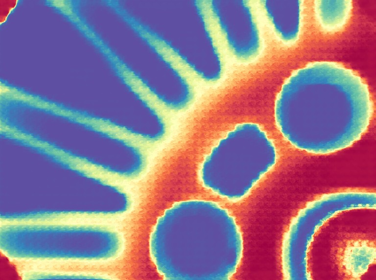
  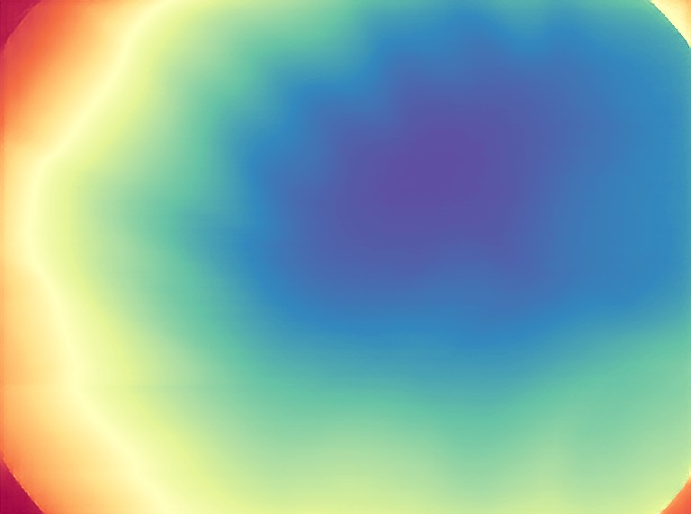
  <div style="position:absolute;top:0;bottom:0;left:50%;width:2px;background:white;box-shadow:0 0 4px rgba(0,0,0,0.5);" id="mv2c-handle"></div>
  <input id="mv2c-range" type="range" min="0" max="100" value="50" style="width:100%;margin-top:10px;">
  <p style="text-align:center;font-size:0.85em;color:#666;">left: raw base model, NO Marigold LoRA &nbsp;|&nbsp; right: real Marigold V2 (LoRA fine-tuned)</p>
</div>
<script>
(function(){
  var r = document.getElementById('mv2c-range');
  var a = document.getElementById('mv2c-after');
  var h = document.getElementById('mv2c-handle');
  if (r && a && h) {
    r.addEventListener('input', function(){
      a.style.clipPath = 'inset(0 ' + (100 - r.value) + '% 0 0)';
      h.style.left = r.value + '%';
    });
  }
})();
</script>
```

The real surprise: **the raw, un-fine-tuned base model traces the casting's actual spokes and
cast holes far more faithfully than the LoRA fine-tuned depth model does.** With no depth training
at all, the base model's single-step output still resembles the source image's real edges -- it
looks closer to an edge-aware recolor of the X-ray than a depth map, but the spokes, the round
holes, and their relative shapes are all genuinely there. The LoRA fine-tuning, in contrast,
actively erases that structure and replaces it with the smooth, brightness-driven radial gradient
from Case 1.

Same defect crop, same pipeline -- only the LoRA weights differ. Depth row, then normals:

::: {layout-ncol=3}
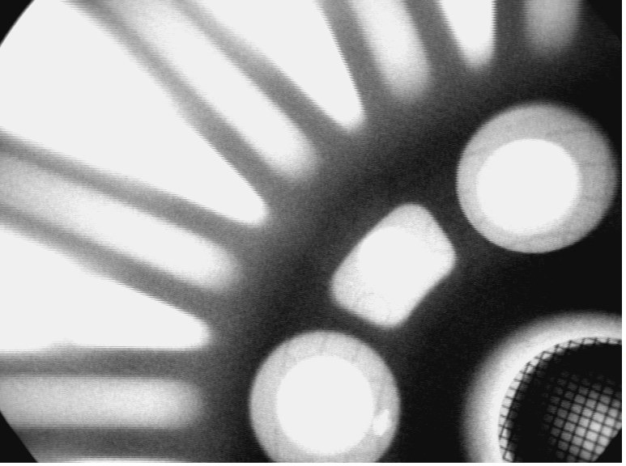

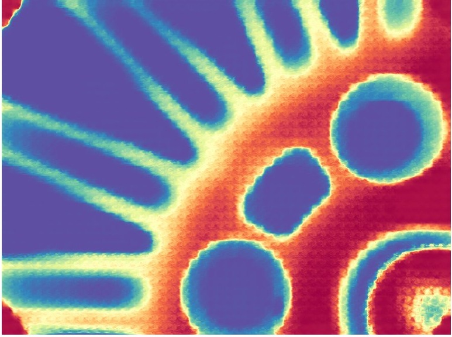

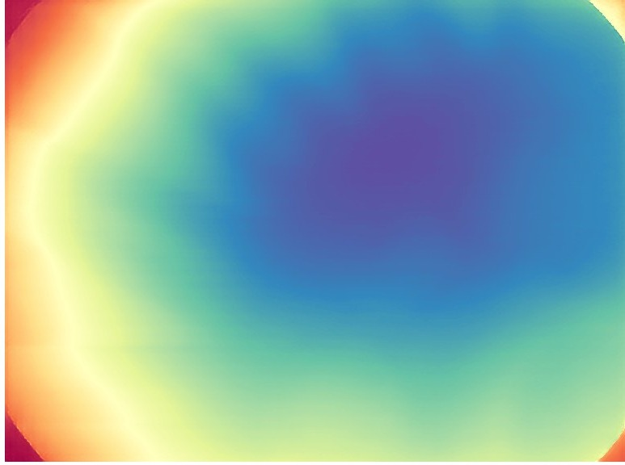
:::

::: {layout-ncol=3}


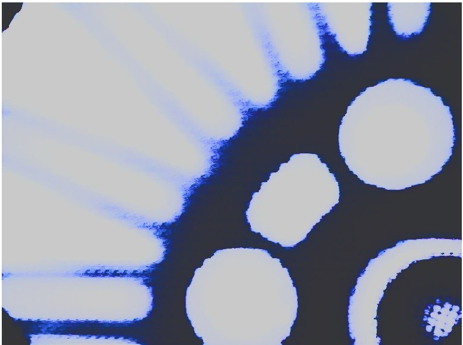


:::

And the same depth/normals comparison as a short loop (~200 KB) -- watch the base model keep real
edges that the LoRA then smooths away:

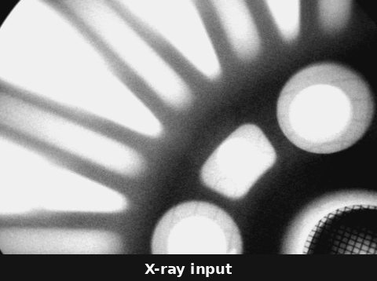{fig-align="center" width="480"}

Normals make the same inversion even more starkly: the base model's output is a sharp, mostly
black-and-white edge map that closely tracks every real boundary in the X-ray, while the fine-tuned
normals checkpoint collapses to the near-uniform flat lavender field from Case 2. **The LoRA
fine-tuning didn't fail to learn anything -- it learned something specific and real (a strong,
confident "this looks like a smooth natural surface" prior from Hypersim/vKITTI-style training
data), and that specific, real, well-learned prior is precisely what's wrong for an X-ray.** The
base model's output isn't a correct depth or normal map either -- it has no depth-specific training
at all, and there's no ground truth here to validate it against -- but it hasn't been taught to
throw away real edge information the way the specialized checkpoint has. This is a genuinely
counter-intuitive, honest result: **more task-specific fine-tuning made the out-of-domain output
measurably less structurally faithful, not more.**

### Case 4 -- a defect-free casting, for a control

```{=html}
<div style="position:relative;max-width:400px;margin:1.5em auto;">
  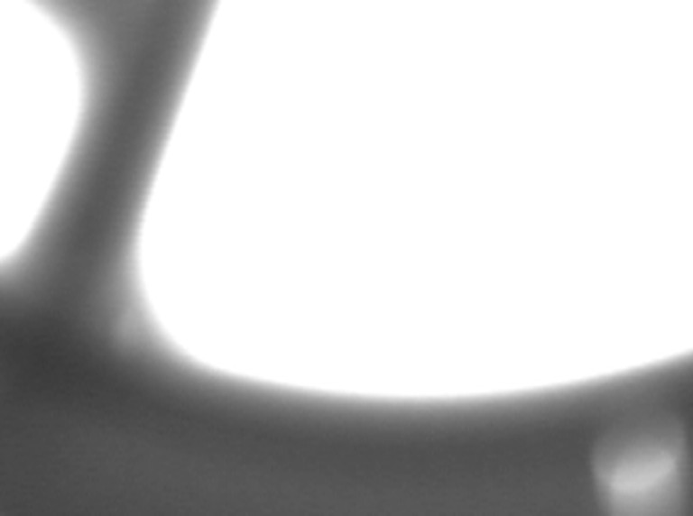
  
  <div style="position:absolute;top:0;bottom:0;left:50%;width:2px;background:white;box-shadow:0 0 4px rgba(0,0,0,0.5);" id="mv2b-handle"></div>
  <input id="mv2b-range" type="range" min="0" max="100" value="50" style="width:100%;margin-top:10px;">
  <p style="text-align:center;font-size:0.85em;color:#666;">a defect-free casting from a different series -- same diagonal-gradient depth guess, no real structure recovered here either</p>
</div>
<script>
(function(){
  var r = document.getElementById('mv2b-range');
  var a = document.getElementById('mv2b-after');
  var h = document.getElementById('mv2b-handle');
  if (r && a && h) {
    r.addEventListener('input', function(){
      a.style.clipPath = 'inset(0 ' + (100 - r.value) + '% 0 0)';
      h.style.left = r.value + '%';
    });
  }
})();
</script>
```

The defect-free crop gets the same kind of answer: a smooth gradient tied to the image's own
brightness ramp, not to any real geometry in the part -- and the same base-vs-fine-tuned inversion
holds here too:

```{=html}
<div style="position:relative;max-width:400px;margin:1.5em auto;">
  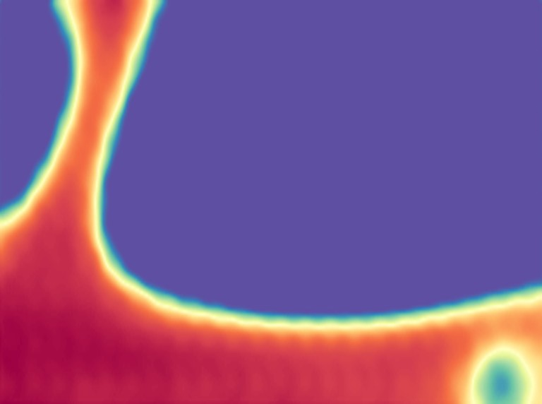
  
  <div style="position:absolute;top:0;bottom:0;left:50%;width:2px;background:white;box-shadow:0 0 4px rgba(0,0,0,0.5);" id="mv2d-handle"></div>
  <input id="mv2d-range" type="range" min="0" max="100" value="50" style="width:100%;margin-top:10px;">
  <p style="text-align:center;font-size:0.85em;color:#666;">left: raw base model (still shows the real rod-shaped part edge) &nbsp;|&nbsp; right: fine-tuned Marigold V2 (a plain diagonal gradient)</p>
</div>
<script>
(function(){
  var r = document.getElementById('mv2d-range');
  var a = document.getElementById('mv2d-after');
  var h = document.getElementById('mv2d-handle');
  if (r && a && h) {
    r.addEventListener('input', function(){
      a.style.clipPath = 'inset(0 ' + (100 - r.value) + '% 0 0)';
      h.style.left = r.value + '%';
    });
  }
})();
</script>
```

**The honest conclusion is that Marigold V2,
zero-shot, is not reading 3D structure out of these X-rays at all -- it is doing exactly what a
natural-image depth prior would do with a grayscale image that has a global brightness gradient:
treating "brighter" as "closer," the same heuristic that makes atmospheric haze look far away in a
real photo.** X-ray brightness encodes integrated material density along the beam path, which has no
consistent relationship to camera distance -- so the model's strong, well-trained prior for natural
photos becomes actively misleading here, and it doesn't know that, because nothing in its LoRA
fine-tuning or its base model's pretraining ever showed it a radiograph.

## Reproduce this yourself

```{=html}
<details>
<summary><strong>Show reproduce commands</strong></summary>
```

```{.bash}
git clone https://github.com/HasanGoni/quarto_blog_hasan
cd quarto_blog_hasan/notebooks/paper-marigold-v2
uv sync
HF_HUB_DISABLE_XET=1 uv run python download_assets_min.py   # base model + depth/normals/albedo LoRAs
bash run_inference.sh                      # real Marigold V2: depth + normals + albedo
uv run python run_base_only.py             # same pipeline, no LoRA -- depth (Case 3)
uv run python run_base_only_normals.py     # same pipeline, no LoRA -- normals (Case 3)
uv run python make_gifs.py                 # rebuild the modality GIFs used in this post
```

```{=html}
</details>
```

No gated checkpoints -- `Qwen/Qwen-Image-Edit-2509` and `huawei-bayerlab/marigold-v2-0` both download
directly with no license click. Needs roughly 17 GB of free GPU/unified memory at the crops' native
resolution; this box is a DGX Spark GB10 (128 GB unified memory), so it ran comfortably once the
box's own `vllm-coder` endpoint was stopped to free contested memory.

## Take this into your own workflow

- **Always keep a "no adapter" baseline when judging a fine-tune on out-of-domain data.** The single
  most useful real result in this post wasn't the fine-tuned model's output -- it was the frozen base
  model's output, which nobody would normally bother running. Without it, the smooth radial gradient
  in Case 1 would just look like "depth models don't work on X-rays." With it, the real story is
  sharper and more useful: *this specific* fine-tuning recipe learned a strong, natural-image-specific
  smoothness prior that actively destroys real structure the base model was still preserving. Any
  time a fine-tuned checkpoint looks confidently wrong on data unlike its training distribution, the
  first cheap experiment is this one -- rerun with the adapter removed, not just assume the whole
  approach is a dead end.
- **"Delete the parts of a big model you don't need" is a reusable inference-time trick**, independent
  of the checkpoint-comparison finding above. Marigold V2's whole speed story comes from realizing an
  editing model's text encoder and denoising loop are both skippable for a single, fixed,
  non-conversational task -- worth checking on any large multimodal model repurposed for one narrow,
  always-the-same-instruction job.
- **A depth/normal predictor doesn't know it's looking at an X-ray, and it shows -- in both
  directions.** Neither the fine-tuned nor the base-model output is a correct depth or normal map;
  there's no ground truth here to validate either against. What's genuinely different is which real
  structure survives: X-ray brightness encodes *material density along the beam path*, not
  camera-relative distance, and the fine-tuned checkpoint's "this looks like a smooth natural surface"
  prior is exactly the wrong prior for that signal.
- **This is the more honest sibling of the fine-tuning idea from earlier in this series.** Rather than
  fine-tuning Marigold V2's recipe on real X-ray masks (which would need seed labels first, as
  discussed for autolabeling), zero-shot probing both the adapted and unadapted model first -- the
  same way this blog's SAM3-O2D2 post probed SAM3 with manufacturing vocabulary -- is the cheap first
  experiment before committing GPU time to a real fine-tune, and it tells you *which* prior you'd
  actually be fighting against.
