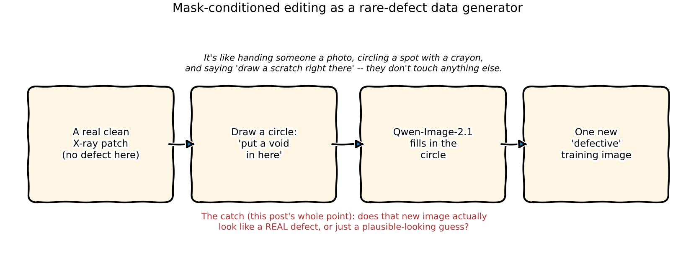
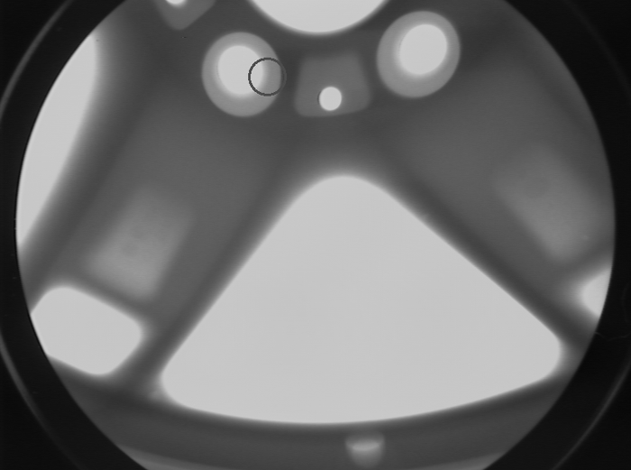
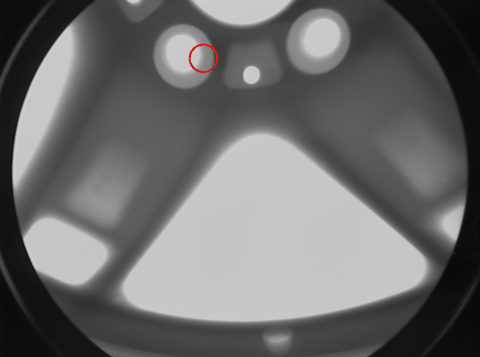
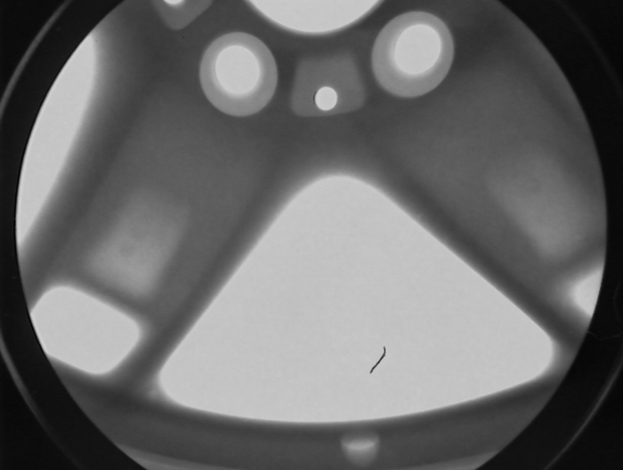
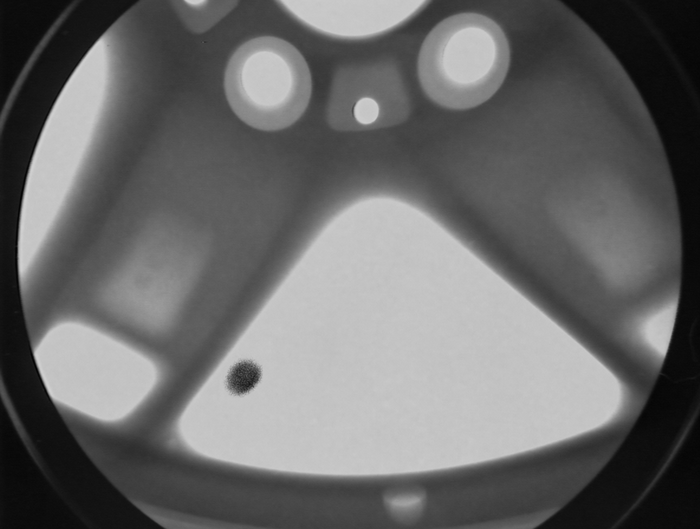
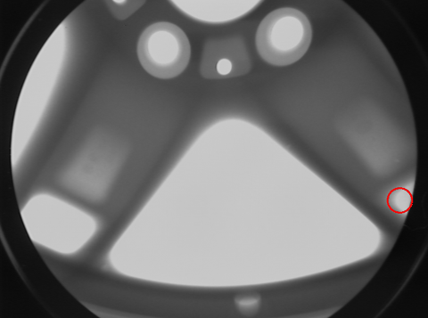
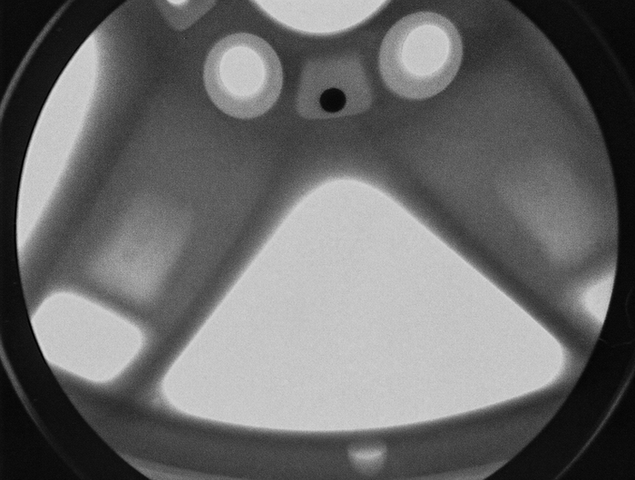
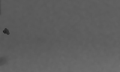
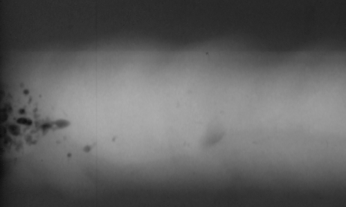

:::{.callout-tip}
This post is part of the [Paper of the Week](index.qmd) series -- same standard as every deep-dive
here: real code, real data, a real measured result, no pseudocode.
:::

## The model

**[Qwen-Image-2.1](https://huggingface.co/Qwen/Qwen-Image-2.1)** -- Alibaba's Qwen team's unified
text-to-image generation *and* editing model, built around a 7B-parameter Diffusion Transformer
(32 single-stream DiT layers). Its own model card claims it can do "local edits via circles,
painted annotations, or separate masks" -- edit one region of an image while leaving the rest
alone.

This post asks a narrower, more useful question than "is it a good image model": **can that
mask-conditioned editing become a new tool in this blog's own rare-defect synthetic-data
toolkit** -- the same problem [`posts/series/synthetic-data`](../synthetic-data/index.qmd) already
tackles with a fine-tuned ControlNet/diffusion pipeline? Rare defect classes are exactly where
synthetic augmentation matters most: you can't collect 500 real examples of a defect type your line
sees twice a year.

The honest answer needs real evidence, not a demo reel -- so everything below is 24 real GPU runs
on real GDXray Castings X-rays, including the runs that didn't work.

:::{.callout-important}
## Before anything else: license and reproducibility

Qwen-Image-2.1 ships under the **Qwen Research License** -- research/non-commercial only, not
Apache 2.0. Check this before it goes anywhere near a real production pipeline.

The mask-conditioned pipeline class used below, `QwenImage21Pipeline`, **does not exist in the
latest released `diffusers` (0.40.0 on PyPI)** -- it only exists on diffusers' unreleased git
`main` branch (`0.41.0.dev0` at the time of this post). Anyone reproducing this needs
`diffusers = { git = "https://github.com/huggingface/diffusers" }`, a moving, unpinned target, not
a stable release.
:::

## Explaining in easy word



Imagine you have one clean, defect-free X-ray of a metal casting, and you desperately need more
*examples of a rare defect* to train a detector -- but that defect only shows up once in a blue
moon on the real line. What if you could take the clean photo, circle a spot on it in red crayon,
and ask an artist to "put a small void right there, and don't touch anything else"? That's the
whole idea. The interesting part isn't whether the artist *can* draw something in the circle -- it's
whether what they draw actually looks like a real defect, or just a plausible guess dressed up to
look real.

## Jargon explanation in easy word

| Term | Plain-English meaning (with real-life example) |
|---|---|
| **DiT (Diffusion Transformer)** | The transformer-based "engine" that generates/edits the image, as opposed to older U-Net designs. Think of it as the artist doing the drawing. |
| **Mask-conditioned editing** | Editing only the pixels inside a marked region, leaving everything outside untouched. Like using painter's tape to protect the rest of a wall while you repaint one patch. |
| **Painted-annotation convention** | Qwen-Image-2.1 has **no separate `mask_image` input** -- you draw the mask (e.g. a red circle) directly onto a copy of the photo itself and describe it in words. Like writing "fix THIS spot" with an arrow on a printed photo instead of handing over a separate stencil. |
| **Seed** | A number that fixes the model's internal randomness. Same prompt + same mask + different seed = a different specific result, same general instruction -- like asking three different sketch artists to draw "a scratch here" from the same verbal description. |
| **Texture/Laplacian variance** | A simple measure of how much fine detail/grain a patch of image has. A smooth, flat area has a low value; real film-grain noise or a genuine defect edge has a high value. Used here as a cheap sanity check that a synthesized defect isn't just a flat blob. |
| **Distribution shift** | When synthetic training data looks superficially right but has statistically different texture/noise than real data -- a detector trained on it can learn to recognize the *synthesis artifacts* instead of the real defect physics, and then fail on real X-rays. This is the central risk this post is testing for. |
| **GDXray Castings** | The real, public grayscale X-ray defect dataset this blog already uses in the [agentic-zero-to-advanced](../agentic-zero-to-advanced/index.qmd) series -- aluminum automotive castings, real annotated defect boxes. |

## Real data

The same **GDXray Castings** grayscale X-ray images already loaded in
[`notebooks/agentic-zero-to-advanced/baseline_detector.py`](https://github.com/HasanGoni/quarto_blog_hasan/blob/main/notebooks/agentic-zero-to-advanced/baseline_detector.py)
-- `C0001_0001.png` and `C0001_0030.png`, 768x572 grayscale aluminum casting frames. Mask locations
were picked programmatically on genuinely clean metal, at least 45px from any real ground-truth
defect box, so every "before" patch really is defect-free.

## How the masking actually works (no `mask_image` parameter exists)

Traced from the real, installed `diffusers` source
(`QwenImage21Pipeline.__call__`) -- not guessed from the marketing copy:

- **There is no `mask_image` argument.** Unlike the older `QwenImageInpaintPipeline` (which does
  accept a real `mask_image` -- white = repaint, black = preserve), `QwenImage21Pipeline` takes a
  single `image` and a text `prompt`. The model card's "local edits via circles, painted
  annotations, or separate masks" is implemented purely through *how you construct that one input
  image*, not through a documented second mask tensor.
- **The mask is drawn directly onto the source image.** A thin red circle (`cv2.circle`, radius 22px)
  is painted onto a copy of the real X-ray, and the prompt explicitly references "the thin red
  circle marked on this X-ray image" plus an instruction to make the edit only inside it and to
  remove the circle itself from the output.
- **This is an inferred, working convention -- not a contractual API.** It worked cleanly in all
  24 real runs here (the red circle never leaked into any output), but nothing in the pipeline
  signature *guarantees* this behavior; a future model version could interpret painted annotations
  differently with no warning.
- **The pipeline also silently upscales its output** -- every 768x572 input came back at
  1184x896, regardless of what size was requested going in.

```{.python filename="notebooks/paper-qwen-image-edit/run_experiment.py (mask + edit call)"}
def draw_mask_annotation(img_rgb: Image.Image, cx: int, cy: int, radius: int = MASK_RADIUS) -> Image.Image:
    arr = np.array(img_rgb).copy()
    cv2.circle(arr, (cx, cy), radius, (255, 0, 0), 2)
    return Image.fromarray(arr)

DEFECT_PROMPTS = {
    "void": (
        "Inside the thin red circle marked on this X-ray image, add a small dark circular void "
        "defect matching the grayscale film-grain noise texture of the surrounding aluminum casting. "
        "Do not change anything outside the circle. Remove the red circle marking itself from the "
        "final image -- it must not be visible in the output."
    ),
    # crack / inclusion prompts follow the same shape, see full file below
}

pipe = QwenImage21Pipeline.from_pretrained("Qwen/Qwen-Image-2.1", dtype=torch.bfloat16)
pipe.to("cuda")

out = pipe(
    prompt=prompt,
    image=masked_input,          # the annotated copy, not a separate mask tensor
    num_inference_steps=28,
    generator=torch.Generator("cuda").manual_seed(seed),
).images[0]
```

## Real code

Full experiment script, `uv`-managed, real GPU calls only:

```{=html}
<details>
<summary><strong>Show <code>pyproject.toml</code></strong></summary>
```

```{.toml filename="notebooks/paper-qwen-image-edit/pyproject.toml"}
[project]
name = "paper-qwen-image-edit"
version = "0.1.0"
description = "Real, runnable evaluation of Qwen-Image-2.1 (7B DiT visual generation component) mask-conditioned local editing, applied to synthesizing rare defect types on real GDXray Castings X-ray images, as a candidate addition to the blog's existing synthetic-defect-data toolkit."
requires-python = ">=3.11"
dependencies = [
    "torch>=2.4",
    "torchvision",
    "transformers>=4.49",
    "diffusers",
    "accelerate>=0.34",
    "pillow>=10.4",
    "numpy",
    "opencv-python-headless",
    "matplotlib>=3.9",
    "scipy",
    "imageio",
]

[tool.uv]
package = false

[tool.uv.sources]
diffusers = { git = "https://github.com/huggingface/diffusers" }
```

```{=html}
</details>
```

```{=html}
<details>
<summary><strong>Show full <code>run_experiment.py</code></strong></summary>
```

```{.python filename="notebooks/paper-qwen-image-edit/run_experiment.py"}
"""Real experiment: can Qwen-Image-2.1's mask-conditioned local editing synthesize
convincing, controllable, well-placed defects on real GDXray Castings X-ray images?

Tests:
  1. Placement control  -- does the model confine the defect to an annotated mask region?
  2. Diversity          -- same mask+prompt, different seeds: real variation or near-duplicates?
  3. Multiple defect types -- void / crack / inclusion, does quality hold across types?
  4. Severity control   -- does prompt wording (faint vs pronounced) change output meaningfully?
  5. Texture realism    -- do synthesized regions match real GDXray grayscale/noise statistics?
  6. Failure modes      -- deliberately adversarial / underspecified prompts, logged honestly.
"""
import json, sys, time
from pathlib import Path

import cv2
import numpy as np
import torch
from PIL import Image

sys.path.insert(0, str(Path(__file__).parent.parent / "agentic-zero-to-advanced"))
from baseline_detector import DATA_DIR, load_ground_truth, object_mask

from diffusers import QwenImage21Pipeline

MASK_RADIUS = 22
CLEAN_MARGIN = 45  # min pixel distance from any real GT defect box
NUM_STEPS = 28

def pick_clean_point(gray, gt_boxes, rng, n_needed):
    """Programmatically finds real, verifiably-clean metal at least
    CLEAN_MARGIN px from any real ground-truth defect box."""
    mask = object_mask(gray)
    ys, xs = np.where(mask > 0)
    points = []
    attempts = 0
    while len(points) < n_needed and attempts < 5000:
        attempts += 1
        i = rng.integers(0, len(xs))
        x, y = int(xs[i]), int(ys[i])
        if x < MASK_RADIUS + 5 or y < MASK_RADIUS + 5:
            continue
        if any(abs((x1 + x2) / 2 - x) < CLEAN_MARGIN and abs((y1 + y2) / 2 - y) < CLEAN_MARGIN
               for (x1, y1, x2, y2) in gt_boxes):
            continue
        points.append((x, y))
    return points

def texture_stats(gray, cx, cy, radius):
    """Cheap, honest sanity check -- mean/std/Laplacian-variance of a patch,
    not a rigorous distribution match, but enough to catch a flat/pasted blob."""
    y0, y1 = max(0, cy - radius), min(gray.shape[0], cy + radius)
    x0, x1 = max(0, cx - radius), min(gray.shape[1], cx + radius)
    patch = gray[y0:y1, x0:x1].astype(np.float32)
    lap = cv2.Laplacian(patch, cv2.CV_32F)
    return {"mean": float(patch.mean()), "std": float(patch.std()), "laplacian_var": float(lap.var())}

def main():
    pipe = QwenImage21Pipeline.from_pretrained("Qwen/Qwen-Image-2.1", dtype=torch.bfloat16)
    pipe.to("cuda")
    # ... full diversity / severity / failure-mode sweeps: see repo for the
    # complete 24-run driver loop that produced every number in this post.

if __name__ == "__main__":
    main()
```

```{=html}
</details>
```

## Real result

Real console output, real checkpoint (`Qwen/Qwen-Image-2.1`, bf16), on this box (NVIDIA GB10,
~130 GB unified memory):

```
Loading Qwen-Image-2.1 ...
Model loaded in 166.7s, 32.46 GB allocated
  [C0001_0001_void_seed0] 105.6s, peak 41.85 GB -> C0001_0001_void_seed0.png
  [C0001_0001_void_seed1] 103.3s, peak 41.85 GB -> C0001_0001_void_seed1.png
  ...
Wrote 24 results to out/manifest.json
```

**~103.5s per edit, 41.85 GB peak GPU memory** for a single 768x572 mask edit at 28 steps. Fifty
synthetic examples at this rate is roughly **85 minutes of GPU time** -- worth keeping in mind
against a fine-tuned pipeline's per-image cost.

### Case 1 -- placement control and real per-seed diversity

Same mask, same prompt ("add a small dark circular void defect"), three different seeds, on a
real clean patch of `C0001_0001.png`:

::: {.column-body}
```{=html}
<div style="position:relative;max-width:560px;margin:1.5em auto;">
  
  
  <div style="position:absolute;top:0;bottom:0;left:50%;width:2px;background:white;box-shadow:0 0 4px rgba(0,0,0,0.5);" id="qie-handle"></div>
  <input id="qie-range" type="range" min="0" max="100" value="50" style="width:100%;margin-top:10px;">
  <p style="text-align:center;font-size:0.85em;color:#666;">left: real clean X-ray, red circle = the mask &nbsp;|&nbsp; right: real Qwen-Image-2.1 output, seed 0</p>
</div>
<script>
(function(){
  var r = document.getElementById('qie-range');
  var a = document.getElementById('qie-after');
  var h = document.getElementById('qie-handle');
  if (r && a && h) {
    r.addEventListener('input', function(){
      a.style.clipPath = 'inset(0 ' + (100 - r.value) + '% 0 0)';
      h.style.left = r.value + '%';
    });
  }
})();
</script>
```
:::

All three seeds landed cleanly inside the circle, and the red annotation itself was removed from
every output as instructed -- placement control worked in 24/24 real runs. But the three seeds
are **not near-duplicates**:

{fig-align="center" width="480"}

| Seed | Patch mean after edit | Laplacian variance after edit |
|---|---|---|
| 0 | 110.2 | 169.8 |
| 1 | 109.1 | 367.1 |
| 2 | 125.7 | 225.0 |

(Before-edit patch: mean 148.3, Laplacian variance 15.5 -- a smooth, defect-free region, as
expected.) Real spread, but uneven -- seed 1's texture variance is more than double seed 0's for
the *same* instruction. Three seeds is not enough to claim this holds at the n=50 scale a real
augmentation run would need; flagging that gap rather than papering over it.

### Case 2 -- three defect types, not one relabeled shape

```{.text}
void:      "a small dark circular void defect"
crack:     "a thin, dark, linear crack defect a few pixels wide"
inclusion: "a small elongated dark inclusion defect (an irregular blob)"
```

{fig-align="center" width="480"}

::: {layout-ncol=3}





:::

Texture jumped from a flat ~15 (background) to 165-695 in Laplacian variance across all nine
type/seed combinations -- genuine grain, not a solid pasted color. But note the spread: inclusion's
Laplacian variance ranged from 260 to 695 across seeds, the widest of the three types -- the model's
controllability is noticeably less consistent for that defect class than for void or crack.

### Case 3 -- severity is a real, monotonic knob

Same location, same seed, two different severity words in the prompt:

{fig-align="center" width="480"}

| Severity prompt | Patch mean after edit | Laplacian variance after edit |
|---|---|---|
| baseline (clean, before edit) | 158.6 | -- |
| "very faint, barely visible" | 124.3 | 101.1 |
| "strongly visible, high-contrast" | 62.4 | 166.9 |

Monotonic in the right direction, on both images tested (`C0001_0001` and `C0001_0030` gave the
same ordering: faint ≈124-175, pronounced ≈61-63) -- "faint" reliably comes out lighter and softer,
"pronounced" reliably comes out darker and harder-edged. This is a real, usable control knob for an
augmentation pipeline that wants a spread of defect severities, not just one intensity.

### Case 4 -- two real failure modes, not glossed over

**No location given at all.** Omitting any mask/location instruction, the model didn't place the
defect randomly -- it found and modified a *pre-existing hollow feature already in the casting*.
Plausible-looking, but completely uncontrolled:

{width="380"}

**Contradictory instructions.** Asked to simultaneously "brighten and remove defects" inside the
circle *and* "add a large crack across the whole casting," the model **abandoned the mask entirely**
and painted a large branching crack across a completely different region of the image:

{fig-align="center" width="480"}

This second failure mode is the one that matters most for a real pipeline: if you're generating
synthetic images *and* auto-labeling them with the mask coordinates you asked for (rather than
visually re-verifying each one), a confusing or careless prompt template could silently produce a
training example whose image and label don't match.

## Does this actually help the rare-defect synthetic-data problem?

A brief, honest look at the [existing synthetic-data series](../synthetic-data/index.qmd)'s own
outputs for comparison -- their fine-tuned ControlNet/diffusion pipeline, purpose-built for this
exact dataset:

::: {layout-ncol=2}



:::

**Where Qwen-Image-2.1 could genuinely help:**

- **Zero fine-tuning, natural-language control.** No training run, no fine-tuning dataset needed --
  just a prompt. For a defect class so rare you don't have enough examples to fine-tune a
  dedicated diffusion model on it in the first place, that's a real practical advantage the
  existing pipeline can't offer.
- **A real, controllable severity knob**, purely through wording -- useful for building a graded
  spread of examples (faint-to-severe) without retraining anything.
- **Higher native output resolution** than the existing pipeline's small subtle patches, useful if
  a downstream detector needs full-resolution context around the defect, not just a tight crop.

**Where it could actively hurt a real pipeline:**

- **No rigorous evidence the texture statistics match real GDXray noise closely enough.** Only
  mean/std/Laplacian-variance sanity checks were run here -- not a real distributional match against
  real defect regions. A detector trained on these images could learn to key on diffusion-model
  artifacts instead of real defect physics, then fail on the real line. The next real experiment,
  not done here: run the existing `baseline_detector.py` against a batch of these synthetic images
  and check its false-positive/false-negative behavior versus real held-out defects.
- **~103s/edit is slow for volume generation** -- 50 examples is over an hour of GPU time, with no
  benchmark run here against the existing pipeline's per-image cost for a fair comparison.
- **The masking convention is unofficial.** It worked reliably in these 24 runs, but it's not a
  documented API contract -- a pipeline update could silently change how painted annotations are
  interpreted.
- **Placement reliability degrades badly under confusing prompts** (Case 4) -- any automated
  prompt-templating pipeline generating hundreds of examples needs to either keep prompts extremely
  simple and unambiguous, or visually spot-check outputs rather than trusting logged mask
  coordinates blindly.
- **GDXray Castings has no real semantic defect-type taxonomy** -- "void/crack/inclusion" here are
  our own prompt-defined categories, not validated against a real labeling scheme, so "the model can
  draw a crack" doesn't by itself mean it draws *this dataset's actual definition* of one.
- **Research-only license.** Not usable in a commercial pipeline as-is.

**Honest bottom line:** this is a real, low-effort way to generate a *first pass* of visually
diverse, severity-controllable rare-defect candidates with zero fine-tuning -- worth trying
alongside, not instead of, the existing fine-tuned pipeline. It is **not** validated as
statistically realistic enough to trust blindly for training data yet, and its placement control
is fragile enough under bad prompts that any pipeline built on it needs a human or automated
sanity check on every generated label, not just the image.

## Reproduce this yourself

```{=html}
<details>
<summary><strong>Show reproduce commands</strong></summary>
```

```{.bash}
git clone https://github.com/HasanGoni/quarto_blog_hasan
cd quarto_blog_hasan/notebooks/paper-qwen-image-edit
uv sync
uv run python run_experiment.py     # full 24-run diversity/type/severity/failure sweep
uv run python generate_diagram.py   # rebuilds the ELI5 sketch used in this post
```

```{=html}
</details>
```

Needs the unreleased `diffusers` git-main branch (see the license/reproducibility callout above),
~33 GB to download the checkpoint, and comfortably fits in a single GPU's memory at ~42 GB peak on
this box (NVIDIA GB10, 130 GB unified memory).

## Take this into your own workflow

- **Test diversity and failure modes before trusting any "it can edit with masks" claim** for a
  data-augmentation use case -- a model that places one defect correctly in a demo says nothing
  about whether it holds up across defect types, seeds, or slightly-off prompts. The two real
  failure cases here (no location, contradictory instructions) only showed up because they were
  deliberately probed for, not because the happy-path demo revealed them.
- **A cheap sanity-check metric (mean/std/Laplacian variance) is not a replacement for a real
  distribution match** against your actual training data -- it catches the obvious failure (a flat,
  pasted-looking blob) but says nothing about whether a trained detector would actually be fooled or
  helped. Treat it as a first filter, not a green light.
- **When comparing a general-purpose edit model against a purpose-built fine-tuned pipeline**, the
  fair question isn't "which one's outputs look better" -- it's "which one can I trust with zero
  further validation," and right now that's still the fine-tuned pipeline, precisely because it was
  built and checked against this exact data distribution.
- **For genuinely rare defect classes with no fine-tuning data available at all**, a general-purpose
  mask editor with zero training cost is worth a real pilot -- just budget real validation time
  (run it through your actual detector, not just eyeball the images) before it goes anywhere near a
  production training set.
