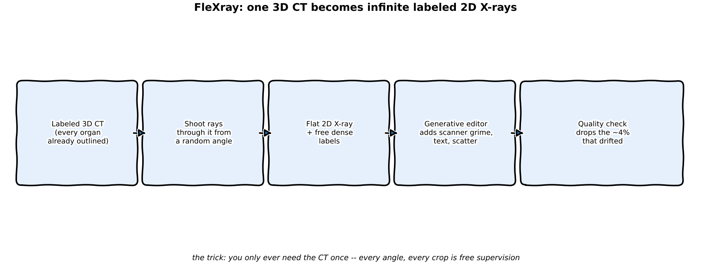
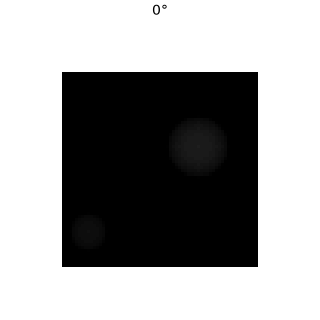
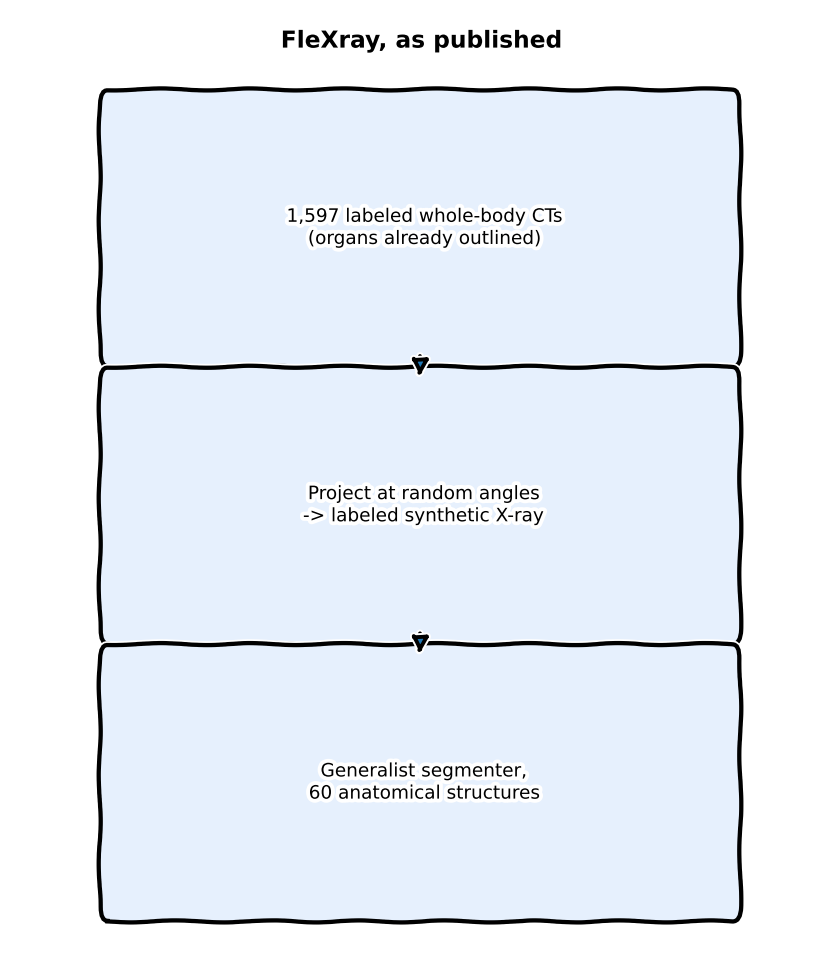
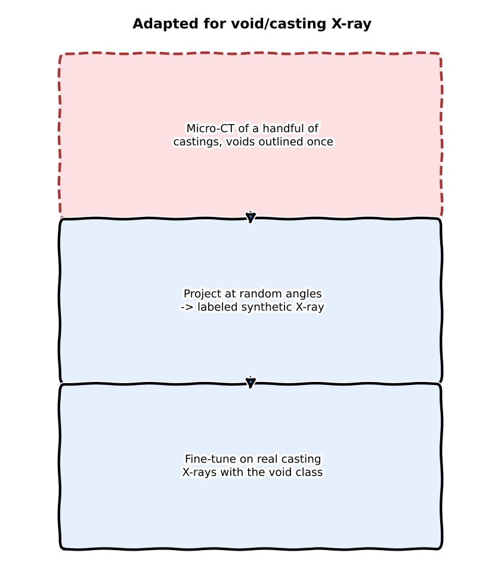

:::{.callout-tip}
This post is part of the [Paper of the Week](index.qmd) series — an applicability audit of the
FleXray data engine for void detection, not a full model reimplementation.
:::

:::{.callout-note}
## Different from the last few posts, on purpose
Recent entries in this series ran a real reimplementation on GPU (Qwen-Image-2.1's mask editing,
Marigold V2 on real X-rays, SAM3-O2D2). This one doesn't -- FleXray is a clinical anatomy model
with no defect-detection angle at all, so there's nothing of *mine* to fine-tune it on. What's
useful here isn't the model, it's the **data engine design**, so this post is an honest
applicability audit: what's genuinely reusable for [Universal void
detection](../synthetic-data/index.qmd), what's superficially tempting but doesn't transfer, and
why. The diagrams and the projection simulation below are real, run code -- just illustrative
rather than a training result.
:::

## The paper

**FleXray: Universal Clinical X-ray Segmentation** (Butoi, Gopalakrishnan, Guttag, Dalca, Dey --
MIT CSAIL / Massachusetts General Hospital / Harvard Medical School,
[arXiv:2609.26756](https://arxiv.org/abs/2609.26756)).

X-ray is medicine's most-used imaging modality (2.28B scans/year vs. 403M for CT) and its least
quantitative one, because nobody has dense pixel labels for X-rays -- 3D anatomy collapsed onto a
2D detector makes even *expert* manual annotation slow and ambiguous. So instead of annotating
more X-rays, the authors build a **generative data engine**: take 3D CT volumes that already have
dense organ labels (from existing CT segmentation datasets), shoot simulated X-ray rays through
them from randomized angles, and get a synthetic 2D X-ray with a perfect, free label mask on the
other side. Run through a pretrained generative image editor to add clinical grime (scanner
artifacts, text overlays, scatter), quality-filtered to drop the ~4% that drifted anatomically, and
harmonized across six CT and four real X-ray datasets into one 60-structure label vocabulary. The
resulting model, FleXray, segments 60 anatomical structures in any clinical X-ray with no prompts
or clicks, matches supervised in-domain nnU-Nets on eight held-out datasets, stays robust at
oblique acquisition angles where every baseline collapses, and provides a useful few-shot
initialization for entirely new pathological targets (hip dysplasia, bone tumors) it never trained
on.

## Explaining in easy words



Picture a doctor who has one perfect 3D wax model of a skeleton with every bone already painted a
different color. Instead of asking a thousand people to trace bones on a thousand flat photographs
(slow, and everyone traces slightly differently), the doctor shines a flashlight through the wax
model from a hundred different angles and traces the *shadow* each time. Because the colors are
already painted on the model, every shadow comes with a free, perfect answer key. Then a
photo-editing artist roughs up each shadow so it looks like a real, grubby hospital X-ray instead
of a clean toy shadow. Do that with a few thousand wax models covering every body type, and you
never need a human to trace a real X-ray by hand again.

## Explaining for a data scientist

The engine has three moving parts, and the paper is explicit that **none of them alone is
sufficient** (Appendix E.2.3 ablation, referenced on p.10): physics-based ray projection alone
transfers poorly to real radiographs; per-structure attenuation randomization (independently
jittering each organ's simulated density) accounts for most of the domain-gap closing; generative
appearance editing adds further benefit specifically where analytic rendering is least faithful
(scanner text, contrast agents, implants); and real X-ray data for peripheral anatomy (hands,
feet -- only 4% of training iterations) closes coverage gaps CT sources simply don't have (whole-body
CT protocols rarely image extremities in frame). Supervision is handled with a **dataset-routed
loss**: because each source dataset only labels a subset of the 60-structure vocabulary, absence
in one dataset is not treated as a negative label for structures that dataset never annotated --
only structures that are *anatomically impossible* in a given view (e.g. hand bones in a foot
X-ray) are used as explicit negatives. This is what lets six differently-labeled CT sources and
four differently-labeled X-ray sources be trained jointly without one dataset's blank space
poisoning another's positive labels.

## Jargon-buster

| Term | Plain meaning |
|---|---|
| **DRR (Digitally Reconstructed Radiograph)** | A synthetic X-ray made by ray-summing through a 3D CT volume — a physics simulation of what an X-ray detector would see, not a photo. Think of shining a flashlight through a toy block: the shadow isn't a photo of the block, it just shows how thickness/density blocks the light. |
| **Attenuation randomization** | Independently jittering how much each labeled structure "blocks" the simulated X-ray beam, to cover the real density variation seen across patients (bone disease, contrast agents, implants) without needing real examples of each. Suppose for every flashlight shadow you randomly tint each part of the toy darker or lighter — you learn to handle all the shadow variants you'll see later. |
| **Dataset-routed loss** | A loss function that only penalizes a prediction against the labels its *source dataset* actually provides, instead of assuming "not labeled" means "absent." For example, grade a student only on the questions they were given — don't mark them wrong for answers they never saw. |
| **Label harmonization** | Mapping several datasets' different naming/granularity for the same anatomy (e.g. "spine" vs. "L1 vertebra") into one shared vocabulary so they can be trained on jointly. Think of merging grocery lists where one says "fruit" and another says "bananas" into one common list that covers both. |
| **Geodesic distance from frontal view** | How far off-angle an X-ray was taken from a standard straight-on shot — used here to measure how a model's accuracy decays as acquisition angle gets more oblique. Think of how much you've turned your head away from someone facing you: the bigger the angle, the harder recognition gets. |
| **Test-time augmentation (TTA) + ensembling** | Running the same image through the model multiple times with small input variations (and/or through several independently trained models) and averaging the predictions, trading extra inference compute for robustness. Suppose you ask several friends what's in a blurry photo, also show them slightly different crops, then take the majority answer. |
| **Chamfer loss (in 2D/3D registration)** | A distance-based loss that pulls two point sets/contours together — here, aligning a predicted 2D structure boundary to its projected 3D counterpart, used as a smoother, less-local-minima-prone alternative to raw image-similarity optimization. Think of tracing two outlines of the same shape (paper vs. shadow) and shrinking the gap between their borders until they match. |

## Architecture — traced from the paper

The pipeline the paper describes, in order. Click a stage (or use the arrow keys once a stage is
focused) to walk the engine.

```{=html}
<style>
.fx-pipe {
  margin: 1.25em 0 1.75em;
  font-size: 0.95em;
  color: inherit;
}
.fx-pipe-track {
  overflow-x: auto;
  padding: 0.35em 0.15em 0.85em;
  -webkit-overflow-scrolling: touch;
}
.fx-pipe-list {
  list-style: none;
  margin: 0;
  padding: 0;
  display: flex;
  align-items: flex-start;
  min-width: 640px;
  position: relative;
}
.fx-pipe-list::before {
  content: "";
  position: absolute;
  left: 1.35em;
  right: 1.35em;
  top: 0.95em;
  height: 1px;
  background: currentColor;
  opacity: 0.22;
  pointer-events: none;
}
.fx-pipe-item {
  flex: 1 1 0;
  text-align: center;
  position: relative;
  z-index: 1;
  min-width: 0;
}
.fx-pipe-btn {
  display: flex;
  flex-direction: column;
  align-items: center;
  gap: 0.45em;
  width: 100%;
  margin: 0;
  padding: 0;
  border: 0;
  background: transparent;
  color: inherit;
  cursor: pointer;
  font: inherit;
}
.fx-pipe-btn:focus-visible {
  outline: 2px solid currentColor;
  outline-offset: 3px;
}
.fx-pipe-num {
  width: 1.9em;
  height: 1.9em;
  border-radius: 50%;
  border: 1.5px solid currentColor;
  background: var(--bs-body-bg, #fff);
  display: inline-flex;
  align-items: center;
  justify-content: center;
  font-size: 0.82em;
  font-weight: 600;
  line-height: 1;
  transition: background 0.12s ease, color 0.12s ease, border-color 0.12s ease;
}
.fx-pipe-btn[aria-selected="true"] .fx-pipe-num {
  background: currentColor;
  color: var(--bs-body-bg, #fff);
}
.fx-pipe-label {
  font-size: 0.72em;
  line-height: 1.25;
  opacity: 0.72;
  max-width: 5.6em;
}
.fx-pipe-btn[aria-selected="true"] .fx-pipe-label {
  opacity: 1;
  font-weight: 600;
}
.fx-pipe-panel {
  margin-top: 0.35em;
  padding: 1em 1.1em;
  border: 1px solid color-mix(in srgb, currentColor 22%, transparent);
  border-radius: 4px;
  background: color-mix(in srgb, currentColor 3.5%, transparent);
}
.fx-pipe-panel h4 {
  margin: 0 0 0.45em;
  font-size: 1.05em;
  font-weight: 600;
}
.fx-pipe-panel p {
  margin: 0;
  line-height: 1.55;
}
</style>
<div class="fx-pipe" id="fx-pipe">
  <div class="fx-pipe-track">
    <ul class="fx-pipe-list" role="tablist" aria-label="FleXray pipeline stages">
      <li class="fx-pipe-item" role="presentation">
        <button type="button" class="fx-pipe-btn" role="tab" id="fx-pipe-tab-0"
          aria-controls="fx-pipe-panel" aria-selected="true" tabindex="0" data-fx-i="0">
          <span class="fx-pipe-num">1</span>
          <span class="fx-pipe-label">Source pool</span>
        </button>
      </li>
      <li class="fx-pipe-item" role="presentation">
        <button type="button" class="fx-pipe-btn" role="tab" id="fx-pipe-tab-1"
          aria-controls="fx-pipe-panel" aria-selected="false" tabindex="-1" data-fx-i="1">
          <span class="fx-pipe-num">2</span>
          <span class="fx-pipe-label">Projection</span>
        </button>
      </li>
      <li class="fx-pipe-item" role="presentation">
        <button type="button" class="fx-pipe-btn" role="tab" id="fx-pipe-tab-2"
          aria-controls="fx-pipe-panel" aria-selected="false" tabindex="-1" data-fx-i="2">
          <span class="fx-pipe-num">3</span>
          <span class="fx-pipe-label">Attenuation</span>
        </button>
      </li>
      <li class="fx-pipe-item" role="presentation">
        <button type="button" class="fx-pipe-btn" role="tab" id="fx-pipe-tab-3"
          aria-controls="fx-pipe-panel" aria-selected="false" tabindex="-1" data-fx-i="3">
          <span class="fx-pipe-num">4</span>
          <span class="fx-pipe-label">Edit</span>
        </button>
      </li>
      <li class="fx-pipe-item" role="presentation">
        <button type="button" class="fx-pipe-btn" role="tab" id="fx-pipe-tab-4"
          aria-controls="fx-pipe-panel" aria-selected="false" tabindex="-1" data-fx-i="4">
          <span class="fx-pipe-num">5</span>
          <span class="fx-pipe-label">QC</span>
        </button>
      </li>
      <li class="fx-pipe-item" role="presentation">
        <button type="button" class="fx-pipe-btn" role="tab" id="fx-pipe-tab-5"
          aria-controls="fx-pipe-panel" aria-selected="false" tabindex="-1" data-fx-i="5">
          <span class="fx-pipe-num">6</span>
          <span class="fx-pipe-label">Harmonize</span>
        </button>
      </li>
      <li class="fx-pipe-item" role="presentation">
        <button type="button" class="fx-pipe-btn" role="tab" id="fx-pipe-tab-6"
          aria-controls="fx-pipe-panel" aria-selected="false" tabindex="-1" data-fx-i="6">
          <span class="fx-pipe-num">7</span>
          <span class="fx-pipe-label">Routed loss</span>
        </button>
      </li>
      <li class="fx-pipe-item" role="presentation">
        <button type="button" class="fx-pipe-btn" role="tab" id="fx-pipe-tab-7"
          aria-controls="fx-pipe-panel" aria-selected="false" tabindex="-1" data-fx-i="7">
          <span class="fx-pipe-num">8</span>
          <span class="fx-pipe-label">Ensemble</span>
        </button>
      </li>
    </ul>
  </div>
  <div class="fx-pipe-panel" id="fx-pipe-panel" role="tabpanel" aria-labelledby="fx-pipe-tab-0">
    <h4 id="fx-pipe-title">Source pooling</h4>
    <p id="fx-pipe-body">Six CT datasets (2,159 subjects; 1,597 from MOOSE for whole-body coverage) plus five targeted CT sets filling age/anatomy gaps, and four real X-ray sets (764 samples: public hand/foot plus manual forearm/upper-arm from MURA). Extremities are included on purpose — whole-body CT protocols systematically miss them.</p>
  </div>
</div>
<script>
(function () {
  var root = document.getElementById('fx-pipe');
  if (!root) return;
  var stages = [
    {
      title: 'Source pooling',
      body: 'Six CT datasets (2,159 subjects; 1,597 from MOOSE for whole-body coverage) plus five targeted CT sets filling age/anatomy gaps, and four real X-ray sets (764 samples: public hand/foot plus manual forearm/upper-arm from MURA). Extremities are included on purpose — whole-body CT protocols systematically miss them.'
    },
    {
      title: 'Online analytic projection',
      body: 'At each training step, target anatomy, viewpoint, field of view, magnification, and geometry are sampled fresh. A physics-based renderer builds the DRR on the fly — not from a fixed offline pool of pre-rendered projections, which is how earlier DRR-segmentation work typically trained.'
    },
    {
      title: 'Per-structure attenuation randomization',
      body: 'Every labeled structure gets an independent density multiplier per example. That covers real inter-patient density shifts (osteoporosis, contrast media, implants) that a fixed-attenuation renderer cannot produce.'
    },
    {
      title: 'Generative appearance editing',
      body: 'A pretrained, language-conditioned image editor (not fine-tuned for X-ray) is applied to DRRs from one CT source (MOOSE) to add clinical factors that analytics miss: scanner artifacts, inscribed text, scatter, and other higher-order effects.'
    },
    {
      title: 'Automatic quality control',
      body: 'Generative edits can hallucinate anatomy and break image–label correspondence. An automatic QC step drops roughly 4% of enhanced DRRs that show gross label/image deviations.'
    },
    {
      title: 'Label harmonization',
      body: 'A hierarchical mapping folds each dataset’s own anatomical vocabulary and granularity into one shared 60-structure label space so the sources can train jointly.'
    },
    {
      title: 'Dataset-routed multi-label training',
      body: 'The loss only supervises structures a given source actually annotates (plus anatomically certain negatives). Absence in one dataset is not treated as a global negative — which matters when overlapping structures share a detector pixel anyway.'
    },
    {
      title: 'Ensemble + TTA at inference',
      body: 'Five independently trained networks, each seeing different mixes of standard vs. generatively enhanced data, combined with 16-sample test-time augmentation at inference.'
    }
  ];
  var tabs = root.querySelectorAll('.fx-pipe-btn');
  var titleEl = document.getElementById('fx-pipe-title');
  var bodyEl = document.getElementById('fx-pipe-body');
  var panel = document.getElementById('fx-pipe-panel');
  var idx = 0;

  function select(i) {
    if (i < 0 || i >= stages.length) return;
    idx = i;
    for (var t = 0; t < tabs.length; t++) {
      var on = t === i;
      tabs[t].setAttribute('aria-selected', on ? 'true' : 'false');
      tabs[t].tabIndex = on ? 0 : -1;
    }
    titleEl.textContent = stages[i].title;
    bodyEl.textContent = stages[i].body;
    panel.setAttribute('aria-labelledby', 'fx-pipe-tab-' + i);
  }

  for (var t = 0; t < tabs.length; t++) {
    tabs[t].addEventListener('click', function (e) {
      select(parseInt(e.currentTarget.getAttribute('data-fx-i'), 10));
    });
    tabs[t].addEventListener('keydown', function (e) {
      var cur = parseInt(e.currentTarget.getAttribute('data-fx-i'), 10);
      var next = cur;
      if (e.key === 'ArrowRight' || e.key === 'ArrowDown') next = (cur + 1) % stages.length;
      else if (e.key === 'ArrowLeft' || e.key === 'ArrowUp') next = (cur - 1 + stages.length) % stages.length;
      else if (e.key === 'Home') next = 0;
      else if (e.key === 'End') next = stages.length - 1;
      else return;
      e.preventDefault();
      select(next);
      tabs[next].focus();
    });
  }
  select(0);
})();
</script>
```

## Watch the core idea, run for real

The one mechanism that matters most for a defect-detection use case is the projection step itself:
**one labeled 3D volume, ray-summed from many angles, produces an unlimited number of labeled 2D
X-rays.** There's no public micro-CT-of-castings-with-voids dataset to demonstrate this on real
data, so below is the actual mechanism run on a toy synthetic volume -- a dense block with two
embedded lower-density voids, real `numpy`/`scipy` rotation and line-integral projection, 24 real
angles:

```{.python filename="notebooks/paper-flexray-void/generate_projection_gif.py (core projection loop)"}
volume = np.zeros((N, N, N), dtype=np.float32)
volume[16:80, 16:80, 16:80] = 1.0          # solid casting block
volume[void_mask] = 0.12                    # embedded low-density void
volume[void2] = 0.12                        # a second, smaller, off-center void

for angle in np.arange(0, 360, 15):
    rotated = rotate(volume, angle=angle, axes=(0, 2), reshape=False, order=1)
    projection = rotated.sum(axis=0)        # parallel-beam line integral
    xray = np.exp(-projection / (vmax * 0.35))   # Beer-Lambert attenuation
```



This is the entire reusable mechanism, stripped of everything clinical: rotate, sum, threshold.
The paper's real contribution on top of this simple idea is everything that makes the *output*
look like a real acquisition (attenuation randomization, generative appearance editing, QC) rather
than a clean toy shadow like the GIF above.

## What FleXray *would* need to look like for void detection

<div style="position:relative;max-width:560px;margin:1.5em auto;">
  
  
  <div style="position:absolute;top:0;bottom:0;left:50%;width:2px;background:white;box-shadow:0 0 4px rgba(0,0,0,0.5);" id="fv-handle"></div>
  <input id="fv-range" type="range" min="0" max="100" value="50" style="width:100%;margin-top:10px;">
  <p style="text-align:center;font-size:0.85em;color:#666;">left: FleXray as published &nbsp;|&nbsp; right: the same recipe for void/casting X-ray -- red dashed box is the ingredient almost nobody in industrial X-ray has</p>
</div>
```{=html}
<script>
(function(){
  var r = document.getElementById('fv-range');
  var a = document.getElementById('fv-after');
  var h = document.getElementById('fv-handle');
  if (r && a && h) {
    r.addEventListener('input', function(){
      a.style.clipPath = 'inset(0 ' + (100 - r.value) + '% 0 0)';
      h.style.left = r.value + '%';
    });
  }
})();
</script>
```

## Does "augmentation" and "editing noise" actually make sense here?

Two questions worth answering with the paper's own evidence rather than a gut feeling.

**Does the broader augmentation pipeline make sense to adopt?** Partly, and the paper is precise
about *which* part does the work. FleXray's augmentation isn't one thing -- it's geometric/viewpoint
randomization (free, from the projection step itself), per-structure attenuation randomization
(Ablating attenuation randomization, p.7), and generative appearance editing, each evaluated
separately. The paper's own ablation shows they don't contribute equally: attenuation
randomization moves the equal-dataset mean Dice only modestly (0.863 -> 0.870) in aggregate, but
concentrates almost all of its benefit in pathological, density-shifted cases -- on DarwinCVD19,
lung Dice goes 0.907 -> 0.922 overall, and that gain is *entirely* in pneumonia cases (0.894 ->
0.914, dense lungs) with the healthy-lung gain essentially flat (0.945 -> 0.946). That's the useful
pattern to copy: density-style augmentation earns its keep specifically on the density-shifted
tail of the distribution, not uniformly.

**Does adding "editing noise" (generative appearance editing) make sense as augmentation?** The
paper answers this more precisely than yes/no. When generative editing is treated as pure
augmentation (equal proportions of standard vs. enhanced DRRs, p.7-8, "Ablating generative
enhancement"), the *aggregate* equal-dataset Dice is literally unchanged: 0.870 enhanced vs. 0.870
raw (n=1,458). The real gain is concentrated exactly where the analytic renderer already
systematically fails to look real -- lower ribs obscured by abdominal organs in standard DRRs
(Figure 4c): ribs 5-10 all improve with generative enhancement (+3.9 Dice pooled, p<0.001), rising
from +2.5 at rib 5 to +7.4 at rib 10. In the paper's own words, generative editing "contributes
useful appearance variation beyond conventional augmentation" -- but only *where* physics-based
rendering has a specific, known blind spot, not as a blanket accuracy booster.

That distinction matters more for void detection than it did for FleXray, for a reason the paper
doesn't have to worry about: **an organ's signal is macro-scale; a void's signal is a small, local
attenuation dip.** FleXray's automatic QC is tuned to catch *gross* anatomical deviation (~4%
rejected) -- an organ hallucinating a slightly wrong shape is still visually obvious. A generative
editor asked to add "scanner grime" to a casting X-ray has an easy, low-cost way to quietly blur or
erase a small void while leaving the overall image looking perfectly plausible, and a QC step built
to catch gross deviations would not necessarily catch that. So the honest read is: physics-based
noise/blur/attenuation modeling (already the approach in
[Synthetic Data Part 1](../synthetic-data/01-physics-based-xray-simulation.qmd)) should stay the
default, and generative "editing noise" is worth the QC overhead only for the specific failure
modes physics can't reach -- e.g. a faint void sitting in genuinely noisy cast-surface texture --
not as a routine augmentation applied to every synthetic example.

## What I'm taking / skipping for void detection

Personal shortlist — what I'll actually try, what I won't, and what sits in the "if time" pile.

**Will try:**

- **Per-structure attenuation randomization is the single most directly reusable idea.** A void
  *is* a local attenuation deficit -- FleXray independently jittering each labeled structure's
  simulated density to cover real inter-patient variation maps almost one-to-one onto jittering a
  synthetic void's depth/density to cover real porosity variation. This is a concrete refinement to
  add to [Synthetic Data Part 1's](../synthetic-data/01-physics-based-xray-simulation.qmd)
  attenuation-depth calibration, not a new idea to adopt wholesale.
- **The dataset-routed partial-label loss** solves a real, current problem: GDXray alone has
  castings, welds, and baggage each labeling different defect vocabularies, and combining public
  industrial X-ray defect datasets (different products, different defect taxonomies) the naive way
  risks treating one dataset's unlabeled defect classes as confirmed negatives. Routing supervision
  per-source, with only anatomically-certain (here: physically-certain) negatives used explicitly,
  is a clean fix.
- **Automatic QC on generative edits** is exactly the discipline this blog's own [Qwen-Image-2.1
  post](2026-09-22-qwen-image-edit-mask-defect-synthesis.qmd) needed and didn't fully have --
  FleXray's ~4% rejection-rate number is a concrete target: measure and report the reject rate for
  any generative-editing step in the void synthesis pipeline, don't assume every edit is usable.
- **Angle-robustness as an evaluation axis, not just accuracy.** FleXray's Dice-vs-geodesic-angle
  curve (Figure 4b) is a better evaluation habit than a single aggregate metric -- a void detector
  should be measured the same way: accuracy as a function of acquisition angle, not just
  "AP on the held-out set."
- **Few-shot fine-tuning from a broad synthetic pretrain is the right framing for rare defects.**
  Section "FleXray adapts to unseen segmentation targets" shows the biggest benefit at 1% of
  real labels, narrowing as real data grows -- precisely this series' own recurring problem
  ("you can't collect 500 real examples of a defect type your line sees twice a year," per the
  Qwen-Image-2.1 post). The value proposition -- broad synthetic pretrain, then fine-tune on a
  handful of real labeled examples -- is directly the shape to aim for, even without CT-scale data.

**Will not test:**

- **The CT-as-ground-truth trick doesn't have an industrial equivalent at scale.** FleXray's entire
  engine is downstream of 1,597 *already densely labeled* whole-body CTs -- that abundance is a
  quirk of medical imaging infrastructure (CT segmentation datasets have been curated for over a
  decade for radiotherapy planning). There is no equivalent public "micro-CT of castings with
  voids already outlined" dataset. A handful of industrial CT scans of castings do exist inside
  companies doing porosity inspection, but nothing at MOOSE's scale is public. This is the red box
  in the comparison above, and it's the load-bearing assumption of the whole paper -- without it,
  the rest of the engine has nothing to project from.
- **The 60-structure anatomical taxonomy and harmonization machinery is overkill.** Void detection
  has a handful of defect classes per product family, not 60 overlapping anatomical structures with
  inter-dataset ontology conflicts. Building FleXray-scale label-harmonization infrastructure for a
  3-5 class problem is solving a problem that doesn't exist yet.
- **The clinical downstream applications (Cobb-angle grading, 2D/3D surgical registration) aren't
  the shape of the void-detection problem.** Void detection is single-shot classification/detection
  on one acquisition, not iterative registration against a live 3D pose during a procedure. The one
  place a Chamfer-style registration idea *might* eventually matter is registering an inspection
  X-ray against a nominal/golden CAD projection to localize where a casting deviates -- worth
  filing away, not worth building now — maybe later as a follow-up in the
  [Image Registration series](../image-registration/index.qmd).

**If time allows:**

- **The specific backbone/architecture isn't the point.** The paper is explicit that its result is
  about training *distribution* design, not architecture (Discussion, p.10: "successful synthetic
  training depends less on reproducing any single notion of realism than on achieving broad
  coverage"). Copying FleXray's network wholesale would import complexity with none of the
  benefit, since the benefit lives entirely in the data engine. Still, if I get spare cycles, I'll
  try their architecture side-by-side with my planned DINO-UNet — as a controlled check that the
  gains (or lack of them) really come from the data recipe, not the backbone.

## The honest bottom line

FleXray is not a model to adopt for void detection -- it's a proof that **attenuation
randomization + a partial-label-aware loss + measured generative-editing QC** is a data engine
design that generalizes well when the source labels are good and *broad* rather than realistic.
The one thing standing between this idea and a real void-detection version of it is the CT-scale
labeled 3D source data this domain doesn't have. The honest next step isn't "reimplement FleXray
for universal defect detection" — it's take the few transferable pieces above, run them on my own
pipeline, and measure whether they move the needle.
