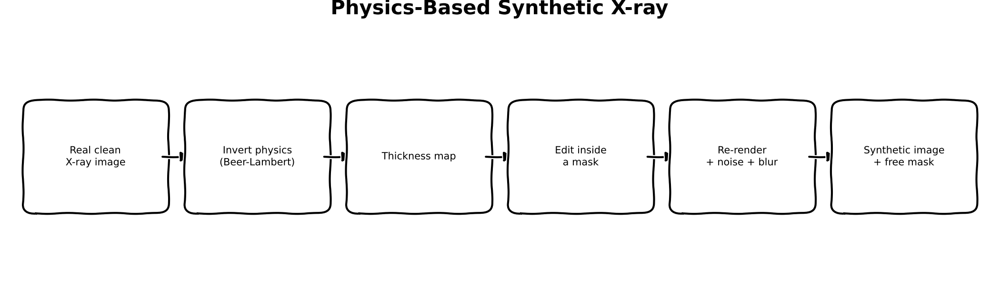
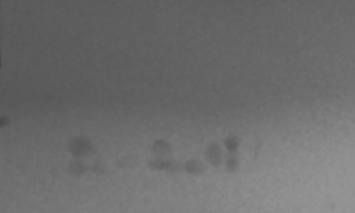
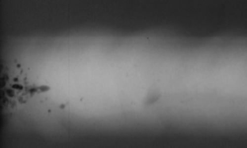
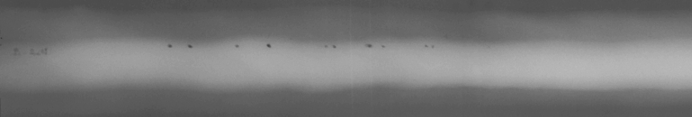

:::{.callout-tip}
This post is part of the [Synthetic Data Series](index.qmd) series.
:::

## The problem

Industrial X-ray inspection has a data problem that's the mirror image of most computer vision
problems: good images are everywhere, bad ones are rare. A production line that's doing its job
produces mostly defect-free welds, castings, and solder joints -- which is great for the factory
and terrible for training a defect detector. Rare defect classes (a hairline crack, a small void,
a bent lead) might show up a handful of times a year, nowhere near enough to teach a model what
one looks like in every lighting, material, and geometry combination it needs to generalize
across.

The standard workaround is manual: an engineer crops a real defect out of one image and pastes it
into a good image, maybe blends the edges a bit so it doesn't look glued on. It works, sort of,
and it's the Part 4 baseline this series will come back to. But it has an honest failure mode --
paste a crack from an image lit one way onto an image lit another way and the physics doesn't
match: the crack's local contrast and noise texture belong to the source image, not the target.

This post asks a more literal question first: what if we didn't paste pixels, but instead undid
the *physics* that produced them, edited the thing the physics actually operates on, and then
re-ran the physics forward again? No CAD model of the part, no access to an actual X-ray source
or detector -- none of that is available here. What *is* available is a real public dataset
([GDXray](https://github.com/computervision-xray-testing/GDXray)) of real X-ray images with real
pixel statistics baked into them, which turns out to be enough to fit every physical parameter we
need directly from the pixels themselves.

## Explain it like I'm five



Think of an X-ray image like a shadow puppet show. The light (X-rays) shines through your hand
(the part being inspected) and lands on the wall (the detector) as a shadow. Thicker or denser
parts of your hand block more light, so they cast a darker shadow; thin gaps let more light
through, so they're brighter.

Now say you want a shadow of a hand with a *cut* in one finger, but you don't have a real cut
hand to shine light through. Here's the trick: take a photo of the *shadow* you already have (a
real X-ray image), and mathematically work backwards to guess how thick the hand must have been
at every point to cast that exact shadow (step 2 in the diagram -- inverting the physics gets you
a "thickness map"). Now you can *edit the thickness map directly* -- carve a thin groove into it
right where you want the cut to be (step 4, editing inside a mask). Then you shine the (simulated)
light through your edited thickness map all over again and see what shadow it casts now (step 5 --
re-render, add the blur and graininess a real detector would add). You end up with a brand-new
shadow that has a scar in exactly the shape you drew, and because you know exactly which pixels
you carved, you get a perfect answer key (a segmentation mask) completely for free (step 6) --
for the scar *you* drew, at least; if the original hand already had a scratch on it, that one is
still there and still not on your answer key. No new hand needed -- just a shadow, some math, and
an eraser.

## Explain it like I'm a data scientist

The physics is the [Beer-Lambert law](https://en.wikipedia.org/wiki/Beer%E2%80%93Lambert_law),
the same attenuation model that governs how light dims passing through any absorbing medium:

$$I = I_0 \, e^{-\mu t}$$

where $I_0$ is the unattenuated beam intensity, $\mu$ is the material's linear attenuation
coefficient, and $t$ is the material thickness the beam travels through. A single 2D X-ray
projection measures $I$ at every pixel and nothing else -- $\mu$ and $t$ never appear separately
in that equation, only as the product $\mu t$ in the exponent. Given one image, there is no way
to recover $\mu$ (what the material is) and $t$ (how thick it is) individually; you'd need either
a known material (so $\mu$ is fixed and $t$ falls out) or multiple views / multiple X-ray energies
(spectral or tomographic imaging) to separate them.

Concretely: a thin, very dense void and a thick, mildly-attenuating gap can produce the *exact
same* pixel intensity if their $\mu t$ products match. Since we're working from single 2D
projections of GDXray images with no access to a CAD model or known material properties, the
honest move is to stop pretending we can recover $\mu$ and $t$ separately, and instead work
entirely in **attenuation-depth units** -- the combined quantity $\mu t$ (call it $d$, in
"attenuation lengths"). Rewriting Beer-Lambert in terms of $d$:

$$I = I_0 \, e^{-d} \qquad\Longleftrightarrow\qquad d = -\ln(I / I_0)$$

That's the entire invertible core of the pipeline: given a real image and a fitted $I_0$, invert
every pixel to its attenuation depth; edit the attenuation-depth map (a defect that removes
material lowers $d$ locally, since less material means less attenuation and hence a brighter
pixel -- or raises it, if the defect is itself an attenuating inclusion, more on that sign in the
calibration section below); then forward-render the edited depth map back to intensity with the
same equation run the other way. Everything downstream of that inversion -- blur, photon noise --
is modeled and calibrated separately, and is covered next.

## Jargon buster

| Term | Plain-English meaning |
|---|---|
| Attenuation depth (mu·t) | How much an X-ray beam is dimmed passing through material -- the only thing a single 2D X-ray image actually tells you, since attenuation coefficient (mu) and thickness (t) can't be separated without spectral or multi-view data |
| Beer-Lambert law | The physics equation for that dimming: I = I0 * exp(-mu*t) |
| Photon-transfer curve | Plotting noise variance against signal mean to characterize a photon-limited (Poisson) sensor |
| Line-spread function | How a sharp edge gets smeared out by geometric and detector blur -- fitting a Gaussian to it recovers the blur width |
| GDXray | Public X-ray dataset of castings, welds, baggage, and more, with defect ground truth |

## Architecture

The pipeline lives in a small `synth_xray` package, traced here from the real function calls in
`generate_examples.py` and `synth_xray/pipeline.py`:

```{mermaid}
flowchart TB
    subgraph DATA["synth_xray.data"]
        DL["download_and_extract('Welds', ...)\n(gdown, Google Drive mirror --\nGDXray's original Dropbox links are dead)"]
        DL --> SD["find_series_dirs\n-> series_dir (W0001)"]
        SD --> GT["find_groundtruth_file\n-> ground_truth.txt"]
        SD --> IMGS["find_images_in_series\n-> images[0] = defect image,\nimages[1] = base image"]
    end

    subgraph GROUNDTRUTH["synth_xray.groundtruth"]
        GT --> PB["parse_gdxray_bboxes\n(col_min col_max row_min row_max)\n-> dict keyed by image_id"]
        PB --> BM["bbox_to_mask\n(boxes for images[0]'s image_id)\n-> roi_mask"]
        IMGS --> RO["refine_mask_otsu\n(defect_image, roi_mask) -> defect_mask"]
        BM --> RO
    end

    subgraph CALIBRATION["synth_xray.calibration (fit from real pixels)"]
        IMGS --> I0["estimate_I0\n(99th percentile of defect image) -> I0\n(cancels out of the round trip)"]
        RO --> DELTA["fit_defect_attenuation_depth\n(defect image; background = 25 px ring\naround roi_mask, not whole image)\n-> delta"]
        IMGS --> NOISE["fit_noise_model\n(base image, dense 20x20 patches)\n-> a, b"]
        IMGS --> BLUR["fit_blur_sigma\n(base image edge profile)\n-> raw sigma"]
    end

    BLUR -->|"raw sigma"| CLAMP["generate_examples.py (script, not library):\naccept [0.5, 5] px,\nfallback 1.5 px if out of range"]

    subgraph EDIT["synth_xray.defect_edit"]
        CRACK["generate_crack_mask\n(random-walk crack shape)\n-> synthetic_mask"]
    end

    subgraph PIPELINE["synth_xray.pipeline.synthesize_defect_image"]
        INV["physics.invert_to_attenuation_depth\n(clean_image arg = base image, I0) -> depth"]
        EDITD["defect_edit.edit_attenuation_depth\n(depth, synthetic_mask, delta) -> edited_depth"]
        REND["physics.render_xray\n(edited_depth, I0) -> rendered"]
        BLURF["physics.apply_gaussian_blur\n(rendered, blur_sigma) -> blurred"]
        NOISEF["physics.apply_photon_noise\n(blurred, gain) -> synthetic_image"]
        INV --> EDITD --> REND --> BLURF --> NOISEF
    end

    IMGS -->|"images[1] (base image)"| INV
    I0 --> INV
    I0 --> REND
    DELTA --> EDITD
    CRACK --> EDITD
    NOISE --> NOISEF
    CLAMP -->|blur_sigma| BLURF
    NOISEF --> OUT["synthetic_image, synthetic_mask\n(free ground truth)"]

    style PIPELINE fill:#2c5,color:#000
    style CLAMP fill:#eb4,color:#000
```

`synthesize_defect_image` itself is a five-line function -- `invert_to_attenuation_depth` on the
whole image, `edit_attenuation_depth` inside the mask, `render_xray` on the whole edited depth map,
then blur and noise applied globally. That "whole image" detail matters and comes back in the
results section below.

## Calibrating from real images

Every number the pipeline needs is fit from real pixel statistics on a real GDXray image, not
assumed or hand-picked. The series used is **W0001** from GDXray's Welds group -- the first weld
radiograph series that ships a `ground_truth.txt` file.

Two of that series' ten radiographs get used, and *which parameter comes from which image* turns
out to matter more than it looks:

- `W0001_0001.png` is the **defect image**. It has annotated ground-truth defect boxes, so it's
  what the defect physics -- the attenuation-depth signature `delta` -- is fit from. You need a
  real, annotated defect to measure what a defect actually does to attenuation depth, and that's
  the one thing this image is for.
- `W0001_0002.png` is the **base image**: the radiograph the synthetic crack gets injected into.
  So it's what the *sensor and acquisition* characteristics -- the noise model and the blur width
  -- are fit from. Those are properties of one specific capture (exposure, dose, detector
  settings), not of defect physics.

Getting that split wrong is easy and quietly expensive. An earlier version of this pipeline fit
*everything*, noise and blur included, on the defect image and then applied it to the base image.
The output was measurably 3.7x grainier than its own source (median local standard deviation over
20x20 tiles: 5.90 versus the base image's 1.58) -- a synthetic image that looks like a *different*
X-ray machine took it. Fitting noise and blur where they'll actually be applied brings that to
1.56x (2.47 versus 1.58), which is about as close as you get while still adding a fresh, honest
noise realization on top.

Running `generate_examples.py` prints the actual calibration report:

```
series: W0001
defect image (delta fit from): W0001_0001.png
base image (noise/blur fit from, synthesized onto): W0001_0002.png
fitted I0: 245.00
fitted attenuation-depth delta: -0.3494
fitted noise model: variance = 0.036 * mean + 0.441
fitted blur sigma: 2.121 px
```

A few things worth calling out, because they're the kind of thing that looks wrong until you
check it against the real image:

- **$I_0 = 245$**, close to the top of the 0-255 range. That's consistent with the 99th-percentile
  brightest pixels in this image being the bright weld-bead band, close to saturation -- a
  physically sane place for the "unattenuated beam" estimate to land. It's also the one parameter
  whose exact value doesn't change the output: `render_xray` and `invert_to_attenuation_depth` are
  exact algebraic inverses ($I_0 e^{-(-\ln(I/I_0))} = I$), so $I_0$ cancels straight out of the
  round trip, and `delta` is a *difference* of two log-depths, so it cancels there too. $I_0$ only
  sets the scale of the intermediate depth map.
- **delta is negative** (-0.3494). The docstring intuition for a void/crack is "material missing
  → less attenuation → brighter pixel," which would be a *positive* delta. This particular weld
  image's defects are small pores that render *darker* than their surroundings, not brighter --
  confirmed by eye (a string of small dark dots along the bright band in the real image) as well
  as by the fit. `edit_attenuation_depth` handles a negative delta correctly (it *increases*
  attenuation depth under the mask, darkening those pixels), so this isn't a bug to fix -- it's
  the real, dataset-specific polarity, and a good reminder that "defects are brighter" is a
  convenient default, not a law of physics.
- **What counts as "background" for that delta fit is a real choice, not a detail.** `delta` is
  the median attenuation depth of the background minus that of the defect, and the obvious
  "background" -- every pixel outside the defect box -- is wrong here for the same reason the
  noise quadrants below are wrong: these panoramas have a strong large-scale brightness gradient,
  so a whole-image median averages the dark plate and the bright weld bead together and has
  nothing to do with the material immediately around *this* defect. Measured on the real image, a
  whole-image background gives `delta = -0.4925`; a local ring dilated 25 px around the defect box
  gives `-0.3494`. Same polarity, roughly 1.4x less magnitude. The value does keep drifting as you
  tighten the ring (-0.2412 at 10 px, -0.1974 at 5 px), which is worth saying out loud: there is no
  single "true" delta here, only a background reference you pick and then state. A 25 px ring is
  the compromise used -- local enough to share the defect's gradient context, wide enough (2,720
  px) for a stable median.
- **The noise model needed a fix to the naive approach.** The obvious way to sample "flat"
  patches for a photon-transfer-curve fit is a 2x2 grid of quadrants. These images have a strong,
  slow brightness gradient (the bright weld-bead band sweeping across an otherwise dark plate),
  so each quadrant patch spans most of that gradient -- its variance reflects the gradient, not
  pixel-level photon noise. Fitting on quadrants predicted a standard deviation roughly an order
  of magnitude above the image's real local standard deviation; applying that everywhere made the
  synthetic image visibly over-grainy. Switching to a dense grid of small 20x20 patches (each one
  small enough to sit inside a single locally-flat region) gives the reported
  `variance = 0.036*mean + 0.441`, which predicts a standard deviation of about 2.1 gray levels at
  the base image's typical brightness -- close to its measured 1.58, with the small remaining gap
  being real large-scale structure that even 20x20 patches can't entirely dodge.
- **Blur sigma needed a sanity clamp, in both directions.** There is no genuinely sharp step edge
  in these images to measure, and the step-edge fit fails in two opposite ways depending on where
  you put the profile: on a profile riding the large-scale gradient it returns 10-40 px (a blur
  that large would smear the synthetic crack, about 11x11 px, down to invisibility), and on a
  locally flat profile it degenerates to a near-zero sigma that `scipy` can't even estimate a
  covariance for (i.e. no detector unsharpness at all). Neither is a measurement. Real
  detector/geometric unsharpness at this resolution is a sub-pixel-to-few-pixel affair, so
  anything outside `[0.5, 5]` px is treated as a failed fit and falls back to a constant 1.5 px.
  The profile actually used -- taken through the site on the base image where the crack is about
  to be injected, which is where the blur has to be right -- lands at **2.121 px**, inside the
  plausible band, so it's a real fit rather than the fallback.

Three more real-world details worth flagging rather than hiding, since they're the kind of thing
that trips up anyone reproducing this: GDXray's original Dropbox download links are entirely
dead (verified across all five groups); the working source is a maintainer-posted Google Drive
replacement, downloaded with `gdown`. And GDXray's ground-truth text files order their columns as
`image_id col_min col_max row_min row_max` -- initially assumed to be
`image_id row_min col_min row_max col_max`, which silently produced nonsense boxes until it was
caught by checking parsed box extents against each image's real pixel dimensions and
cross-checking against a third-party open-source GDXray parser. A third, subtler one: a series
ships a *single* `ground_truth.txt` for all its images, with the image each box belongs to given
only by a leading `image_id` column. Returning a flat list of boxes from that file works right up
until the file isn't sorted the way you assumed, so `parse_gdxray_bboxes` returns a dict keyed by
`image_id` and callers ask for the boxes of the image they actually loaded (file `W0001_000N.png`
is `image_id` N -- verified by checking every one of the 10 ids' coordinate extents against its
same-numbered PNG's real dimensions). All three are the unglamorous parts of working with a real,
imperfectly-maintained public dataset, and they're handled in `synth_xray/data.py` and
`synth_xray/groundtruth.py`.

## Real code

The package is a small `uv`-managed project at `notebooks/synthetic-data-xray/`, four modules
doing one job each.

```{.python filename="notebooks/synthetic-data-xray/src/synth_xray/physics.py"}
"""Beer-Lambert forward/inverse rendering, blur, and photon-noise models."""
import numpy as np
from scipy.ndimage import gaussian_filter


def render_xray(attenuation_depth: np.ndarray, I0: float) -> np.ndarray:
    """Forward-render an attenuation-depth map (mu*t, in attenuation lengths) to intensity."""
    return I0 * np.exp(-attenuation_depth)


def invert_to_attenuation_depth(image: np.ndarray, I0: float, eps: float = 1e-6) -> np.ndarray:
    """Invert Beer-Lambert to recover the attenuation-depth map implied by a real image."""
    ratio = np.clip(image / I0, eps, None)
    return -np.log(ratio)


def apply_gaussian_blur(image: np.ndarray, sigma: float) -> np.ndarray:
    """Apply detector/geometric-unsharpness blur as a Gaussian filter."""
    if sigma <= 0:
        return image
    return gaussian_filter(image, sigma=sigma)


def apply_photon_noise(
    image: np.ndarray, gain: float, rng: np.random.Generator | None = None
) -> np.ndarray:
    """Apply photon-limited (Poisson) noise: variance scales with signal, per `gain` electrons/count."""
    rng = rng if rng is not None else np.random.default_rng()
    photon_counts = np.clip(image, 0, None) / gain
    noisy_counts = rng.poisson(photon_counts).astype(np.float64)
    return noisy_counts * gain
```

```{.python filename="notebooks/synthetic-data-xray/src/synth_xray/calibration.py"}
"""Fitting physics-model parameters from real GDXray image statistics."""
import numpy as np
from scipy.optimize import curve_fit

from synth_xray.physics import invert_to_attenuation_depth


def estimate_I0(image: np.ndarray, percentile: float = 99.0) -> float:
    """Estimate the unattenuated beam intensity as a high percentile of the image."""
    return float(np.percentile(image, percentile))


def fit_defect_attenuation_depth(
    image: np.ndarray, defect_mask: np.ndarray, background_mask: np.ndarray, I0: float
) -> float:
    """Fit the attenuation-depth difference (background - defect) a real defect represents.

    Positive for a void/crack (material missing -> less attenuation -> brighter pixels).
    """
    depth = invert_to_attenuation_depth(image, I0)
    background_depth = float(np.median(depth[background_mask]))
    defect_depth = float(np.median(depth[defect_mask]))
    return background_depth - defect_depth


def fit_noise_model(image: np.ndarray, patch_masks: list[np.ndarray]) -> tuple[float, float]:
    """Fit variance = a*mean + b (photon-transfer curve) across flat patches."""
    means = np.array([image[mask].mean() for mask in patch_masks])
    variances = np.array([image[mask].var() for mask in patch_masks])
    a, b = np.polyfit(means, variances, deg=1)
    return float(a), float(b)


def _gaussian_cdf_edge(x: np.ndarray, amplitude: float, center: float, sigma: float, offset: float) -> np.ndarray:
    from scipy.special import erf
    return offset + amplitude * 0.5 * (1 + erf((x - center) / (sigma * np.sqrt(2))))


def fit_blur_sigma(edge_profile: np.ndarray) -> float:
    """Fit a Gaussian-blurred step edge to a 1D intensity profile; return sigma in pixels."""
    x = np.arange(edge_profile.size, dtype=float)
    amplitude_guess = edge_profile[-1] - edge_profile[0]
    center_guess = x[np.argmin(np.abs(edge_profile - edge_profile.mean()))]
    p0 = [amplitude_guess, center_guess, 2.0, edge_profile[0]]
    popt, _ = curve_fit(_gaussian_cdf_edge, x, edge_profile, p0=p0, maxfev=5000)
    return float(abs(popt[2]))
```

```{.python filename="notebooks/synthetic-data-xray/src/synth_xray/defect_edit.py"}
"""Synthetic defect shape generation and attenuation-depth map editing."""
import numpy as np
from skimage.draw import disk


def generate_crack_mask(
    image_shape: tuple[int, int],
    start: tuple[int, int],
    length: int,
    thickness: int = 1,
    rng: np.random.Generator | None = None,
) -> np.ndarray:
    """Generate a thin random-walk crack-shaped mask starting at `start`."""
    rng = rng if rng is not None else np.random.default_rng()
    mask = np.zeros(image_shape, dtype=bool)
    row, col = start
    radius = max(thickness - 1, 0)

    # Mark the starting position
    if radius > 0:
        rr, cc = disk((row, col), radius + 1, shape=image_shape)
        mask[rr, cc] = True
    else:
        mask[row, col] = True

    for _ in range(length):
        row = int(np.clip(row + rng.integers(-1, 2), 0, image_shape[0] - 1))
        col = int(np.clip(col + rng.integers(-1, 2), 0, image_shape[1] - 1))
        if radius > 0:
            rr, cc = disk((row, col), radius + 1, shape=image_shape)
            mask[rr, cc] = True
        else:
            mask[row, col] = True
    return mask


def edit_attenuation_depth(attenuation_depth: np.ndarray, mask: np.ndarray, delta: float) -> np.ndarray:
    """Reduce attenuation depth under `mask` by `delta` (a void/crack: material is missing)."""
    edited = attenuation_depth.copy()
    edited[mask] = np.clip(edited[mask] - delta, 0.0, None)
    return edited
```

```{.python filename="notebooks/synthetic-data-xray/src/synth_xray/pipeline.py"}
"""End-to-end physics-based synthetic defect image generation."""
import numpy as np

from synth_xray.physics import (
    render_xray,
    invert_to_attenuation_depth,
    apply_gaussian_blur,
    apply_photon_noise,
)
from synth_xray.defect_edit import edit_attenuation_depth


def synthesize_defect_image(
    clean_image: np.ndarray,
    I0: float,
    defect_mask: np.ndarray,
    delta: float,
    noise_gain: float,
    blur_sigma: float,
    rng: np.random.Generator | None = None,
) -> tuple[np.ndarray, np.ndarray]:
    """Invert a real clean image to attenuation depth, inject a defect, and re-render.

    Steps: invert -> edit under mask -> forward render -> blur -> photon noise.
    Returns (synthetic_image, defect_mask) so the mask travels with its image as
    free ground truth.
    """
    depth = invert_to_attenuation_depth(clean_image, I0)
    edited_depth = edit_attenuation_depth(depth, defect_mask, delta)
    rendered = render_xray(edited_depth, I0)
    blurred = apply_gaussian_blur(rendered, blur_sigma)
    noisy = apply_photon_noise(blurred, gain=noise_gain, rng=rng)
    return noisy, defect_mask
```

Every function above is real, tested code from `notebooks/synthetic-data-xray/src/synth_xray/`
(25/25 tests passing), run for real against the downloaded GDXray Welds data by
`notebooks/synthetic-data-xray/generate_examples.py` to produce the images below.

## Results

::: {layout-ncol=3}





:::

The synthetic image holds up at a glance: the overall gradient structure (dark plate, bright
weld-bead band) matches the base image, the naturally-occurring real pore dots that were already
in the base image pass straight through the invert-edit-render round trip, and the grain now sits
at 2.47 median local standard deviation against the base image's 1.58 -- a 1.56x ratio, versus the
3.74x of the earlier version that fit noise on the wrong image. Zooming into the injected crack's
location shows a visible dark blob distinct from the surrounding noise texture: in the rendered
image before blur and noise it carries about 26 gray levels of contrast, and in the final saved PNG
the mask pixels average 70.5 against a surrounding-window mean of 87.8 with a local standard
deviation of 2.8 -- roughly a 6-sigma separation, so it survives the noise it's buried in. The
crack itself is small (an 11x11 pixel random walk) relative to the full ~4900-pixel-wide panorama,
so it reads as a small, easy-to-miss local flaw rather than a dramatic feature -- which is actually
consistent with how this dataset's own real pore defects look.

**The "real base image" is not actually a clean image, and that limits the free-ground-truth
claim.** It's worth being blunt about this, because the pitch for physics-based synthesis is "you
get a perfect segmentation mask for free" and that sentence has a footnote. There is no
defect-free radiograph in GDXray's W0001 series: all ten images carry annotated defects, 641 boxes
between them, and `W0001_0002.png` -- the base image the crack is injected into, and the one
`synthesize_defect_image` politely calls `clean_image` -- has 37 real annotated defects of its own.
So the mask this pipeline hands back is ground truth for *the one synthetic crack it just drew*,
and nothing else. The 37 pre-existing real defects in the same frame are still there, still
unlabeled by this mask, and a detector trained on that mask alone would be told they are
background. In practice you'd merge the synthetic mask with the base image's own shipped ground
truth, or start from a base image you've actually verified is clean. Neither is free, and the
honest version of the claim is narrower than the headline: the mask is free *for the defect you
injected*.

A second honest caveat that's important not to gloss over: this is **not** a surgical, local edit.
`synthesize_defect_image` inverts, re-renders, re-blurs, and re-samples fresh Poisson noise for
the *entire* image, not just the pixels under the defect mask. The signal (attenuation depth)
outside the mask is unchanged, but the noise realization outside the mask is a fresh random draw,
not a copy of the base image's own noise -- so the base/synthetic pair differs everywhere at
low magnitude, not only where the defect was injected. In practice that difference is small
enough not to be visually obvious next to the actual defect, but it means a naive pixel-diff
between base and synthetic images is not itself a ground-truth defect mask -- the real mask
returned by `synthesize_defect_image` is what to use, not a diff.

Where the physics-only approach visibly falls short: the injected crack is geometrically correct
(a thin random-walk shape with the right local contrast and noise texture) but has no learned
notion of what a *real* crack or pore looks like beyond that -- no branching, no texture beyond
what the blur and noise models provide, no correlation with the surrounding material's actual
microstructure. It's a physically-consistent placeholder shape, not a learned one. That's exactly
the bar Part 2's diffusion fine-tune needs to clear: can a model that's actually seen real defect
textures do better than physics alone at the *shape and texture* of the defect, while still
respecting the same underlying image statistics this post calibrated by hand?

Known follow-up, not blocking for this post: the three PNGs above are large, wide-aspect real
GDXray panoramas (up to ~1.9MB for the synthetic one) -- fine for `quarto render`, but worth a
size check and possible downscaling before `quarto publish`, given quarto.pub's upload-size
sensitivity.

## What's next

Part 2 fine-tunes a mask-conditioned diffusion model on the same real GDXray defect crops --
does learning the texture from data beat re-rendering it from physics?
