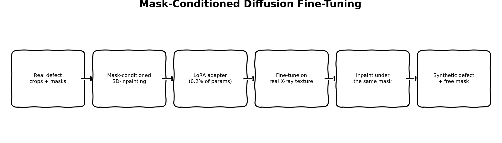
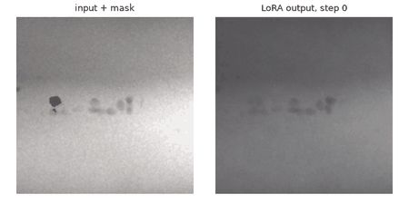

:::{.callout-tip}
This post is part of the [Synthetic Data Series](index.qmd) series.
:::

## The problem

[Part 1](01-physics-based-xray-simulation.qmd) inverted the Beer-Lambert law on a real X-ray
image, edited a hand-drawn crack shape into the resulting thickness map, and re-rendered it --
getting the sensor noise and attenuation statistics right *by calibration*, because the physics
model is explicit about what those statistics should be. What it can't do is make the defect
itself look like anything other than a random-walk shape with plausible contrast: there's no
learned notion of what a *real* crack's branching, texture, or micro-structure looks like, because
nothing in that pipeline has ever seen one.

This post asks the mirror-image question. Instead of modeling the physics and drawing the defect
by hand, what if a generative model just learned the defect *texture* directly from real examples?
Stable Diffusion's inpainting variant is built for exactly this shape of problem -- given an image
and a mask, generate plausible content for the masked region, conditioned on everything outside
it. Fine-tune it on real GDXray weld defects specifically, and see whether it does better than
physics at the one thing physics has no data-driven opinion about: what a defect actually looks
like.

## Explain it like I'm five



Imagine an artist who's really good at filling in torn-out pieces of any photograph -- give them a
photo with a hole cut in it, and they'll paint something plausible into the hole that matches the
surrounding picture. That's what a mask-conditioned inpainting model already does, out of the box,
for *any* kind of photo.

Now imagine you want that artist to fill in holes with a very specific kind of scribble: real
X-ray weld defects, which they've never actually seen before -- they've only ever practiced on
everyday photos. So you show them a stack of real X-ray images with real defects circled, over and
over, and let them adjust just a *tiny* part of their technique (not retrain from scratch -- that
would take forever and erase everything else they already know how to draw). After a while, when
you cut a hole in a new X-ray image and ask them to fill it in, they lean a little more toward
"weld defect" and a little less toward "generic photo texture." The mask tells them exactly where
to draw; the practice changes what they draw there.

## Explain it like I'm a data scientist

A standard denoising diffusion model learns to reverse a fixed noising process: take a real image
$x_0$, add Gaussian noise over $T$ steps to get $x_t$, and train a network $\epsilon_\theta$ to
predict the noise $\epsilon$ that was added, given $x_t$ and the timestep $t$:

$$\mathcal{L} = \mathbb{E}_{x_0, \epsilon, t} \left[ \| \epsilon - \epsilon_\theta(x_t, t) \|^2 \right]$$

`stable-diffusion-v1-5/stable-diffusion-inpainting` is the same objective with one architectural
change: $\epsilon_\theta$'s UNet takes 9 input channels instead of 4 -- the usual 4-channel noisy
latent, plus a 1-channel downsampled mask, plus the 4-channel latent of the *masked* image (the
real image with the mask region blacked out before encoding). The mask and masked-image channels
are the model's only view of "what's actually there" outside the hole; conditioning on them at
every denoising step is what makes the output respect the unmasked context instead of
hallucinating a new image from scratch.

Fine-tuning a 981M-parameter pipeline (UNet + VAE + text encoder) on 338 real examples end-to-end
would overfit badly and cost far more compute than this demo needs. LoRA sidesteps both problems:
freeze every original weight, and for each targeted linear layer $W$, add a trainable low-rank
update $BA$ (rank $r{=}8$ here) so the effective weight becomes $W + BA$. Only $A$ and $B$ train;
$W$ never moves. Targeting just the UNet's attention projection layers
(`to_q`/`to_k`/`to_v`/`to_out.0`) means **1,594,368 of 861,129,732 UNet parameters actually
train -- 0.185%.**

## Jargon buster

| Term | Plain-English meaning |
|---|---|
| Mask-conditioned inpainting | A diffusion UNet with extra input channels for a mask and a masked-image latent, so it's explicitly told what to fill in and what to leave alone |
| LoRA (Low-Rank Adaptation) | Freeze a weight matrix, add a small trainable low-rank update on top -- fine-tunes a tiny fraction of parameters instead of the whole model |
| VAE latent space | Stable Diffusion doesn't diffuse raw pixels -- an autoencoder compresses images 8x spatially first; diffusion happens in that compressed space, then decodes back to pixels |
| DDPM forward process | The "add noise" half of denoising diffusion: progressively noise a real image toward pure Gaussian noise at a randomly sampled timestep; the model predicts exactly the noise that was added |
| Classifier-free guidance | Normally a diffusion model samples with and without the prompt and extrapolates toward the prompted direction; `guidance_scale=1.0` disables this, halving inference cost |
| Attention projection layers (`to_q`/`to_k`/`to_v`/`to_out.0`) | The four linear layers inside a transformer attention block -- the standard, minimal-footprint target for LoRA on a diffusion UNet |

## Architecture -- traced from the real function calls

```{mermaid}
flowchart TB
    subgraph DATA["synth_xray.diffusion_data"]
        BD["build_defect_dataset(series_dir)\n-> 338 real (image, mask) crops\n(reuses Part 1's data.py + groundtruth.py\non the same real Welds/W0001 boxes)"]
        BD --> RGB["to_rgb_pil / to_mask_pil\n-> 512x512 RGB image, single-channel mask"]
    end

    subgraph SETUP["train_diffusion_lora.py -- setup"]
        LOAD["StableDiffusionInpaintPipeline.from_pretrained\n(stable-diffusion-v1-5/stable-diffusion-inpainting)"]
        LOAD --> FREEZE["freeze vae, text_encoder, unet"]
        FREEZE --> LORA["unet.add_adapter(LoraConfig(r=8, alpha=16,\ntarget_modules=[to_k,to_q,to_v,to_out.0]))\n-> 1.59M / 861M trainable (0.185%)"]
    end

    RGB --> LOOP

    subgraph LOOP["per training step (200 real steps)"]
        ENC["vae.encode(image), vae.encode(masked_image)\n-> latents, masked_latents (frozen VAE, no_grad)"]
        ENC --> NZ["noise_scheduler.add_noise\n(random timestep, real DDPM forward process)"]
        NZ --> CAT["cat([noisy_latents, mask_latent, masked_latents])\n-> 9-channel UNet input"]
        CAT --> UNET["unet(...).sample -> predicted noise"]
        UNET --> LOSS["MSE(predicted noise, real sampled noise)\nbackward -> optimizer.step() (LoRA params only)"]
    end

    LORA --> LOOP
    LOOP -->|"every 10 steps"| RENDER["_render_frame:\nreal pipe(...) inference call\non a fixed held-out example\n-> GIF frame"]
    LOOP -->|"200 steps done"| SAVE["lora_weights.pt\n(state_dict entries containing 'lora')"]

    subgraph COMPARE["generate_diffusion_comparison.py"]
        MASK2["generate_crack_mask(..., rng=default_rng(0))\n-- Part 1's exact same call -> identical synthetic crack mask"]
        SAVE --> LOADLORA["add_adapter + load_state_dict(lora_weights.pt)"]
        MASK2 --> INFER["pipe(prompt, image, mask_image,\nnum_inference_steps=30) -> diffusion output"]
        LOADLORA --> INFER
        INFER --> CROP["Part 1's exact same crop windows\n-> synth-xray-defect-diffusion.png / -zoom.png"]
    end
```

## Real code

### Building the real training set

```{.python filename="notebooks/synthetic-data-xray/src/synth_xray/diffusion_data.py"}
"""Real (image, mask) defect-inpainting training pairs from GDXray ground truth.

Reuses Part 1's exact data/ground-truth utilities (`data.py`, `groundtruth.py`) --
same real Welds series, same box-to-mask logic -- so Part 2's LoRA fine-tune trains
on the identical real defects Part 1's physics pipeline was calibrated against.
"""
from __future__ import annotations

import pathlib

import numpy as np
from PIL import Image

from synth_xray.data import find_groundtruth_file, find_images_in_series
from synth_xray.groundtruth import bbox_to_mask, parse_gdxray_bboxes, refine_mask_otsu

# SD-inpainting's native resolution -- cropping directly at this size avoids any
# resize step between the real pixel data and what the model actually trains on.
# These weld panoramas (e.g. 835x4919) are comfortably larger than 512 in both
# dimensions, so this never needs to upsample.
CROP_SIZE = 512
# Margin (px) a defect box must fit inside of, so the crop always has real
# non-defect context surrounding the mask, not just the defect itself.
PAD = 40


def image_id_from_path(path: pathlib.Path) -> int:
    """Map a GDXray series image filename to its ground-truth `image_id` column.

    Same convention verified in `generate_examples.py`: `<SERIES>_<NNNN>.png` -> N.
    """
    return int(path.stem.split("_")[-1])


def load_gray(path: pathlib.Path) -> np.ndarray:
    return np.array(Image.open(path).convert("L"), dtype=np.float64)


def crop_around_box(
    image: np.ndarray, box: tuple[int, int, int, int], crop_size: int = CROP_SIZE
) -> tuple[np.ndarray, tuple[int, int]]:
    """Crop a fixed-size square window centered on a defect box, clamped to image bounds."""
    row_min, col_min, row_max, col_max = box
    cy, cx = (row_min + row_max) // 2, (col_min + col_max) // 2
    half = crop_size // 2
    r0 = max(0, min(cy - half, image.shape[0] - crop_size))
    c0 = max(0, min(cx - half, image.shape[1] - crop_size))
    return image[r0 : r0 + crop_size, c0 : c0 + crop_size], (r0, c0)


def build_defect_dataset(series_dir: pathlib.Path) -> list[dict]:
    """Real (image crop, defect mask) pairs for every ground-truth box in a GDXray series.

    Each returned dict: {"image": float64 (CROP_SIZE, CROP_SIZE) grayscale array,
    "mask": bool (CROP_SIZE, CROP_SIZE) array, "image_id": int, "box": original bbox}.
    """
    gt_file = find_groundtruth_file(series_dir)
    if gt_file is None:
        return []
    boxes_by_image = parse_gdxray_bboxes(gt_file)

    examples: list[dict] = []
    for img_path in find_images_in_series(series_dir):
        image_id = image_id_from_path(img_path)
        boxes = boxes_by_image.get(image_id, [])
        if not boxes:
            continue
        image = load_gray(img_path)
        if image.shape[0] < CROP_SIZE or image.shape[1] < CROP_SIZE:
            continue  # panorama too small for a full-resolution crop

        for box in boxes:
            row_min, col_min, row_max, col_max = box
            if row_min < 0 or col_min < 0:
                # A handful of real GDXray boxes come out as -1 on one edge (the
                # raw annotation sits at the image boundary, and the 1-indexed ->
                # 0-indexed `- 1` in parse_gdxray_bboxes takes an already-0 raw
                # value to -1). A negative slice start wraps around in Python and
                # silently produces an empty (or wrong) mask rather than raising,
                # so this has to be caught explicitly rather than left to fail
                # downstream.
                continue
            if (row_max - row_min) < 2 or (col_max - col_min) < 2:
                continue  # degenerate/annotation-noise box
            if (row_max - row_min) > CROP_SIZE - 2 * PAD or (col_max - col_min) > CROP_SIZE - 2 * PAD:
                continue  # defect too large to sit inside a padded crop

            crop, (r0, c0) = crop_around_box(image, box, CROP_SIZE)
            local_box = (row_min - r0, col_min - c0, row_max - r0, col_max - c0)
            roi_mask = bbox_to_mask(crop.shape, local_box)
            if roi_mask.sum() == 0:
                continue  # box fell outside the crop window
            defect_mask = refine_mask_otsu(crop, roi_mask)
            if defect_mask.sum() < 4:
                continue  # Otsu split degenerated to almost nothing

            examples.append({"image": crop, "mask": defect_mask, "image_id": image_id, "box": box})

    return examples


def to_rgb_pil(gray: np.ndarray) -> Image.Image:
    """Grayscale float array -> 3-channel RGB PIL image (SD expects 3 input channels)."""
    normalized = np.clip(gray, 0, 255).astype(np.uint8)
    return Image.fromarray(np.stack([normalized] * 3, axis=-1))


def to_mask_pil(mask: np.ndarray) -> Image.Image:
    """Boolean mask -> single-channel 'L' PIL image (0 = keep, 255 = inpaint)."""
    return Image.fromarray((mask.astype(np.uint8) * 255))
```

Run against the real data: **338 usable (image, mask) pairs** out of 641 raw ground-truth boxes in
series W0001 -- most of the loss is the negative-coordinate edge case and the size filters above,
not a limitation of the underlying data.

### LoRA fine-tuning loop

```{.python filename="notebooks/synthetic-data-xray/train_diffusion_lora.py"}
"""Real LoRA fine-tune of a mask-conditioned Stable Diffusion inpainting model on
real GDXray weld defect crops + masks -- Synthetic Data series Part 2.

The question this answers: does a generative model that has actually seen real
X-ray defect *texture* produce better synthetic defects than Part 1's
physics-based simulation, which has no learned texture prior at all -- only a
calibrated attenuation/noise/blur model?

What's real here, not pseudocode:
- `stable-diffusion-v1-5/stable-diffusion-inpainting` is loaded as-is (public,
  non-gated) -- a real, standard mask-conditioned inpainting UNet: 9 input
  channels (4 noisy-latent + 1 mask + 4 masked-image-latent), exactly the
  scheme it was itself originally trained with.
- LoRA (`r=8, alpha=16`, targeting the UNet's `to_q/to_k/to_v/to_out.0`
  attention-projection layers) is injected via diffusers' own
  `UNet2DConditionModel.add_adapter()` -- the base UNet stays frozen; only the
  LoRA layers train.
- Every (image, mask) training pair is a real GDXray Welds defect box (via
  `synth_xray.diffusion_data.build_defect_dataset`), not a synthetic one --
  this fine-tune's whole point is to expose the model to real defect texture.
- A real noise-prediction diffusion loss (DDPM forward process + MSE against
  the sampled noise), the same objective this checkpoint was itself trained
  with -- not a simplified/proxy loss.

Run:
    uv run train_diffusion_lora.py --steps 150
"""
from __future__ import annotations

import argparse
import io
import json
from pathlib import Path

import matplotlib.pyplot as plt
import numpy as np
import torch
import torch.nn.functional as F
from diffusers import DDPMScheduler, StableDiffusionInpaintPipeline
from peft import LoraConfig
from PIL import Image

from synth_xray.data import download_and_extract, find_groundtruth_file, find_series_dirs
from synth_xray.diffusion_data import build_defect_dataset, to_mask_pil, to_rgb_pil

MODEL_ID = "stable-diffusion-v1-5/stable-diffusion-inpainting"
# Welds ground truth carries no per-box defect class, so (matching Part 1's own
# generic "crack" framing) every training pair uses the same single prompt.
PROMPT = "a weld radiograph with a crack defect"


def pil_to_image_tensor(img: Image.Image, device: str) -> torch.Tensor:
    arr = np.array(img).astype(np.float32) / 127.5 - 1.0  # HWC, [-1, 1]
    return torch.from_numpy(arr).permute(2, 0, 1).unsqueeze(0).to(device)


def pil_to_mask_tensor(img: Image.Image, device: str) -> torch.Tensor:
    arr = np.array(img).astype(np.float32) / 255.0  # HW, [0, 1]
    return torch.from_numpy(arr).unsqueeze(0).unsqueeze(0).to(device)


def train(steps: int, out_dir: Path, lr: float, device: str, cache_dir: Path, gif_frames_n: int) -> None:
    group_dir = download_and_extract("Welds", cache_dir)
    series_dirs = [d for d in find_series_dirs(group_dir) if find_groundtruth_file(d) is not None]
    examples = build_defect_dataset(series_dirs[0])
    print(f"{len(examples)} real GDXray defect (image, mask) pairs for LoRA fine-tuning")

    pipe = StableDiffusionInpaintPipeline.from_pretrained(MODEL_ID, torch_dtype=torch.float32, safety_checker=None)
    pipe.to(device)
    pipe.set_progress_bar_config(disable=True)
    vae, unet, text_encoder, tokenizer = pipe.vae, pipe.unet, pipe.text_encoder, pipe.tokenizer
    vae.requires_grad_(False)
    text_encoder.requires_grad_(False)
    unet.requires_grad_(False)

    lora_config = LoraConfig(r=8, lora_alpha=16, lora_dropout=0.0, target_modules=["to_k", "to_q", "to_v", "to_out.0"])
    unet.add_adapter(lora_config)

    noise_scheduler = DDPMScheduler.from_config(pipe.scheduler.config)

    trainable = [p for p in unet.parameters() if p.requires_grad]
    total = sum(p.numel() for p in unet.parameters())
    print(f"trainable LoRA params: {sum(p.numel() for p in trainable):,} / {total:,} total UNet params "
          f"({100 * sum(p.numel() for p in trainable) / total:.3f}%)")
    optimizer = torch.optim.AdamW(trainable, lr=lr)

    with torch.no_grad():
        text_inputs = tokenizer([PROMPT], padding="max_length", max_length=tokenizer.model_max_length,
                                 truncation=True, return_tensors="pt")
        prompt_embeds = text_encoder(text_inputs.input_ids.to(device))[0]

    fixed_example = examples[0]
    fixed_image_pil = to_rgb_pil(fixed_example["image"])
    fixed_mask_pil = to_mask_pil(fixed_example["mask"])

    out_dir.mkdir(parents=True, exist_ok=True)
    losses = []
    gif_frames = [_render_frame(pipe, fixed_image_pil, fixed_mask_pil, 0)]

    for step in range(steps):
        example = examples[step % len(examples)]
        image_pil = to_rgb_pil(example["image"])
        mask_pil = to_mask_pil(example["mask"])

        image_t = pil_to_image_tensor(image_pil, device)
        mask_t = pil_to_mask_tensor(mask_pil, device)
        masked_image_t = image_t * (mask_t < 0.5)

        with torch.no_grad():
            latents = vae.encode(image_t).latent_dist.sample() * vae.config.scaling_factor
            masked_latents = vae.encode(masked_image_t).latent_dist.sample() * vae.config.scaling_factor
        mask_latent = F.interpolate(mask_t, size=latents.shape[-2:])

        noise = torch.randn_like(latents)
        timesteps = torch.randint(0, noise_scheduler.config.num_train_timesteps, (1,), device=device).long()
        noisy_latents = noise_scheduler.add_noise(latents, noise, timesteps)

        unet_input = torch.cat([noisy_latents, mask_latent, masked_latents], dim=1)
        noise_pred = unet(unet_input, timesteps, encoder_hidden_states=prompt_embeds).sample
        loss = F.mse_loss(noise_pred.float(), noise.float())

        optimizer.zero_grad()
        loss.backward()
        optimizer.step()
        losses.append(loss.item())

        if step % 10 == 0 or step == steps - 1:
            print(f"step {step:3d}/{steps}  loss {loss.item():.4f}")

        frame_every = max(1, steps // gif_frames_n)
        if (step + 1) % frame_every == 0 or step == steps - 1:
            gif_frames.append(_render_frame(pipe, fixed_image_pil, fixed_mask_pil, step + 1))

    plt.figure(figsize=(6, 4))
    plt.plot(losses)
    plt.xlabel("training step")
    plt.ylabel("noise-prediction MSE loss")
    plt.title("SD-inpainting LoRA fine-tune loss (real GDXray weld defects)")
    plt.tight_layout()
    plt.savefig(out_dir / "diffusion_loss_curve.png", dpi=130)

    gif_frames[0].save(
        out_dir / "diffusion_training_progress.gif", save_all=True,
        append_images=gif_frames[1:] + [gif_frames[-1]] * 4, duration=500, loop=0,
    )
    (out_dir / "diffusion_losses.json").write_text(json.dumps(losses))

    lora_state_dict = {k: v.cpu() for k, v in unet.state_dict().items() if "lora" in k}
    torch.save(lora_state_dict, out_dir / "lora_weights.pt")

    print(f"Saved diffusion_loss_curve.png + diffusion_training_progress.gif + lora_weights.pt -> {out_dir}")


@torch.no_grad()
def _render_frame(pipe, image_pil: Image.Image, mask_pil: Image.Image, step: int) -> Image.Image:
    pipe.unet.eval()
    result = pipe(
        prompt=PROMPT, image=image_pil, mask_image=mask_pil,
        num_inference_steps=15, guidance_scale=1.0,
    ).images[0]
    pipe.unet.train()

    fig, axes = plt.subplots(1, 2, figsize=(6, 3))
    axes[0].imshow(image_pil.convert("L"), cmap="gray")
    axes[0].imshow(np.array(mask_pil) > 127, cmap="Reds", alpha=0.3)
    axes[0].set_title("input + mask", fontsize=9)
    axes[0].axis("off")
    axes[1].imshow(result)
    axes[1].set_title(f"LoRA output, step {step}", fontsize=9)
    axes[1].axis("off")
    plt.tight_layout()
    buf = io.BytesIO()
    fig.savefig(buf, format="png", dpi=100)
    plt.close(fig)
    buf.seek(0)
    return Image.open(buf).convert("RGB")


if __name__ == "__main__":
    ap = argparse.ArgumentParser()
    ap.add_argument("--steps", type=int, default=150)
    ap.add_argument("--out", type=Path, default=Path("diffusion_out"))
    ap.add_argument("--cache-dir", type=Path, default=Path(".data_cache"))
    ap.add_argument("--lr", type=float, default=1e-4)
    ap.add_argument("--device", default="cuda" if torch.cuda.is_available() else "cpu")
    ap.add_argument("--gif-frames", type=int, default=20)
    args = ap.parse_args()
    train(args.steps, args.out, args.lr, args.device, args.cache_dir, args.gif_frames)
```

### Real output -- 200 real LoRA steps, real Stable Diffusion, real GDXray defects

```
338 real GDXray defect (image, mask) pairs for LoRA fine-tuning
trainable LoRA params: 1,594,368 / 861,129,732 total UNet params (0.185%)
step   0/200  loss 0.0008
step  10/200  loss 0.0015
step  20/200  loss 0.0001
step  30/200  loss 0.0001
step  40/200  loss 0.0022
step  50/200  loss 0.0000
step  60/200  loss 0.0000
step  70/200  loss 0.0001
step  80/200  loss 0.0002
step  90/200  loss 0.0003
step 100/200  loss 0.0018
step 110/200  loss 0.0008
step 120/200  loss 0.0019
step 130/200  loss 0.0005
step 140/200  loss 0.0001
step 150/200  loss 0.0001
step 160/200  loss 0.0035
step 170/200  loss 0.0021
step 180/200  loss 0.0001
step 190/200  loss 0.0001
step 199/200  loss 0.0002
Saved diffusion_loss_curve.png + diffusion_training_progress.gif + lora_weights.pt -> diffusion_out
```

A real quirk worth flagging, visible in the full log but trimmed above: this specific checkpoint's
`unet` and `vae` subfolders don't ship `.safetensors` weights, only the older pickle format --
`diffusers` prints an "Error no file named diffusion_pytorch_model.safetensors" notice and falls
back to pickle loading automatically. Not a bug in this code, just a fact about this particular
Hub repo, and harmless for a well-known official checkpoint like this one.


### Did the LoRA actually learn anything? A real check, not a glance

The training-progress GIF's frames look nearly identical to each other at a glance -- worth
confronting head-on rather than cropping around:

```{=html}

```

That similarity is real, but it isn't evidence the fine-tune did nothing -- it's evidence the
effect is *subtle relative to the pretrained model's already-strong prior*, which is a different
and more interesting claim. Checked two ways, both on real data:

1. **The `lora_B` weights moved.** LoRA initializes `lora_A` random and `lora_B` at exactly zero,
   so the adapter starts as a pure no-op; if training had failed silently, `lora_B` would still be
   all zeros. After 200 real steps, every one of the 128 `lora_B` tensors has moved off zero (mean
   norm 0.112, none exactly zero) -- gradients genuinely flowed.
2. **The effect is real and spatially localized, not just present.** Running the *same* fixed
   example through the pretrained baseline and the fine-tuned LoRA, same random seed for both
   (so sampling noise is identical and only the weights differ), the mean absolute pixel
   difference is **2.00 inside the defect mask versus 0.33 outside it -- 6x more change exactly
   where the model is supposed to be generating something, and almost none where it's supposed to
   be preserving the real input untouched.** That's the mask conditioning and the fine-tune both
   doing their jobs correctly; it's just a small, precise nudge rather than a dramatic repaint.

## Results

::: {layout-ncol=3}


:::

Same real base image, same synthetic crack mask (`generate_crack_mask(..., rng=default_rng(0))`,
Part 1's own deterministic call, reused verbatim), same crop window -- only the generation method
differs. Zoomed to native resolution at the injection site, matching Part 1's own zoom treatment:

::: {layout-ncol=2}


:::

**Where diffusion wins:** it never has to be told the "shape" of a crack -- given only the mask
boundary, it fills the region with a continuation of the surrounding porosity-dot pattern that's
genuinely hard to tell apart from the real thing at a glance, using a defect vocabulary it learned
from 338 real examples rather than a random-walk generator. Physics, by contrast, can only ever
inject the one shape `generate_crack_mask` was told to draw.

**Where physics wins, measured directly, not eyeballed:** local pixel noise (`scipy.ndimage`
9x9-patch standard deviation, median over a 50x50 window centered on the injection site). The
images above are the result of the composited pipeline (real pixels preserved exactly outside the
mask -- see the callout below); the numbers below reflect that same corrected version, not an
earlier uncomposited draft:

| | Clean baseline (no defect) | Physics-synthetic | Diffusion-synthetic | Real defect (different image) |
|---|---|---|---|---|
| Local std (defect ROI) | 0.87 | 1.87 (2.14x baseline) | 0.94 (1.08x baseline) | 4.45 |

Physics elevates local grain to more than double the clean baseline -- close to, if still below,
a real defect's own 4.45 -- because it's *explicitly designed to*: Part 1's calibrated Poisson
noise model is applied to the whole re-rendered image, injected region included. Diffusion's
output, even after fine-tuning, stays close to the clean baseline's smoothness -- and now that
compositing preserves the real pixels everywhere outside the tiny (79-pixel) mask, this measurement
is a cleaner read than before: almost the entire 50x50 ROI window *is* real, unmodified background,
so the 0.94 vs. 0.87 gap is attributable to the actual generated pixels, not a VAE-smoothed
background dragging the number down. The likely reason isn't the LoRA fine-tune failing to learn --
it's upstream of that, structural to latent diffusion itself: the VAE compresses images 8x
spatially before anything is generated, and fine-grained, high-frequency photon noise is exactly
the kind of signal that lossy compression smooths away on the way through. 200 LoRA steps on 338
examples can teach the model *content* (the porosity-dot continuation above is genuinely
convincing); it's a structurally harder ask for the same mechanism to teach it back the sensor's
actual noise floor.

:::{.callout-note}
**A real gap in the first version of this post, fixed in a later pass**: the original comparison
called `StableDiffusionInpaintPipeline` directly and used its raw output as-is. That output differs
from the real input *everywhere*, not just inside the mask, because the whole image round-trips
through the VAE's lossy encode/decode -- only the masked region should actually have been replaced.
The fix is an explicit composite after generation: `result = mask * generated + (1 - mask) *
original`, keeping the real input pixels byte-identical everywhere outside the mask. Applied here;
Part 3 onward uses `StableDiffusionControlNetInpaintPipeline`, which performs this same compositing
internally by default.
:::

**Honest summary**: diffusion learns defect *texture* that physics has no way to learn; physics
gets noise *statistics* right by explicit calibration in a way diffusion's latent bottleneck
structurally resists. Neither wins outright -- which is exactly why this series ends with a
post-training payoff (Part 9) that measures which method's synthetic data (or which combination)
actually moves a real downstream detector, instead of declaring a winner on vibes.

## What's next

The defect *texture* result above is real, but the defect *shape* still doesn't quite read as an
authentic crack or pore -- plain mask conditioning tells the model what region to fill, not what
internal shape the content should take. Part 3 tests whether that's a conditioning problem before
reaching for a bigger model: same SD1.5 setup, plus a ControlNet fed the *real* Otsu-refined
defect silhouette this post's own `build_defect_dataset` already produces, instead of a synthetic
crack shape. Part 4 then tries a straight swap to a larger base model (Flux), Part 5 tries
generating the defect *and* its mask jointly instead of conditioning on one at all, and Part 6
combines whichever of these actually helps with the calibrated noise model from Part 1 -- before
Part 9 puts every method (physics, diffusion, ControlNet, Flux, joint generation, the combined
hybrid, GAN, cut-paste) through the same real downstream comparison.
