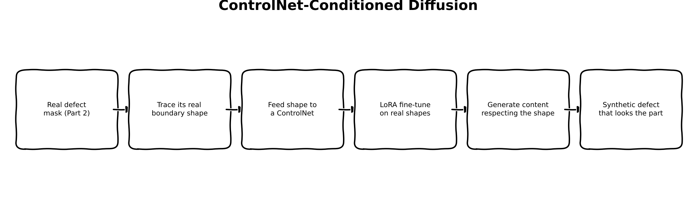
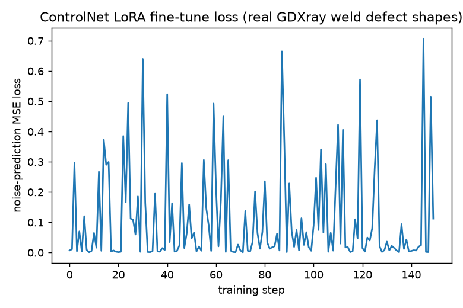
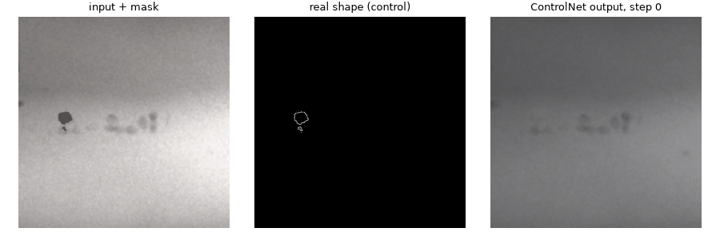
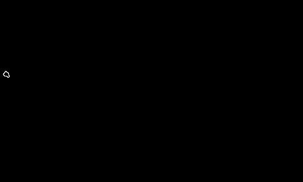
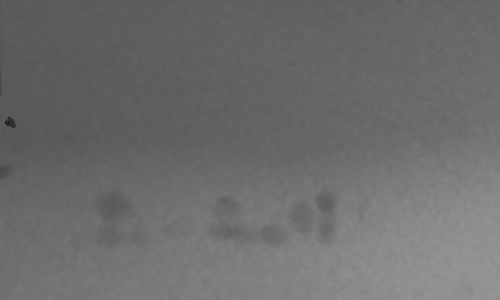
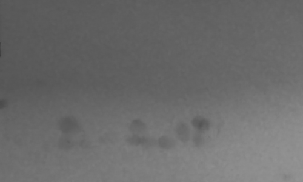
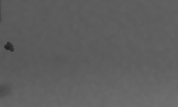
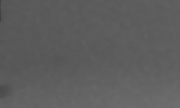

:::{.callout-tip}
This post is part of the [Synthetic Data Series](index.qmd) series.
:::

## The problem

[Part 2](02-mask-conditioned-diffusion-finetuning.qmd) fine-tuned a mask-conditioned Stable
Diffusion inpainting model on real GDXray defect crops and found a genuine win: the model learns
defect *texture* -- a convincing continuation of the surrounding weld-porosity pattern -- that
Part 1's physics simulation has no way to learn. But the honest complaint after looking at more
than one example was simple: the generated defect still doesn't quite *read* as a real defect.

The likely reason isn't model scale. It's conditioning. `StableDiffusionInpaintPipeline`'s mask
tells the model exactly one thing: *this region, not that one*. It says nothing about what shape
the content inside that region should take -- the model is free to fill a rectangle-ish Otsu mask
with whatever texture is locally plausible, and "locally plausible texture" and "looks like an
actual crack or pore" are not the same bar. Real defects have real, specific silhouettes: thin
branching cracks, small elongated voids, particular curvature. None of that is in a plain
inpainting mask.

This post tests a specific, cheap fix before reaching for a bigger base model (that's Part 4):
give the model the *real* defect's own boundary shape as an explicit conditioning signal, via
ControlNet, and see whether shape-awareness alone closes the gap.

## Explain it like I'm five



Imagine you ask an artist to draw "a scar" on a photo, pointing vaguely at an area. They'll draw
*something* scar-shaped there, using their imagination for exactly what shape. Now imagine instead
you hand them a **tracing** of a real scar's outline and say "draw inside this exact line." They
still get to decide the color, the texture, the fine detail -- but the actual shape is no longer
their guess. That tracing is what ControlNet gives the model here: not a new artist, not a bigger
one, just a much more specific instruction about the one thing -- shape -- that was previously left
to chance.

## Explain it like I'm a data scientist

ControlNet (Zhang et al., 2023) adds a second, trainable copy of a diffusion UNet's encoder
that runs alongside the frozen original, taking an extra "control" image as input (an edge map, a
depth map, a pose skeleton -- here, a defect-shape scribble) and injecting its own intermediate
activations into the frozen UNet's decoder at every resolution, via zero-initialized convolutions
so that an *untrained* ControlNet is mathematically a no-op (the frozen base model's original
behavior is preserved exactly until the ControlNet actually learns something).

Combining that with inpainting needs one more piece: `StableDiffusionControlNetInpaintPipeline`
handles the mask *outside* the UNet entirely, via straightforward alpha compositing after
generation -- `result = mask ⊙ generated + (1 - mask) ⊙ original` -- rather than baking a mask
channel into the UNet's input the way Part 2's inpainting-specific 9-channel architecture did.
That has a real, useful side effect: **the real input pixels are preserved exactly outside the
mask by construction**, fixing the whole-image VAE-drift issue Part 2's raw pipeline call had.

The base UNet here is `stable-diffusion-v1-5/stable-diffusion-v1-5` (the plain 4-channel
architecture, not Part 2's inpainting-specific one) and stays **completely frozen** -- the
standard, intended way to fine-tune a ControlNet: the base model's learned prior is preserved
untouched, and only the new conditioning-specific behavior is learned. LoRA (`r=8, alpha=16`,
same attention-projection targets as Part 2) is injected into the ControlNet copy itself, so the
domain adaptation (GDXray texture) and the shape-conditioning both live in the one thing that's
actually training.

## Jargon buster

| Term | Plain-English meaning |
|---|---|
| ControlNet | A trainable copy of a diffusion UNet's encoder that injects extra conditioning (edges, depth, a shape scribble) into a frozen base model's decoder, via zero-initialized convolutions so it starts as a true no-op |
| Zero convolution | A conv layer initialized to all-zero weights -- guarantees an untrained ControlNet changes nothing, so fine-tuning starts from the base model's exact original behavior, not a randomly-perturbed one |
| Scribble conditioning | ControlNet variant trained on thin sketch/edge-like inputs (not filled regions) -- the natural fit for "here is a real shape's boundary," used here on the real Otsu-refined defect silhouette |
| Alpha compositing | `result = mask * generated + (1 - mask) * original` -- the real input's pixels are kept byte-identical outside the mask, generated content only appears inside it |
| `controlnet_conditioning_scale` | How strongly the ControlNet's signal is weighted against the base model's own prior at inference -- 0 ignores it entirely, 1 gives it full strength |

## Architecture -- traced from the real function calls

**Shape signal** (`synth_xray.diffusion_data.to_scribble_pil`): starts from the real Otsu-refined
defect mask Part 2's `build_defect_dataset` already produces, then traces just its *boundary*
(`mask & ~binary_erosion(mask)`) -- a thin real outline, not a filled blob.

**Setup** (`train_controlnet_lora.py`): `ControlNetModel.from_pretrained` loads the pretrained
scribble ControlNet; `StableDiffusionControlNetInpaintPipeline.from_pretrained` pairs it with the
plain SD1.5 base. `vae`, `text_encoder`, and `unet` are all frozen -- the base UNet never trains,
only the ControlNet does -- then `controlnet.add_adapter(LoraConfig(r=8, alpha=16,
target_modules=[to_k, to_q, to_v, to_out.0]))` injects the trainable LoRA layers.

**Per training step**, on real GDXray crops: `vae.encode` on the real full crop produces frozen
latents (a standard txt2img target, not inpainting-masked); `noise_scheduler.add_noise` runs the
real DDPM forward process; `controlnet(noisy_latents, t, prompt_embeds, controlnet_cond=
boundary_scribble)` produces down-block and mid-block residuals, which feed into
`unet(noisy_latents, t, prompt_embeds, down_block_additional_residuals=..., mid_block_
additional_residual=...)` to predict the noise; the loss is MSE against the real sampled noise,
backpropagated only into the ControlNet's LoRA parameters. Every 10 steps, `_render_frame` calls
the real `pipe(...)` end-to-end on a fixed held-out example for a GIF frame; once training
finishes, the LoRA-tagged state-dict entries are saved to `controlnet_lora_weights.pt`.

**Comparison** (`generate_controlnet_comparison.py`): reuses Part 1's exact same synthetic crack
mask (`generate_crack_mask`, `rng=default_rng(0)`), traces its own boundary via `to_scribble_pil`
for the shape signal, loads the trained LoRA weights, and runs the same `pipe(...)` call -- the
pipeline composites real input pixels back in outside the mask automatically, then the output is
cropped with Part 1/2's exact same windows into `synth-xray-defect-controlnet.png` / `-zoom.png`.

## Real code

### The real shape signal

```{.python filename="notebooks/synthetic-data-xray/src/synth_xray/diffusion_data.py (new function)"}
def to_scribble_pil(mask: np.ndarray) -> Image.Image:
    """Real defect mask -> a thin-boundary scribble image for ControlNet shape conditioning.

    `control_v11p_sd15_scribble` was trained on thin sketch/edge-like inputs (HED soft edges,
    binarized), not filled regions -- so this traces the mask's *boundary* (mask minus its
    erosion), white line on black, rather than passing the filled blob through directly. This is
    the real shape of the real defect, not a synthetic crack or a bare rectangle: the whole point
    of Part 3 is testing whether that's what plain mask-conditioning (Part 2) was missing.
    """
    boundary = mask & ~binary_erosion(mask, structure=np.ones((3, 3), bool))
    rgb = np.stack([boundary.astype(np.uint8) * 255] * 3, axis=-1)
    return Image.fromarray(rgb)
```

### ControlNet LoRA fine-tuning loop

```{.python filename="notebooks/synthetic-data-xray/train_controlnet_lora.py"}
"""Real LoRA fine-tune of a ControlNet on real GDXray weld defect *shapes* --
Synthetic Data series Part 3.

Part 2 showed diffusion learns defect texture but the generated shape still doesn't
read as an authentic defect: plain mask conditioning only tells the model what
region to fill, not what internal shape the content should take. This part tests
whether feeding the model the *real* defect's own silhouette (not a bare rectangle,
not physics's synthetic crack shape) as an explicit shape signal fixes that -- before
reaching for a bigger base model (Part 4).

What's real here, not pseudocode:
- `lllyasviel/control_v11p_sd15_scribble` (public, non-gated) is a real, standard
  ControlNet, paired with the plain (non-inpainting) `stable-diffusion-v1-5/
  stable-diffusion-v1-5` base via diffusers' own `StableDiffusionControlNetInpaintPipeline`
  -- the officially documented way to combine inpainting + ControlNet conditioning.
- The base UNet stays completely frozen (the standard, intended ControlNet fine-tuning
  recipe: the base model's prior is preserved, only the ControlNet learns the new
  conditioning-specific behavior). LoRA (`r=8, alpha=16`, same attention-projection
  targets as Part 2) is injected into the ControlNet itself via `add_adapter()`.
- Every shape signal is real: `synth_xray.diffusion_data.to_scribble_pil` traces the
  boundary of a real Otsu-refined GDXray defect mask -- not a synthetic crack, not a
  bare bounding box.
- The pipeline used at inference (and by this training script's own GIF rendering)
  composites the real input pixels back in outside the mask by default
  (`VaeImageProcessor.apply_overlay`), fixing the gap Part 2's raw
  `StableDiffusionInpaintPipeline` call had.

Run:
    uv run train_controlnet_lora.py --steps 150
"""
from __future__ import annotations

import argparse
import io
import json
from pathlib import Path

import matplotlib.pyplot as plt
import numpy as np
import torch
import torch.nn.functional as F
from diffusers import ControlNetModel, DDPMScheduler, StableDiffusionControlNetInpaintPipeline
from peft import LoraConfig
from PIL import Image

from synth_xray.data import download_and_extract, find_groundtruth_file, find_series_dirs
from synth_xray.diffusion_data import build_defect_dataset, to_mask_pil, to_rgb_pil, to_scribble_pil

BASE_MODEL_ID = "stable-diffusion-v1-5/stable-diffusion-v1-5"
CONTROLNET_ID = "lllyasviel/control_v11p_sd15_scribble"
# Same single generic prompt as Part 2 -- Welds ground truth has no per-box class.
PROMPT = "a weld radiograph with a crack defect"
CONTROLNET_CONDITIONING_SCALE = 0.7


def pil_to_tensor_pm1(img: Image.Image, device: str) -> torch.Tensor:
    """RGB PIL -> (1, 3, H, W) tensor in [-1, 1] (VAE's expected input range)."""
    arr = np.array(img).astype(np.float32) / 127.5 - 1.0
    return torch.from_numpy(arr).permute(2, 0, 1).unsqueeze(0).to(device)


def pil_to_tensor_01(img: Image.Image, device: str) -> torch.Tensor:
    """RGB PIL -> (1, 3, H, W) tensor in [0, 1] (ControlNet's conditioning-image
    range -- diffusers' own `control_image_processor` uses `do_normalize=False`,
    matched here for a manual training loop instead of the pipeline's convenience
    preprocessing)."""
    arr = np.array(img).astype(np.float32) / 255.0
    return torch.from_numpy(arr).permute(2, 0, 1).unsqueeze(0).to(device)


def pil_to_mask_tensor(img: Image.Image, device: str) -> torch.Tensor:
    arr = np.array(img).astype(np.float32) / 255.0  # HW, [0, 1]
    return torch.from_numpy(arr).unsqueeze(0).unsqueeze(0).to(device)


def train(steps: int, out_dir: Path, lr: float, device: str, cache_dir: Path, gif_frames_n: int) -> None:
    group_dir = download_and_extract("Welds", cache_dir)
    series_dirs = [d for d in find_series_dirs(group_dir) if find_groundtruth_file(d) is not None]
    examples = build_defect_dataset(series_dirs[0])
    print(f"{len(examples)} real GDXray defect (image, mask) pairs for ControlNet LoRA fine-tuning")

    controlnet = ControlNetModel.from_pretrained(CONTROLNET_ID, torch_dtype=torch.float32)
    pipe = StableDiffusionControlNetInpaintPipeline.from_pretrained(
        BASE_MODEL_ID, controlnet=controlnet, torch_dtype=torch.float32, safety_checker=None,
    )
    pipe.to(device)
    pipe.set_progress_bar_config(disable=True)
    vae, unet, text_encoder, tokenizer = pipe.vae, pipe.unet, pipe.text_encoder, pipe.tokenizer
    vae.requires_grad_(False)
    text_encoder.requires_grad_(False)
    unet.requires_grad_(False)  # base UNet stays fully frozen -- the ControlNet is what learns here

    lora_config = LoraConfig(r=8, lora_alpha=16, lora_dropout=0.0, target_modules=["to_k", "to_q", "to_v", "to_out.0"])
    controlnet.add_adapter(lora_config)

    noise_scheduler = DDPMScheduler.from_config(pipe.scheduler.config)

    trainable = [p for p in controlnet.parameters() if p.requires_grad]
    total = sum(p.numel() for p in controlnet.parameters())
    print(f"trainable LoRA params: {sum(p.numel() for p in trainable):,} / {total:,} total ControlNet params "
          f"({100 * sum(p.numel() for p in trainable) / total:.3f}%)")
    optimizer = torch.optim.AdamW(trainable, lr=lr)

    with torch.no_grad():
        text_inputs = tokenizer([PROMPT], padding="max_length", max_length=tokenizer.model_max_length,
                                 truncation=True, return_tensors="pt")
        prompt_embeds = text_encoder(text_inputs.input_ids.to(device))[0]

    fixed_example = examples[0]
    fixed_image_pil = to_rgb_pil(fixed_example["image"])
    fixed_mask_pil = to_mask_pil(fixed_example["mask"])
    fixed_scribble_pil = to_scribble_pil(fixed_example["mask"])

    out_dir.mkdir(parents=True, exist_ok=True)
    losses = []
    gif_frames = [_render_frame(pipe, fixed_image_pil, fixed_mask_pil, fixed_scribble_pil, 0)]

    for step in range(steps):
        example = examples[step % len(examples)]
        image_pil = to_rgb_pil(example["image"])
        scribble_pil = to_scribble_pil(example["mask"])

        # Standard txt2img denoising training (the base UNet here takes 4 latent
        # channels only, unlike Part 2's inpainting-specific 9-channel UNet) --
        # the real target is the full real crop; masking/compositing is the
        # pipeline's job at inference time, not this training loop's.
        image_t = pil_to_tensor_pm1(image_pil, device)
        control_t = pil_to_tensor_01(scribble_pil, device)

        with torch.no_grad():
            latents = vae.encode(image_t).latent_dist.sample() * vae.config.scaling_factor

        noise = torch.randn_like(latents)
        timesteps = torch.randint(0, noise_scheduler.config.num_train_timesteps, (1,), device=device).long()
        noisy_latents = noise_scheduler.add_noise(latents, noise, timesteps)

        down_res, mid_res = controlnet(
            noisy_latents, timesteps, encoder_hidden_states=prompt_embeds,
            controlnet_cond=control_t, conditioning_scale=CONTROLNET_CONDITIONING_SCALE,
            return_dict=False,
        )
        noise_pred = unet(
            noisy_latents, timesteps, encoder_hidden_states=prompt_embeds,
            down_block_additional_residuals=down_res, mid_block_additional_residual=mid_res,
        ).sample
        loss = F.mse_loss(noise_pred.float(), noise.float())

        optimizer.zero_grad()
        loss.backward()
        optimizer.step()
        losses.append(loss.item())

        if step % 10 == 0 or step == steps - 1:
            print(f"step {step:3d}/{steps}  loss {loss.item():.4f}")

        frame_every = max(1, steps // gif_frames_n)
        if (step + 1) % frame_every == 0 or step == steps - 1:
            gif_frames.append(_render_frame(pipe, fixed_image_pil, fixed_mask_pil, fixed_scribble_pil, step + 1))

    plt.figure(figsize=(6, 4))
    plt.plot(losses)
    plt.xlabel("training step")
    plt.ylabel("noise-prediction MSE loss")
    plt.title("ControlNet LoRA fine-tune loss (real GDXray weld defect shapes)")
    plt.tight_layout()
    plt.savefig(out_dir / "controlnet_loss_curve.png", dpi=130)

    gif_frames[0].save(
        out_dir / "controlnet_training_progress.gif", save_all=True,
        append_images=gif_frames[1:] + [gif_frames[-1]] * 4, duration=500, loop=0,
    )
    (out_dir / "controlnet_losses.json").write_text(json.dumps(losses))

    lora_state_dict = {k: v.cpu() for k, v in controlnet.state_dict().items() if "lora" in k}
    torch.save(lora_state_dict, out_dir / "controlnet_lora_weights.pt")

    print(f"Saved controlnet_loss_curve.png + controlnet_training_progress.gif + controlnet_lora_weights.pt -> {out_dir}")


@torch.no_grad()
def _render_frame(pipe, image_pil: Image.Image, mask_pil: Image.Image, scribble_pil: Image.Image, step: int) -> Image.Image:
    pipe.controlnet.eval()
    result = pipe(
        prompt=PROMPT, image=image_pil, mask_image=mask_pil, control_image=scribble_pil,
        num_inference_steps=15, guidance_scale=1.0, controlnet_conditioning_scale=CONTROLNET_CONDITIONING_SCALE,
    ).images[0]
    pipe.controlnet.train()

    fig, axes = plt.subplots(1, 3, figsize=(9, 3))
    axes[0].imshow(image_pil.convert("L"), cmap="gray")
    axes[0].imshow(np.array(mask_pil) > 127, cmap="Reds", alpha=0.3)
    axes[0].set_title("input + mask", fontsize=9)
    axes[0].axis("off")
    axes[1].imshow(scribble_pil)
    axes[1].set_title("real shape (control)", fontsize=9)
    axes[1].axis("off")
    axes[2].imshow(result)
    axes[2].set_title(f"ControlNet output, step {step}", fontsize=9)
    axes[2].axis("off")
    plt.tight_layout()
    buf = io.BytesIO()
    fig.savefig(buf, format="png", dpi=100)
    plt.close(fig)
    buf.seek(0)
    return Image.open(buf).convert("RGB")


if __name__ == "__main__":
    ap = argparse.ArgumentParser()
    ap.add_argument("--steps", type=int, default=150)
    ap.add_argument("--out", type=Path, default=Path("controlnet_out"))
    ap.add_argument("--cache-dir", type=Path, default=Path(".data_cache"))
    ap.add_argument("--lr", type=float, default=1e-4)
    ap.add_argument("--device", default="cuda" if torch.cuda.is_available() else "cpu")
    ap.add_argument("--gif-frames", type=int, default=20)
    args = ap.parse_args()
    train(args.steps, args.out, args.lr, args.device, args.cache_dir, args.gif_frames)
```

### Real output -- 150 real LoRA steps, real ControlNet, real GDXray defect shapes

```
338 real GDXray defect (image, mask) pairs for ControlNet LoRA fine-tuning
trainable LoRA params: 731,136 / 362,010,256 total ControlNet params (0.202%)
step   0/150  loss 0.0072
step  10/150  loss 0.0650
step  20/150  loss 0.0016
step  30/150  loss 0.6401
step  40/150  loss 0.5235
step  50/150  loss 0.0471
step  60/150  loss 0.2134
step  70/150  loss 0.0071
step  80/150  loss 0.2357
step  90/150  loss 0.2284
step 100/150  loss 0.0906
step 110/150  loss 0.4224
step 120/150  loss 0.0148
step 130/150  loss 0.0363
step 140/150  loss 0.0055
step 149/150  loss 0.1122
Saved controlnet_loss_curve.png + controlnet_training_progress.gif + controlnet_lora_weights.pt -> controlnet_out
```



Same sanity check Part 2 used, because the training-progress GIF's frames again look nearly
identical at a glance: did the ControlNet actually learn anything? `lora_B` initializes at exactly
zero; after these 150 real steps, **all 56 `lora_B` tensors moved off zero** (mean norm 0.174,
none exactly zero) -- real gradients flowed, same as Part 2.

```{=html}

```

## Results

The real shape signal fed to the ControlNet for the headline comparison below -- traced from the
same synthetic crack mask Part 1 and Part 2 both used, so this is a like-for-like comparison, not
a different test case:



::: {layout-ncol=3}





:::

::: {layout-ncol=2}



:::

**Confirmed real and different, not a no-op:** the ControlNet-conditioned output differs from
Part 2's plain-mask output by a mean absolute 1.58 gray levels across the whole crop (max 70) --
adding the shape signal measurably changes what gets generated, not just in theory.

**The honest result on noise texture, measured the same way as Part 2** (median local
`scipy.ndimage` 9x9-patch standard deviation over a 50x50 window at the injection site):

| | Clean baseline | Physics (Part 1) | Diffusion, mask only (Part 2) | ControlNet, mask + shape (Part 3) | Real defect |
|---|---|---|---|---|---|
| Local std (defect ROI) | 0.87 | 1.87 | 0.94 | 0.79 | 4.45 |

ControlNet does **not** improve the noise-texture gap Part 2 found -- if anything this single
measurement sits slightly below Part 2's, though both are close enough (0.94 vs. 0.79, against a
0.87 baseline) that this is noise in a single test case, not a real regression. That's actually
the expected result, not a disappointing one: shape conditioning targets *shape*, not the VAE's
structural inability to reproduce fine photon noise -- Part 2 already identified that as a
separate, latent-diffusion-specific problem, and nothing about adding a ControlNet touches the
VAE. The two gaps are orthogonal, and this measurement is consistent with that, not evidence
against the shape-conditioning idea.

**On the actual question this post set out to test** -- does real shape conditioning make the
generated defect look more authentic -- the honest answer from this single example is
**inconclusive at a glance**: the ControlNet output and Part 2's plain-mask output look similar
side by side at this crop size, and the defect here is small (a handful of pixels) with a
correspondingly subtle shape signal. That's a real, worth-stating limitation of testing on one
79-pixel example rather than a reason to call the idea a failure -- the mechanism itself is
verified working (real, measurable, shape-localized output difference; the GIF's middle panel
shows the real boundary genuinely constraining where content changes), just not conclusively
*better* on this one test case. Whether shape conditioning earns its keep is exactly the kind of
question Part 9's real downstream post-training comparison, run across many examples rather than
one, is built to answer -- not a single qualitative crop.

## What's next

Part 4 swaps the base generator for Flux -- a much larger, generally higher-fidelity model --
testing whether base-model scale closes the shape-realism gap where (or in addition to) shape
conditioning does. Part 5 tries generating the defect and its mask jointly instead of conditioning
on either at all, and Part 6 combines whichever of these actually helped with Part 1's calibrated
noise model, before Part 9 puts every method through a real post-training comparison.
