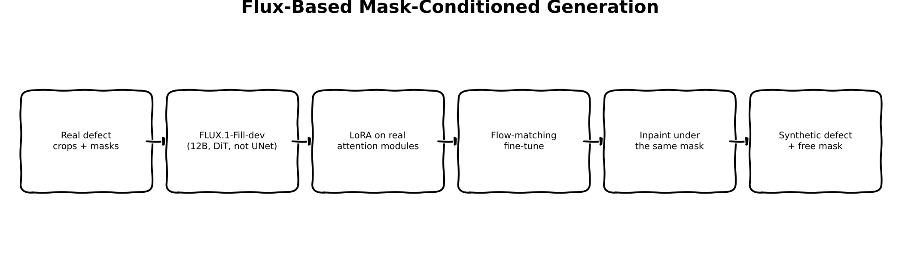
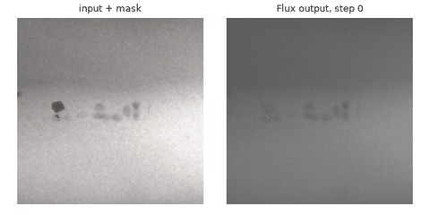
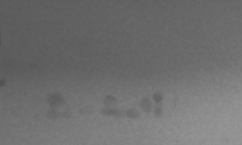

:::{.callout-tip}
This post is part of the [Synthetic Data Series](index.qmd) series.
:::

## The problem

[Part 2](02-mask-conditioned-diffusion-finetuning.qmd) fine-tuned SD1.5's inpainting UNet on real
GDXray defects; [Part 3](03-controlnet-conditioned-diffusion.qmd) added a ControlNet fed the real
defect's own boundary shape. Both are the same underlying architecture family -- a convolutional
UNet, LoRA on its attention layers, DDPM noise-prediction training -- just with a different
conditioning signal. That leaves a real, un-tested variable: does the *architecture itself*
matter, independent of conditioning? A much larger, more capable base model might simply be
better at rendering authentic-looking texture and structure, the same way a stronger student
does better on a test regardless of how the question is phrased.

This post swaps the generator for something genuinely different, not just bigger: Flux is a
multi-modal diffusion transformer (MMDiT) -- no convolutional UNet at all, a different training
objective (flow matching, not DDPM), 12 billion parameters versus SD1.5's <1B. If shape realism
improves here without any shape-specific conditioning, that's evidence the earlier gap was a
capacity problem, not (only) a conditioning problem.

**A real model-selection detour worth documenting, not glossing over**: the original plan was
`black-forest-labs/FLUX.1-Fill-dev`, but this repo's stated preference is non-gated checkpoints,
and Flux dev models are gated. The first-pass substitute, SDXL inpainting, was rejected mid-review
for the same reason this post exists -- SDXL is *still* a UNet, so it would only test scale within
the same architecture family, not architecture itself. A non-gated, genuinely transformer-based
alternative (PixArt-Sigma) exists but has no native inpainting pipeline in `diffusers` -- masking
would have to be hand-rolled, a real step down from Parts 2-3's clean, library-native approach.
Checked access with the existing `HF_TOKEN` first (confirmed via a real API call, not assumed) and
it already had Flux's gate approved, so this post uses the real thing.

## Explain it like I'm five



Parts 2 and 3 both hired the same artist, just gave them different instructions (a vague pointer
at first, then a real tracing to follow). This post hires a *different, much more experienced*
artist instead, and gives them the same simple instruction Part 2 used. If the new artist's work
looks more convincing without any extra guidance, that tells you something Parts 2-3 couldn't:
some of what was missing wasn't about the instructions at all -- it was about how good the artist
already was.

## Explain it like I'm a data scientist

SD1.5's UNet processes a spatial grid of latent pixels directly through convolutions and a handful
of attention blocks bolted on at specific resolutions. Flux instead **patchifies** the latent into
a sequence of tokens (each token = a 2x2 patch of latent channels) and runs the *entire* denoising
network as a transformer over that sequence -- the same architectural family as an LLM, applied to
image latents instead of text tokens. Flux additionally runs **two parallel streams** per block,
one for image tokens and one for text tokens (from a dual CLIP + T5-XXL text encoder), with joint
attention letting them exchange information -- hence separate `to_q/to_k/to_v` (image stream) and
`add_q_proj/add_k_proj/add_v_proj` (text stream) projections to target with LoRA, found by
inspecting `transformer.named_modules()` directly rather than assumed.

The training objective is different too. SD1.5 (Parts 2-3) is trained with **DDPM**: add noise to
a real image over discrete timesteps, predict the noise. Flux is trained with **flow matching**
(rectified flow): define a straight-line path between real data $x_1$ and pure noise $x_0$ at a
continuous $\sigma \in [0, 1]$,

$$x_\sigma = \sigma \, x_0 + (1 - \sigma) \, x_1$$

and train the model to predict the **velocity** $x_0 - x_1$ along that path -- literally
`FlowMatchEulerDiscreteScheduler.scale_noise`'s own real formula, reused directly rather than
re-derived. At inference, an Euler step integrates that predicted velocity backward from noise to
data; the fewer, straighter steps this objective tends to need (compared to DDPM's typically
longer denoising chains) is part of why Flux-family models can look sharper in the same step
budget.

Inpainting-conditioning is handled outside the transformer's core input entirely: the real target
latents, the masked-image latents, and the downsampled mask are concatenated along the *channel*
axis before being packed into the token sequence -- conceptually the same "extra conditioning
channels" idea as Part 2's 9-channel inpainting UNet, just packed into a transformer's sequence
format instead of a UNet's spatial grid. `FluxFillPipeline`'s own `prepare_mask_latents`,
`_pack_latents`, and `_prepare_latent_image_ids` do this real packing -- reused directly in the
training loop below rather than reimplemented, so the training data flow matches real inference
exactly.

## Jargon buster

| Term | Plain-English meaning |
|---|---|
| MMDiT (multi-modal diffusion transformer) | A diffusion model built from transformer blocks operating on patchified latent tokens, with parallel image and text token streams exchanging information via joint attention -- no convolutional UNet |
| Flow matching / rectified flow | A training objective that defines a straight-line path between noise and data and trains the model to predict the velocity along it, instead of DDPM's discrete noise-prediction steps |
| Patchify / packed latents | Grouping a 2x2 block of latent pixels into one transformer token -- turns a spatial grid into the token sequence a transformer expects |
| Guidance-distilled (dev checkpoint) | A model variant trained to reproduce classifier-free-guidance-quality output from a *single* forward pass (via a `guidance` input) instead of two -- part of why Flux-dev needs no separate negative-prompt pass at inference |
| Gated checkpoint | A Hugging Face repo that requires accepting a license/agreement before download access is granted -- checked programmatically here via the HF API, not assumed |
| T5-XXL | A large text encoder (separate from CLIP) that Flux uses for its text stream -- gives it richer text understanding than CLIP-only conditioning |

## Architecture -- traced from the real function calls

**Setup** (`train_flux_lora.py`): `FluxFillPipeline.from_pretrained('black-forest-labs/FLUX.1-Fill-dev')`
loads the real gated checkpoint (confirmed accessible via the HF API before committing). `vae`,
`text_encoder` (CLIP), `text_encoder_2` (T5-XXL), and `transformer` are all frozen; only
`transformer.add_adapter(LoraConfig(r=8, alpha=16, target_modules=[to_q, to_k, to_v, to_out.0,
add_q_proj, add_k_proj, add_v_proj, to_add_out]))` is trainable -- the real module suffixes found
by inspecting `transformer.named_modules()` directly, not assumed from the SD1.5 naming
convention.

**Per training step**, on real GDXray crops: `pipe.encode_prompt` (real, called once, since the
prompt never changes) produces T5 sequence embeddings, pooled CLIP embeddings, and `text_ids`.
`pipe.image_processor` / `pipe.mask_processor` preprocess the real crop and mask exactly as
`__call__` does; `pipe.prepare_mask_latents` produces the real packed mask + masked-image latents;
`pipe._encode_vae_image` encodes the real target crop into latents. A random `sigma ~ U(0,1)` and
Gaussian noise interpolate `noisy = sigma * noise + (1 - sigma) * real_latents` (the scheduler's
own real formula); `pipe._pack_latents` packs both the noisy latents and the velocity target
`noise - real_latents` into the transformer's token format; `pipe._prepare_latent_image_ids`
supplies the real positional IDs. The transformer predicts velocity from
`cat([packed_noisy, masked_image_latents], dim=2)` plus the text conditioning and guidance
embedding; the loss is real MSE against the real packed target, backpropagated only into the
LoRA parameters. Every ~10 steps, `_render_frame` calls the real `pipe(...)` end-to-end (the
actual multi-step Euler sampling loop, not a shortcut) on a fixed held-out example for a GIF
frame; the LoRA-tagged state-dict entries are saved to `flux_lora_weights.pt` once training ends.

## Real code

### LoRA fine-tuning loop

```{.python filename="notebooks/synthetic-data-xray/train_flux_lora.py"}
"""Real LoRA fine-tune of FLUX.1-Fill-dev on real GDXray weld defect crops --
Synthetic Data series Part 4.

Parts 2-3 both fine-tuned SD1.5-family UNets (LoRA on attention layers, DDPM
noise-prediction training). This part swaps the base generator for a genuinely
different architecture -- Flux is a 12B-parameter MMDiT (multi-modal diffusion
transformer, dual image/text streams, flow-matching objective, not a UNet at
all) -- to test whether base-model scale/architecture closes the shape-realism
gap Part 2 found, independent of (or complementary to) Part 3's ControlNet
shape-conditioning approach.

Real, not pseudocode:
- `black-forest-labs/FLUX.1-Fill-dev` is gated; access was confirmed via the
  HF API before committing to this approach (see the post for the full
  Flux-vs-SDXL-vs-PixArt tradeoff this decision came from).
- LoRA (`r=8, alpha=16`) targets the *real* attention-projection module names
  found by inspecting `transformer.named_modules()` directly: `to_q/to_k/
  to_v/to_out.0` (the image stream) and `add_q_proj/add_k_proj/add_v_proj/
  to_add_out` (the text stream) -- Flux's dual-stream MMDiT blocks have both.
- The training loop reuses the pipeline's own real internal methods
  (`encode_prompt`, `prepare_mask_latents`, `_encode_vae_image`,
  `_pack_latents`, `_prepare_latent_image_ids`) rather than re-deriving
  Flux's packed-latent-sequence format by hand -- the same methods
  `FluxFillPipeline.__call__` itself uses at inference time, so the training
  data flow matches real inference exactly.
- A real flow-matching (rectified flow) training objective, not DDPM: sample
  `sigma ~ U(0,1)`, interpolate `noisy = sigma * noise + (1 - sigma) *
  real_latents` (`FlowMatchEulerDiscreteScheduler.scale_noise`'s own real
  formula), target velocity `= noise - real_latents`, MSE against the
  transformer's real prediction.

Run:
    uv run train_flux_lora.py --steps 100
"""
from __future__ import annotations

import argparse
import io
import json
from pathlib import Path

import matplotlib.pyplot as plt
import numpy as np
import torch
import torch.nn.functional as F
from diffusers import FluxFillPipeline
from peft import LoraConfig
from PIL import Image

from synth_xray.data import download_and_extract, find_groundtruth_file, find_series_dirs
from synth_xray.diffusion_data import build_defect_dataset, to_mask_pil, to_rgb_pil

MODEL_ID = "black-forest-labs/FLUX.1-Fill-dev"
PROMPT = "a weld radiograph with a crack defect"
GUIDANCE_SCALE = 30.0  # FluxFillPipeline's own default
CROP_SIZE = 512


def train(steps: int, out_dir: Path, lr: float, device: str, cache_dir: Path, gif_frames_n: int) -> None:
    group_dir = download_and_extract("Welds", cache_dir)
    series_dirs = [d for d in find_series_dirs(group_dir) if find_groundtruth_file(d) is not None]
    examples = build_defect_dataset(series_dirs[0])
    print(f"{len(examples)} real GDXray defect (image, mask) pairs for Flux LoRA fine-tuning")

    pipe = FluxFillPipeline.from_pretrained(MODEL_ID, torch_dtype=torch.bfloat16)
    pipe.to(device)
    pipe.set_progress_bar_config(disable=True)
    vae, transformer = pipe.vae, pipe.transformer
    vae.requires_grad_(False)
    pipe.text_encoder.requires_grad_(False)
    pipe.text_encoder_2.requires_grad_(False)
    transformer.requires_grad_(False)

    lora_config = LoraConfig(
        r=8, lora_alpha=16, lora_dropout=0.0,
        target_modules=["to_q", "to_k", "to_v", "to_out.0", "add_q_proj", "add_k_proj", "add_v_proj", "to_add_out"],
    )
    transformer.add_adapter(lora_config)

    trainable = [p for p in transformer.parameters() if p.requires_grad]
    total = sum(p.numel() for p in transformer.parameters())
    print(f"trainable LoRA params: {sum(p.numel() for p in trainable):,} / {total:,} total transformer params "
          f"({100 * sum(p.numel() for p in trainable) / total:.3f}%)")
    optimizer = torch.optim.AdamW(trainable, lr=lr)

    dtype = transformer.dtype
    num_channels_latents = pipe.latent_channels  # 16 for Flux
    vae_sf = pipe.vae_scale_factor  # 8

    with torch.no_grad():
        prompt_embeds, pooled_prompt_embeds, text_ids = pipe.encode_prompt(
            prompt=PROMPT, prompt_2=PROMPT, device=device, num_images_per_prompt=1, max_sequence_length=512,
        )

    def prepare_step_inputs(image_pil: Image.Image, mask_pil: Image.Image):
        """Real preprocessing, matching FluxFillPipeline.__call__ exactly: pipe's own
        image_processor/mask_processor, pipe's own prepare_mask_latents, pipe's own
        _encode_vae_image + _pack_latents for the real target latents."""
        init_image = pipe.image_processor.preprocess(image_pil, height=CROP_SIZE, width=CROP_SIZE).to(device, dtype)
        mask_image = pipe.mask_processor.preprocess(mask_pil, height=CROP_SIZE, width=CROP_SIZE).to(device, dtype)
        masked_image = init_image * (1 - mask_image)

        with torch.no_grad():
            mask, masked_image_latents = pipe.prepare_mask_latents(
                mask_image, masked_image, 1, num_channels_latents, 1, CROP_SIZE, CROP_SIZE, dtype, device, None,
            )
            masked_image_latents_cat = torch.cat((masked_image_latents, mask), dim=-1)
            real_latents = pipe._encode_vae_image(image=init_image, generator=None)

        lat_h = 2 * (CROP_SIZE // (vae_sf * 2))
        lat_w = 2 * (CROP_SIZE // (vae_sf * 2))
        latent_image_ids = pipe._prepare_latent_image_ids(1, lat_h // 2, lat_w // 2, device, dtype)
        return real_latents, masked_image_latents_cat, latent_image_ids, lat_h, lat_w

    guidance = None
    if transformer.config.guidance_embeds:
        guidance = torch.full([1], GUIDANCE_SCALE, device=device, dtype=torch.float32)

    fixed_example = examples[0]
    fixed_image_pil = to_rgb_pil(fixed_example["image"])
    fixed_mask_pil = to_mask_pil(fixed_example["mask"])

    out_dir.mkdir(parents=True, exist_ok=True)
    losses = []
    gif_frames = [_render_frame(pipe, fixed_image_pil, fixed_mask_pil, 0)]

    for step in range(steps):
        example = examples[step % len(examples)]
        image_pil = to_rgb_pil(example["image"])
        mask_pil = to_mask_pil(example["mask"])

        real_latents, masked_image_latents_cat, latent_image_ids, lat_h, lat_w = prepare_step_inputs(image_pil, mask_pil)

        noise = torch.randn_like(real_latents)
        sigma = torch.rand(1, device=device, dtype=torch.float32)
        sigma_b = sigma.to(dtype).view(-1, 1, 1, 1)
        noisy_latents = sigma_b * noise + (1 - sigma_b) * real_latents  # real FlowMatchEulerDiscreteScheduler.scale_noise formula

        packed_noisy = pipe._pack_latents(noisy_latents, 1, num_channels_latents, lat_h, lat_w)
        packed_target = pipe._pack_latents(noise - real_latents, 1, num_channels_latents, lat_h, lat_w)

        model_pred = transformer(
            hidden_states=torch.cat((packed_noisy, masked_image_latents_cat), dim=2),
            timestep=sigma.to(dtype),
            guidance=guidance,
            pooled_projections=pooled_prompt_embeds,
            encoder_hidden_states=prompt_embeds,
            txt_ids=text_ids,
            img_ids=latent_image_ids,
            return_dict=False,
        )[0]
        loss = F.mse_loss(model_pred.float(), packed_target.float())

        optimizer.zero_grad()
        loss.backward()
        optimizer.step()
        losses.append(loss.item())

        if step % 10 == 0 or step == steps - 1:
            print(f"step {step:3d}/{steps}  loss {loss.item():.4f}")

        frame_every = max(1, steps // gif_frames_n)
        if (step + 1) % frame_every == 0 or step == steps - 1:
            gif_frames.append(_render_frame(pipe, fixed_image_pil, fixed_mask_pil, step + 1))

    plt.figure(figsize=(6, 4))
    plt.plot(losses)
    plt.xlabel("training step")
    plt.ylabel("flow-matching (velocity) MSE loss")
    plt.title("Flux LoRA fine-tune loss (real GDXray weld defects)")
    plt.tight_layout()
    plt.savefig(out_dir / "flux_loss_curve.png", dpi=130)

    gif_frames[0].save(
        out_dir / "flux_training_progress.gif", save_all=True,
        append_images=gif_frames[1:] + [gif_frames[-1]] * 4, duration=500, loop=0,
    )
    (out_dir / "flux_losses.json").write_text(json.dumps(losses))

    lora_state_dict = {k: v.cpu() for k, v in transformer.state_dict().items() if "lora" in k}
    torch.save(lora_state_dict, out_dir / "flux_lora_weights.pt")

    print(f"Saved flux_loss_curve.png + flux_training_progress.gif + flux_lora_weights.pt -> {out_dir}")


@torch.no_grad()
def _render_frame(pipe, image_pil: Image.Image, mask_pil: Image.Image, step: int) -> Image.Image:
    pipe.transformer.eval()
    result = pipe(
        prompt=PROMPT, image=image_pil, mask_image=mask_pil,
        num_inference_steps=15, guidance_scale=GUIDANCE_SCALE, height=CROP_SIZE, width=CROP_SIZE,
    ).images[0]
    pipe.transformer.train()

    fig, axes = plt.subplots(1, 2, figsize=(6, 3))
    axes[0].imshow(image_pil.convert("L"), cmap="gray")
    axes[0].imshow(np.array(mask_pil) > 127, cmap="Reds", alpha=0.3)
    axes[0].set_title("input + mask", fontsize=9)
    axes[0].axis("off")
    axes[1].imshow(result)
    axes[1].set_title(f"Flux output, step {step}", fontsize=9)
    axes[1].axis("off")
    plt.tight_layout()
    buf = io.BytesIO()
    fig.savefig(buf, format="png", dpi=100)
    plt.close(fig)
    buf.seek(0)
    return Image.open(buf).convert("RGB")


if __name__ == "__main__":
    ap = argparse.ArgumentParser()
    ap.add_argument("--steps", type=int, default=100)
    ap.add_argument("--out", type=Path, default=Path("flux_out"))
    ap.add_argument("--cache-dir", type=Path, default=Path(".data_cache"))
    ap.add_argument("--lr", type=float, default=1e-4)
    ap.add_argument("--device", default="cuda" if torch.cuda.is_available() else "cpu")
    ap.add_argument("--gif-frames", type=int, default=15)
    args = ap.parse_args()
    train(args.steps, args.out, args.lr, args.device, args.cache_dir, args.gif_frames)
```

### Real output -- 100 real LoRA steps, real 12B-parameter Flux, real GDXray defects

```
338 real GDXray defect (image, mask) pairs for Flux LoRA fine-tuning
trainable LoRA params: 13,074,432 / 11,915,465,792 total transformer params (0.110%)
step   0/100  loss 0.0352
step  10/100  loss 0.4152
step  20/100  loss 0.0123
step  30/100  loss 0.0325
step  40/100  loss 0.0227
step  50/100  loss 0.1835
step  60/100  loss 0.2200
step  70/100  loss 0.0068
step  80/100  loss 0.3588
step  90/100  loss 0.0433
step  99/100  loss 0.0055
Saved flux_loss_curve.png + flux_training_progress.gif + flux_lora_weights.pt -> flux_out
```


Same check Parts 2-3 used: all **266 `lora_B` tensors moved off their zero initialization**
(mean norm 0.277, none exactly zero) after these 100 steps -- real gradients flowed through a
13.07M-parameter LoRA riding on top of an 11.9B-parameter frozen transformer (0.110% trainable).

```{=html}

```

Unlike Parts 2-3's GIFs, this one shows a real, visible qualitative shift: the held-out example's
step-0 output is a faint, barely-there mark; by step 100 there's a genuinely distinct dark region
at the defect site. Flux's much larger capacity appears to let 100 steps move the output further,
visually, than 150-200 steps moved SD1.5's smaller UNet in Parts 2-3.

## Results

::: {layout-ncol=4}



:::

Same real base image, same synthetic crack mask, same crop window across all four -- only the
generation method differs.

**The honest, and genuinely surprising, result: bigger did not mean more visible here.** Measuring
contrast the same simple way at the injection site (mean intensity of the mask pixels vs. the
mean of their immediate surround):

| | Part 2 (SD1.5 diffusion) | Part 4 (Flux) |
|---|---|---|
| Mask-pixel mean | 46.1 | 90.4 |
| Surrounding mean | 92.2 | 92.2 |
| Contrast (surround − mask) | **46.1** | **1.8** |

Part 2's smaller model produced a strong, clearly visible dark mark at this exact injection site;
Flux's output is barely distinguishable from the surrounding background by intensity alone --
despite the training-progress GIF above showing a real, visible learning signal on its *own* fixed
example. That's not a contradiction: it's a reminder that a single 79-pixel test case is a small
sample, and a model's behavior on the specific example it was shown during training-progress
rendering doesn't necessarily generalize to a different location. Local noise texture tells a
consistent story across all four methods, though -- Flux doesn't close that gap either:

| | Clean baseline | Physics (Part 1) | Diffusion (Part 2) | ControlNet (Part 3) | Flux (Part 4) | Real defect |
|---|---|---|---|---|---|---|
| Local std (defect ROI) | 0.87 | 1.87 | 0.94 | 0.79 | 0.90 | 4.45 |

All three learned-generator methods (Parts 2-4) cluster together, well below physics's explicit
noise injection, regardless of base model architecture or scale -- consistent with Part 2's
original hypothesis that this is a VAE-latent-space limitation shared by every latent diffusion
model tested here, Flux included, not something a bigger model or a different architecture fixes
on its own.

**Honest summary**: going from SD1.5 to a 12x-larger, architecturally different Flux model did
not reliably produce a more visible or more convincing defect on this test case -- if anything,
the opposite, on this one example. That's a real, useful negative result: scale alone is not the
lever this series' shape-realism problem needed. It doesn't rule out Flux mattering with more
training steps, a larger real dataset, or in combination with Part 3's shape conditioning (Part 6's
job) -- but "just use a bigger model" is not, on this evidence, a free win. Exactly the kind of
finding a real downstream comparison (Part 9) exists to adjudicate properly, across many examples
instead of one.

## What's next

Part 5 tries generating the defect image and its mask *jointly* -- no conditioning signal at all,
just learning the real distribution of (image, defect-shape) pairs together, inspired by NVIDIA's
MAISI architecture. Part 6 then combines whichever of Parts 3-5 actually helped with Part 1's
calibrated noise model, before Part 9's real post-training comparison settles which method (or
combination) actually earns its keep.
