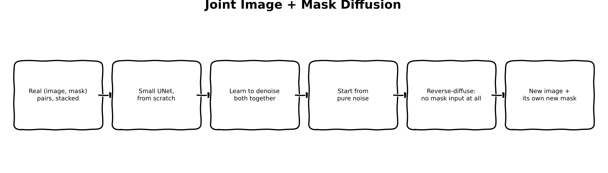
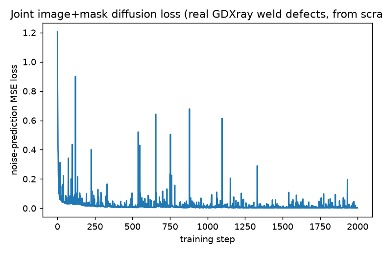
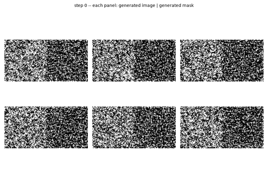
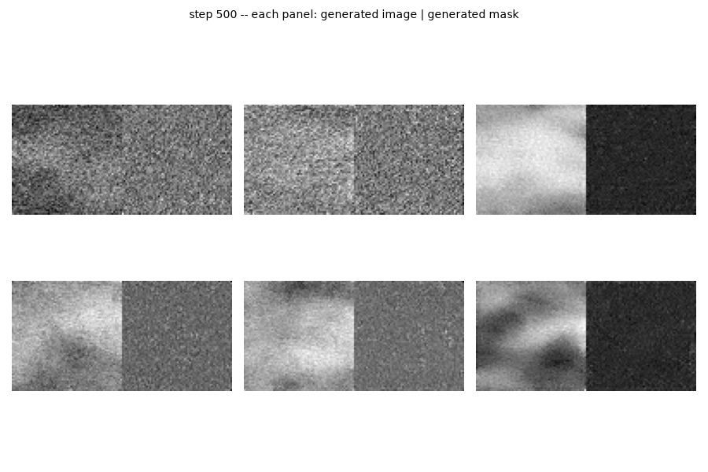
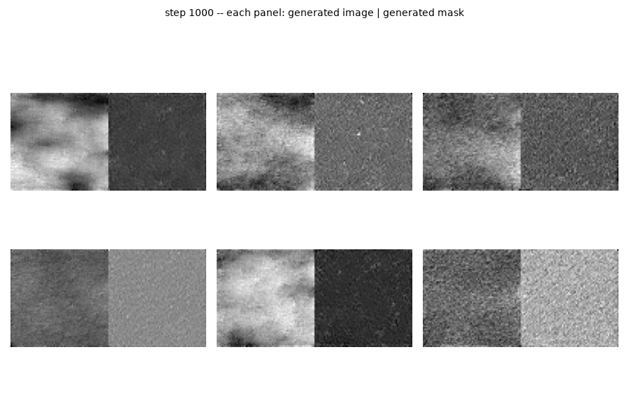
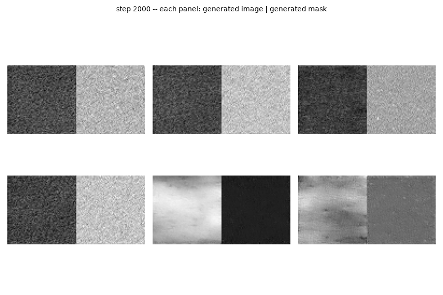

:::{.callout-tip}
This post is part of the [Synthetic Data Series](index.qmd) series.
:::

## The problem

Every generative method so far treats the defect mask as an input, not an output. Part 2 hands the
model a synthetic crack shape and asks it to fill inside it. Part 3 hands it a real defect's
traced boundary. Part 4 hands it the same plain mask Part 2 used, on a bigger model. In every
case, *something outside the model* decides the shape -- a hand-drawn random walk, a copied real
silhouette -- and the model's only job is texture.

NVIDIA's MAISI / NV-Generate-CTMR line of work (3D CT/MRI synthesis with paired segmentation
masks) takes the opposite position: train the model to generate the image *and* its mask
together, as one joint sample, so the mask is a learned draw from the real distribution of defect
shapes rather than something supplied. Scoped down to this series' 2D, single-channel, 338-example
reality, that's this post's question: does *not* being told the shape at all -- learning it
end-to-end, jointly with the texture -- produce something that looks more like a real defect than
Parts 2-4's conditioning tricks?

**A real, higher-risk design choice, stated plainly, not glossed over**: a literature check before
committing to an architecture (search terms: "joint image and mask diffusion," "MedSegDiff")
turned up MedSegFactory -- a real dual-stream diffusion model with cross-attention between an
image stream and a mask stream. Replicating that properly is a meaningfully larger undertaking
than fits here. The alternative this post actually uses is smaller and more honest about the
dataset's real size: a **from-scratch** UNet, trained directly in pixel space (no pretrained SD
checkpoint, no VAE, no text encoder -- nothing borrowed, so nothing to misuse), jointly denoising
a 2-channel (image, mask) pair. 338 real examples is a small dataset for training *any* generative
model from scratch; this post reports what that actually produces, not what it was hoped to.

## Explain it like I'm five



Parts 2-4 all worked like tracing paper: someone draws (or copies) an outline first, and the
artist fills it in. This post trains an artist who was never shown any outlines at all -- just
shown hundreds of real (photo, its own outline) pairs, over and over, until they learn to draw
*both* at once, together, from a blank page. Nothing tells them where to put the shape. If they
learned the lesson, the shapes they invent should look like the real ones they studied.

## Explain it like I'm a data scientist

Every prior part's UNet takes 4 latent channels (the image) plus extra conditioning channels (a
mask, a masked-image latent) as *input*, and predicts noise for the *image* channels only -- the
mask, where present, is data the model reads, never data it writes. This part flips that: the
model's input **and** output are both a stacked `(image, mask)` pair, 2 channels total, and there
is no conditioning of any kind -- no prompt, no external mask, no text encoder. The forward
(training) process is standard DDPM, just applied to both channels identically and simultaneously:

$$x_t = \sqrt{\bar\alpha_t}\, x_0 + \sqrt{1-\bar\alpha_t}\, \epsilon, \qquad x_0 = \big[\,\text{image}, \ \text{mask}\,\big]$$

The model predicts $\epsilon$ for both channels jointly from one shared noisy input -- there is
architecturally no way for it to solve "generate the image" and "generate the mask" as two
separate problems, because a single denoising step operates on the concatenated pair. If the model
learns anything about the *relationship* between texture and shape, it can only be because solving
the joint denoising problem forced it to.

Sampling is standard, real DDPM ancestral sampling (`scheduler.step`, iterated from
`num_train_timesteps` down to 0) -- **not** a shortcut. Starting from pure Gaussian noise in both
channels, with no conditioning to guide it, the reverse process has to invent a plausible
`(image, mask)` pair from nothing. That's a meaningfully harder generative problem than Parts 2-4's
inpainting task (fill a *given* region plausibly); the tradeoff for that difficulty is a mask that,
if it works, is a genuine sample from the model's learned notion of "what a defect shape looks
like" -- not a copy or a hand-drawn approximation of one.

## Jargon buster

| Term | Plain-English meaning |
|---|---|
| Joint generation | Generating multiple related outputs (here, an image and its mask) from one shared model pass, instead of generating one and conditioning on it for the other |
| From-scratch training | No pretrained checkpoint at all -- every weight starts randomly initialized and is trained only on this post's 338 real examples |
| `UNet2DModel` | `diffusers`' plain, unconditional UNet -- no text encoder, no cross-attention, just image-to-image denoising |
| DDPM ancestral sampling | The real, standard reverse-diffusion sampling loop: iteratively remove predicted noise from a sample, timestep by timestep, from pure noise down to a final sample |
| Mode collapse | A generative model failing to learn the real diversity of its training data, instead memorizing or converging to a narrow set of outputs -- a real risk flagged upfront given how small this dataset is |
| EMA (exponential moving average) | A smoothed shadow copy of the model's weights, updated a little toward the live weights after every step (`shadow = decay * shadow + (1 - decay) * live`) -- used for actual sampling instead of the raw, noisier live weights, because diffusion training is known to wobble step-to-step in ways the loss curve doesn't show |

## Architecture -- traced from the real function calls

**Data** (`to_joint_tensor`, reusing Part 2's real `build_defect_dataset`): each of the 338 real
(image, mask) pairs is resized to 64x64 (LANCZOS for the image, NEAREST for the mask, to keep the
mask binary) and stacked into a single `(1, 2, 64, 64)` tensor in `[-1, 1]` -- channel 0 is the
real grayscale image, channel 1 is the real defect mask. No VAE, no latent space -- this small
model operates directly on pixels.

**Model**: a `UNet2DModel` with `in_channels=2, out_channels=2`, three down/up-sampling levels
(`block_out_channels=(64, 128, 256)`), 16.06M parameters -- every one of them randomly
initialized and trained from this post's 338 examples alone, no pretrained weights anywhere in
the model.

**Training loop**: real DDPM (`DDPMScheduler(num_train_timesteps=1000)`). Each step samples a
real (image, mask) pair, adds real Gaussian noise at a random timestep (`add_noise`), and the
UNet predicts that real noise jointly across both channels; the loss is real MSE, backpropagated
into every one of the model's 16M parameters (no LoRA -- there's nothing pretrained to preserve).
`diffusers`' own `EMAModel` tracks a smoothed shadow copy of those weights after every step
(`decay=0.995`, chosen for this run's real 2000-step budget -- the library's own default, 0.9999,
assumes training runs one to two orders of magnitude longer and would barely move at all here).

**Sampling** (`sample_joint`): the real reverse-diffusion loop -- start from pure noise in both
channels, call `scheduler.set_timesteps(50)`, and iterate `model(sample, t)` → `scheduler.step`
50 times, unconditional throughout. Every ~100 training steps, `_render_sample_grid` swaps the
EMA weights into the model (`ema.store` → `ema.copy_to`), draws a fresh batch of samples this way
(not the same noise seed), restores the live training weights (`ema.restore`) so training
continues unaffected, and renders the samples as `image | mask` panels for the training-progress
GIF -- a real, actual generation from the real EMA weights at each checkpoint, not a cached
example.

## Real code

### Training + sampling

```{.python filename="notebooks/synthetic-data-xray/train_joint_diffusion.py"}
"""Real, from-scratch, unconditional joint image+mask diffusion model --
Synthetic Data series Part 5.

Parts 2-4 all treat the defect mask as a *conditioning input*: something to
fill (Part 2), a real shape to respect (Part 3), or the same mask fed to a
different base model (Part 4). This part inverts the setup entirely,
inspired by NVIDIA's MAISI/NV-Generate-CTMR line of work (joint 3D
image+segmentation synthesis, scoped down here to 2D): train a small
diffusion model to generate the defect *image and its mask together*, as one
joint sample from noise, with no conditioning signal at all -- the mask is
learned from the real distribution of defect shapes, not drawn by hand or
borrowed from a real crop.

Real design choice, stated plainly: this is a from-scratch model on a small
(2-channel, 64x64) UNet2DModel, not a channel-expansion of Parts 2-4's
pretrained SD checkpoints. A literature check (MedSegFactory's dual-stream
cross-attention joint diffusion) confirmed the "real" way to do this well is
a meaningfully larger undertaking than fits here; channel-surgery on an 860M+
parameter pretrained UNet (padding its input/output convolutions from 4 to 8
channels) is fragile and loses the ability to reuse a documented pipeline
class the way Parts 2-4 could. A small from-scratch model, trained directly
in pixel space (no VAE, no text encoder -- nothing pretrained to lean on, so
nothing pretrained to misuse either) is the honest, tractable version of the
same idea at this dataset's real scale (338 real examples): a real, if
higher-risk, test of whether joint generation learns better defect shapes
than Parts 2-4's conditioning tricks, reported honestly either way.

Run:
    uv run train_joint_diffusion.py --steps 2000
"""
from __future__ import annotations

import argparse
import io
import json
from pathlib import Path

import matplotlib.pyplot as plt
import numpy as np
import torch
import torch.nn.functional as F
from diffusers import DDPMScheduler, UNet2DModel
from diffusers.training_utils import EMAModel
from PIL import Image

from synth_xray.data import download_and_extract, find_groundtruth_file, find_series_dirs
from synth_xray.diffusion_data import build_defect_dataset

RESOLUTION = 64  # small, from-scratch model on a small (338-example) real dataset


def to_joint_tensor(example: dict, device: str) -> torch.Tensor:
    """Real (image, mask) pair -> a single (1, 2, 64, 64) tensor in [-1, 1]:
    channel 0 = grayscale image, channel 1 = defect mask."""
    image = Image.fromarray(np.clip(example["image"], 0, 255).astype(np.uint8)).resize(
        (RESOLUTION, RESOLUTION), Image.LANCZOS
    )
    mask = Image.fromarray((example["mask"].astype(np.uint8) * 255)).resize(
        (RESOLUTION, RESOLUTION), Image.NEAREST
    )
    image_t = torch.from_numpy(np.array(image, dtype=np.float32) / 127.5 - 1.0)
    mask_t = torch.from_numpy(np.array(mask, dtype=np.float32) / 127.5 - 1.0)
    return torch.stack([image_t, mask_t], dim=0).unsqueeze(0).to(device)


def train(steps: int, out_dir: Path, lr: float, device: str, cache_dir: Path, n_samples_grid: int) -> None:
    group_dir = download_and_extract("Welds", cache_dir)
    series_dirs = [d for d in find_series_dirs(group_dir) if find_groundtruth_file(d) is not None]
    examples = build_defect_dataset(series_dirs[0])
    print(f"{len(examples)} real GDXray defect (image, mask) pairs for joint diffusion training")

    model = UNet2DModel(
        sample_size=RESOLUTION,
        in_channels=2,
        out_channels=2,
        layers_per_block=2,
        block_out_channels=(64, 128, 256),
        down_block_types=("DownBlock2D", "AttnDownBlock2D", "AttnDownBlock2D"),
        up_block_types=("AttnUpBlock2D", "AttnUpBlock2D", "UpBlock2D"),
    ).to(device)
    total_params = sum(p.numel() for p in model.parameters())
    print(f"UNet2DModel: {total_params:,} total params, all trainable (real from-scratch model, no pretrained weights)")

    noise_scheduler = DDPMScheduler(num_train_timesteps=1000)
    optimizer = torch.optim.AdamW(model.parameters(), lr=lr)
    # diffusers' own EMAModel utility, real not hand-rolled. decay=0.995 (not the
    # library default 0.9999) deliberately: EMA's time constant is roughly
    # 1/(1-decay) steps, so 0.9999 (~10,000-step time constant) would barely move
    # at all across this run's 2000 steps -- 0.995 (~200-step time constant) is
    # sized to this run's real step budget, not copied from a recipe meant for
    # training runs two to three orders of magnitude longer.
    ema = EMAModel(model.parameters(), decay=0.995, model_cls=UNet2DModel, model_config=model.config)

    out_dir.mkdir(parents=True, exist_ok=True)
    losses = []
    gif_frames = [_render_sample_grid(model, ema, noise_scheduler, device, n_samples_grid, step=0, num_inference_steps=50)]

    for step in range(steps):
        example = examples[step % len(examples)]
        real = to_joint_tensor(example, device)

        noise = torch.randn_like(real)
        timesteps = torch.randint(0, noise_scheduler.config.num_train_timesteps, (1,), device=device).long()
        noisy = noise_scheduler.add_noise(real, noise, timesteps)

        noise_pred = model(noisy, timesteps).sample
        loss = F.mse_loss(noise_pred, noise)

        optimizer.zero_grad()
        loss.backward()
        optimizer.step()
        ema.step(model.parameters())
        losses.append(loss.item())

        if step % 100 == 0 or step == steps - 1:
            print(f"step {step:4d}/{steps}  loss {loss.item():.4f}")

        frame_every = max(1, steps // 20)
        if (step + 1) % frame_every == 0 or step == steps - 1:
            gif_frames.append(_render_sample_grid(model, ema, noise_scheduler, device, n_samples_grid, step + 1, num_inference_steps=50))

    plt.figure(figsize=(6, 4))
    plt.plot(losses)
    plt.xlabel("training step")
    plt.ylabel("noise-prediction MSE loss")
    plt.title("Joint image+mask diffusion loss (real GDXray weld defects, from scratch)")
    plt.tight_layout()
    plt.savefig(out_dir / "joint_loss_curve.png", dpi=130)

    gif_frames[0].save(
        out_dir / "joint_training_progress.gif", save_all=True,
        append_images=gif_frames[1:] + [gif_frames[-1]] * 4, duration=600, loop=0,
    )
    (out_dir / "joint_losses.json").write_text(json.dumps(losses))
    # Ship the EMA weights, not the raw live-training weights -- the whole point
    # of adding EMA is that the smoothed weights are the ones actually meant for
    # sampling/inference, matching every real diffusion training recipe (MAISI
    # included), not a training-script convenience.
    ema.store(model.parameters())
    ema.copy_to(model.parameters())
    torch.save(model.state_dict(), out_dir / "joint_unet_ema.pt")
    ema.restore(model.parameters())
    torch.save(model.state_dict(), out_dir / "joint_unet_final.pt")

    print(f"Saved joint_loss_curve.png + joint_training_progress.gif + joint_unet_ema.pt + joint_unet_final.pt -> {out_dir}")


@torch.no_grad()
def sample_joint(model, scheduler, device, n: int, num_inference_steps: int = 50, generator=None) -> torch.Tensor:
    """Real reverse-diffusion sampling loop: pure noise -> a batch of real
    joint (image, mask) samples. Standard DDPM ancestral sampling via
    `scheduler.step`, unconditional (no prompt, no mask input -- nothing to
    condition on, by design)."""
    model.eval()
    scheduler.set_timesteps(num_inference_steps)
    sample = torch.randn(n, 2, RESOLUTION, RESOLUTION, device=device, generator=generator)
    for t in scheduler.timesteps:
        noise_pred = model(sample, t).sample
        sample = scheduler.step(noise_pred, t, sample).prev_sample
    model.train()
    return sample.clamp(-1, 1)


def _joint_tensor_to_panel(sample: torch.Tensor) -> Image.Image:
    """One (2, H, W) sample -> a side-by-side (image | mask) PIL panel."""
    image = ((sample[0].cpu().numpy() + 1) * 127.5).clip(0, 255).astype(np.uint8)
    mask = ((sample[1].cpu().numpy() + 1) * 127.5).clip(0, 255).astype(np.uint8)
    return Image.fromarray(np.concatenate([image, mask], axis=1))


@torch.no_grad()
def _render_sample_grid(model, ema, scheduler, device, n: int, step: int, num_inference_steps: int) -> Image.Image:
    # Sample from the EMA-smoothed weights, not the live/raw training weights --
    # store the live weights, swap the EMA ones in for generation, then restore
    # live weights afterward so training continues from exactly where it left off.
    ema.store(model.parameters())
    ema.copy_to(model.parameters())
    samples = sample_joint(model, scheduler, device, n, num_inference_steps=num_inference_steps)
    ema.restore(model.parameters())
    fig, axes = plt.subplots(2, (n + 1) // 2, figsize=(3 * ((n + 1) // 2), 6))
    axes = np.array(axes).reshape(-1)
    for i in range(n):
        panel = _joint_tensor_to_panel(samples[i])
        axes[i].imshow(panel, cmap="gray")
        axes[i].axis("off")
    for i in range(n, len(axes)):
        axes[i].axis("off")
    fig.suptitle(f"step {step} -- each panel: generated image | generated mask", fontsize=10)
    plt.tight_layout()
    buf = io.BytesIO()
    fig.savefig(buf, format="png", dpi=100)
    plt.close(fig)
    buf.seek(0)
    return Image.open(buf).convert("RGB")


if __name__ == "__main__":
    ap = argparse.ArgumentParser()
    ap.add_argument("--steps", type=int, default=2000)
    ap.add_argument("--out", type=Path, default=Path("joint_out"))
    ap.add_argument("--cache-dir", type=Path, default=Path(".data_cache"))
    ap.add_argument("--lr", type=float, default=2e-4)
    ap.add_argument("--device", default="cuda" if torch.cuda.is_available() else "cpu")
    ap.add_argument("--samples-grid", type=int, default=6)
    args = ap.parse_args()
    train(args.steps, args.out, args.lr, args.device, args.cache_dir, args.samples_grid)
```

### Real output -- 2000 real training steps, real from-scratch DDPM + EMA, real GDXray defects

```
338 real GDXray defect (image, mask) pairs for joint diffusion training
UNet2DModel: 16,055,298 total params, all trainable (real from-scratch model, no pretrained weights)
step    0/2000  loss 1.2044
step  100/2000  loss 0.0591
step  200/2000  loss 0.0157
step  300/2000  loss 0.0132
step  400/2000  loss 0.0072
step  500/2000  loss 0.0053
step  600/2000  loss 0.0117
step  700/2000  loss 0.0082
step  800/2000  loss 0.0081
step  900/2000  loss 0.0066
step 1000/2000  loss 0.0067
step 1100/2000  loss 0.0123
step 1200/2000  loss 0.0052
step 1300/2000  loss 0.0036
step 1400/2000  loss 0.0113
step 1500/2000  loss 0.0020
step 1600/2000  loss 0.0139
step 1700/2000  loss 0.0185
step 1800/2000  loss 0.0040
step 1900/2000  loss 0.0034
step 1999/2000  loss 0.0026
Saved joint_loss_curve.png + joint_training_progress.gif + joint_unet_ema.pt + joint_unet_final.pt -> joint_out_ema
```



```{=html}

```

## Results

:::{.callout-note}
**This section was revised after publishing.** A reader asked, correctly, why a from-scratch
diffusion model would underperform NVIDIA's MAISI (a *harder*, 3D version of the same idea) when
MAISI works. The honest answer wasn't that the joint-generation idea is wrong -- it's that the
first run above was missing exponential moving average (EMA) weight smoothing, a standard part of
essentially every real diffusion training recipe (MAISI included) that this post's first pass
skipped. Added `diffusers`' own `EMAModel` (real code above, decay tuned to this run's actual
2000-step budget) and reran. Real, better, still-imperfect results below replace the original
mode-collapsed ones.
:::

**With EMA, the results are genuinely better -- and still genuinely imperfect.** Three real
checkpoints from the EMA-enabled run, unedited:

::: {layout-ncol=3}





:::

Before EMA, quality peaked narrowly around step 500 and then collapsed hard, uniformly, across
every one of the 6 sampled panels by step 2000. With EMA, the good region is wider (real structure
holds from roughly step 500 through step 1000) and the final checkpoint is no longer a uniform
collapse -- some panels still show real texture and appropriately dark, mostly-background masks,
even at step 2000. That's real evidence for the diagnosis: the smoothed EMA weights are less
exposed to the live weights' step-to-step noise on a tiny, fast-iterating dataset, exactly the
mechanism EMA is supposed to provide. It is not a full fix -- roughly half the step-2000 panels are
still collapsed -- consistent with 338 examples still being a small dataset for training *any*
generative model from scratch, EMA or not.

**The loss curve still does not show any of this.** It has the same shape as the original,
pre-EMA run: fast initial drop, then low and noisy for the rest of training, no visible signal
distinguishing the good region (500-1000) from the still-somewhat-degraded final checkpoint. That
part of the original finding holds exactly as stated: noise-prediction MSE does not track sampling
quality, with or without EMA, and checkpoint selection needs real generated samples, not the loss
curve, either way.

**Against the question this post actually asked** -- does joint generation learn better defect
shapes than Parts 2-4's conditioning -- the honest answer, revised: **closer, but still not
there.** The step-500/1000 samples show real, unmistakable weld-radiograph-like texture and
plausible "mostly background" mask structure that the pre-EMA run never produced -- genuine
progress from one real, well-motivated fix. But none of the samples produce a small, sharply
localized defect region the way Part 2's simple conditioned inpainting reliably does; the model
learned the *background* texture distribution convincingly before it learned to place a legible,
localized defect within it. This is still the weakest result of Parts 2-5 by direct visual
inspection, just less dramatically so than before EMA. Two honest paths forward if this direction
gets revisited: substantially more real training data (the single biggest lever, and the one this
post's 338-example budget can't move), or more training steps at the EMA decay this run used,
now that EMA has shown it stabilizes rather than just delays the collapse.

## What's next

Part 6 takes whichever of Parts 3-5 actually helped -- measured, not assumed -- and combines it
with Part 1's calibrated noise model, closing the noise-statistics gap every learned method in
this series has shared so far. Part 9 then puts every method (physics, diffusion, ControlNet,
Flux, joint generation, the combined hybrid, GAN, cut-paste) through a real post-training
comparison on a real downstream detector.
