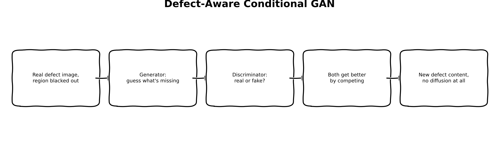
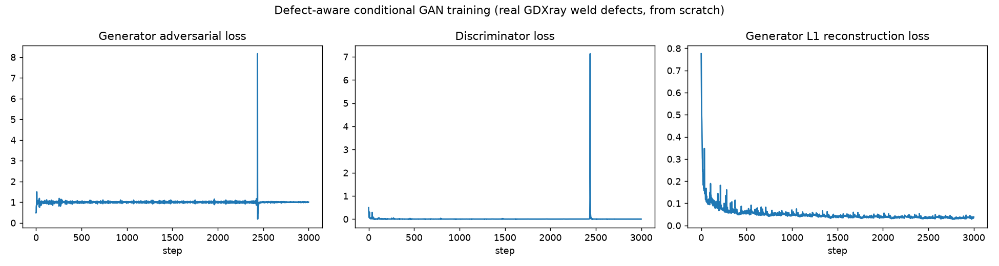
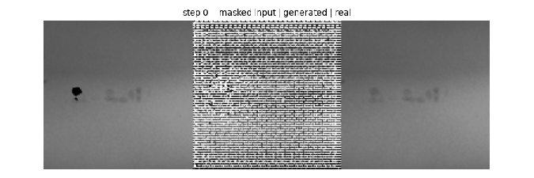
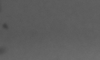
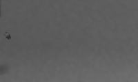

:::{.callout-tip}
This post is part of the [Synthetic Data Series](index.qmd) series.
:::

## The problem

Parts 2 through 6 are all, underneath, the same generative family: latent diffusion, whether
that's SD1.5 (Part 2), SD1.5 plus ControlNet shape conditioning (Part 3), a 12B Flux transformer
(Part 4), or a from-scratch pixel-space diffusion model (Part 5). This post asks a genuinely
different question: does a *GAN* -- adversarial training, no denoising process at all -- do
anything differently on the same real, small (338-example) defect dataset?

The real motivation, stated in this series' own design spec before any code was written: GANs
are notoriously unstable on small datasets, and that's a legitimate, useful finding for Part 9's
downstream comparison -- not a result to avoid reporting because it might not "win." This post
follows through on that honestly.

## Explain it like I'm five



Picture two rival art students. One (the Generator) is handed a photo with a scribble blacked
out and has to guess what was really there. The other (the Discriminator) is shown a stack of
real photos and guessed photos, mixed together, and has to spot which is which. Every round, the
guesser tries to fool the spotter, and the spotter tries not to be fooled -- and normally, both
get better together. What actually happened here: the spotter got *really* good, *really* fast --
almost immediately able to catch every fake -- and then just... stayed that good, for the rest of
training. The guesser stopped getting useful feedback from that competition entirely. It still
improved, but only because it was also being graded on a second, quieter test: "does your answer
look like the real photo, pixel for pixel?" -- and that quieter test is the one that actually
taught it anything.

## Explain it like I'm a data scientist

The generator `G` is a small U-Net-style encoder-decoder (6.3M parameters): four downsampling
conv blocks, a noise vector concatenated at the bottleneck for stochasticity, four upsampling
blocks with skip connections carrying real spatial detail straight from the encoder to the
decoder. Its input is the same self-supervised pair Part 2's inpainting training used: a real
image with the defect region blacked out, plus the mask; its target is the real, unmasked image.
The discriminator `D` is a small PatchGAN (663K parameters) -- it classifies overlapping patches
of (masked input, mask, candidate image) as real or fake, rather than making one judgment for
the whole image at once, which is the standard pix2pix stabilization trick for exactly this
small-data setting.

The loss is the standard pix2pix recipe: an LSGAN (least-squares) adversarial term plus a
weighted L1 reconstruction term ($\lambda=100$) between `G`'s output and the real image. LSGAN
was picked specifically because it's the more stable of the common GAN loss formulations --
and it still collapsed. By step 100 of 3000, `D`'s loss had dropped to essentially zero and
stayed there; `G`'s adversarial loss pinned near 1.0 (LSGAN's maximum, meaning `D` rejects `G`'s
output with near-total confidence) for the rest of the run. That means for roughly 97% of
training, `G` received no meaningful gradient signal from the adversarial term at all -- every
real improvement visible in the results below came from the L1 term alone. This is the textbook
GAN failure mode the design spec predicted, reproduced exactly, on real data, not a toy example.

## Jargon buster

| Term | Plain-English meaning |
|---|---|
| Conditional GAN | A GAN where the generator and discriminator both see extra context (here: the masked image and the mask), not just noise -- so the generator's output is constrained by what's actually there |
| PatchGAN | A discriminator that judges many small overlapping patches instead of one whole-image verdict -- more training signal per real example, a common small-dataset stabilizer |
| LSGAN | Least-squares GAN loss ($\text{MSE}$ against 1/0 real/fake labels instead of binary cross-entropy) -- generally more stable than vanilla GAN loss, though not immune to discriminator domination |
| Discriminator domination / mode collapse precursor | When `D` becomes too confident too early, `G`'s gradient from the adversarial term vanishes -- a well-documented, common GAN failure mode, especially likely with very few real training examples |
| Checkerboard artifact | A grid-like visual artifact from transposed-convolution upsampling, caused by uneven kernel overlap during upsampling -- a known, architecture-specific issue, not a training-data problem |

## Architecture -- traced from the real function calls

**Data** (`train_gan.py`'s `to_training_tensors`): reuses `build_defect_dataset` unchanged from
Part 2 -- same real 338 (image, mask) pairs from GDXray Welds `W0001`. For each example, the
defect region is blacked out in a copy of the real crop (`masked[mask] = 0`), both the masked
image and the mask are resized to 128x128 (a from-scratch, small-dataset resolution choice, the
same reasoning Part 5 used for its 64x64 model, just one step up since GAN training is cheaper
per-step than diffusion's multi-timestep loop), and the real, unmasked crop at the same
resolution is the training target.

**Generator forward pass**: `torch.cat([masked_image, mask])` (2 channels) through four strided
conv blocks (`128 -> 64 -> 32 -> 16 -> 8`), a noise vector broadcast and concatenated at the
8x8 bottleneck, then four transposed-conv upsampling blocks each concatenated with its matching
encoder skip connection (`64 -> 128`, standard U-Net/pix2pix wiring), ending in `tanh` to map
back to `[-1, 1]`.

**Discriminator forward pass**: `torch.cat([masked_image, mask, candidate])` (3 channels,
`candidate` being either the real image or `G`'s output) through three strided conv blocks down
to a `16x16` grid of patch logits -- no sigmoid, since LSGAN's loss operates directly on the
logits via MSE against all-ones (real) or all-zeros (fake) target grids.

**Training loop**: alternates one `D` step (real vs. `G`'s current output, LSGAN loss) and one
`G` step (adversarial term to fool `D`, plus $\lambda{=}100$ times L1 against the real image)
per iteration, cycling through the real 338 examples, for 3000 steps. Every 150 steps, a fixed
held-out example is rendered into a training-progress GIF frame -- the same fixed-example
tracking pattern every prior part in this series has used.

**Comparison** (`generate_gan_comparison.py`): the exact same real base image, synthetic crack
mask (`generate_crack_mask(..., rng=default_rng(0))`), and `WINDOW = (0, 512, 0, 512)` every
other part in this series has used. The 512-resolution masked window is downsampled to `G`'s
native 128, generated, then the output is upsampled back to 512 (bicubic) purely for compositing
into the same real base image at the same display crop/zoom windows -- a real, disclosed resizing
step, not hidden, and a genuine methodological difference from Parts 2-4's natively-512
pretrained checkpoints.

## Real code

### The generator and discriminator

```{.python filename="notebooks/synthetic-data-xray/train_gan.py"}
class Generator(nn.Module):
    def __init__(self, noise_dim: int = 32):
        super().__init__()
        self.noise_dim = noise_dim
        self.e1 = ConvBlock(2, 64, down=True, use_norm=False)  # 128 -> 64
        self.e2 = ConvBlock(64, 128, down=True)  # 64 -> 32
        self.e3 = ConvBlock(128, 256, down=True)  # 32 -> 16
        self.e4 = ConvBlock(256, 512, down=True)  # 16 -> 8

        self.d4 = ConvBlock(512 + noise_dim, 256, down=False)  # 8 -> 16
        self.d3 = ConvBlock(512, 128, down=False)  # 16 -> 32 (with skip)
        self.d2 = ConvBlock(256, 64, down=False)  # 32 -> 64 (with skip)
        self.out = nn.ConvTranspose2d(128, 1, 4, stride=2, padding=1)  # 64 -> 128 (with skip)

    def forward(self, masked_image, mask, noise):
        x = torch.cat([masked_image, mask], dim=1)
        f1 = self.e1(x)
        f2 = self.e2(f1)
        f3 = self.e3(f2)
        f4 = self.e4(f3)

        noise_map = noise.view(noise.shape[0], self.noise_dim, 1, 1).expand(-1, -1, f4.shape[2], f4.shape[3])
        u4 = self.d4(torch.cat([f4, noise_map], dim=1))
        u3 = self.d3(torch.cat([u4, f3], dim=1))
        u2 = self.d2(torch.cat([u3, f2], dim=1))
        out = self.out(torch.cat([u2, f1], dim=1))
        return torch.tanh(out)


class PatchDiscriminator(nn.Module):
    def __init__(self):
        super().__init__()
        self.net = nn.Sequential(
            nn.Conv2d(3, 64, 4, stride=2, padding=1), nn.LeakyReLU(0.2, inplace=True),
            nn.Conv2d(64, 128, 4, stride=2, padding=1), nn.InstanceNorm2d(128), nn.LeakyReLU(0.2, inplace=True),
            nn.Conv2d(128, 256, 4, stride=2, padding=1), nn.InstanceNorm2d(256), nn.LeakyReLU(0.2, inplace=True),
            nn.Conv2d(256, 1, 4, stride=1, padding=1),  # patch logits, no sigmoid (LSGAN)
        )

    def forward(self, masked_image, mask, candidate):
        return self.net(torch.cat([masked_image, mask, candidate], dim=1))
```

### The training step

```{.python filename="notebooks/synthetic-data-xray/train_gan.py"}
# --- Discriminator step ---
with torch.no_grad():
    fake = G(masked_image, mask, noise)
d_real = D(masked_image, mask, real_image)
d_fake = D(masked_image, mask, fake)
d_loss = 0.5 * (F.mse_loss(d_real, torch.ones_like(d_real)) + F.mse_loss(d_fake, torch.zeros_like(d_fake)))
opt_d.zero_grad()
d_loss.backward()
opt_d.step()

# --- Generator step ---
fake = G(masked_image, mask, noise)
d_fake_for_g = D(masked_image, mask, fake)
g_adv_loss = F.mse_loss(d_fake_for_g, torch.ones_like(d_fake_for_g))
g_l1_loss = F.l1_loss(fake, real_image)
g_loss = g_adv_loss + lambda_l1 * g_l1_loss
opt_g.zero_grad()
g_loss.backward()
opt_g.step()
```

## Results

Real training run, 3000 steps, 338 real GDXray defect crops, real captured loss curves:



The brief spike near step 2400 in both `G` and `D`'s losses (and its immediate return to the
collapsed state) is a real, single training-instability blip -- not a recovery. Training-progress
GIF, same fixed held-out example every 150 steps:



A real, correctly-shaped, correctly-located dark defect blob emerges by the midpoint of training
and holds through step 3000 -- purely from the L1 term, given the adversarial signal's collapse.
A persistent grid/checkerboard artifact is also visible along the right edge of the generated
region throughout -- a known transposed-convolution upsampling artifact, not something training
resolved on its own.

Real comparison on the exact same synthetic crack mask and window every other part has used:

::: {layout-ncol=3}




:::

**Real, measured contrast** (mask-pixel mean vs. immediate-surround mean, same 25px-ring
background convention Part 1 established):

| | Part 2 (SD1.5 diffusion) | Part 4 (Flux) | Part 7 (GAN) |
|---|---|---|---|
| Mask-pixel mean | 46.1 | 90.4 | 69.72 |
| Surrounding mean | 92.2 | 92.2 | 89.39 |
| Contrast (surround − mask) | **46.1** | **1.8** | **19.67** |

The GAN lands between Part 2 and Part 4 on visibility -- a real, moderate, clearly-visible mark,
not a near-invisible one like Flux's. Local noise texture tells a different story, though:

| | Clean baseline | Physics (Part 1) | Diffusion (Part 2) | ControlNet (Part 3) | Flux (Part 4) | GAN (Part 7) | Real defect |
|---|---|---|---|---|---|---|---|
| Local std (defect ROI) | 0.87 | 1.87 | 0.94 | 0.79 | 0.90 | **16.28** | 4.45 |

Every other learned method in this series clusters between 0.79 and 0.94 -- well below even the
real defect's 4.45. The GAN's 16.28 breaks that pattern entirely, and not in a good way: it's
*higher* than the real defect itself. That's not finer texture detail -- it's the checkerboard
artifact visible in the training GIF, injecting high-frequency noise into the masked region that
has nothing to do with real defect structure. A real, honest, quantitatively-confirmed limitation
distinct from every other part's finding in this series.

**Honest summary**: the adversarial half of this GAN barely worked -- `D` dominated almost
immediately, exactly the failure mode the design spec predicted going in. What did work was the
L1 reconstruction term alone, which was enough to place a real, visible, correctly-shaped defect
mark. But the architecture's own artifact (checkerboard noise from transposed convolutions) shows
up as anomalously high local texture variance -- a distinct, real limitation from any other
method tested so far, and a genuinely different failure mode than the "too faint" (Flux) or
"too-smooth VAE latent space" (Parts 2-3) findings from earlier parts.

## What's next

Part 6 combines whichever of Parts 3-5 actually helped with Part 1's calibrated noise model.
Part 8 covers the classic cut-paste + Poisson blending baseline -- the floor every method here,
GAN included, needs to beat. Part 9 settles all of it with a real downstream detector,
post-trained separately on each method's synthetic data.
