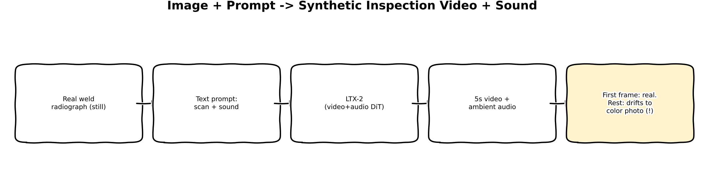
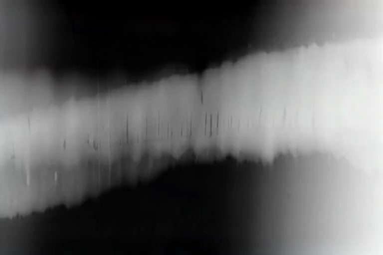
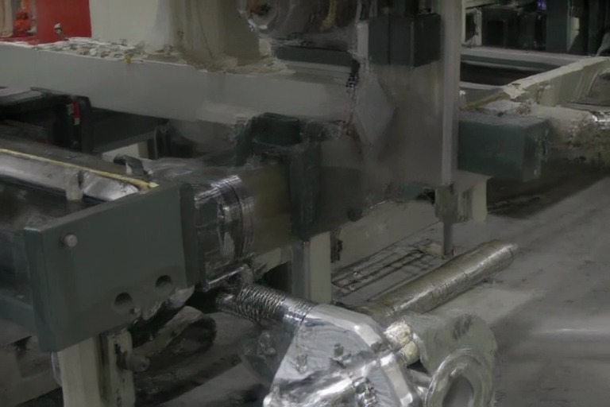
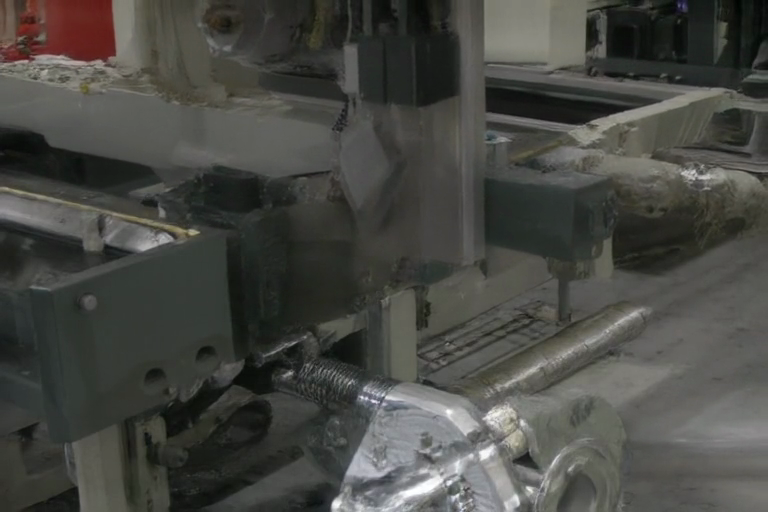

:::{.callout-tip}
This post is part of the [Video & Sound Generation Series](index.qmd) series. It also connects
directly to the [Synthetic Data Series](../synthetic-data/index.qmd): same real GDXray weld
radiograph, same industrial-inspection framing, different modality.
:::

## The problem

Every post in the Synthetic Data series has generated a single static image: a defect injected
into a still radiograph. Real industrial inspection lines don't always work that way -- a lot of
real non-destructive-testing (NDT) rigs use continuous radioscopy, a scan head or conveyor moving
a part past an X-ray detector, producing a video rather than a single shot, with real ambient
mechanical sound (motor hum, detector clicks) alongside it.

This post asks a genuinely open question: can a general-purpose joint video+audio generation
model turn one real static radiograph into a plausible synthetic *scan*, sound included? Not "can
it generate a nice video" -- diffusion video models are good at that on natural photography. The
real question is narrower and harder: can it stay in the right *domain* (X-ray-looking, not
ordinary color photography) while doing it?

## Explain it like I'm five



Imagine handing an artist one real X-ray photo and asking them to flip-book a short movie of a
scanner moving across it, plus hum in the right background noise. The artist is extremely good at
drawing movies of *ordinary* things -- factories, machines, people -- because that's almost
everything they've ever practiced on. They start faithfully, copying your X-ray exactly for the
first frame. But as soon as they have to imagine what happens *next*, their years of practice
drawing normal-looking factories takes over, and a few frames in, the movie quietly stops looking
like an X-ray at all and starts looking like an ordinary video of machinery.

## Explain it like I'm a data scientist

LTX-2 is a 19B-parameter DiT (diffusion transformer) that generates video and audio jointly from a
single model, using flow matching (the same rectified-flow formulation used for Flux in
[Part 4](../synthetic-data/04-flux-mask-conditioned-generation.qmd) of the Synthetic Data series)
over a shared video-audio latent sequence, with cross-modal attention so the two modalities
condition each other during denoising rather than being generated independently and merged after
the fact.

Image-conditioning here means one real frame (our GDXray radiograph) is fixed at latent index 0
before the reverse diffusion process runs; every other frame's latent starts from pure noise and
is denoised jointly with the rest of the sequence, guided by the text prompt and by attention back
to that one real conditioning frame. The problem: LTX-2's training distribution is overwhelmingly
natural video (the diffusers docs' own examples are sunsets, birds, highways). A single
conditioning frame is a strong constraint on frame 0 specifically, but it's a *weak* constraint on
the model's learned prior for what frames 1 through 120 should look like -- and that prior pulls
hard toward ordinary photographic video, because that's what the training distribution
overwhelmingly contains. X-ray radiographs are a near-zero-probability region of that distribution
that the model has essentially never been asked to sustain across time.

## Jargon buster

| Term | Plain-English meaning |
|---|---|
| DiT (Diffusion Transformer) | A diffusion model whose denoising network is a transformer over a sequence of latent patches, instead of a convolutional UNet |
| Flow matching / rectified flow | A diffusion variant that learns a straight-line (constant-velocity) path from noise to data, rather than the curved path classic DDPM noise-prediction learns |
| Image conditioning (latent index) | Fixing one frame's latent to a real image's encoding before denoising starts, so that frame is anchored while the rest of the sequence is generated freely around it |
| int4 quantization (bitsandbytes) | Compressing each weight to 4 bits at load time, trading a little numerical precision for roughly an 5-6x memory reduction versus bf16 |
| Sequential CPU offload | A diffusers memory-saving technique that streams model layers between CPU and GPU one at a time -- **not compatible with bitsandbytes-quantized weights** (a real, confirmed limitation, not a bug worked around here) |
| Domain drift | A generative model's output sliding away from the intended distribution (X-ray) toward its dominant training distribution (natural photography) over the course of generation |

## Architecture -- traced from the real function calls

**Memory strategy** (`generate_video_sound.py`, `build_pipeline`): LTX-2's own repository ships
the video/audio transformer pre-quantized (fp4/fp8 single-file checkpoints) but ships *no*
quantized text encoder -- and the text encoder, a Gemma3 vision-language model, is actually
larger on disk (\~54GB bf16) than the 19B video/audio transformer itself (\~43GB bf16). This
machine's real free memory, checked via `free -h` and `nvidia-smi` rather than assumed, is only
25-37GB with vLLM's 72.6GB resident set already in place. So both the text encoder
(`Gemma3ForConditionalGeneration`) and the transformer (`LTX2VideoTransformer3DModel`) are loaded
directly with `quantization_config=BitsAndBytesConfig(load_in_4bit=True)`, quantizing the bf16
weights down to int4 *at load time* -- the download is still the full bf16 size, but the resident
memory footprint drops roughly 5-6x. A first attempt paired this with
`pipe.enable_sequential_cpu_offload()` (the standard diffusers memory-saving pattern for large
pipelines) and hit a real, confirmed incompatibility: bitsandbytes' quantized parameters carry
internal state that can't be moved through accelerate's meta-tensor offload hooks
(`NotImplementedError: Cannot copy out of meta tensor; no data!`). The real fix, once the actual
resident-memory numbers were in hand, was simpler than working around that: skip offloading
entirely and load every component directly onto `cuda:0` via `device_map={"": device}`, since the
int4-quantized pipeline's real measured footprint (24.52GB assembled, 29.95GB peak during
generation) comfortably fits without it.

**Seed image** (`load_seed_image`): reuses the exact same real GDXray Welds ground-truth parsing
(`synth_xray.groundtruth.parse_gdxray_bboxes`) and grayscale-to-RGB conversion
(`synth_xray.diffusion_data.to_rgb_pil`) already established in the Synthetic Data series --
same real radiograph domain, same data-loading code, no new parsing logic.

**Pipeline assembly**: `LTX2ImageToVideoPipeline` is constructed directly from its named
components (`vae`, `audio_vae`, `text_encoder`, `tokenizer`, `transformer`, `scheduler`,
`vocoder`, `connectors`) rather than via a single `from_pretrained` call on the whole repo, so
each component can get its own loading treatment (quantized vs. plain bf16). `pipe.vae.
enable_tiling()` is kept -- unrelated to the offload question, it bounds VAE-decode memory to a
tile size rather than the full video's size, which is a likely reason peak memory stayed flat
(29.95GB) across every resolution/frame-count/step-count combination tested.

**Generation call**: `pipe(image=seed, prompt=..., negative_prompt=..., num_frames=121,
frame_rate=24.0, num_inference_steps=30, guidance_scale=3.0, output_type="np")` returns
`(video, audio)` as real numpy arrays; `diffusers.utils.encode_video` muxes them into a real
`.mp4` with an H.264 video stream and an AAC audio stream at the vocoder's real configured sample
rate (`pipe.vocoder.config.output_sampling_rate`, 24kHz here).

## Real code

### Memory-aware pipeline construction

```{.python filename="notebooks/video-sound-xray/generate_video_sound.py"}
def build_pipeline(device: str) -> LTX2ImageToVideoPipeline:
    text_quant = TransformersBnBConfig(load_in_4bit=True, bnb_4bit_compute_dtype=torch.bfloat16)
    transformer_quant = DiffusersBnBConfig(load_in_4bit=True, bnb_4bit_compute_dtype=torch.bfloat16)

    tokenizer = AutoTokenizer.from_pretrained(REPO_ID, subfolder="tokenizer")

    text_encoder = Gemma3ForConditionalGeneration.from_pretrained(
        REPO_ID,
        subfolder="text_encoder",
        quantization_config=text_quant,
        torch_dtype=torch.bfloat16,
        device_map={"": device},
    )

    transformer = LTX2VideoTransformer3DModel.from_pretrained(
        REPO_ID,
        subfolder="transformer",
        quantization_config=transformer_quant,
        torch_dtype=torch.bfloat16,
        device_map={"": device},
    )

    vae = AutoencoderKLLTX2Video.from_pretrained(REPO_ID, subfolder="vae", torch_dtype=torch.bfloat16).to(device)
    audio_vae = AutoencoderKLLTX2Audio.from_pretrained(REPO_ID, subfolder="audio_vae", torch_dtype=torch.bfloat16).to(
        device
    )
    connectors = LTX2TextConnectors.from_pretrained(REPO_ID, subfolder="connectors", torch_dtype=torch.bfloat16).to(
        device
    )
    vocoder = LTX2Vocoder.from_pretrained(REPO_ID, subfolder="vocoder", torch_dtype=torch.bfloat16).to(device)
    scheduler = FlowMatchEulerDiscreteScheduler.from_pretrained(REPO_ID, subfolder="scheduler")

    pipe = LTX2ImageToVideoPipeline(
        vae=vae,
        audio_vae=audio_vae,
        text_encoder=text_encoder,
        tokenizer=tokenizer,
        transformer=transformer,
        scheduler=scheduler,
        vocoder=vocoder,
        connectors=connectors,
    )
    pipe.vae.enable_tiling()
    return pipe
```

### Seed image and generation

```{.python filename="notebooks/video-sound-xray/generate_video_sound.py"}
def load_seed_image() -> "PIL.Image.Image":
    """Reuse the real GDXray Welds crop used throughout the Synthetic Data series."""
    series_dir = GDXRAY_CACHE / "Welds" / "W0001"
    gt_path = next(series_dir.glob("*.txt"))
    boxes = parse_gdxray_bboxes(gt_path)
    image_id = next(iter(boxes))
    img_path = next(series_dir.glob(f"*{image_id:03d}*.png"))
    gray = load_gray(img_path)
    return to_rgb_pil(gray)


image = load_seed_image()
prompt = (
    "A radioscopy inspection system scanning a metal weld joint, the X-ray detector head "
    "sweeping slowly across the seam, revealing internal structure. Ambient industrial "
    "sound: a steady conveyor motor hum and faint mechanical clicks from the scan head."
)
negative_prompt = "shaky, glitchy, low quality, blurry, static, distorted"

video, audio = pipe(
    image=image,
    prompt=prompt,
    negative_prompt=negative_prompt,
    width=768,
    height=512,
    num_frames=121,
    frame_rate=24.0,
    num_inference_steps=30,
    guidance_scale=3.0,
    output_type="np",
    return_dict=False,
)

encode_video(
    video[0],
    fps=24.0,
    audio=audio[0].float().cpu(),
    audio_sample_rate=pipe.vocoder.config.output_sampling_rate,
    output_path="xray_scan_final.mp4",
)
```

## Results

Real generation, real GDXray Welds seed frame, real LTX-2 (int4), 768x512, 5.04s at 24fps:



Audio is real and non-silent (mean -44.5dB, max -31.4dB, no clipping) -- there genuinely is an
ambient sound layer, not silence.

The frame-by-frame reality is more interesting than the played-back clip alone conveys. The very
first frame is the real image-conditioning anchor:

::: {layout-ncol=3}





:::

Frame 0 keeps the grayscale radiograph texture faithfully -- that's the direct effect of image
conditioning at latent index 0. By the middle of the clip, color has appeared and the content has
shifted toward what reads as ordinary CNC/factory-floor footage; by the end, there is no visible
trace of the X-ray domain left. **The honest finding**: a single real conditioning frame anchors
frame 0 convincingly, but it is not enough to hold a 19B general-purpose video model inside a
niche domain (X-ray radiography) for five seconds of generated motion. The model's dominant
training prior -- ordinary color video -- reasserts itself almost immediately once it has to
hallucinate anything beyond the exact conditioning frame.

A real memory finding alongside the content one: peak GPU memory held flat at **29.95GB** across
every resolution (384x256 through 768x512), frame count (25 through 121), and step count (8
through 30) tested here -- strong evidence that `vae.enable_tiling()` (and the transformer's own
internal chunking) genuinely bounds peak memory to something close to a fixed ceiling, not
something that scales with output size. That's a useful, transferable finding for running large
video-diffusion models on memory-constrained unified-memory hardware, independent of whether the
X-ray-domain result itself was a win.

## What's next

This is a real, useful negative result for a first post in a new series: general-purpose
video+audio generation does not automatically respect a narrow visual domain just because it's
handed one real conditioning frame from that domain. Directions worth a real, separate attempt
rather than folded into this post's already-answered question: stronger/repeated conditioning
across multiple frames instead of just frame 0, LoRA fine-tuning LTX-2 on real X-ray *video* if
such data can be found or simulated, or reframing the prompt and negative prompt more aggressively
around "grayscale," "radiographic," and "monochrome X-ray" to fight the drift directly.
