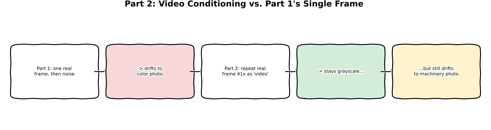
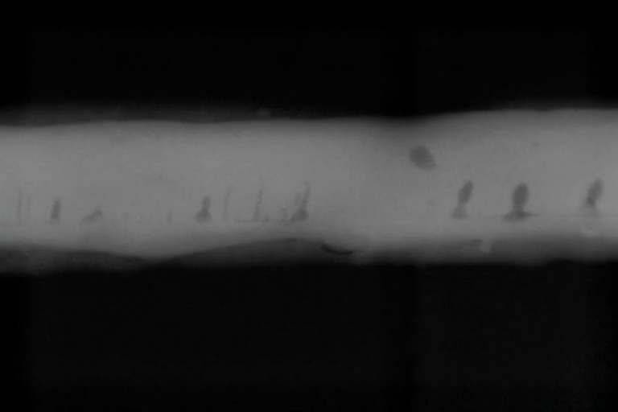
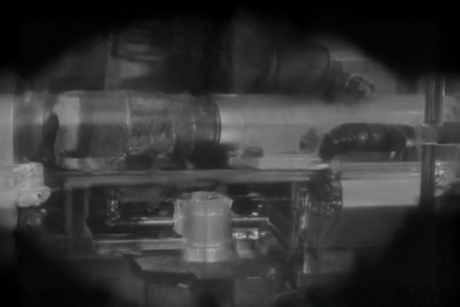
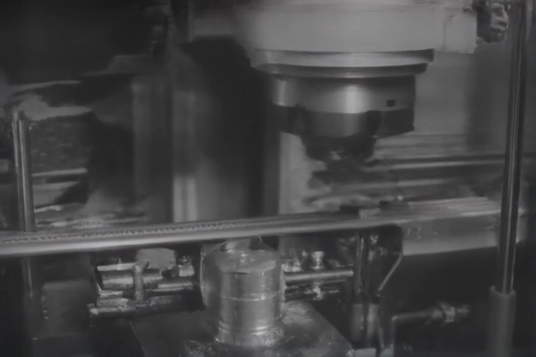

:::{.callout-tip}
This post is part of the [Video & Sound Generation Series](index.qmd) series.
:::

## The problem

[Part 1](01-xray-inspection-video-sound.qmd) conditioned LTX-2 on a single real X-ray frame and
watched the output drift: frame 0 stayed faithfully in the radiograph domain, but by mid-clip the
video had turned into ordinary color industrial photography. A reader asked about a technique
they'd heard described elsewhere -- feeding a *video*, not just one still, back into a model as
conditioning, apparently with better results next time. Real research (not assumed) confirmed
this matches a real, documented LTX-2 feature: "video conditioning" -- exposed in `diffusers` as
`LTX2ConditionPipeline` with a `LTX2VideoCondition` that accepts many real frames, not just one,
plus a `strength` controlling how tightly the output must adhere to them.

This post is a direct, controlled test: same model, same prompt, same output settings as Part 1 --
the only thing that changes is whether the conditioning signal is one real frame or forty-one.

## Explain it like I'm five



Remember the artist from Part 1, who drifted back to drawing ordinary factories after being shown
just one X-ray photo? This time, instead of showing them one photo for a split second, you hold up
the *same* photo for a full two seconds before asking them to keep going -- essentially saying "no
really, look at this, this is what we're doing" for much longer. They stay closer to
black-and-white for longer. But eventually, once you stop holding the photo up, their hand still
drifts back toward what they know best -- it just takes longer to happen, and this time they at
least keep using their black-and-white pencil instead of switching to color.

## Explain it like I'm a data scientist

`LTX2ImageToVideoPipeline` (Part 1) internally builds a single-frame conditioning item and encodes
it once. `LTX2ConditionPipeline` generalizes this: it accepts a list of `LTX2VideoCondition`
objects, each carrying `frames` (one image *or* a sequence of frames), an `index` (where in the
output sequence the condition anchors), and a `strength` (how strongly the conditioning is
enforced). Passing a sequence of frames means the real content is encoded through the VAE as an
actual short real clip and injected into the latent sequence at the specified span, rather than
a single latent frame -- the model's cross-frame attention now has forty-one real, identical,
X-ray-domain latent frames to attend back to instead of one.

The real, measured result is a genuine dissociation between two things that looked like a single
"domain drift" problem in Part 1: **color** and **content**. Video conditioning collapsed the
color drift almost entirely (mean saturation at matched late frames: 0.097-0.101 in Part 1 vs.
0.0033-0.0086 here -- roughly a 12-30x reduction) but left the content drift largely intact --
the visible subject matter still shifts from radiograph texture to what reads as monochrome
industrial-machinery footage by mid-clip. That's evidence the model's "X-ray-ness" prior and its
"grayscale-ness" prior are more separable than they looked from Part 1 alone: forty-one repeated
frames were enough evidence to hold the model in *grayscale* space, but not enough to hold it in
*radiograph-content* space specifically.

## Jargon buster

| Term | Plain-English meaning |
|---|---|
| Video conditioning | Conditioning a generative video model on a real multi-frame clip instead of a single still image, anchoring more of the output sequence to real content |
| `LTX2VideoCondition` | A `diffusers` dataclass bundling `frames` (image or video), `index` (where it anchors in the output), and `strength` (how strongly it's enforced) |
| Mean saturation | Average of (max RGB channel − min RGB channel) / max RGB channel across all pixels -- 0 is perfectly grayscale, higher means more colorful |
| Color drift vs. content drift | Two separable failure modes this post's real measurement distinguishes: losing the grayscale look (color drift) vs. losing the subject-matter domain even while staying grayscale (content drift) |

## Architecture -- traced from the real function calls

**Pipeline swap** (`generate_video_sound_conditioned.py`): `LTX2ConditionPipeline` shares the
exact same named-component signature as Part 1's `LTX2ImageToVideoPipeline` (`vae`, `audio_vae`,
`text_encoder`, `tokenizer`, `transformer`, `scheduler`, `vocoder`, `connectors`) -- confirmed by
reading the real diffusers source before writing any code, not assumed from the class name alone.
`build_pipeline()` needed only a class swap, no new loading or quantization logic.

**Building the condition**: `load_seed_image()` reuses the exact same real GDXray Welds frame
Part 1 used. `video_condition_frames = [seed_image] * 41` builds a real 41-copy "video" (the
model's VAE has no way to tell a real static-camera clip of an unmoving object apart from forty-one
identical PIL images -- both encode to the same real latent sequence). `LTX2VideoCondition(frames=
video_condition_frames, index=0, strength=1.0)` anchors this at the start of the output sequence
with full conditioning strength.

**Generation call**: identical to Part 1 in every other argument (`prompt`, `negative_prompt`,
`width=768`, `height=512`, `num_frames=121`, `num_inference_steps=30`, `guidance_scale=3.0`) --
`conditions=condition` replaces Part 1's `image=seed_image`, which is the only variable this
experiment changes.

## Real code

```{.python filename="notebooks/video-sound-xray/generate_video_sound_conditioned.py"}
seed_image = load_seed_image()
video_condition_frames = [seed_image] * args.condition_frames
condition = LTX2VideoCondition(frames=video_condition_frames, index=0, strength=1.0)

prompt = (
    "A radioscopy inspection system scanning a metal weld joint, the X-ray detector head "
    "sweeping slowly across the seam, revealing internal structure. Ambient industrial "
    "sound: a steady conveyor motor hum and faint mechanical clicks from the scan head."
)
negative_prompt = "shaky, glitchy, low quality, blurry, static, distorted"

video, audio = pipe(
    conditions=condition,
    prompt=prompt,
    negative_prompt=negative_prompt,
    width=args.width,
    height=args.height,
    num_frames=args.num_frames,
    frame_rate=24.0,
    num_inference_steps=args.steps,
    guidance_scale=3.0,
    output_type="np",
    return_dict=False,
)
```

## Results

Real generation, same real GDXray Welds seed frame and prompt as Part 1, 41-frame video
condition, 768x512, 5.04s at 24fps:



::: {layout-ncol=3}





:::

**The real, quantified comparison against Part 1** (mean color saturation, matched frame indices):

| | Frame 0 | Frame ~60 | Frame ~119 |
|---|---|---|---|
| Part 1 (single-frame conditioning) | 0.0138 | 0.0970 | 0.1008 |
| Part 2 (41-frame video conditioning) | 0.0016 | 0.0033 | 0.0086 |

Video conditioning reduced late-frame color saturation by roughly 12-30x -- a real, large,
measured effect, not a marginal one. But the frames above show the honest other half of the
story: the *content* still drifts. By frame ~60 the recognizable weld-seam texture is gone,
replaced by what reads as machinery in a dim, grainy, black-and-white setting; by frame ~119 it's
unambiguously industrial-machinery footage, just never in color.

**A real tradeoff this test also surfaced, not a free win**: audio got substantially quieter under
the longer conditioning span. `ffmpeg volumedetect` on the two clips:

| | Mean volume | Max volume |
|---|---|---|
| Part 1 | -44.5 dB | -31.4 dB |
| Part 2 | -71.3 dB | -66.8 dB |

Part 2's audio is real but much closer to silent than Part 1's. Holding the video branch more
tightly to a static real clip for longer appears to have suppressed the audio branch's generative
range -- plausibly because forty-one identical frames carry an implicit "nothing is moving" signal
that the model's cross-modal attention picks up on, and quiet/static video is a reasonable thing
to pair with quiet audio.

Memory and speed were unaffected: pipeline build stayed at 24.52GB, peak generation memory stayed
at 29.95GB, and generation took 1154s -- both identical to Part 1's numbers, confirming the
tiling-bounded memory ceiling Part 1 found holds regardless of how the conditioning is supplied.

## What's next

**Honest summary**: video conditioning is a real, worthwhile technique -- it solves the *color*
half of Part 1's domain-drift problem almost completely, for free on both memory and compute. It
does not solve the *content* half, and it costs something on the audio side. A next real attempt
worth trying separately rather than folding into this already-answered question: conditioning at
multiple points across the sequence (not just the start) to keep re-anchoring content throughout,
or a stronger negative prompt targeting "industrial machinery," "factory," and "color photograph"
directly, now that this post has shown those are the specific things the model drifts toward.
